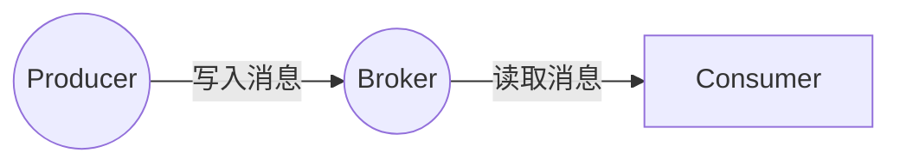

# Kafka在车联网数据处理中的应用

## 1.背景介绍

### 1.1 车联网概述

车联网(Internet of Vehicles, IoV)是一种新兴的网络技术,旨在通过无线通信网络将车辆与外部环境连接起来,实现车辆与车辆、车辆与路侧设施、车辆与信息中心之间的实时信息交互和共享。车联网将汽车与互联网、移动通信网络、卫星定位系统等多种技术相融合,构建一个庞大的信息交换平台。

### 1.2 车联网数据特点

在车联网环境下,车辆将成为移动的数据源和数据终端,产生海量的数据流。这些数据具有以下几个显著特点:

- **数据量大**:每辆车都装有多种传感器,实时采集车辆状态、行驶轨迹、周边环境等多维度数据,数据量巨大。
- **种类繁多**:车载传感器种类多样,包括GPS、加速度计、陀螺仪、温度传感器、压力传感器等,采集的数据种类繁多。
- **实时性强**:车辆行驶过程中,数据需要实时采集和处理,以支持车联网应用的实时响应。
- **分布广泛**:车辆分布在不同区域,产生的数据来源地理位置分散。

### 1.3 数据处理需求

面对如此庞大的车联网数据,有效的数据采集、传输、存储和处理至关重要。传统的数据处理架构很难满足车联网场景下的需求,主要体现在:

- **实时性差**:基于批处理的大数据处理系统往往存在较高的时延。
- **扩展性差**:单机系统或集中式架构难以应对大规模数据访问。
- **可靠性差**:单点故障可能导致整个系统瘫痪。
- **成本高昂**:大规模集中式存储和计算成本高昂。

因此,我们需要一种全新的数据处理架构,能够实时高效地处理海量车联网数据流。

## 2.核心概念与联系

### 2.1 Kafka概述

Apache Kafka是一个分布式的流处理平台,最初由LinkedIn公司开发。它具有高吞吐量、低延迟、高可扩展性和持久化存储等优点,非常适合作为车联网数据处理的基础架构。

Kafka的核心概念包括:

- **Topic**:一个Topic可理解为一个数据流,由多个有序的Partition组成。
- **Partition**:Topic的数据按Partition存储,每个Partition在集群中备份若干个Replica。
- **Producer**:向Topic写入数据流的生产者。
- **Consumer**:从Topic读取数据流的消费者。
- **Broker**:Kafka集群中一台或多台服务器统称为Broker。

Kafka采用分布式、分区、多副本的架构模式,保证了数据处理的高吞吐量、低延迟和高可靠性。

### 2.2 Kafka与车联网数据处理的联系

Kafka天生适合处理车联网场景下的实时数据流,主要体现在以下几个方面:

1. **吞吐量高**:Kafka以磁盘顺序读写方式存储数据,能够支持每秒百万级别的消息吞吐量。
2. **实时性强**:消息被持久化到磁盘,并维护较长的数据留存周期,支持实时数据处理和历史数据查询。
3. **容错性好**:通过在集群中备份多个Replica,提高了数据的可靠性和可用性。
4. **扩展性强**:Kafka集群可以通过增加Broker数量线性扩展,满足大规模数据访问需求。
5. **生态系统丰富**:Kafka与Hadoop、Spark、Storm等大数据框架天然集成,构建流式数据处理管道。

因此,Kafka可以作为车联网数据处理的核心组件,实现车载设备与云端的高效数据流交互。

## 3.核心算法原理具体操作步骤

### 3.1 Kafka工作原理

Kafka的工作原理可以概括为以下几个步骤:

1. **Producer生产消息**:Producer将消息发送到指定的Topic。
2. **Broker存储消息**:消息被追加到Topic的Partition中,并在多个Broker上备份多个Replica。
3. **Consumer消费消息**:Consumer从Broker读取消息,并维护消费位移(offset)。
4. **消息传输**:Broker负责消息的存储和传输,Producer和Consumer只需连接到任意一个Broker即可生产和消费消息。

Kafka采用了分区(Partition)和复制(Replication)的设计,具体如下:

- **分区(Partition)**:一个Topic的数据被分散存储在多个Partition中,每个Partition在集群中备份多个Replica。这种设计提高了并行度,实现了数据的负载均衡。
- **复制(Replication)**:每个Partition都有多个Replica副本,其中一个作为Leader,其余作为Follower。所有的生产和消费操作都是通过Leader进行,Follower只是被动复制数据。当Leader宕机时,其中一个Follower会被选举为新的Leader。这种设计提高了数据的可靠性和可用性。

$$
\begin{aligned}
&\text{Topic 1:} \\
&\qquad \text{Partition 0}: \text{Replica 0, Replica 1, Replica 2} \\
&\qquad \text{Partition 1}: \text{Replica 3, Replica 4, Replica 5} \\
&\qquad \text{...} \\
&\text{Topic 2:} \\
&\qquad \text{Partition 0}: \text{Replica 6, Replica 7, Replica 8} \\
&\qquad \text{...}
\end{aligned}
$$

如上所示,每个Topic包含多个Partition,每个Partition包含多个Replica副本。Replica分布在不同的Broker上,以提高数据的冗余性和可用性。

### 3.2 Kafka数据流

Kafka的数据流由Producer、Broker和Consumer三部分组成,数据流向如下:



1. **Producer生产消息**

Producer是消息的生产者,将消息发送到指定的Topic。Producer可以是车载设备、物联网传感器、Web服务等。

```java
// 构建Producer实例
Properties props = new Properties();
props.put("bootstrap.servers", "localhost:9092");
Producer<String, String> producer = new KafkaProducer<>(props);

// 构建消息
ProducerRecord<String, String> record = new ProducerRecord<>("topic1", "value");

// 发送消息
producer.send(record);
```

2. **Broker存储消息**

Broker是Kafka集群中的服务实例,负责存储和管理消息数据。消息被持久化到磁盘,并备份多个Replica副本。

3. **Consumer消费消息**

Consumer是消息的消费者,从Broker读取并处理消息。Consumer可以是实时数据处理应用、离线分析系统等。

```java
// 构建Consumer实例 
Properties props = new Properties();
props.put("bootstrap.servers", "localhost:9092");
props.put("group.id", "group1");
props.put("enable.auto.commit", "true");
Consumer<String, String> consumer = new KafkaConsumer<>(props);

// 订阅Topic
consumer.subscribe(Collections.singletonList("topic1"));

// 拉取消息
while (true) {
    ConsumerRecords<String, String> records = consumer.poll(Duration.ofMillis(100));
    for (ConsumerRecord<String, String> record : records) {
        System.out.println(record.value());
    }
}
```

## 4.数学模型和公式详细讲解举例说明

在Kafka的设计中,涉及到一些数学模型和公式,用于优化系统性能和资源利用率。

### 4.1 分区分配策略

Kafka采用分区(Partition)的设计,将Topic的数据分散存储在多个Partition中。这种设计提高了并行度,实现了数据的负载均衡。但是,如何将消息合理地分配到不同的Partition,是一个需要解决的问题。

Kafka提供了多种分区分配策略,最常用的是**粘性分区分配(Sticky Partition Assignment)**策略。该策略的核心思想是:将相同Key的消息分配到同一个Partition中,以保证消息的有序性。

具体来说,Kafka使用murmur2哈希算法计算消息Key的哈希值,然后根据哈希值对Partition数量取模,得到目标Partition编号。

$$
\text{Partition} = \text{murmur2}(\text{Key}) \bmod N
$$

其中,N是Topic的Partition数量。

例如,假设Topic有3个Partition,Key分别为"car1"、"car2"和"car3",则:

$$
\begin{aligned}
\text{Partition}(\text{"car1"}) &= \text{murmur2}(\text{"car1"}) \bmod 3 = 0 \\
\text{Partition}(\text{"car2"}) &= \text{murmur2}(\text{"car2"}) \bmod 3 = 1 \\
\text{Partition}(\text{"car3"}) &= \text{murmur2}(\text{"car3"}) \bmod 3 = 2
\end{aligned}
$$

这种分区分配策略可以保证具有相同Key的消息被分配到同一个Partition中,从而保证消息的有序性。同时,由于不同Key的消息分布在不同的Partition,实现了负载均衡。

### 4.2 复制因子和ISR

为了提高数据的可靠性和可用性,Kafka采用了复制(Replication)机制。每个Partition都有多个Replica副本,其中一个作为Leader,其余作为Follower。所有的生产和消费操作都是通过Leader进行,Follower只是被动复制数据。

Replica的数量由**复制因子(Replication Factor)**决定。复制因子越高,数据的可靠性和可用性越高,但同时也会增加存储和网络开销。

在实际运行过程中,Follower副本可能会因为网络问题或节点故障而落后于Leader,无法及时复制数据。为了解决这个问题,Kafka引入了**同步复制(In-Sync Replica, ISR)**的概念。

ISR是一个动态的Follower副本集合,它们与Leader保持高度同步,数据复制延迟在指定阈值范围内。只有处于ISR集合中的Follower副本,才有资格被选举为新的Leader。

ISR集合的大小由以下公式决定:

$$
\begin{aligned}
\text{ISR Size} &\ge \text{max}(1, \text{Replication Factor} - \text{max.unavailable.replicas}) \\
&\ge \text{min.insync.replicas}
\end{aligned}
$$

- `max.unavailable.replicas`表示允许同时离线的最大Replica数量。
- `min.insync.replicas`表示ISR集合中最小的Replica数量。

例如,假设Replication Factor=3, max.unavailable.replicas=1, min.insync.replicas=2,则:

$$
\begin{aligned}
\text{ISR Size} &\ge \text{max}(1, 3 - 1) = 2 \\
&\ge 2
\end{aligned}
$$

因此,ISR集合中至少需要2个Replica,才能确保数据的可靠性和可用性。

通过合理设置复制因子和ISR参数,Kafka可以在数据可靠性、可用性和存储开销之间达到平衡。

## 5.项目实践:代码实例和详细解释说明

在本节中,我们将通过一个实际的代码示例,演示如何使用Kafka处理车联网数据流。

### 5.1 场景描述

假设我们有一个车队管理系统,需要实时监控车辆的位置、速度、油耗等数据,并进行数据分析和可视化展示。我们将使用Kafka作为数据流的中间件,实现车载设备与云端应用之间的数据交互。

### 5.2 环境准备

1. 安装Kafka及相关依赖库(ZooKeeper、Confluent等)。
2. 启动ZooKeeper和Kafka Broker服务。
3. 创建Topic `vehicle-telemetry`用于存储车辆遥测数据。

```bash
bin/kafka-topics.sh --create --topic vehicle-telemetry --bootstrap-server localhost:9092 --partitions 3 --replication-factor 2
```

### 5.3 Producer:车载设备

车载设备作为Producer,将车辆遥测数据发送到Kafka的`vehicle-telemetry`Topic。

```java
import org.apache.kafka.clients.producer.KafkaProducer;
import org.apache.kafka.clients.producer.ProducerRecord;

import java.util.Properties;

public class VehicleProducer {
    public static void main(String[] args) {
        // 配置Producer
        Properties props = new Properties();
        props.put("bootstrap.servers", "localhost:9092");
        props.put("key.serializer", "org.apache.kafka.common.serialization.StringSerializer");
        props.put("value.serializer", "org.apache.kafka