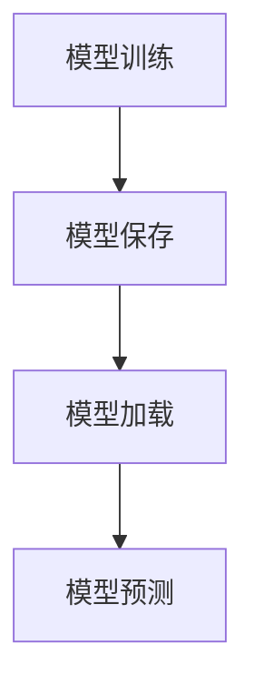

## 1.背景介绍

在深度学习的世界中，模型的管理和部署是一个重要但常常被忽视的主题。在许多情况下，我们需要将训练好的模型保存下来，以便在未来的时间点进行预测或者进一步的训练。这就是模型注册的概念。Keras作为一个用户友好的深度学习框架，提供了一套简单而强大的API来处理模型的保存和加载。在本文中，我们将探讨如何在实战中使用Keras进行模型注册。

## 2.核心概念与联系

在Keras中，模型注册的核心概念主要包括模型的保存、加载和版本控制。

### 2.1 模型的保存

在Keras中，我们可以使用`model.save()`函数将训练好的模型保存到硬盘上，这个函数会将模型的结构和权重以及优化器的状态一起保存下来。

### 2.2 模型的加载

与模型的保存相对应，我们可以使用`keras.models.load_model()`函数来加载保存的模型。这个函数会返回一个和原模型完全一样的新模型，包括模型的结构、权重和优化器的状态。

### 2.3 模型的版本控制

在实际的项目中，我们可能会训练多个版本的模型，每个版本的模型可能有不同的结构或者参数。为了管理这些模型，我们需要对每个模型进行版本控制，这通常可以通过在保存模型时，将模型的版本信息保存在文件名中来实现。



## 3.核心算法原理具体操作步骤

下面，我们将通过一个具体的例子来介绍如何在Keras中进行模型注册。

### 3.1 训练模型

首先，我们需要训练一个模型。这里我们使用Keras内置的MNIST数据集来训练一个简单的全连接网络。

### 3.2 保存模型

模型训练完成后，我们可以使用`model.save()`函数来保存模型。我们将模型保存在当前目录下的`model.h5`文件中。

### 3.3 加载模型

然后，我们可以使用`keras.models.load_model()`函数来加载保存的模型。

### 3.4 预测

最后，我们可以使用加载的模型进行预测。

## 4.数学模型和公式详细讲解举例说明

在深度学习中，模型的保存和加载涉及到了许多重要的数学概念，比如张量、权重和优化器的状态等。下面，我们将对这些概念进行详细的讲解。

### 4.1 张量

在深度学习中，我们通常使用张量来表示数据。张量是一个可以在N个维度上进行运算的数据结构，它是标量、向量、矩阵的高维拓展。在Keras中，我们使用`numpy`库来操作张量。

### 4.2 权重

在深度学习模型中，权重是模型的核心部分，它们决定了模型的预测能力。在Keras中，我们可以使用`model.get_weights()`和`model.set_weights()`函数来获取和设置模型的权重。

### 4.3 优化器的状态

在深度学习中，优化器用于更新模型的权重以减小损失函数。优化器的状态通常包括当前的学习率、动量等参数。在Keras中，我们可以使用`model.optimizer.get_config()`函数来获取优化器的状态。

## 5.项目实践：代码实例和详细解释说明

下面，我们将通过一个具体的代码例子来展示如何在Keras中进行模型注册。

```python
# 导入所需的库
from keras.datasets import mnist
from keras.models import Sequential
from keras.layers import Dense
from keras.models import load_model

# 加载MNIST数据集
(x_train, y_train), (x_test, y_test) = mnist.load_data()

# 数据预处理
x_train = x_train.reshape(60000, 784)
x_test = x_test.reshape(10000, 784)
x_train = x_train.astype('float32')
x_test = x_test.astype('float32')
x_train /= 255
x_test /= 255

# 构建模型
model = Sequential()
model.add(Dense(512, activation='relu', input_shape=(784,)))
model.add(Dense(10, activation='softmax'))

# 编译模型
model.compile(loss='sparse_categorical_crossentropy',
              optimizer='adam',
              metrics=['accuracy'])

# 训练模型
model.fit(x_train, y_train,
          batch_size=128,
          epochs=5,
          verbose=1,
          validation_data=(x_test, y_test))

# 保存模型
model.save('model.h5')

# 加载模型
model = load_model('model.h5')

# 使用模型进行预测
predictions = model.predict(x_test)
```

在这个例子中，我们首先加载了MNIST数据集，并对数据进行了预处理。然后，我们构建了一个全连接网络，并使用Adam优化器和交叉熵损失函数来编译模型。接着，我们对模型进行了训练，并将训练好的模型保存到了硬盘上。最后，我们加载了保存的模型，并使用这个模型对测试集进行了预测。

## 6.实际应用场景

模型注册在许多实际应用场景中都非常重要。例如，在自动驾驶、医疗图像分析、语音识别等领域，我们都需要将训练好的模型保存下来，以便在未来的时间点进行预测或者进一步的训练。同时，模型注册也是模型部署的重要步骤，只有将模型保存下来，我们才能将模型部署到服务器或者嵌入式设备上。

## 7.工具和资源推荐

以下是一些在进行Keras模型注册时可能会用到的工具和资源：

- Keras文档：Keras的官方文档是学习和使用Keras的最好资源。在文档中，你可以找到关于模型保存和加载的详细信息。
- TensorFlow Serving：如果你需要在生产环境中部署你的模型，那么TensorFlow Serving可能是一个好选择。它是一个专门用于模型部署的系统，支持模型的热更新和版本控制。
- ONNX：ONNX是一个开源的模型交换格式，它允许你将模型从一个框架转换到另一个框架。如果你需要将你的Keras模型转换到其他框架，那么ONNX可能会很有用。

## 8.总结：未来发展趋势与挑战

随着深度学习的发展，模型注册的重要性正在日益增加。在未来，我们期待看到更多的工具和服务来简化模型注册的过程。同时，模型注册也面临着一些挑战，比如如何管理和版本控制大规模的模型，以及如何保护模型的隐私和安全等。

## 9.附录：常见问题与解答

### 9.1 我可以保存模型的部分权重吗？

是的，你可以使用`model.get_weights()`函数来获取模型的权重，然后选择你需要的权重进行保存。

### 9.2 我可以只保存模型的结构，不保存权重吗？

是的，你可以使用`model.to_json()`或者`model.to_yaml()`函数来只保存模型的结构。

### 9.3 我可以在不同的框架之间转换模型吗？

是的，你可以使用ONNX来在不同的框架之间转换模型。

作者：禅与计算机程序设计艺术 / Zen and the Art of Computer Programming