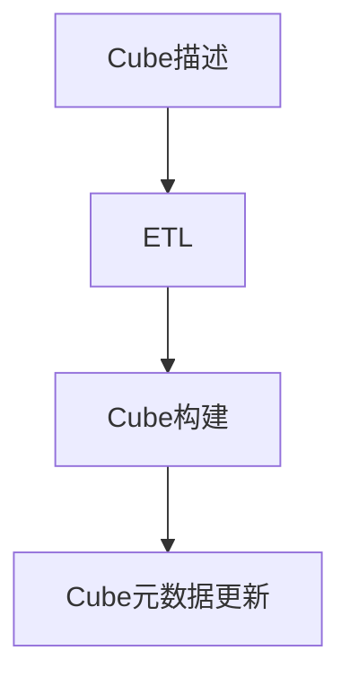
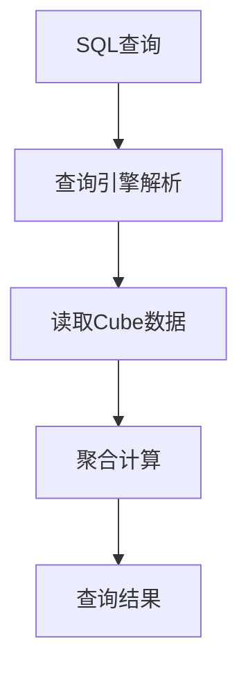
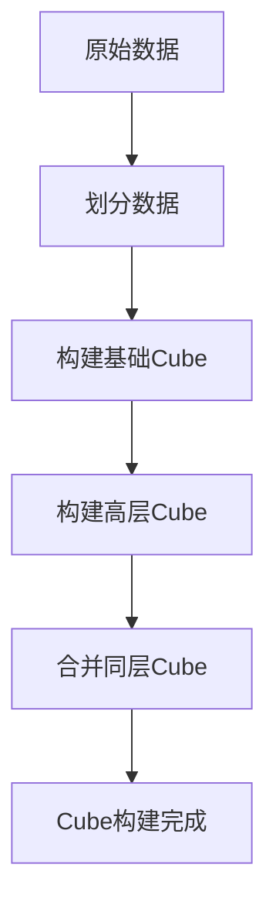

# Kylin原理与代码实例讲解

## 1. 背景介绍

### 1.1 什么是Kylin

Kylin是一个开源的分布式分析引擎,旨在提供Hadoop之上的SQL查询接口及超高并发的查询性能。作为Apache旗下的顶级项目,Kylin已经被广泛应用于各行业的大数据分析场景,为数据分析人员提供了高效、灵活的分析工具。

### 1.2 Kylin的发展历程

Kylin最初由eBay的数据基础架构团队于2013年开发,用于支持eBay的大数据分析需求。2014年,Kylin正式加入Apache软件基金会,成为Apache的顶级项目。自此,Kylin得到了来自世界各地开发者的持续维护和更新,功能日益完善。

### 1.3 Kylin的优势

相比其他大数据分析工具,Kylin具有以下显著优势:

- 高并发查询能力:预计算和预聚合技术使Kylin能够支持数千个并发查询。
- 低查询延迟:查询响应时间通常在秒级,满足实时分析需求。
- 高度扩展性:可根据需求无缝扩展计算和存储资源。
- 与生态系统无缝集成:支持Hadoop、Spark、Kafka等主流大数据框架。

## 2. 核心概念与联系

### 2.1 Cube概念

Cube是Kylin的核心概念,代表了对原始数据的预计算和预聚合。Cube中包含了维度和度量的组合,可极大提高查询性能。


### 2.2 Cube构建流程

Cube的构建流程包括以下几个主要步骤:

1. 定义Cube描述
2. 提取转换加载(ETL)原始数据
3. 构建Cube
4. 更新Cube元数据



### 2.3 查询流程

查询Kylin的基本流程如下:

1. 将SQL查询发送到Kylin
2. 查询引擎解析SQL
3. 从Cube中读取相关数据
4. 根据需要进行数据聚合和计算
5. 返回查询结果



## 3. 核心算法原理具体操作步骤 

### 3.1 Cube构建算法

Kylin采用了基于层次化的Cube构建算法,可以高效地对数据进行预计算和预聚合。该算法的核心思想是将维度分层,并逐层构建Cube。

算法步骤如下:

1. 根据维度层次关系对原始数据进行划分
2. 从最底层维度开始,构建基础Cube
3. 逐层向上构建更高层次的Cube
4. 合并同层次的Cube,消除冗余数据



### 3.2 查询优化算法

Kylin采用了多种查询优化算法,以提高查询性能。主要包括:

1. **Cube选择算法**: 根据查询条件,选择最佳的Cube来执行查询。
2. **剪枝算法**: 剪枝掉不相关的数据,减少计算量。
3. **分布式并行算法**: 将查询任务分发到多个节点并行执行。
4. **增量更新算法**: 只更新变化的数据,避免全量重新计算。

## 4. 数学模型和公式详细讲解举例说明

### 4.1 Cube大小估算模型

Kylin使用一种基于组合数学的模型来估算Cube的大小,从而优化存储资源的使用。

设原始数据集包含 $N$ 条记录, $D$ 个维度, $M$ 个度量。每个维度 $d_i$ 包含 $c_i$ 个不同值。则Cube的大小 $S$ 可以估算为:

$$S = N \times \sum_{i=1}^{2^D-1}\prod_{d_j\in C_i}\frac{c_j}{c_j+M}$$

其中 $C_i$ 表示第 $i$ 个Cube的维度组合。

例如,对于一个包含 $10^9$ 条记录、4个维度(分别包含10、20、30和50个值)以及5个度量的数据集,估算的Cube大小为:

$$S = 10^9 \times \left(\frac{10}{15}+\frac{20}{25}+\frac{30}{35}+\frac{50}{55}+\frac{10\times20}{15\times25}+\cdots+\frac{10\times20\times30\times50}{15\times25\times35\times55}\right)$$

### 4.2 Cube选择算法

Kylin使用一种基于代价模型的算法来选择最佳Cube执行查询。该算法的核心思想是估算每个Cube执行查询的代价,并选择代价最小的Cube。

设查询 $Q$ 涉及的维度集合为 $D_Q$,度量集合为 $M_Q$。对于每个Cube $C$,定义代价函数:

$$\text{Cost}(C,Q)=\omega_1\cdot\left(1-\frac{\left|D_C\cap D_Q\right|}{\left|D_Q\right|}\right)+\omega_2\cdot\left(1-\frac{\left|M_C\cap M_Q\right|}{\left|M_Q\right|}\right)+\omega_3\cdot\text{Size}(C)$$

其中 $D_C$ 和 $M_C$ 分别表示Cube $C$ 包含的维度和度量, $\text{Size}(C)$ 表示Cube $C$ 的大小, $\omega_1$、$\omega_2$、$\omega_3$ 是权重系数。

算法会选择 $\text{Cost}(C,Q)$ 最小的Cube来执行查询。

## 5. 项目实践:代码实例和详细解释说明

本节将通过一个示例项目,展示如何使用Kylin进行数据分析。我们将基于一个在线零售数据集,构建Cube并执行查询。

### 5.1 环境准备

首先,我们需要准备以下环境:

- Hadoop集群(本示例使用Pseudo分布式模式)
- Kylin 4.0.0
- Maven 3.6.3
- Java 8

### 5.2 定义Cube描述

使用Kylin的CLI工具,我们可以定义Cube的描述。以下是一个示例描述:

```json
{
  "uuid" : "89af4ee2-2cca-4a03-b74b-ef8cb9b4b014",
  "last_modified" : 1472486896752,
  "create_time" : null,
  "name" : "kylin_sample_cube",
  "dimensions" : [ {
    "name" : "SELLER_ID",
    "table" : "SELLER",
    "column" : "SELLER_ID",
    "derived" : null
  }, {
    "name" : "CATEG_LVL2_NAME",
    "table" : "CATEGORY",
    "column" : "CATEG_LVL2_NAME",
    "derived" : null
  }, {
    "name" : "TRANS_TIME",
    "table" : "FACT",
    "column" : "TRANS_TIME",
    "derived" : null
  } ],
  "measures" : [ {
    "name" : "PRICE",
    "function" : {
      "expression" : "SUM",
      "parameter" : {
        "type" : "constant",
        "next_parameter" : null,
        "value" : "PRICE"
      }
    }
  }, {
    "name" : "ITEM_COUNT",
    "function" : {
      "expression" : "SUM",
      "parameter" : {
        "type" : "constant",
        "next_parameter" : null,
        "value" : "ITEM_COUNT"
      }
    }
  } ],
  "filter_condition" : null,
  "capacity" : "MEDIUM",
  "segment_condition" : null,
  "status_need_notification" : false,
  "auto_merge_time_ranges" : null,
  "retention_range" : 0,
  "engine_type" : 8,
  "storage_type" : 2,
  "override_kylin_properties" : { },
  "cuboid_scheduler_enabled" : false
}
```

该描述定义了3个维度(卖家ID、类别层级2和交易时间)和2个度量(价格和商品数量)。

### 5.3 构建Cube

接下来,我们可以使用Kylin的构建工具来构建Cube:

```bash
bin/kylin.sh org.apache.kylin.job.BuildCuboidJob -cubeName kylin_sample_cube -startTime 2012-01-01 -endTime 2012-12-31 -force
```

此命令将基于2012年的数据构建Cube。构建完成后,Cube将被保存在Hadoop分布式文件系统中。

### 5.4 执行查询

现在,我们可以使用Kylin的查询引擎来执行SQL查询。例如:

```sql
SELECT SELLER_ID, CATEG_LVL2_NAME, SUM(PRICE) AS TOTAL_PRICE, SUM(ITEM_COUNT) AS TOTAL_ITEMS
FROM KYLIN_SAMPLE_CUBE
WHERE TRANS_TIME >= '2012-01-01' AND TRANS_TIME <= '2012-03-31'
GROUP BY SELLER_ID, CATEG_LVL2_NAME;
```

该查询将返回2012年第一季度每个卖家在每个类别层级2下的总销售额和总商品数量。

Kylin的查询引擎会自动选择最佳Cube执行查询,并对查询结果进行聚合和计算。

## 6. 实际应用场景

Kylin广泛应用于各行业的大数据分析场景,为数据分析人员提供高效、灵活的分析工具。以下是一些典型的应用场景:

### 6.1 电子商务分析

在电子商务领域,Kylin可以用于分析用户购买行为、销售额趋势、商品库存等,为企业提供决策支持。

### 6.2 金融风控分析

金融机构可以使用Kylin对交易数据进行实时分析,及时发现异常行为,防范金融风险。

### 6.3 网络日志分析

Kylin可以对海量网络日志进行分析,了解用户访问模式、热点内容等,为网站优化和广告投放提供依据。

### 6.4 物联网数据分析

在物联网领域,Kylin可以对设备传感器数据进行实时分析,监控设备状态,优化运营策略。

## 7. 工具和资源推荐

本节将介绍一些与Kylin相关的有用工具和学习资源。

### 7.1 Kylin官方文档

Kylin官方文档(https://kylin.apache.org/docs/)提供了详细的安装指南、使用教程和API参考,是学习Kylin的重要资源。

### 7.2 Kylin Insiders

Kylin Insiders(https://lists.apache.org/list.html?insiders@kylin.apache.org)是Kylin的官方邮件列表,用于讨论Kylin的设计、开发和使用问题。

### 7.3 Kyligence

Kyligence(https://kyligence.io/)是一家专注于Kylin商业化的公司,提供了企业级的Kylin支持和服务。

### 7.4 Apache Superset

Apache Superset(https://superset.apache.org/)是一个现代化的数据可视化工具,与Kylin无缝集成,可以基于Kylin的查询结果生成丰富的图表和报表。

## 8. 总结:未来发展趋势与挑战

### 8.1 发展趋势

未来,Kylin将继续致力于提高查询性能、扩展性和易用性,以满足不断增长的大数据分析需求。预计Kylin将在以下几个方面有所发展:

1. **云原生支持**:提供更好的云环境支持,实现资源按需分配。
2. **AI/ML集成**:将人工智能和机器学习技术集成到Kylin中,实现智能分析。
3. **增强安全性**:加强数据安全和访问控制机制,满足企业级需求。

### 8.2 面临的挑战

尽管Kylin取得了长足的进步,但仍面临一些挑战:

1. **性能优化**:随着数据量的持续增长,需要进一步优化查询性能。
2. **易用性提升**:简化Kylin的配置和使用流程,降低上手难度。
3. **生态系统集成**:与更多大数据框架和工具无缝集成。

Kylin社区正在积极应对这些挑战,以确保Kylin能够持续满足用户