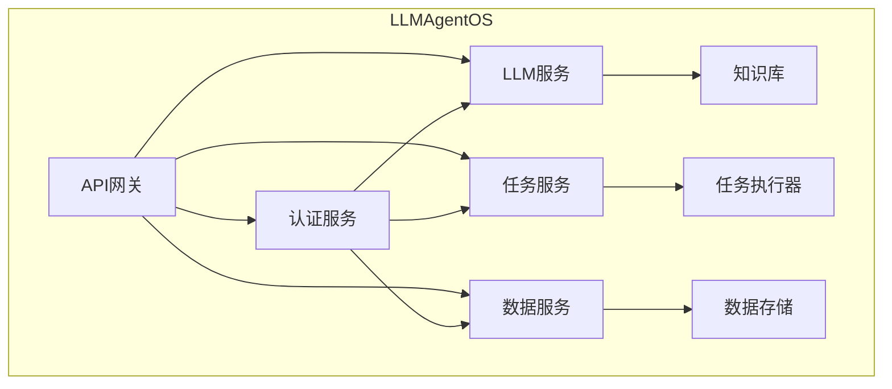
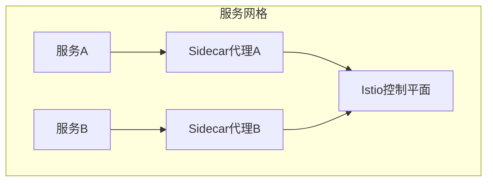
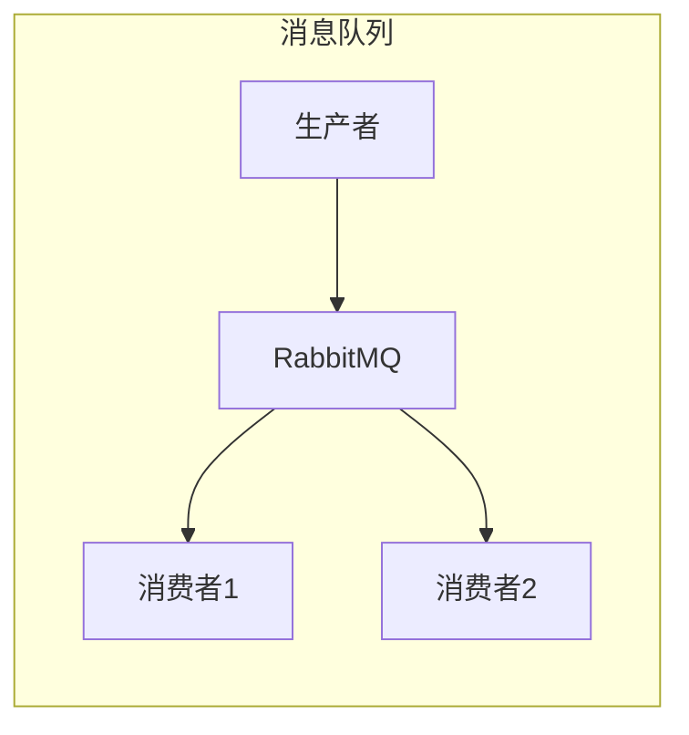
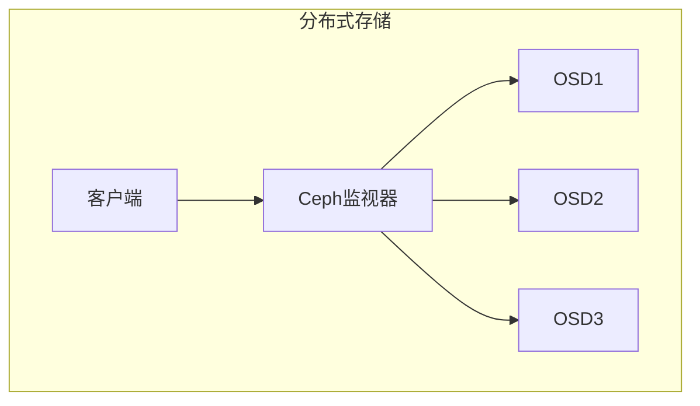
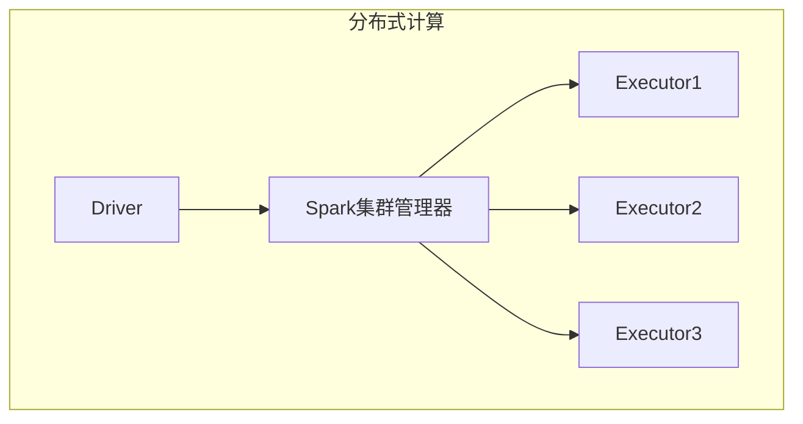
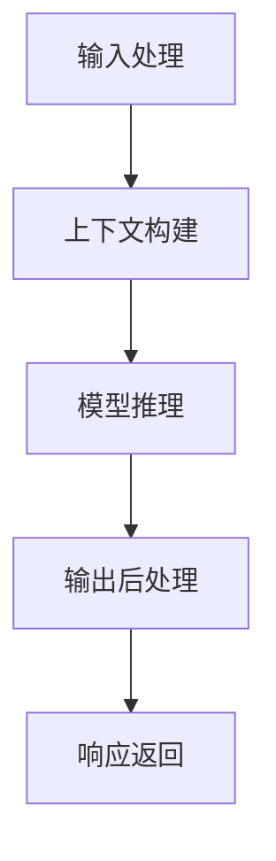
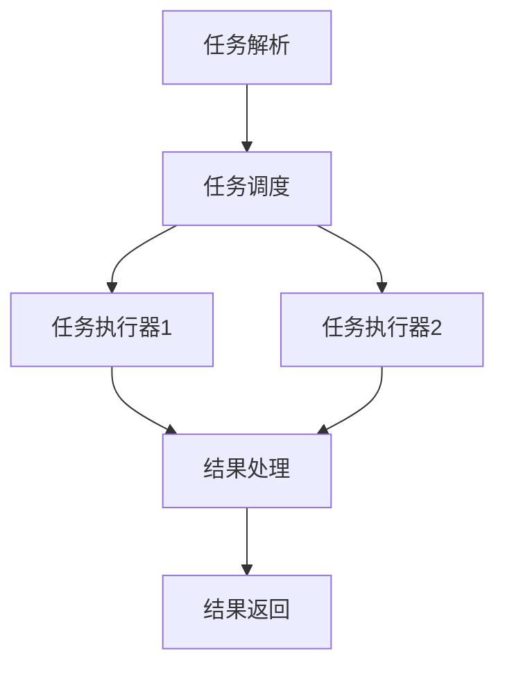
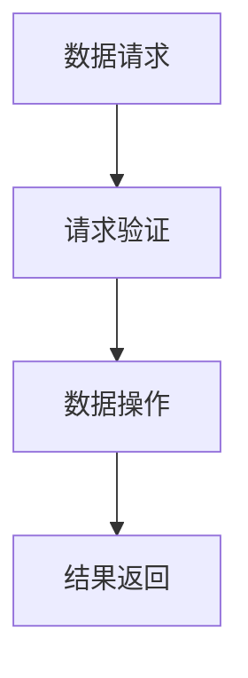

# LLMAgentOS的分布式架构:实现高可用性和可扩展性

## 1.背景介绍

### 1.1 什么是LLMAgentOS?

LLMAgentOS是一个基于大型语言模型(LLM)的智能代理操作系统,旨在为各种应用程序提供强大的自然语言处理(NLP)和人工智能(AI)功能。它利用了最新的LLM技术,如GPT、PaLM和LaMDA等,为用户提供自然语言交互界面,并执行各种任务,如问答、文本生成、代码生成等。

### 1.2 为什么需要分布式架构?

随着LLMAgentOS的广泛采用和功能的不断扩展,单个服务器已无法满足日益增长的计算需求和高并发请求。因此,构建一个高度可扩展和高可用的分布式架构变得至关重要。分布式架构可以提供以下优势:

- **高可用性**: 通过冗余和负载均衡,确保系统持续运行,避免单点故障。
- **可扩展性**: 可以根据需求动态添加或删除计算资源,满足不断变化的负载。
- **容错性**: 单个组件故障不会导致整个系统瘫痪,提高了系统的鲁棒性。
- **高效利用资源**: 通过负载均衡和资源调度,充分利用集群中的计算资源。

## 2.核心概念与联系

### 2.1 微服务架构

LLMAgentOS采用了微服务架构,将整个系统拆分为多个小型、独立的服务。每个服务都负责特定的业务逻辑,并通过轻量级的通信机制(如HTTP/gRPC)进行交互。这种架构具有以下优势:

- **高内聚、低耦合**: 每个服务只关注自己的职责,降低了服务之间的依赖关系。
- **独立部署和扩展**: 每个服务可以独立部署和扩展,提高了灵活性和可维护性。
- **技术栈heterogeneity**: 不同的服务可以使用不同的编程语言和技术栈,适应不同的需求。

### 2.2 服务网格

为了简化服务之间的通信和管理,LLMAgentOS采用了服务网格(Service Mesh)技术。服务网格是一个专门用于处理服务间通信的基础设施层,它提供了一系列关键功能,如负载均衡、服务发现、流量控制、安全性和可观察性等。

在LLMAgentOS中,我们使用了Istio作为服务网格的实现。Istio通过在每个服务旁边注入一个Sidecar代理,拦截服务间的所有流量,从而实现了透明的流量管理。这种设计使得服务本身不需要知道网络细节,只需关注业务逻辑即可。

### 2.3 消息队列

为了实现异步通信和解耦,LLMAgentOS使用了消息队列(Message Queue)技术。消息队列可以在发送方和接收方之间提供一个中介缓冲区,确保消息的可靠传递和有序处理。

在LLMAgentOS中,我们使用RabbitMQ作为消息队列的实现。RabbitMQ支持多种消息传递模式,如发布/订阅、工作队列和路由等,可以满足不同场景的需求。消息队列的引入使得系统更加灵活和可扩展,同时也提高了系统的容错能力。

### 2.4 分布式存储

为了存储和管理大量的数据,如知识库、模型参数和用户数据等,LLMAgentOS采用了分布式存储系统。分布式存储系统可以提供高度的可扩展性、可用性和容错性,满足大规模数据存储和访问的需求。

在LLMAgentOS中,我们使用了Ceph作为分布式存储的实现。Ceph是一个统一的分布式存储系统,支持对象存储、块存储和文件存储等多种存储方式。它具有高可扩展性、高可用性和自修复能力,非常适合大规模数据存储场景。

### 2.5 分布式计算

为了处理大规模的计算任务,如模型训练、推理和数据处理等,LLMAgentOS采用了分布式计算框架。分布式计算框架可以将计算任务分解为多个小任务,并在多个计算节点上并行执行,从而提高计算效率和资源利用率。

在LLMAgentOS中,我们使用了Apache Spark作为分布式计算框架的实现。Spark支持内存计算、流式计算和机器学习等多种计算模式,并提供了丰富的API和库,可以满足各种计算需求。

## 3.核心算法原理具体操作步骤

### 3.1 LLM服务

LLM服务是LLMAgentOS的核心组件,负责处理自然语言输入并生成相应的响应。它基于大型语言模型(LLM)技术,如GPT、PaLM和LaMDA等,实现了强大的自然语言处理能力。

LLM服务的工作流程如下:

1. **输入处理**: 接收来自API网关的自然语言输入,进行预处理和标准化。
2. **上下文构建**: 根据输入和用户历史记录,构建相关的上下文信息。
3. **模型推理**: 将上下文信息输入到LLM模型中,生成响应输出。
4. **输出后处理**: 对模型输出进行后处理,如过滤、格式化和增强等。
5. **响应返回**: 将最终响应返回给API网关。

### 3.2 任务服务

任务服务负责管理和执行各种任务,如问答、文本生成、代码生成等。它与LLM服务紧密协作,将自然语言输入转换为具体的任务,并调用相应的任务执行器进行处理。

任务服务的工作流程如下:

1. **任务解析**: 接收来自API网关的自然语言输入,解析出需要执行的任务类型和参数。
2. **任务调度**: 根据任务类型和负载情况,选择合适的任务执行器进行处理。
3. **任务执行**: 将任务参数传递给任务执行器,执行相应的操作。
4. **结果处理**: 对任务执行器的输出进行后处理,如格式化、过滤和增强等。
5. **结果返回**: 将最终结果返回给API网关。

### 3.3 数据服务

数据服务负责管理和访问各种数据资源,如知识库、模型参数和用户数据等。它提供了统一的数据访问接口,供其他服务调用。

数据服务的工作流程如下:

1. **数据请求**: 接收来自其他服务的数据请求,如读取、写入或更新等。
2. **请求验证**: 验证请求的合法性和权限。
3. **数据操作**: 根据请求类型,执行相应的数据操作,如从分布式存储读取数据或将数据写入分布式存储。
4. **结果返回**: 将数据操作的结果返回给请求方。

## 4.数学模型和公式详细讲解举例说明

在LLMAgentOS中,我们使用了多种数学模型和算法来实现各种功能,如自然语言处理、推理和决策等。以下是一些常用的数学模型和公式:

### 4.1 Transformer模型

Transformer是一种广泛应用于自然语言处理任务的序列到序列模型。它基于自注意力(Self-Attention)机制,能够有效捕获序列中的长程依赖关系。Transformer模型的核心公式如下:

$$\text{Attention}(Q, K, V) = \text{softmax}\left(\frac{QK^T}{\sqrt{d_k}}\right)V$$

其中,$$Q$$、$$K$$和$$V$$分别表示查询(Query)、键(Key)和值(Value)。$$d_k$$是缩放因子,用于防止点积过大导致梯度消失。

Transformer模型通过多头注意力(Multi-Head Attention)机制,从不同的表示子空间捕获不同的依赖关系,进一步提高了模型的表现力。

### 4.2 BERT模型

BERT(Bidirectional Encoder Representations from Transformers)是一种基于Transformer的双向编码器模型,在自然语言处理任务中表现出色。BERT采用了掩码语言模型(Masked Language Model)和下一句预测(Next Sentence Prediction)两种预训练任务,能够学习到深层次的语义表示。

BERT模型的掩码语言模型目标函数如下:

$$\mathcal{L}_{\text{MLM}} = -\sum_{i=1}^{n}\log P(x_i|x_{\backslash i})$$

其中,$$x_i$$是被掩码的词,$$x_{\backslash i}$$表示其他词。目标是最大化被掩码词的条件概率。

通过预训练和微调,BERT模型可以在多种自然语言处理任务上取得出色的性能,如文本分类、问答和序列标注等。

### 4.3 GPT模型

GPT(Generative Pre-trained Transformer)是一种基于Transformer的自回归语言模型,能够生成连贯、流畅的自然语言文本。GPT模型采用了自回归(Autoregressive)机制,每次预测下一个词时,都会考虑之前生成的词序列。

GPT模型的目标函数如下:

$$\mathcal{L} = -\sum_{t=1}^{T}\log P(x_t|x_{<t})$$

其中,$$x_t$$是第$$t$$个词,$$x_{<t}$$表示之前生成的词序列。目标是最大化每个词的条件概率。

通过预训练和微调,GPT模型可以生成高质量的文本,如新闻报道、小说和代码等。它还可以用于其他自然语言处理任务,如问答和文本摘要等。

### 4.4 强化学习模型

在LLMAgentOS中,我们还使用了强化学习模型来优化决策和控制策略。强化学习模型基于马尔可夫决策过程(Markov Decision Process),通过与环境交互来学习最优策略。

强化学习模型的目标是最大化累积回报(Cumulative Reward):

$$G_t = \sum_{k=0}^{\infty}\gamma^k R_{t+k+1}$$

其中,$$R_t$$是时间步$$t$$的即时回报,$$\gamma$$是折现因子,用于平衡即时回报和长期回报。

强化学习算法通过探索和利用的过程,不断更新策略函数$$\pi(a|s)$$,最终找到最优策略。常用的算法包括Q-Learning、策略梯度(Policy Gradient)和Actor-Critic等。

在LLMAgentOS中,强化学习模型可以用于优化任务调度、资源分配和决策过程,提高系统的整体效率和性能。

## 5.项目实践:代码实例和详细解释说明

在本节中,我们