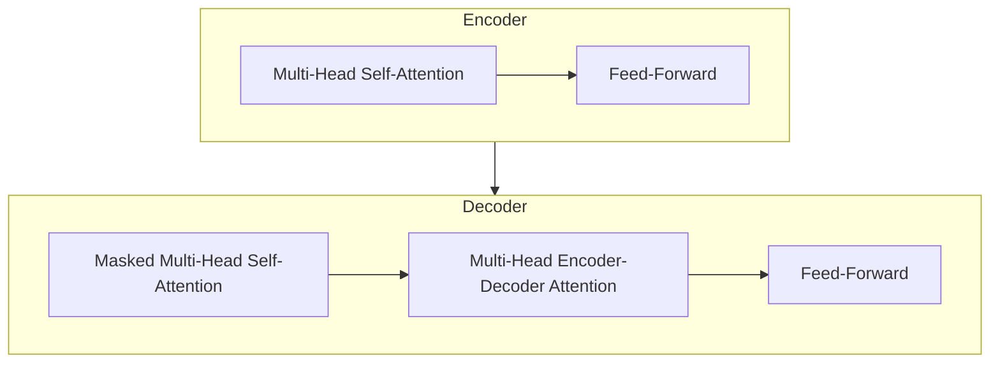

# LLaMA原理与代码实例讲解

## 1.背景介绍

### 1.1 人工智能的发展历程

人工智能(Artificial Intelligence, AI)是一个旨在模拟人类智能行为的研究领域,包括学习、推理、规划、感知和操作等方面。自20世纪50年代诞生以来,人工智能经历了几个重要的发展阶段。

#### 1.1.1 早期阶段(1950s-1960s)

早期的人工智能研究主要集中在博弈问题、符号推理和专家系统等领域。这一时期的代表性成果包括深蓝(DeepBlue)国际象棋程序、通用问题求解器(General Problem Solver)和专家系统DENDRAL等。

#### 1.1.2 知识库时代(1960s-1980s)

在这一阶段,研究人员开始关注知识的表示和推理,试图构建大规模的知识库系统。代表性成果包括SHRDLU自然语言理解系统、MYCIN专家系统等。然而,知识获取的瓶颈成为了这一时期的主要挑战。

#### 1.1.3 统计学习时代(1980s-2010s)

随着计算机硬件的发展和大量数据的积累,统计学习方法开始在人工智能领域广泛应用,包括神经网络、支持向量机、贝叶斯方法等。这一时期的代表性成果包括深度学习的兴起、ImageNet大规模图像识别挑战赛等。

#### 1.1.4 大模型时代(2010s-现在)

近年来,benefromed by the rapid growth of computing power and the availability of massive datasets, large language models (LLMs) and multimodal models have emerged as a new frontier in AI, achieving remarkable performance in various natural language processing (NLP) and multimodal tasks. Representative models include GPT-3, DALL-E, PaLM, and LLaMA.

### 1.2 大语言模型的兴起

大语言模型(Large Language Model, LLM)是一种利用自监督学习方法在大规模文本语料库上训练的神经网络模型。这些模型能够从海量的自然语言数据中学习语言的统计规律和语义关联,从而获得强大的语言理解和生成能力。

LLM的出现源于transformer模型架构的提出,以及自注意力机制和大规模预训练的应用。代表性的LLM包括GPT系列(GPT、GPT-2、GPT-3)、BERT、XLNet、RoBERTa、ALBERT等。这些模型在自然语言处理任务中取得了卓越的成绩,推动了NLP技术的快速发展。

LLaMA(Llama Language Model Adapted)是由人工智能研究公司Anthropic开发的一种大语言模型。它基于Transformer架构,采用自监督学习方法进行预训练,具有出色的语言理解和生成能力。LLaMA在多项NLP基准测试中表现优异,展现了强大的通用语言智能。

### 1.3 LLaMA的重要性

LLaMA作为一种新兴的大语言模型,具有重要的理论意义和应用价值:

1. **通用语言智能**:LLaMA展现了强大的语言理解和生成能力,能够处理多种NLP任务,体现了通用人工智能(Artificial General Intelligence, AGI)的雏形。
2. **高效学习**:LLaMA通过自监督学习方法从海量语料中高效学习语言知识,体现了机器学习的高效学习能力。
3. **开源共享**:Anthropic公司决定开源LLaMA模型权重,促进了人工智能技术的开放共享,为学术界和工业界提供了宝贵资源。
4. **多语言支持**:LLaMA支持多种语言,有助于推动多语言NLP技术的发展。
5. **广泛应用前景**:LLaMA可应用于自然语言处理、对话系统、问答系统、文本摘要、机器翻译等多个领域,具有广阔的应用前景。

## 2.核心概念与联系

### 2.1 自注意力机制

自注意力机制(Self-Attention Mechanism)是Transformer模型架构的核心组成部分,它能够有效捕捉输入序列中任意两个位置之间的长程依赖关系。相比于传统的循环神经网络(RNN)和卷积神经网络(CNN),自注意力机制具有并行计算和长期记忆的优势。

自注意力机制的基本思想是,对于输入序列中的每个位置,计算其与所有其他位置的相关性得分,然后根据这些得分对其他位置的表示进行加权求和,得到该位置的新表示。这种机制使模型能够同时关注整个输入序列,而不受序列长度的限制。

在LLaMA中,自注意力机制被广泛应用于Transformer的编码器和解码器层,用于捕捉输入和输出序列中的长程依赖关系,从而提高模型的语言理解和生成能力。

$$
\begin{aligned}
\text{Attention}(Q, K, V) &= \text{softmax}\left(\frac{QK^T}{\sqrt{d_k}}\right)V \\
\text{MultiHead}(Q, K, V) &= \text{Concat}(head_1, \ldots, head_h)W^O\\
\text{where } head_i &= \text{Attention}(QW_i^Q, KW_i^K, VW_i^V)
\end{aligned}
$$

其中,$$Q$$、$$K$$和$$V$$分别表示查询(Query)、键(Key)和值(Value)矩阵,$$d_k$$是缩放因子,用于防止点积过大导致的梯度饱和问题。MultiHead表示多头注意力机制,通过将$$Q$$、$$K$$和$$V$$分别线性投影到不同的子空间,并对多个注意力头的输出进行拼接,可以提高模型的表达能力。

### 2.2 Transformer架构

Transformer是一种全新的序列到序列(Seq2Seq)模型架构,它完全基于自注意力机制,不依赖于循环或卷积操作。Transformer架构主要由编码器(Encoder)和解码器(Decoder)两部分组成。

#### 2.2.1 编码器(Encoder)

编码器的主要作用是将输入序列映射为一系列连续的表示,捕捉输入序列中的上下文信息。编码器由多个相同的层组成,每一层包括两个子层:

1. **多头自注意力子层**(Multi-Head Self-Attention Sublayer):通过自注意力机制捕捉输入序列中任意两个位置之间的长程依赖关系。
2. **前馈全连接子层**(Feed-Forward Fully-Connected Sublayer):对每个位置的表示进行非线性变换,提高模型的表达能力。

#### 2.2.2 解码器(Decoder)

解码器的主要作用是根据编码器的输出和先前生成的输出序列,预测下一个输出符号。解码器也由多个相同的层组成,每一层包括三个子层:

1. **掩蔽多头自注意力子层**(Masked Multi-Head Self-Attention Sublayer):通过掩蔽机制,使每个位置的表示只能关注其之前的位置,保证了自回归(Autoregressive)属性。
2. **多头编码器-解码器注意力子层**(Multi-Head Encoder-Decoder Attention Sublayer):通过注意力机制,将解码器的表示与编码器的输出进行关联。
3. **前馈全连接子层**(Feed-Forward Fully-Connected Sublayer):类似于编码器中的前馈全连接子层。

Transformer架构的核心优势在于完全基于注意力机制,能够有效捕捉长程依赖关系,并且支持并行计算,从而提高了模型的性能和训练效率。

### 2.3 自监督学习

自监督学习(Self-Supervised Learning)是一种无需人工标注的机器学习范式,它通过从原始数据中自动构建监督信号,使模型能够从大量未标注数据中学习有用的表示。

在自然语言处理领域,常见的自监督学习方法包括:

1. **蒙版语言模型**(Masked Language Modeling, MLM):在输入序列中随机掩蔽部分词元,要求模型根据上下文预测被掩蔽的词元。
2. **下一句预测**(Next Sentence Prediction, NSP):给定两个句子,要求模型预测它们是否为连续的句子。
3. **序列到序列预训练**(Sequence-to-Sequence Pre-training):将输入序列作为编码器的输入,将输入序列的移位版本作为解码器的输出,要求模型重构输入序列。

LLaMA采用了序列到序列预训练的方法,通过在大规模语料库上预训练,使模型能够从海量文本数据中高效学习语言知识,获得强大的语言理解和生成能力。

### 2.4 大模型的挑战

尽管大语言模型展现了强大的能力,但它们也面临着一些重要的挑战:

1. **计算资源需求**:训练大规模语言模型需要巨大的计算资源,包括高性能GPU、大量内存和存储空间等,这对于普通用户和小型组织来说是一个挑战。
2. **数据隐私和安全**:大语言模型通常在海量文本数据上训练,可能会存在隐私和安全风险,如模型可能会复制或泄露训练数据中的敏感信息。
3. **偏见和不当内容**:由于训练数据可能存在偏见和不当内容,大语言模型也可能继承和放大这些问题,产生有偏见或不当的输出。
4. **可解释性和可控性**:大语言模型的内部机理通常是一个黑箱,缺乏可解释性和可控性,这可能会影响其在关键任务中的应用。
5. **能源消耗和环境影响**:训练和部署大语言模型需要消耗大量能源,可能会对环境产生不利影响。

解决这些挑战需要持续的研究和创新,包括提高计算效率、加强隐私保护、缓解偏见、提高可解释性和可控性,以及探索更加环保的模型设计和训练方法。

## 3.核心算法原理具体操作步骤

### 3.1 Transformer编码器

Transformer编码器的主要作用是将输入序列映射为一系列连续的表示,捕捉输入序列中的上下文信息。编码器由多个相同的层组成,每一层包括两个子层:多头自注意力子层和前馈全连接子层。

#### 3.1.1 多头自注意力子层

多头自注意力子层的主要作用是捕捉输入序列中任意两个位置之间的长程依赖关系。具体操作步骤如下:

1. 将输入序列$$X=(x_1, x_2, \ldots, x_n)$$分别线性投影到查询(Query)、键(Key)和值(Value)空间,得到$$Q$$、$$K$$和$$V$$矩阵。
2. 计算查询$$Q$$与所有键$$K$$的点积,并除以缩放因子$$\sqrt{d_k}$$,得到注意力得分矩阵。
3. 对注意力得分矩阵进行softmax操作,得到注意力权重矩阵。
4. 将注意力权重矩阵与值$$V$$矩阵相乘,得到每个位置的加权和表示。
5. 对多个注意力头的输出进行拼接,并线性投影到最终的输出空间。

数学表示如下:

$$
\begin{aligned}
Q &= XW^Q \\
K &= XW^K \\
V &= XW^V \\
\text{Attention}(Q, K, V) &= \text{softmax}\left(\frac{QK^T}{\sqrt{d_k}}\right)V \\
\text{MultiHead}(Q, K, V) &= \text{Concat}(head_1, \ldots, head_h)W^O\\
\text{where } head_i &= \text{Attention}(QW_i^Q, KW_i^K, VW_i^V)
\end{aligned}
$$

其中,$$W^Q$$、$$W^K$$、$$W^V$$和$$W^O$$是可学习的线性投影参数。

#### 3.1.2 前馈全连接子层

前馈全连接子层的主要作用是对每个位置的表示进行非线性变换,提高模型的表达能力。具体操作步骤如下:

1. 将多头自注意力子层的输出$$X'$$线性投