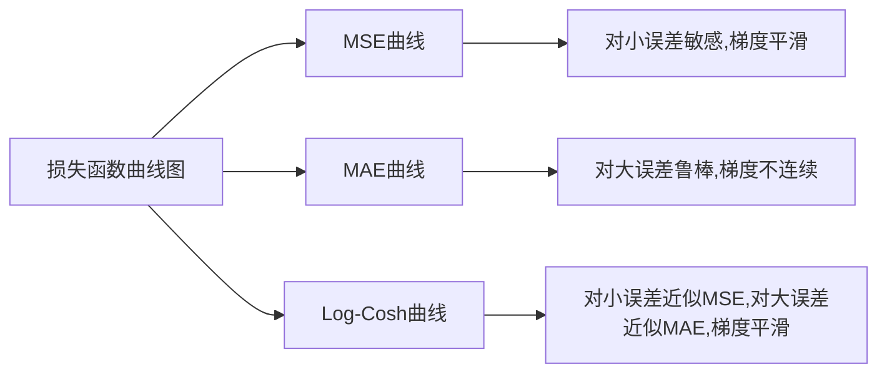

# Log-Cosh损失：平滑的MSE替代方案

## 1.背景介绍

### 1.1 损失函数的重要性

在机器学习和深度学习中，损失函数(Loss Function)扮演着至关重要的角色。它用于衡量模型预测值与真实值之间的差距,并作为优化模型参数的依据。选择合适的损失函数对于模型的性能和收敛具有重大影响。

### 1.2 常见损失函数及其局限性

最常见的损失函数是均方误差(Mean Squared Error, MSE)。它计算预测值与真实值之间的平方差,并取平均值。然而,MSE对于异常值(outliers)非常敏感,这可能会导致模型性能下降。另一个流行的损失函数是平均绝对误差(Mean Absolute Error, MAE),它计算预测值与真实值之间的绝对差值的平均值。MAE相对于MSE更加鲁棒,但在某些情况下可能会产生不连续的梯度,从而影响模型的优化过程。

## 2.核心概念与联系

### 2.1 Log-Cosh损失函数

Log-Cosh损失函数是一种平滑的损失函数,它结合了MSE和MAE的优点。Log-Cosh损失函数的公式如下:

$$\text{Log-Cosh Loss} = \sum_{i=1}^{N} \log\left(\cosh\left(y_i - \hat{y}_i\right)\right)$$

其中,$ y_i $是真实值,$ \hat{y}_i $是预测值,$ N $是样本数量。

Log-Cosh损失函数的关键特点是:

1. 对于小的误差,它近似于MSE,具有良好的数学性质和平滑梯度。
2. 对于大的误差,它近似于MAE,从而减少异常值的影响。
3. 它是一个平滑的凸函数,可以保证梯度的连续性,有利于模型的优化。

### 2.2 Log-Cosh与MSE和MAE的关系

为了更好地理解Log-Cosh损失函数,我们可以将其与MSE和MAE进行比较。

当误差$ e = y - \hat{y} $较小时,Log-Cosh损失函数近似于MSE:

$$\log(\cosh(e)) \approx \frac{e^2}{2}$$

当误差$ e $较大时,Log-Cosh损失函数近似于MAE:

$$\log(\cosh(e)) \approx |e| - \log(2)$$

通过这种平滑的转换,Log-Cosh损失函数结合了MSE和MAE的优点,同时避免了它们各自的缺陷。

## 3.核心算法原理具体操作步骤

实现Log-Cosh损失函数的核心步骤如下:

1. 计算预测值与真实值之间的误差$ e = y - \hat{y} $。
2. 对每个误差值应用双曲余弦函数$ \cosh(e) $。
3. 取自然对数$ \log(\cosh(e)) $。
4. 对所有样本的Log-Cosh损失值求和,得到总的损失值。
5. 在反向传播过程中,计算Log-Cosh损失函数的梯度,并用于更新模型参数。

以下是Log-Cosh损失函数的Python实现示例:

```python
import torch
import torch.nn as nn

def log_cosh_loss(y_true, y_pred):
    x = y_pred - y_true
    return torch.mean(torch.log(torch.cosh(x)))

# 使用Log-Cosh损失函数训练模型
model = MyModel()
criterion = log_cosh_loss
optimizer = optim.SGD(model.parameters(), lr=0.01)

for epoch in range(num_epochs):
    for data in dataloader:
        inputs, labels = data
        outputs = model(inputs)
        loss = criterion(outputs, labels)
        
        optimizer.zero_grad()
        loss.backward()
        optimizer.step()
```

在上述代码中,我们定义了一个`log_cosh_loss`函数,它计算预测值与真实值之间的Log-Cosh损失。然后,我们可以将该损失函数与任何PyTorch模型一起使用,并使用标准的优化器(如SGD)来训练模型。

## 4.数学模型和公式详细讲解举例说明

### 4.1 Log-Cosh损失函数的数学表达式

Log-Cosh损失函数的数学表达式如下:

$$\mathcal{L}_\text{Log-Cosh}(y, \hat{y}) = \sum_{i=1}^{N} \log\left(\cosh\left(y_i - \hat{y}_i\right)\right)$$

其中:

- $y$是真实值的向量,大小为$N$。
- $\hat{y}$是预测值的向量,大小也为$N$。
- $\cosh(x) = \frac{e^x + e^{-x}}{2}$是双曲余弦函数。

让我们逐步分析这个公式:

1. $y_i - \hat{y}_i$计算第$i$个样本的预测误差。
2. 对每个误差值应用$\cosh$函数,得到$\cosh(y_i - \hat{y}_i)$。
3. 取自然对数$\log(\cosh(y_i - \hat{y}_i))$,得到第$i$个样本的Log-Cosh损失值。
4. 对所有样本的Log-Cosh损失值求和,得到总的损失值$\mathcal{L}_\text{Log-Cosh}(y, \hat{y})$。

### 4.2 Log-Cosh损失函数的性质

Log-Cosh损失函数具有以下性质:

1. **平滑性**: Log-Cosh损失函数是一个无处不在可微的凸函数,这意味着它的梯度在任何地方都是连续的,有利于模型的优化。

2. **鲁棒性**: 对于小的误差,Log-Cosh损失函数近似于MSE,具有良好的数学性质。对于大的误差,它近似于MAE,从而减少异常值的影响。

3. **渐近线性**: 当误差值$|y_i - \hat{y}_i|$趋近于无穷大时,Log-Cosh损失函数近似于$|y_i - \hat{y}_i| - \log(2)$,呈现出线性增长的趋势。这种性质有助于防止损失函数过度惩罚大的误差,从而提高模型的鲁棒性。

### 4.3 Log-Cosh损失函数的梯度

为了使用梯度下降法优化模型参数,我们需要计算Log-Cosh损失函数相对于预测值$\hat{y}$的梯度。根据链式法则,我们可以得到:

$$\frac{\partial \mathcal{L}_\text{Log-Cosh}}{\partial \hat{y}_i} = -\tanh(y_i - \hat{y}_i)$$

其中,$ \tanh(x) = \frac{e^x - e^{-x}}{e^x + e^{-x}} $是双曲正切函数。

这个梯度公式具有以下特点:

1. 梯度是连续的,有利于模型的优化。
2. 当误差$y_i - \hat{y}_i$接近0时,梯度近似于$-(y_i - \hat{y}_i)$,与MSE的梯度相同。
3. 当误差$y_i - \hat{y}_i$较大时,梯度值被压缩到$(-1, 1)$范围内,从而减少异常值的影响。

### 4.4 Log-Cosh损失函数的示例

让我们通过一个简单的示例来直观地理解Log-Cosh损失函数的性质。

假设我们有一个线性回归问题,真实值为$y = 2x + 1$,预测值为$\hat{y} = 1.8x + 0.5$。我们将计算MSE、MAE和Log-Cosh损失函数在不同误差值下的损失值,并绘制它们的曲线图。

```python
import numpy as np
import matplotlib.pyplot as plt

x = np.linspace(-5, 5, 100)
y = 2 * x + 1
y_pred = 1.8 * x + 0.5
error = y - y_pred

# 计算MSE
mse = np.mean((error) ** 2)

# 计算MAE
mae = np.mean(np.abs(error))

# 计算Log-Cosh损失
log_cosh_loss = np.mean(np.log(np.cosh(error)))

plt.figure(figsize=(10, 6))
plt.plot(x, (error) ** 2, label='MSE')
plt.plot(x, np.abs(error), label='MAE')
plt.plot(x, np.log(np.cosh(error)), label='Log-Cosh Loss')
plt.legend()
plt.xlabel('Error')
plt.ylabel('Loss')
plt.title('Comparison of Loss Functions')
plt.show()
```

上述代码将绘制出MSE、MAE和Log-Cosh损失函数的曲线图,如下所示:



从图中可以看出:

- MSE对于小的误差非常敏感,但梯度是平滑的。
- MAE对于大的误差更加鲁棒,但梯度在0处不连续。
- Log-Cosh损失函数结合了MSE和MAE的优点,对于小的误差近似于MSE,对于大的误差近似于MAE,同时保持了梯度的连续性。

通过这个示例,我们可以直观地理解Log-Cosh损失函数的优势所在。

## 5.项目实践:代码实例和详细解释说明

在这一部分,我们将展示如何在一个实际的机器学习项目中使用Log-Cosh损失函数。我们将使用PyTorch框架,并基于MNIST手写数字识别数据集进行实践。

### 5.1 导入所需库

```python
import torch
import torch.nn as nn
import torch.optim as optim
from torchvision import datasets, transforms
```

### 5.2 定义Log-Cosh损失函数

```python
def log_cosh_loss(y_true, y_pred):
    x = y_pred - y_true
    return torch.mean(torch.log(torch.cosh(x)))
```

这里我们定义了一个`log_cosh_loss`函数,它计算预测值与真实值之间的Log-Cosh损失。

### 5.3 加载MNIST数据集

```python
# 下载并加载MNIST数据集
train_dataset = datasets.MNIST(root='./data', train=True, transform=transforms.ToTensor(), download=True)
test_dataset = datasets.MNIST(root='./data', train=False, transform=transforms.ToTensor())

# 创建数据加载器
train_loader = torch.utils.data.DataLoader(dataset=train_dataset, batch_size=64, shuffle=True)
test_loader = torch.utils.data.DataLoader(dataset=test_dataset, batch_size=64, shuffle=False)
```

### 5.4 定义神经网络模型

```python
class MNISTNet(nn.Module):
    def __init__(self):
        super(MNISTNet, self).__init__()
        self.fc1 = nn.Linear(28 * 28, 512)
        self.fc2 = nn.Linear(512, 256)
        self.fc3 = nn.Linear(256, 10)

    def forward(self, x):
        x = x.view(-1, 28 * 28)
        x = torch.relu(self.fc1(x))
        x = torch.relu(self.fc2(x))
        x = self.fc3(x)
        return x

model = MNISTNet()
```

这里我们定义了一个简单的全连接神经网络模型,用于对MNIST数据集进行分类。

### 5.5 训练模型

```python
# 设置损失函数和优化器
criterion = log_cosh_loss
optimizer = optim.SGD(model.parameters(), lr=0.01)

# 训练模型
num_epochs = 10
for epoch in range(num_epochs):
    for i, (images, labels) in enumerate(train_loader):
        outputs = model(images)
        loss = criterion(outputs, labels)
        
        optimizer.zero_grad()
        loss.backward()
        optimizer.step()
        
    # 每个epoch打印一次训练loss
    print(f'Epoch [{epoch+1}/{num_epochs}], Loss: {loss.item():.4f}')
```

在训练过程中,我们使用Log-Cosh损失函数作为优化目标,并使用随机梯度下降(SGD)优化器更新模型参数。每个epoch结束后,我们打印当前的训练损失值。

### 5.6 评估模型

```python
# 评估模型
model.eval()
with torch.no_grad():
    correct = 0
    total = 0
    for images, labels in test_loader:
        outputs = model(images)
        _, predicted = torch.max(outputs.data, 1)
        total += labels.size(0)
        correct += (predicted == labels).sum().item()

    print(f'测试集准确率: {100 * correct / total:.2f}%')
```

在评估阶段,我们使用测试数据集计算模型