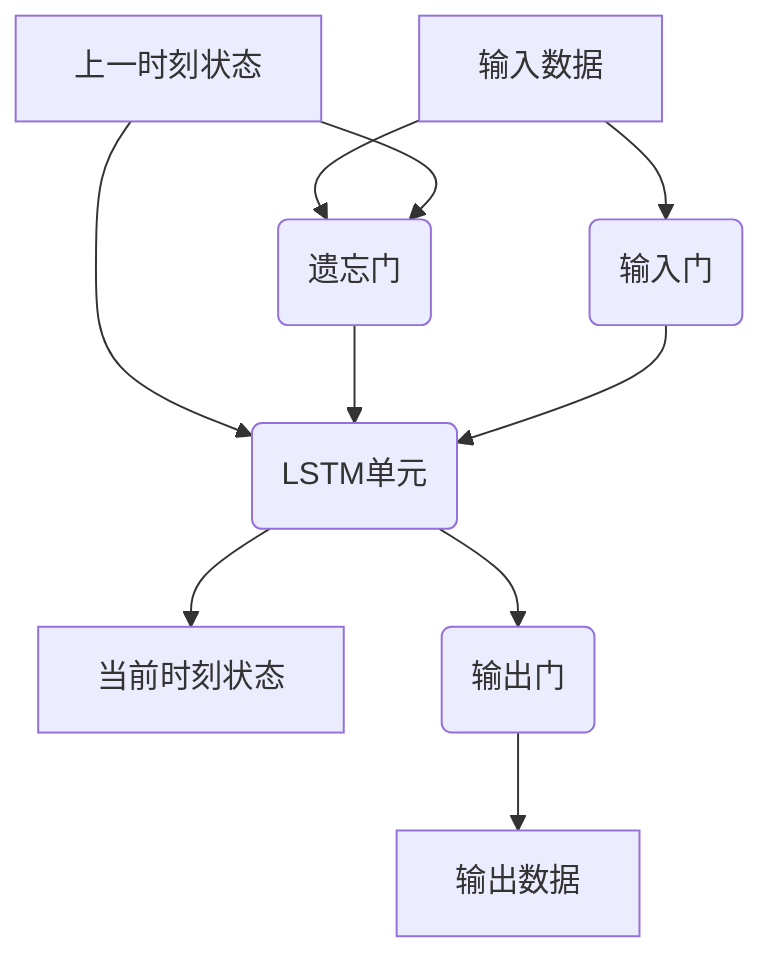

# Long Short-Term Memory 原理与代码实战案例讲解

## 1.背景介绍

### 1.1 人工神经网络的发展历程

人工神经网络是一种模拟生物神经网络工作原理的计算模型,旨在解决复杂的模式识别和数据处理问题。早期的人工神经网络模型主要包括感知器(Perceptron)和多层前馈神经网络(Multi-Layer Feedforward Neural Networks),但它们存在一些局限性,如无法有效处理序列数据和存在梯度消失/爆炸问题。

### 1.2 递归神经网络(RNN)的出现

为了解决传统神经网络在处理序列数据方面的不足,1980年代中期,递归神经网络(Recurrent Neural Networks,RNN)应运而生。RNN通过引入循环连接,使得网络具备了记忆能力,能够更好地处理序列数据。然而,传统RNN在训练过程中仍然存在梯度消失/爆炸问题,导致难以捕捉长期依赖关系。

### 1.3 长短期记忆网络(LSTM)的提出

1997年,Sepp Hochreiter和Jürgen Schmidhuber提出了长短期记忆网络(Long Short-Term Memory,LSTM),旨在解决RNN的梯度问题。LSTM通过引入门控机制和状态向量,使网络能够学习何时保留、更新和忘记信息,从而更好地捕捉长期依赖关系。LSTM在自然语言处理、语音识别、机器翻译等领域取得了巨大成功,成为序列建模的主流方法之一。

## 2.核心概念与联系

### 2.1 LSTM网络的基本结构

LSTM网络由多个LSTM单元(Cell)组成,每个单元包含一个状态向量(Cell State)和三个门控机制:遗忘门(Forget Gate)、输入门(Input Gate)和输出门(Output Gate)。



1. 遗忘门决定了从上一时刻传递过来的状态向量中,保留哪些信息,遗忘哪些信息。
2. 输入门决定了从当前输入数据和上一时刻状态向量中,提取哪些信息作为新的状态向量。
3. LSTM单元根据遗忘门和输入门的输出,更新状态向量。
4. 输出门决定了从当前状态向量中输出哪些信息作为当前时刻的输出数据。

### 2.2 LSTM与传统RNN的区别

相比传统RNN,LSTM的优势在于:

1. 通过门控机制,LSTM能够更好地控制信息的流动,避免梯度消失/爆炸问题。
2. LSTM能够捕捉长期依赖关系,适用于处理长序列数据。
3. LSTM在训练过程中更加稳定,收敛速度更快。

然而,LSTM也存在一些缺陷,如参数较多、计算复杂度较高等。针对这些问题,研究人员提出了各种改进版本,如GRU(门控循环单元)、双向LSTM等。

## 3.核心算法原理具体操作步骤

### 3.1 LSTM单元的前向传播

LSTM单元的前向传播过程包括以下步骤:

1. 计算遗忘门的输出:

$$
f_t = \sigma(W_f \cdot [h_{t-1}, x_t] + b_f)
$$

其中,$f_t$表示遗忘门的输出向量,$\sigma$为sigmoid激活函数,$W_f$和$b_f$分别为遗忘门的权重矩阵和偏置向量,$h_{t-1}$为上一时刻的隐藏状态向量,$x_t$为当前时刻的输入向量。

2. 计算输入门的输出和候选状态向量:

$$
i_t = \sigma(W_i \cdot [h_{t-1}, x_t] + b_i)
$$
$$
\tilde{C}_t = \tanh(W_C \cdot [h_{t-1}, x_t] + b_C)
$$

其中,$i_t$表示输入门的输出向量,$\tilde{C}_t$为候选状态向量,$W_i$、$W_C$和$b_i$、$b_C$分别为对应的权重矩阵和偏置向量。

3. 更新当前时刻的状态向量:

$$
C_t = f_t \odot C_{t-1} + i_t \odot \tilde{C}_t
$$

其中,$C_t$为当前时刻的状态向量,$\odot$表示元素wise乘积操作。状态向量由上一时刻的状态向量和当前时刻的候选状态向量共同决定。

4. 计算输出门的输出和当前时刻的隐藏状态向量:

$$
o_t = \sigma(W_o \cdot [h_{t-1}, x_t] + b_o)
$$
$$
h_t = o_t \odot \tanh(C_t)
$$

其中,$o_t$表示输出门的输出向量,$h_t$为当前时刻的隐藏状态向量,$W_o$和$b_o$为输出门的权重矩阵和偏置向量。

通过上述步骤,LSTM单元能够根据当前输入和上一时刻的状态,更新当前时刻的状态向量和输出向量。

### 3.2 LSTM网络的反向传播

LSTM网络的反向传播过程与传统神经网络类似,采用反向传播算法计算梯度并更新权重矩阵和偏置向量。由于LSTM单元的复杂结构,反向传播公式也相对复杂。以下是一些关键步骤:

1. 计算输出门、状态向量和隐藏状态向量的梯度:

$$
\frac{\partial L}{\partial o_t} = \frac{\partial L}{\partial h_t} \odot \tanh(C_t)
$$
$$
\frac{\partial L}{\partial C_t} = \frac{\partial L}{\partial h_t} \odot o_t \odot (1 - \tanh^2(C_t)) + \frac{\partial L}{\partial C_{t+1}} \odot f_{t+1}
$$
$$
\frac{\partial L}{\partial h_{t-1}} = \frac{\partial L}{\partial C_t} \odot (f_t \odot i_t \odot \tilde{C}_t) + \frac{\partial L}{\partial f_t} \odot C_{t-1} + \frac{\partial L}{\partial i_t} \odot \tilde{C}_t + \frac{\partial L}{\partial \tilde{C}_t} \odot i_t
$$

2. 计算门控机制的梯度:

$$
\frac{\partial L}{\partial f_t} = \frac{\partial L}{\partial C_t} \odot C_{t-1}
$$
$$
\frac{\partial L}{\partial i_t} = \frac{\partial L}{\partial C_t} \odot \tilde{C}_t
$$
$$
\frac{\partial L}{\partial \tilde{C}_t} = \frac{\partial L}{\partial C_t} \odot i_t
$$

3. 计算权重矩阵和偏置向量的梯度,并使用优化算法(如Adam)更新参数。

通过反向传播,LSTM网络能够根据输出和目标之间的误差,不断调整参数,提高模型的准确性。

## 4.数学模型和公式详细讲解举例说明

### 4.1 LSTM单元的数学模型

LSTM单元的数学模型可以用以下公式表示:

$$
\begin{aligned}
f_t &= \sigma(W_f \cdot [h_{t-1}, x_t] + b_f) \\
i_t &= \sigma(W_i \cdot [h_{t-1}, x_t] + b_i) \\
\tilde{C}_t &= \tanh(W_C \cdot [h_{t-1}, x_t] + b_C) \\
C_t &= f_t \odot C_{t-1} + i_t \odot \tilde{C}_t \\
o_t &= \sigma(W_o \cdot [h_{t-1}, x_t] + b_o) \\
h_t &= o_t \odot \tanh(C_t)
\end{aligned}
$$

其中:

- $f_t$: 遗忘门的输出向量,决定从上一时刻传递过来的状态向量中,保留哪些信息,遗忘哪些信息。
- $i_t$: 输入门的输出向量,决定从当前输入数据和上一时刻状态向量中,提取哪些信息作为新的状态向量。
- $\tilde{C}_t$: 候选状态向量,表示基于当前输入和上一时刻隐藏状态,计算出的新的状态向量。
- $C_t$: 当前时刻的状态向量,由上一时刻的状态向量和当前时刻的候选状态向量共同决定。
- $o_t$: 输出门的输出向量,决定从当前状态向量中输出哪些信息作为当前时刻的输出数据。
- $h_t$: 当前时刻的隐藏状态向量,由输出门的输出和当前状态向量计算得到。

通过上述公式,LSTM单元能够根据当前输入和上一时刻的状态,更新当前时刻的状态向量和输出向量,从而捕捉长期依赖关系。

### 4.2 门控机制的作用

LSTM单元中的三个门控机制(遗忘门、输入门和输出门)扮演着非常重要的角色,它们决定了信息在LSTM单元中的流动方式。

1. 遗忘门:

遗忘门决定了从上一时刻传递过来的状态向量中,保留哪些信息,遗忘哪些信息。通过调节遗忘门的输出,LSTM单元可以选择性地遗忘不再相关的信息,避免过度积累无用信息。

2. 输入门:

输入门决定了从当前输入数据和上一时刻状态向量中,提取哪些信息作为新的状态向量。通过调节输入门的输出,LSTM单元可以控制新信息的流入,确保状态向量只包含相关和有用的信息。

3. 输出门:

输出门决定了从当前状态向量中输出哪些信息作为当前时刻的输出数据。通过调节输出门的输出,LSTM单元可以根据当前任务的需求,选择性地输出相关信息。

这三个门控机制的协同作用,使得LSTM单元能够灵活地控制信息的流动,从而更好地捕捉长期依赖关系,避免梯度消失/爆炸问题。

### 4.3 LSTM在序列建模中的应用

LSTM在序列建模任务中有广泛的应用,例如:

1. 自然语言处理:

- 机器翻译: LSTM可以有效捕捉源语言和目标语言之间的长期依赖关系,提高翻译质量。
- 语言模型: LSTM能够学习语言的统计规律,用于文本生成、自动补全等任务。
- 情感分析: LSTM可以捕捉文本中的上下文信息,更好地识别情感倾向。

2. 语音识别:

LSTM能够有效地建模语音信号中的时序依赖关系,提高语音识别的准确性。

3. 时间序列预测:

LSTM可以学习时间序列数据中的长期模式,用于股票预测、天气预报等任务。

4. 手写识别:

LSTM能够捕捉笔画的时序信息,提高手写识别的性能。

5. 视频分析:

LSTM可以建模视频帧之间的时序依赖关系,用于行为识别、视频描述等任务。

总的来说,LSTM在处理序列数据时表现出色,成为了序列建模领域的主流方法之一。

## 5.项目实践:代码实例和详细解释说明

在本节中,我们将通过一个实际案例,展示如何使用Python和TensorFlow构建并训练LSTM模型。我们将以情感分析任务为例,使用LSTM模型对电影评论进行情感分类(正面或负面)。

### 5.1 数据准备

我们将使用IMDB电影评论数据集,该数据集包含25,000条已标注的电影评论(正面或负面)。我们将数据集分为训练集(20,000条评论)和测试集(5,000条评论)。

```python
from tensorflow.keras.datasets import imdb
from tensorflow.keras.preprocessing import sequence

# 加载IMDB数据集
(x_train, y_train), (x_test, y_test) = imdb.load_data(num_words=10000)

# 将评论序列填充/截断为固定长度
max_len = 200
x_train = sequence.pad_sequences(