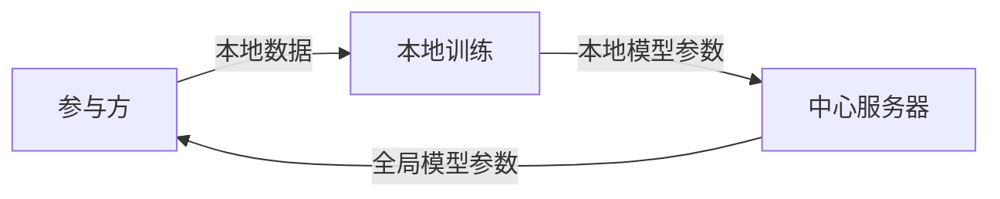

# MAML与联邦元学习:隐私保护新范式

## 1.背景介绍

### 1.1 人工智能中的隐私保护挑战

在人工智能飞速发展的今天,数据隐私保护已成为一个不容忽视的重要课题。传统的机器学习模式需要将大量数据汇集到中心服务器进行训练,这无疑给用户隐私数据带来了极大的安全隐患。如何在保证模型性能的同时,最大限度地保护用户隐私,是目前亟需解决的关键问题。

### 1.2 联邦学习的兴起 

联邦学习(Federated Learning)作为一种分布式机器学习范式应运而生。它允许参与方在本地设备上训练模型,只需上传模型参数而无需共享原始数据,从而很好地保护了数据隐私。然而,传统的联邦学习也面临着诸多挑战,如数据分布不均衡、通信开销大、模型性能不佳等。

### 1.3 元学习与MAML

元学习(Meta-Learning)是一种旨在学习如何学习的机器学习方法。与传统机器学习直接学习任务本身不同,元学习致力于学习模型参数的更新策略,从而实现快速适应新任务的能力。其中,MAML(Model-Agnostic Meta-Learning)是一种广泛使用的优化类元学习算法,通过梯度下降来学习模型初始化参数,使得模型能够在新任务上快速收敛。

### 1.4 联邦元学习的提出

MAML与联邦学习的结合,催生了一种全新的学习范式——联邦元学习(Federated Meta-Learning)。它继承了联邦学习的隐私保护优势,同时利用元学习来应对数据异构等挑战,力图实现高效、隐私保护、鲁棒的分布式机器学习。本文将重点探讨MAML在联邦元学习中的应用,阐述其核心原理、关键技术、实践案例以及面临的机遇与挑战。

## 2.核心概念与联系

### 2.1 联邦学习

联邦学习是一种分布式机器学习框架,旨在在不集中原始数据的前提下,协同训练一个全局模型。其基本流程如下:

参与方利用本地数据对模型进行训练,并将训练后的模型参数上传至中心服务器。服务器对收集到的本地模型参数进行聚合,更新全局模型,并将新的全局模型参数分发给各参与方,如此循环往复,直至模型收敛。

### 2.2 元学习与MAML

元学习旨在学习一个模型,使其能够在新任务上快速适应。形式化地,假设每个任务 $\mathcal{T}_i$ 都服从某个任务分布 $p(\mathcal{T})$,并且每个任务都有对应的损失函数 $\mathcal{L}_{\mathcal{T}_i}$。元学习的目标是找到一组模型参数 $\theta$,使得对于从 $p(\mathcal{T})$ 中采样得到的新任务,经过少量梯度下降步骤后,都能取得较好的性能。 

MAML是一种广泛使用的元学习算法,其核心思想是学习一个好的初始化参数 $\theta$,使得模型能够在新任务上快速收敛。具体而言,MAML在每个任务 $\mathcal{T}_i$ 上进行如下操作:

1. 在 $\mathcal{T}_i$ 的训练集 $\mathcal{D}^{tr}_{\mathcal{T}_i}$ 上计算梯度:
$$\nabla_\theta \mathcal{L}_{\mathcal{T}_i}(f_\theta) \Big|_{\theta}$$

2. 利用计算出的梯度更新参数,得到 $\theta'_i$:  
$$\theta'_i=\theta-\alpha \nabla_\theta \mathcal{L}_{\mathcal{T}_i}(f_\theta)$$

3. 在 $\mathcal{T}_i$ 的测试集 $\mathcal{D}^{ts}_{\mathcal{T}_i}$ 上计算 $\theta'_i$ 的损失:
$$\mathcal{L}_{\mathcal{T}_i}(f_{\theta'_i})$$

MAML的目标是最小化所有任务测试集上损失的期望:

$$\min_\theta \mathbb{E}_{\mathcal{T}_i \sim p(\mathcal{T})} [\mathcal{L}_{\mathcal{T}_i}(f_{\theta'_i})]$$

其中 $\alpha$ 是学习率。通过不断迭代优化上述目标,MAML最终学习到一组良好的初始化参数 $\theta$。

### 2.3 联邦元学习

联邦元学习将元学习引入联邦学习框架,旨在解决数据分布不均衡、通信开销大等问题,同时保护用户隐私。每个参与方视为一个任务,本地数据集对应任务的训练集。联邦元学习通过学习全局模型的初始化参数,使各参与方能在此基础上快速适应本地任务。其优化目标可表示为:

$$\min_\theta \mathbb{E}_{i \sim p(\mathcal{T})} [\mathcal{L}_{\mathcal{T}_i}(f_{\theta'_i})] + \lambda \Omega(\theta)$$

其中 $p(\mathcal{T})$ 表示所有参与方(任务)的分布, $\Omega(\theta)$ 为正则项。第一项期望所有参与方经过本地更新后的模型性能,第二项用于控制模型复杂度。

## 3.核心算法原理具体操作步骤

本节将详细介绍联邦元学习中的两个关键算法:FedMAML和Per-FedMAML。

### 3.1 FedMAML

FedMAML是将MAML直接应用到联邦学习中的一种尝试。其核心思想是联邦学习负责聚合更新全局初始化模型,而各参与方在此基础上利用MAML进行本地任务自适应。算法主要步骤如下:

1. 随机初始化全局模型参数 $\theta$
2. 重复以下步骤直到收敛:
   1. 随机选择部分参与方 $\mathcal{S}_t$
   2. 将当前全局模型参数 $\theta$ 下发给选中的参与方
   3. 对于每个选中的参与方 $i \in \mathcal{S}_t$:
      1. 在本地训练集 $\mathcal{D}^{tr}_{\mathcal{T}_i}$ 上计算梯度并更新本地模型参数:
         $$\theta'_i=\theta-\alpha \nabla_\theta \mathcal{L}_{\mathcal{T}_i}(f_\theta)$$
      2. 在本地测试集 $\mathcal{D}^{ts}_{\mathcal{T}_i}$ 上计算更新后模型 $\theta'_i$ 的梯度:
         $$g_i=\nabla_{\theta'_i} \mathcal{L}_{\mathcal{T}_i}(f_{\theta'_i})$$
      3. 将梯度 $g_i$ 上传至服务器
   4. 服务器对收到的梯度进行聚合,更新全局模型参数:
      $$\theta \leftarrow \theta - \beta \frac{1}{|\mathcal{S}_t|} \sum_{i \in \mathcal{S}_t} g_i$$

其中 $\alpha$ 和 $\beta$ 分别为本地和全局学习率。FedMAML通过交替本地更新和全局聚合,在保护隐私的同时实现了模型的自适应能力。

### 3.2 Per-FedMAML 

FedMAML在非IID数据分布下的性能不佳,Per-FedMAML对其进行了改进。不同于FedMAML学习一个全局初始化模型,Per-FedMAML为每个参与方学习一个个性化的初始化模型,从而更好地适应本地数据分布。算法主要步骤如下:

1. 随机初始化每个参与方的本地模型参数 $\{\theta_1,\cdots,\theta_N\}$
2. 重复以下步骤直到收敛:  
   1. 对于每个参与方 $i=1,\cdots,N$:
      1. 在本地训练集 $\mathcal{D}^{tr}_{\mathcal{T}_i}$ 上计算梯度并更新本地模型参数:
         $$\theta'_i=\theta_i-\alpha \nabla_{\theta_i} \mathcal{L}_{\mathcal{T}_i}(f_{\theta_i})$$
      2. 在本地测试集 $\mathcal{D}^{ts}_{\mathcal{T}_i}$ 上计算更新后模型 $\theta'_i$ 的梯度:
         $$g_i=\nabla_{\theta'_i} \mathcal{L}_{\mathcal{T}_i}(f_{\theta'_i})$$
   2. 服务器对收到的梯度进行聚合,更新每个参与方的模型参数:
      $$\theta_i \leftarrow \theta_i - \beta g_i, \quad i=1,\cdots,N$$

相比FedMAML,Per-FedMAML为每个参与方维护一个本地模型,通过个性化的初始化参数来适应不同的任务,从而提高了非IID数据下的性能。同时,由于不直接共享本地数据和模型,Per-FedMAML也很好地保护了用户隐私。

## 4.数学模型和公式详细讲解举例说明

### 4.1 FedMAML的优化目标

FedMAML旨在学习一个全局初始化模型 $\theta$,使得所有参与方经过少量本地更新后,都能在本地任务上取得较好的性能。形式化地,其优化目标可表示为:

$$\min_\theta \mathbb{E}_{i \sim p(\mathcal{T})} [\mathcal{L}_{\mathcal{T}_i}(f_{\theta'_i})]$$

其中 $\theta'_i$ 表示参与方 $i$ 经过一步梯度下降后的本地模型参数:

$$\theta'_i=\theta-\alpha \nabla_\theta \mathcal{L}_{\mathcal{T}_i}(f_\theta)$$

$\alpha$ 为本地学习率。直观地,FedMAML希望找到一个全局初始化模型 $\theta$,使得所有参与方在此基础上经过一步梯度下降后,其本地模型 $f_{\theta'_i}$ 在对应任务的损失函数 $\mathcal{L}_{\mathcal{T}_i}$ 上的值最小。

### 4.2 Per-FedMAML的优化目标

与FedMAML学习一个全局模型不同,Per-FedMAML为每个参与方学习一个个性化的初始化模型。其优化目标可表示为:

$$\min_{\theta_1,\cdots,\theta_N} \frac{1}{N} \sum_{i=1}^N \mathcal{L}_{\mathcal{T}_i}(f_{\theta'_i})$$

其中 $\theta'_i$ 表示参与方 $i$ 经过一步梯度下降后的本地模型参数:

$$\theta'_i=\theta_i-\alpha \nabla_{\theta_i} \mathcal{L}_{\mathcal{T}_i}(f_{\theta_i})$$

$\alpha$ 为本地学习率。Per-FedMAML希望找到一组个性化的初始化模型 $\{\theta_1,\cdots,\theta_N\}$,使得每个参与方在其对应初始化模型的基础上经过一步梯度下降后,其本地模型 $f_{\theta'_i}$ 在对应任务的损失函数 $\mathcal{L}_{\mathcal{T}_i}$ 上的值最小。

### 4.3 举例说明

为了更直观地理解FedMAML和Per-FedMAML,我们以一个简单的线性回归任务为例进行说明。假设有 $N$ 个参与方,每个参与方 $i$ 的本地数据集为 $\mathcal{D}_i=\{(x_j^i,y_j^i)\}_{j=1}^{n_i}$,其中 $x_j^i \in \mathbb{R}^d$, $y_j^i \in \mathbb{R}$。我们希望学习一个线性模型 $f_\theta(x)=\theta^\top x$ 来拟合数据,其中 $\theta \in \mathbb{R}^d$ 为模型参数。每个参与方 $i$ 的损失函数为均方误差:

$$\mathcal{L}_i(\theta)=\frac{1}{n_i} \sum_{j=1}^{n_i} (f_\theta(x_j^i)-y_