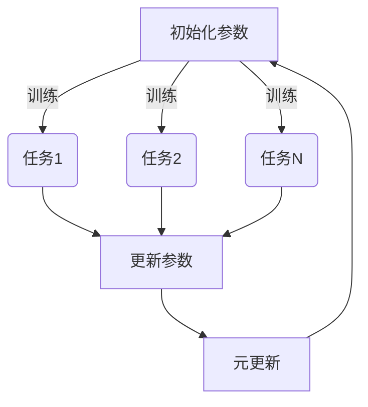

# MAML赋能:智能系统可解释性提升

## 1. 背景介绍

### 1.1 人工智能系统的不可解释性挑战

随着人工智能(AI)系统在各个领域的广泛应用,它们的决策过程和输出结果对人类生活产生了深远影响。然而,许多AI系统特别是深度学习模型,由于其黑盒性质和复杂性,很难解释其内部工作原理和决策依据。这种不可解释性不仅影响了人类对AI系统的信任和接受度,也可能导致潜在的风险和不公平。

### 1.2 可解释性的重要性

可解释性(Explainability)被认为是构建可信赖的AI系统的关键因素之一。它允许人类理解AI系统的决策过程,评估其合理性和公平性,并在必要时进行调整和改进。可解释性还有助于发现模型中的偏差和错误,提高系统的透明度和可审计性。

### 1.3 MAML:一种提高可解释性的元学习方法

为了解决AI系统的不可解释性挑战,研究人员提出了多种方法,其中一种备受关注的方法是模型不可知元学习(Model-Agnostic Meta-Learning,MAML)。MAML是一种元学习算法,它旨在提高机器学习模型在新任务上的快速适应能力,同时保持模型的可解释性。

## 2. 核心概念与联系

### 2.1 元学习概念

元学习(Meta-Learning)是机器学习的一个分支,它关注如何利用过去的经验来快速学习新任务。传统的机器学习算法通常在单个任务上进行训练,而元学习则旨在从多个相关任务中提取出通用的知识,以便更好地适应新的任务。

### 2.2 MAML算法概述

MAML算法的核心思想是在多个相关任务上进行训练,以学习一个良好的初始化参数,使得在新任务上只需少量数据和少量梯度更新步骤即可获得良好的性能。该算法通过优化模型在不同任务上的性能,来寻找一个可以快速适应新任务的初始化参数。



上图展示了MAML算法的基本流程。初始化参数经过在多个任务上的训练后,可以更新为一个能够快速适应新任务的良好初始化参数。

### 2.3 MAML与可解释性

MAML算法不仅能够提高模型在新任务上的适应能力,同时也有助于提高模型的可解释性。由于MAML算法在训练过程中需要优化多个任务的性能,因此它会学习到一种更加通用和鲁棒的表示,这种表示更容易被人类理解和解释。此外,MAML算法还可以与其他可解释性方法相结合,进一步增强模型的可解释性。

## 3. 核心算法原理具体操作步骤

MAML算法的核心思想是通过在一系列相关任务上进行元训练,来学习一个良好的初始化参数,使得在新任务上只需少量数据和少量梯度更新步骤即可获得良好的性能。下面我们详细介绍MAML算法的具体操作步骤:

### 3.1 任务分布和元训练集

MAML算法假设存在一个任务分布 $p(\mathcal{T})$,每个任务 $\mathcal{T}_i$ 都是从该分布中采样得到的。我们将整个数据集划分为元训练集 $\mathcal{D}_{train}$ 和元测试集 $\mathcal{D}_{test}$。元训练集用于学习初始化参数,而元测试集用于评估模型在新任务上的性能。

### 3.2 内循环:任务特定适应

对于每个任务 $\mathcal{T}_i$,我们从元训练集 $\mathcal{D}_{train}$ 中采样一个支持集 $\mathcal{D}_i^{tr}$ 和一个查询集 $\mathcal{D}_i^{val}$。支持集用于模型在该任务上的适应,而查询集用于评估模型在该任务上的性能。

我们从初始化参数 $\theta$ 开始,在支持集 $\mathcal{D}_i^{tr}$ 上进行少量梯度更新步骤,得到任务特定的适应参数 $\theta_i'$:

$$
\theta_i' = \theta - \alpha \nabla_\theta \mathcal{L}_{\mathcal{T}_i}(f_\theta, \mathcal{D}_i^{tr})
$$

其中 $\alpha$ 是学习率, $\mathcal{L}_{\mathcal{T}_i}$ 是任务 $\mathcal{T}_i$ 上的损失函数, $f_\theta$ 是参数化的模型。

### 3.3 外循环:元更新

在内循环中,我们获得了每个任务的适应参数 $\theta_i'$。在外循环中,我们将这些适应参数在对应的查询集 $\mathcal{D}_i^{val}$ 上的性能作为元目标函数,对初始化参数 $\theta$ 进行元更新:

$$
\theta \leftarrow \theta - \beta \nabla_\theta \sum_{\mathcal{T}_i \sim p(\mathcal{T})} \mathcal{L}_{\mathcal{T}_i}(f_{\theta_i'}, \mathcal{D}_i^{val})
$$

其中 $\beta$ 是元学习率。通过这种方式,我们可以获得一个能够快速适应新任务的良好初始化参数 $\theta$。

### 3.4 算法伪代码

下面是MAML算法的伪代码:

```
# 元训练阶段
初始化参数 θ
for 每个元训练批次:
    从任务分布 p(T) 中采样一批任务
    for 每个任务 T_i:
        从 D_train 中采样支持集 D_i^tr 和查询集 D_i^val
        # 内循环:任务特定适应
        计算梯度: g_i = ∇_θ L_T_i(f_θ, D_i^tr)
        计算适应参数: θ_i' = θ - α * g_i
        # 外循环:元更新
        计算元梯度: g_meta = ∇_θ L_T_i(f_θ_i', D_i^val)
        更新参数: θ = θ - β * g_meta

# 元测试阶段
for 每个元测试任务 T_test:
    从 D_test 中采样支持集 D_test^tr 和查询集 D_test^val
    # 任务特定适应
    计算梯度: g_test = ∇_θ L_T_test(f_θ, D_test^tr)
    计算适应参数: θ_test' = θ - α * g_test
    # 评估性能
    计算损失: loss_test = L_T_test(f_θ_test', D_test^val)
```

通过上述步骤,我们可以获得一个能够快速适应新任务的初始化参数 $\theta$,同时也保持了模型的可解释性。

## 4. 数学模型和公式详细讲解举例说明

在MAML算法中,有几个关键的数学模型和公式需要详细讲解和举例说明。

### 4.1 任务分布和元训练集

MAML算法假设存在一个任务分布 $p(\mathcal{T})$,每个任务 $\mathcal{T}_i$ 都是从该分布中采样得到的。我们将整个数据集划分为元训练集 $\mathcal{D}_{train}$ 和元测试集 $\mathcal{D}_{test}$。

例如,在图像分类任务中,我们可以将不同的类别视为不同的任务。任务分布 $p(\mathcal{T})$ 就是所有类别的分布,而元训练集 $\mathcal{D}_{train}$ 和元测试集 $\mathcal{D}_{test}$ 分别包含了不同类别的图像样本。

### 4.2 内循环:任务特定适应

对于每个任务 $\mathcal{T}_i$,我们从元训练集 $\mathcal{D}_{train}$ 中采样一个支持集 $\mathcal{D}_i^{tr}$ 和一个查询集 $\mathcal{D}_i^{val}$。支持集用于模型在该任务上的适应,而查询集用于评估模型在该任务上的性能。

我们从初始化参数 $\theta$ 开始,在支持集 $\mathcal{D}_i^{tr}$ 上进行少量梯度更新步骤,得到任务特定的适应参数 $\theta_i'$:

$$
\theta_i' = \theta - \alpha \nabla_\theta \mathcal{L}_{\mathcal{T}_i}(f_\theta, \mathcal{D}_i^{tr})
$$

其中 $\alpha$ 是学习率, $\mathcal{L}_{\mathcal{T}_i}$ 是任务 $\mathcal{T}_i$ 上的损失函数, $f_\theta$ 是参数化的模型。

例如,在图像分类任务中,我们可以将每个类别视为一个任务。对于某个类别(任务) $\mathcal{T}_i$,我们从该类别的图像样本中采样出支持集 $\mathcal{D}_i^{tr}$ 和查询集 $\mathcal{D}_i^{val}$。我们在支持集上进行少量梯度更新步骤,得到适应该类别的参数 $\theta_i'$。

### 4.3 外循环:元更新

在内循环中,我们获得了每个任务的适应参数 $\theta_i'$。在外循环中,我们将这些适应参数在对应的查询集 $\mathcal{D}_i^{val}$ 上的性能作为元目标函数,对初始化参数 $\theta$ 进行元更新:

$$
\theta \leftarrow \theta - \beta \nabla_\theta \sum_{\mathcal{T}_i \sim p(\mathcal{T})} \mathcal{L}_{\mathcal{T}_i}(f_{\theta_i'}, \mathcal{D}_i^{val})
$$

其中 $\beta$ 是元学习率。通过这种方式,我们可以获得一个能够快速适应新任务的良好初始化参数 $\theta$。

例如,在图像分类任务中,我们将所有类别的适应参数 $\theta_i'$ 在对应的查询集上的性能作为元目标函数,对初始化参数 $\theta$ 进行元更新。这样,我们就可以获得一个能够快速适应新类别(任务)的良好初始化参数。

通过上述数学模型和公式的详细讲解和举例说明,我们可以更好地理解MAML算法的核心思想和工作原理。

## 5. 项目实践:代码实例和详细解释说明

为了更好地理解MAML算法,我们提供了一个基于PyTorch的代码实例,用于在Omniglot数据集上进行元学习。Omniglot数据集是一个手写字符数据集,包含来自不同语言的手写字符图像。我们将每种语言视为一个任务,并使用MAML算法来学习一个能够快速适应新语言的初始化参数。

### 5.1 导入所需库

```python
import torch
import torch.nn as nn
import torch.nn.functional as F
from torch.utils.data import DataLoader
from omniglot import Omniglot
```

### 5.2 定义模型

我们定义一个简单的卷积神经网络作为基础模型:

```python
class ConvNet(nn.Module):
    def __init__(self, in_channels, out_channels):
        super(ConvNet, self).__init__()
        self.conv1 = nn.Conv2d(in_channels, 64, kernel_size=3, padding=1)
        self.bn1 = nn.BatchNorm2d(64)
        self.conv2 = nn.Conv2d(64, 64, kernel_size=3, padding=1)
        self.bn2 = nn.BatchNorm2d(64)
        self.conv3 = nn.Conv2d(64, 64, kernel_size=3, padding=1)
        self.bn3 = nn.BatchNorm2d(64)
        self.conv4 = nn.Conv2d(64, 64, kernel_size=3, padding=1)
        self.bn4 = nn.BatchNorm2d(64)
        self.fc1 = nn.Linear(64, out_channels)

    def forward(self, x):
        x = F.relu(self.bn1(self.conv1(x)))
        x = F.relu(self.bn2(self.conv2(x)))
        x = F.relu(self.bn3(self.conv3(x)))
        x = F.relu(self.bn4