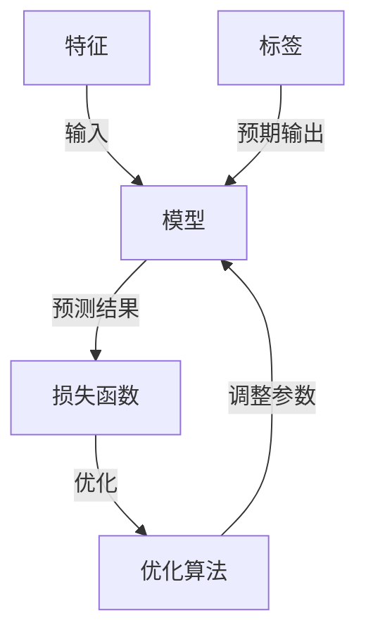

## 1.背景介绍

机器学习，作为人工智能的一个重要分支，正在逐渐改变我们的生活。从自动驾驶汽车，到智能家居设备，再到个性化推荐系统，机器学习已经无处不在。然而，这一领域的知识体系却相当复杂，涉及到大量的数学、统计学和计算机科学知识。本文旨在以通俗易懂的方式，介绍机器学习的基本概念、核心算法，以及如何在实际问题中应用这些算法。

## 2.核心概念与联系

在深入探讨机器学习的核心算法之前，我们首先需要理解几个基本概念。这些概念包括但不限于：监督学习、无监督学习、强化学习、特征、标签、模型、损失函数、优化算法等。

- 监督学习：在这种学习方式中，模型通过一组已标记的训练数据进行学习，目标是找到一个映射关系，使得对于输入的特征，模型可以预测出相应的标签。
- 无监督学习：在无监督学习中，模型需要在没有标签的数据中找出某种结构或者模式。常见的无监督学习任务包括聚类和降维。
- 强化学习：强化学习是一种通过不断与环境交互，学习如何在给定的状态下选择最优动作以获取最大回报的学习方式。
- 特征：特征是描述数据的各种属性，它们是模型的输入。
- 标签：在监督学习中，标签是我们希望模型预测出的结果。
- 模型：模型是一个数学函数，它定义了特征和标签之间的关系。
- 损失函数：损失函数用于衡量模型预测结果与真实标签之间的差异。
- 优化算法：优化算法用于调整模型的参数，以最小化损失函数。

这些概念之间的联系可以用下面的Mermaid流程图进行描述：

## 3.核心算法原理具体操作步骤

接下来，我们将介绍几种常见的机器学习算法，包括线性回归、逻辑回归、决策树、随机森林、支持向量机、神经网络等。每种算法都有其特定的应用场景，理解这些算法的原理和操作步骤，对于我们有效利用机器学习解决实际问题至关重要。

### 3.1 线性回归

线性回归是一种基础的监督学习算法，主要用于处理回归问题。其基本思想是通过找到一条直线或者一个平面，最好地拟合数据的分布。

具体操作步骤如下：

1. 初始化模型参数。
2. 使用模型进行预测。
3. 计算损失函数。
4. 使用优化算法更新模型参数。
5. 重复步骤2-4，直到模型收敛。

### 3.2 逻辑回归

逻辑回归是一种广泛用于处理二分类问题的监督学习算法。它的基本思想是通过sigmoid函数将线性回归的输出映射到(0,1)区间，从而得到一个概率值。

具体操作步骤如下：

1. 初始化模型参数。
2. 使用模型进行预测。
3. 计算损失函数。
4. 使用优化算法更新模型参数。
5. 重复步骤2-4，直到模型收敛。

### 3.3 决策树

决策树是一种简单而强大的分类和回归算法。它的基本思想是通过一系列问题，将数据划分到不同的类别中。

具体操作步骤如下：

1. 选择最优特征进行分割。
2. 根据特征值将数据划分到不同的子节点。
3. 对每个子节点递归执行步骤1-2，直到满足停止条件。
4. 生成决策树。

### 3.4 随机森林

随机森林是一种集成学习算法，它通过构建多个决策树，并取其平均值或者多数投票的方式进行预测。

具体操作步骤如下：

1. 使用bootstrap方法生成多个训练集。
2. 对每个训练集构建一个决策树。
3. 对于分类问题，采用多数投票的方式进行预测；对于回归问题，采用平均值的方式进行预测。

### 3.5 支持向量机

支持向量机是一种强大而灵活的分类和回归算法。它的基本思想是通过找到一个超平面，最大化正负样本之间的间隔。

具体操作步骤如下：

1. 初始化模型参数。
2. 计算每个样本到超平面的距离。
3. 最大化间隔，即最小化距离的平方和。
4. 使用优化算法更新模型参数。
5. 重复步骤2-4，直到模型收敛。

### 3.6 神经网络

神经网络是一种模拟人脑神经元结构的机器学习模型。它由多个层组成，每个层包含多个神经元，神经元之间通过权重连接。

具体操作步骤如下：

1. 初始化模型参数。
2. 将输入数据传递给神经网络，通过前向传播得到预测结果。
3. 计算损失函数。
4. 通过反向传播算法计算梯度，并使用优化算法更新模型参数。
5. 重复步骤2-4，直到模型收敛。

## 4.数学模型和公式详细讲解举例说明

理