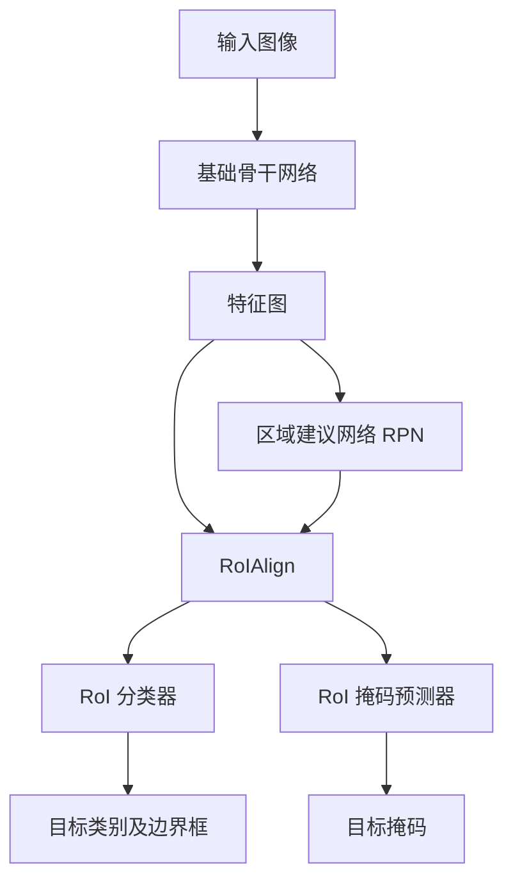

# MaskR-CNN原理与代码实例讲解

## 1. 背景介绍

### 1.1 计算机视觉任务概述

计算机视觉是人工智能领域的一个重要分支,旨在使计算机能够从数字图像或视频中获取有意义的信息。它涉及多个任务,包括图像分类、目标检测、语义分割、实例分割等。其中,实例分割是一个极具挑战的任务,它要求同时检测出图像中的目标实例,并精确分割出每个实例的像素级掩码。

### 1.2 实例分割的重要性

实例分割在许多领域有着广泛的应用,例如:

- **自动驾驶**:准确检测和分割行人、车辆、道路标志等对于自动驾驶系统的安全性至关重要。
- **增强现实(AR)和虚拟现实(VR)**: 实例分割可以帮助将虚拟对象自然地融入真实环境。
- **医疗影像分析**:能够准确分割病灶、器官等,对于疾病诊断和治疗规划具有重要意义。
- **视频监控**:可用于人员重识别、行为分析等。

### 1.3 传统方法的局限性

早期的实例分割方法主要基于传统的计算机视觉技术,如滑动窗口、手工设计的特征等。这些方法存在一些明显的局限性:

1. **泛化能力差**:手工设计的特征往往只适用于特定场景,难以泛化到更广阔的视觉任务中。
2. **计算效率低下**:滑动窗口等方法计算量巨大,难以满足实时性要求。
3. **鲁棒性差**:对噪声、遮挡、变形等因素敏感。

## 2. 核心概念与联系

### 2.1 深度学习在计算机视觉中的突破

近年来,深度学习技术在计算机视觉领域取得了巨大的突破。卷积神经网络(CNN)能够自动学习多层次的特征表示,显著提高了视觉任务的性能。著名的模型如AlexNet、VGGNet、ResNet等在图像分类、目标检测等任务上取得了卓越的成绩。

### 2.2 Mask R-CNN 模型

Mask R-CNN 是实例分割领域的里程碑式模型,它建立在著名的 Faster R-CNN 目标检测模型的基础之上。Mask R-CNN 在 Faster R-CNN 的基础上增加了一个分支,用于并行地预测对象的分割掩码。该模型的优势在于:

1. **高精度**:在多个公开数据集上,Mask R-CNN 展现出了业界领先的实例分割性能。
2. **高效率**:通过与 Faster R-CNN 共享大部分卷积特征,Mask R-CNN 在保持高精度的同时,也具有较高的计算效率。
3. **通用性**:Mask R-CNN 能够同时完成目标检测、语义分割和实例分割三个任务,是一种多任务学习模型。

### 2.3 Mask R-CNN 在各领域的应用

由于其卓越的性能和通用性,Mask R-CNN 已经在诸多领域得到了广泛应用,例如:

- 自动驾驶中的行人、车辆、道路标志等检测和分割
- 医疗影像分析中的病灶、器官等分割
- 工业缺陷检测中的缺陷实例分割
- 人物重识别和行为分析等

## 3. 核心算法原理具体操作步骤 

### 3.1 Mask R-CNN 模型架构

Mask R-CNN 模型由两个主要部分组成:

1. **基础骨干网络**:通常采用深度卷积神经网络(如 ResNet、ResNeXt 等)作为特征提取器,对输入图像进行编码,提取多尺度的特征图。

2. **两阶段检测头**:包括区域建议网络(RPN)、RoIAlign 层、RoI 分类器、RoI 掩码预测器等模块。

整体架构如下所示:



### 3.2 区域建议网络 (RPN)

RPN 是 Faster R-CNN 中提出的一种高效的候选区域生成方法。它在特征图上滑动一个小型网络,生成多个候选边界框及其对应的目标或背景分数。RPN 通过软最大化原理学习生成高质量的区域建议,为后续的分类和掩码预测奠定基础。

### 3.3 RoIAlign 层

由于卷积特征图相对于输入图像存在一定的位移,直接对 RoI 区域进行池化会引入较大的定位误差。RoIAlign 层通过在输入特征图上进行双线性插值,有效解决了这一问题,为 RoI 分类器和掩码预测器提供了更加精确的特征表示。

### 3.4 RoI 分类器和掩码预测器

RoI 分类器和掩码预测器是 Mask R-CNN 模型中两个并行的分支。

- **RoI 分类器**:基于 RoIAlign 提取的 RoI 特征,通过全连接层预测每个 RoI 的类别及精细边界框。
- **RoI 掩码预测器**:同样基于 RoIAlign 特征,通过一个小型的全卷积网络(FCN)预测每个 RoI 内的像素级掩码。

这两个分支共享大部分卷积特征,因此 Mask R-CNN 能够高效地完成目标检测和实例分割两个任务。

### 3.5 损失函数与优化

Mask R-CNN 的损失函数是多任务损失的组合,包括:

1. **分类损失**:用于优化 RoI 分类器的分类精度。
2. **边界框回归损失**:用于优化 RoI 分类器的边界框预测精度。
3. **掩码损失**:用于优化 RoI 掩码预测器的像素级分割精度。

通过端到端的训练,Mask R-CNN 能够同时优化这些损失,学习出高质量的目标检测和实例分割模型。

## 4. 数学模型和公式详细讲解举例说明

### 4.1 RPN 中的锚框 (Anchor) 机制

RPN 通过在特征图的每个位置设置多个预定义的锚框,用于捕获不同尺度和纵横比的目标。锚框的中心坐标、宽高和纵横比由预设的锚框配置决定。

设第 $i$ 个锚框的参数为 $(x_i, y_i, w_i, h_i)$,其对应的预测边界框参数为 $(\hat{x}_i, \hat{y}_i, \hat{w}_i, \hat{h}_i)$,则 RPN 需要学习以下四个参数:

$$
\begin{aligned}
t_x &= (\hat{x}_i - x_i) / w_i \\
t_y &= (\hat{y}_i - y_i) / h_i \\
t_w &= \log(\hat{w}_i / w_i) \\
t_h &= \log(\hat{h}_i / h_i)
\end{aligned}
$$

通过这种参数化方式,RPN 可以高效地预测每个锚框的目标分数和边界框回归参数。

### 4.2 RoIAlign 层双线性插值

对于输入特征图 $X$ 和某个 RoI 区域 $R$,RoIAlign 层需要计算 $R$ 在 $X$ 上的双线性插值特征。设 $R$ 被均分为 $k \times k$ 个子区域,对于第 $(i, j)$ 个子区域,其双线性插值特征计算如下:

$$
\begin{aligned}
Y_{ij} &= \sum_{m=1}^{k} \sum_{n=1}^{k} X(p_m, q_n) \cdot \max(0, 1 - |p_m - p_m^{ij}|) \cdot \max(0, 1 - |q_n - q_n^{ij}|) \\
&= \sum_{m=1}^{k} \sum_{n=1}^{k} X(p_m, q_n) \cdot b_m \cdot b_n
\end{aligned}
$$

其中 $(p_m, q_n)$ 为特征图 $X$ 上的采样点坐标,$(p_m^{ij}, q_n^{ij})$ 为子区域 $(i, j)$ 的归一化坐标,而 $b_m$ 和 $b_n$ 则是双线性插值的权重系数。通过这种方式,RoIAlign 层能够获得更加精确的 RoI 特征表示。

### 4.3 RoI 掩码预测器的全卷积网络

RoI 掩码预测器采用一个小型的全卷积网络(FCN)结构,用于预测每个 RoI 内的像素级掩码。设输入的 RoI 特征为 $X$,掩码预测器的目标是学习一个映射 $f: X \rightarrow M$,使得输出的掩码 $M$ 与真实掩码 $Y$ 尽可能接近。

FCN 的结构通常包括几个卷积层、上采样层和逐像素的分类层,如下所示:

$$
\begin{aligned}
X_1 &= \text{Conv}(X_0) \\
X_2 &= \text{Conv}(X_1) \\
\cdots \\
X_n &= \text{Deconv}(X_{n-1}) \\
M &= \text{PixelClassifier}(X_n)
\end{aligned}
$$

其中 $\text{Conv}$ 表示卷积层, $\text{Deconv}$ 表示上采样层,而 $\text{PixelClassifier}$ 则是一个逐像素的二分类器(前景或背景)。通过端到端的训练,FCN 能够学习出高质量的掩码预测模型。

### 4.4 多任务损失函数

Mask R-CNN 的损失函数是多任务损失的组合,包括分类损失 $\mathcal{L}_\text{cls}$、边界框回归损失 $\mathcal{L}_\text{box}$ 和掩码损失 $\mathcal{L}_\text{mask}$:

$$
\mathcal{L} = \mathcal{L}_\text{cls} + \mathcal{L}_\text{box} + \mathcal{L}_\text{mask}
$$

其中:

- $\mathcal{L}_\text{cls}$ 是 RoI 分类器的交叉熵损失,用于优化分类精度。
- $\mathcal{L}_\text{box}$ 是 RoI 分类器的平滑 $L_1$ 损失,用于优化边界框回归精度。
- $\mathcal{L}_\text{mask}$ 是 RoI 掩码预测器的平均二值交叉熵损失,用于优化像素级分割精度。

通过端到端的训练,Mask R-CNN 能够同时优化这三个损失,学习出高质量的目标检测和实例分割模型。

## 5. 项目实践:代码实例和详细解释说明

在本节中,我们将提供一个基于 PyTorch 的 Mask R-CNN 实现示例,并详细解释关键代码部分。完整代码可在 [GitHub 仓库](https://github.com/CommandrX/MaskRCNN-PyTorch) 中获取。

### 5.1 模型架构定义

```python
import torch
import torch.nn as nn
import torchvision

class MaskRCNN(nn.Module):
    def __init__(self, num_classes):
        super(MaskRCNN, self).__init__()
        
        # 加载预训练的 ResNet-50 骨干网络
        self.backbone = torchvision.models.resnet50(pretrained=True)
        
        # RPN 模块
        self.rpn = RPNHead(...)
        
        # RoI 特征提取层
        self.roi_align = RoIAlign(...)
        
        # RoI 分类器
        self.roi_classifier = RoIClassifier(...)
        
        # RoI 掩码预测器
        self.roi_mask_pred = RoIMaskPredictor(...)
        
    def forward(self, images, targets=None):
        # 特征提取
        features = self.backbone(images)
        
        # RPN 前向传播
        rpn_locs, rpn_scores, anchors = self.rpn(features)
        
        # RoI 特征提取
        roi_features = self.roi_align(features, anchors)
        
        # RoI 分类器前向传播
        cls_locs, cls_scores = self.roi_classifier(roi