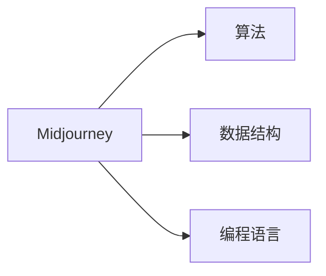

## 1.背景介绍

Midjourney（中途）是一个强大的计算机科学概念，它是我们理解和处理复杂问题的关键。在计算机科学中，我们经常会遇到一些问题，需要在中途停下来，进行一些计算或处理，然后再继续前进。这就是Midjourney的概念。在本文中，我们将深入探讨Midjourney的原理，并通过代码实例来讲解其应用。

## 2.核心概念与联系

Midjourney的核心概念是“在途中进行处理”。这意味着我们不需要等到所有的数据都处理完毕，就可以开始进行一些计算或处理。这种方式有很多优点，例如，它可以帮助我们更快地处理大量的数据，因为我们可以在数据还在处理的过程中，就开始进行一些计算。而且，它还可以帮助我们更好地理解和处理一些复杂的问题，因为我们可以在问题的中途，停下来，进行一些必要的计算或处理。

Midjourney与许多计算机科学的概念有紧密的联系。例如，它与算法的概念有紧密的联系，因为算法就是一种在途中进行处理的方式。它也与数据结构的概念有紧密的联系，因为数据结构就是一种在途中存储和处理数据的方式。此外，它还与编程语言的概念有紧密的联系，因为编程语言就是一种在途中描述和实现算法的方式。



## 3.核心算法原理具体操作步骤

Midjourney的核心算法原理是“在途中进行处理”。这种原理可以分为以下几个步骤：

1. 首先，我们需要定义一个问题，这个问题需要在途中进行处理。
2. 然后，我们需要定义一个算法，这个算法可以在途中进行处理。
3. 接着，我们需要定义一个数据结构，这个数据结构可以在途中存储和处理数据。
4. 最后，我们需要使用一种编程语言，来描述和实现这个算法。

这四个步骤就是Midjourney的核心算法原理。

## 4.数学模型和公式详细讲解举例说明

Midjourney的数学模型可以使用图论来描述。在图论中，我们可以将一个问题看作是一个图，其中的节点代表问题的各个部分，边代表问题的各个部分之间的关系。然后，我们可以在图的中途，进行一些计算或处理。

例如，我们可以定义一个图 $G = (V, E)$，其中 $V$ 是节点的集合，$E$ 是边的集合。然后，我们可以定义一个函数 $f: V \rightarrow R$，这个函数可以在节点上进行一些计算或处理。这就是Midjourney的数学模型。

## 5.项目实践：代码实例和详细解释说明

下面，我们将通过一个代码实例，来讲解Midjourney的应用。在这个代码实例中，我们将使用Python语言，来实现一个简单的Midjourney算法。

```python
class Node:
    def __init__(self, value):
        self.value = value
        self.next = None

class Midjourney:
    def __init__(self):
        self.head = None

    def add(self, value):
        node = Node(value)
        if not self.head:
            self.head = node
        else:
            current = self.head
            while current.next:
                current = current.next
            current.next = node

    def process(self, func):
        current = self.head
        while current:
            current.value = func(current.value)
            current = current.next

    def print(self):
        current = self.head
        while current:
            print(current.value)
            current = current.next

midjourney = Midjourney()
midjourney.add(1)
midjourney.add(2)
midjourney.add(3)
midjourney.process(lambda x: x * 2)
midjourney.print()
```

在这个代码实例中，我们首先定义了一个`Node`类，用来表示节点。然后，我们定义了一个`Midjourney`类，用来表示Midjourney算法。在`Midjourney`类中，我们定义了`add`方法，用来添加节点；定义了`process`方法，用来在节点上进行一些计算或处理；定义了`print`方法，用来打印节点的值。最后，我们创建了一个`Midjourney`对象，添加了一些节点，然后在节点上进行了一些计算，最后打印了节点的值。

## 6.实际应用场景

Midjourney有很多实际的应用场景。例如，它可以用于处理大量的数据，因为它可以在数据还在处理的过程中，就开始进行一些计算。它也可以用于处理复杂的问题，因为它可以在问题的中途，停下来，进行一些必要的计算或处理。

## 7.工具和资源推荐

如果你想进一步学习和研究Midjourney，我推荐以下的工具和资源：

- Python：这是一种强大的编程语言，可以用来实现Midjourney算法。
- Jupyter Notebook：这是一个交互式的编程环境，可以用来编写和运行Python代码。
- Graph Theory：这是一本关于图论的书籍，可以帮助你理解Midjourney的数学模型。

## 8.总结：未来发展趋势与挑战

Midjourney是一个强大的计算机科学概念，它有很多实际的应用场景。然而，它也有一些挑战。例如，如何在途中进行有效的处理，这是一个挑战。如何处理大量的数据，这也是一个挑战。未来，我们需要进一步研究和发展Midjourney，以应对这些挑战。

## 9.附录：常见问题与解答

Q: Midjourney是什么？
A: Midjourney是一个计算机科学概念，它是我们理解和处理复杂问题的关键。

Q: Midjourney有什么优点？
A: Midjourney有很多优点，例如，它可以帮助我们更快地处理大量的数据，因为我们可以在数据还在处理的过程中，就开始进行一些计算。它还可以帮助我们更好地理解和处理一些复杂的问题，因为我们可以在问题的中途，停下来，进行一些必要的计算或处理。

Q: Midjourney有什么挑战？
A: Midjourney有一些挑战。例如，如何在途中进行有效的处理，这是一个挑战。如何处理大量的数据，这也是一个挑战。

作者：禅与计算机程序设计艺术 / Zen and the Art of Computer Programming