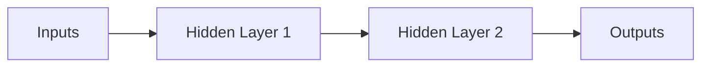

## 1.背景介绍
神经网络，或称为人工神经网络 (Artificial Neural Networks, ANN)，是一种模拟人脑神经元结构和工作机制的计算模型。这种模型通过复合多个不同的转换，对数据进行高层抽象。神经网络模型在近年来的人工智能领域取得了显著的进展，尤其是在图像识别、语音识别和自然语言处理等领域。

## 2.核心概念与联系
神经网络由大量的神经元组成，这些神经元通常被组织成一个由层次结构组成的网络。每个神经元接收一些输入，将输入与其权重进行计算，然后通过一个激活函数产生一个输出。这个输出可以被送到下一层的神经元作为输入。


在上图中，每个箭头代表神经元之间的连接，这些连接具有权重。权重是神经网络学习的基础，通过反复的训练，神经网络会调整这些权重，以便更好地完成其任务。

## 3.核心算法原理具体操作步骤
神经网络的训练通常使用一种名为反向传播的算法。反向传播算法首先进行一次前向传播，计算出神经网络的输出，并将这个输出与期望的输出进行比较，计算出误差。然后，这个误差会被反向传播到网络中，用于更新权重。

## 4.数学模型和公式详细讲解举例说明
让我们以一个简单的神经元为例，来详细说明神经网络的数学模型。假设我们有一个神经元，它有两个输入$x_1$和$x_2$，对应的权重为$w_1$和$w_2$，偏置为$b$，激活函数为$f$，那么该神经元的输出$y$可以通过以下公式计算：

$$
y = f(w_1x_1 + w_2x_2 + b)
$$

其中，$f$是激活函数，可以是任何非线性函数，如sigmoid函数、tanh函数或ReLU函数等。激活函数的作用是引入非线性因素，使得神经网络可以逼近任何复杂的函数。

## 5.项目实践：代码实例和详细解释说明
下面我们通过一个简单的例子来展示如何使用Python的神经网络库Keras来构建和训练一个神经网络。在这个例子中，我们将使用神经网络来解决一个二分类问题。

首先，我们需要导入必要的库：

```python
import keras
from keras.models import Sequential
from keras.layers import Dense
```

然后，我们定义一个神经网络模型：

```python
model = Sequential()
model.add(Dense(32, input_dim=100, activation='relu'))
model.add(Dense(1, activation='sigmoid'))
```

接下来，我们编译模型，并指定损失函数和优化器：

```python
model.compile(loss='binary_crossentropy', optimizer='adam', metrics=['accuracy'])
```

最后，我们可以使用训练数据来训练模型：

```python
model.fit(x_train, y_train, epochs=10, batch_size=32)
```

## 6.实际应用场景
神经网络在许多领域都有广泛的应用，如图像识别、语音识别、自然语言处理、推荐系统等。例如，深度神经网络在图像识别领域的应用已经超过了传统的计算机视觉技术；在自然语言处理领域，神经网络也被广泛用于情感分析、机器翻译、语音识别等任务。

## 7.工具和资源推荐
如果你对神经网络感兴趣，以下是一些有用的工具和资源：
- Keras：一个高级的神经网络库，使用Python编写，易于使用，适合初学者。
- TensorFlow：一个强大的神经网络库，由Google开发，支持多种编程语言。
- PyTorch：一个由Facebook开发的神经网络库，易于使用，支持动态计算图。

## 8.总结：未来发展趋势与挑战
神经网络已经在许多领域取得了显著的成果，但是仍然面临一些挑战，如模型解释性差、训练数据需求大、易于过拟合等。但是，随着技术的不断进步，我们有理由相信这些问题会被逐渐解决。同时，神经网络的应用领域也会越来越广泛，未来可期。

## 9.附录：常见问题与解答
- **问题1：神经网络的激活函数有什么作用？**
答：激活函数的主要作用是引入非线性因素，使得神经网络可以逼近任何复杂的函数。

- **问题2：我应该如何选择神经网络的隐藏层和神经元的数量？**
答：这主要取决于你的任务复杂度和训练数据的数量。一般来说，任务越复杂，需要的隐藏层和神经元数量就越多。但是，如果训练数据不足，过多的隐藏层和神经元可能会导致过拟合。

- **问题3：神经网络训练时如何防止过拟合？**
答：常用的防止过拟合的方法包括提供更多的训练数据、使用正则化、使用dropout等。

作者：禅与计算机程序设计艺术 / Zen and the Art of Computer Programming