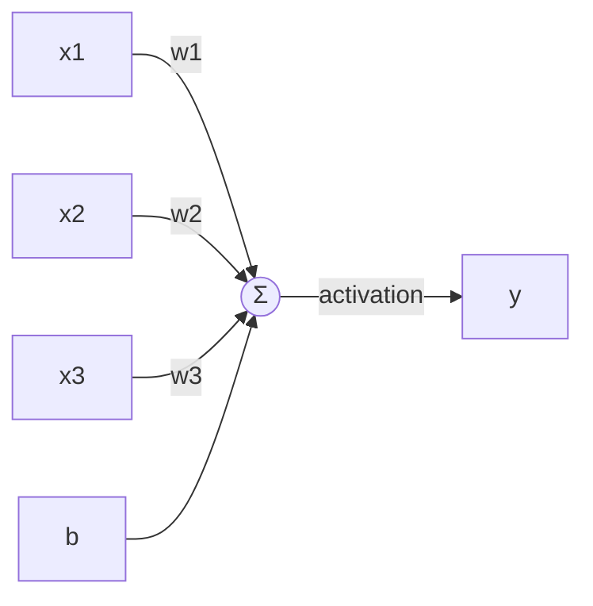
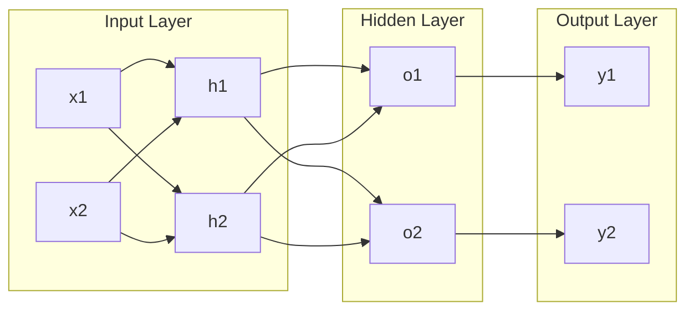
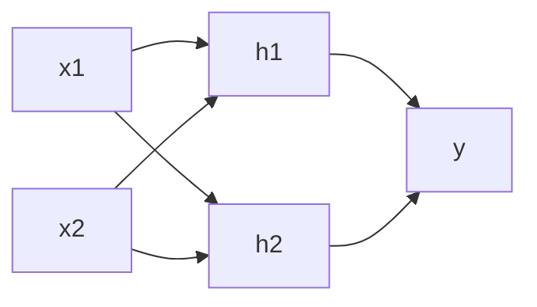

# Neural Networks 原理与代码实战案例讲解

## 1.背景介绍
### 1.1 人工智能与神经网络概述
人工智能(Artificial Intelligence, AI)是计算机科学的一个重要分支,它致力于研究如何让计算机模拟甚至超越人类的智能。而神经网络(Neural Networks, NN)则是实现人工智能的一种重要技术途径。神经网络从结构和功能上模仿生物神经系统,由大量的人工神经元相互连接构成网络,通过调整神经元之间的连接权重,不断学习和优化,从而具备处理复杂问题的能力。

### 1.2 神经网络的发展历程
神经网络的研究可以追溯到20世纪40年代,随着人工智能的发展,神经网络也经历了几次起伏:

- 1943年,McCulloch和Pitts提出了MP神经元模型,奠定了神经网络的理论基础。
- 1958年,Rosenblatt提出了感知机(Perceptron)模型,实现了神经网络的学习功能。
- 20世纪80年代,Rumelhart等人提出了反向传播(Back Propagation, BP)算法,解决了多层神经网络的训练难题。
- 2006年,Hinton等人提出了深度信念网络(Deep Belief Network, DBN),开启了深度学习的新篇章。
- 近年来,随着大数据和计算能力的发展,神经网络在计算机视觉、自然语言处理等领域取得了巨大突破。

### 1.3 神经网络的应用前景
神经网络强大的学习和建模能力,使其在许多领域大放异彩:

- 计算机视觉:图像分类、目标检测、语义分割等
- 自然语言处理:机器翻译、情感分析、问答系统等  
- 语音识别:语音转文本、说话人识别等
- 推荐系统:个性化推荐、协同过滤等
- 自动驾驶:环境感知、路径规划、决策控制等

可以预见,随着技术的不断进步,神经网络将在更多领域发挥重要作用。

## 2.核心概念与联系
### 2.1 人工神经元
人工神经元是构成神经网络的基本单元,从结构上模拟生物神经元,主要由输入、权重、激活函数、输出等部分组成。下面是一个典型的人工神经元结构图:



其中,x1, x2, x3是输入信号,w1, w2, w3是对应的权重,b是偏置项,Σ表示对加权输入求和,activation表示激活函数,用于引入非线性特性,y是神经元的输出。

人工神经元的工作原理可以用数学公式表示为:

$$
z = \sum_{i=1}^{n} w_i x_i + b \\
y = f(z)
$$

其中,$f$表示激活函数。常见的激活函数有:Sigmoid、tanh、ReLU等。

### 2.2 神经网络结构 
神经网络由大量的人工神经元按一定的拓扑结构互联而成。最常见的是前馈神经网络,它的神经元分层排列,每层神经元与相邻层的神经元全互联,而同层神经元之间没有连接,信号从输入层向输出层单向传播。下图是一个简单的三层前馈神经网络结构:



除了前馈结构,还有其他类型的神经网络,如:

- 循环神经网络(Recurrent Neural Network, RNN):引入了神经元的自连接和层间反馈连接,适合处理序列数据。
- 卷积神经网络(Convolutional Neural Network, CNN):引入了卷积和池化等操作,善于提取局部特征,广泛用于图像处理。
- 图神经网络(Graph Neural Network, GNN):直接在图结构数据上进行学习和推理。

### 2.3 神经网络学习
神经网络通过调整连接权重来学习和优化,使网络的输出尽可能接近期望输出。最常用的学习算法是反向传播算法,它根据误差反向传播的原理,利用梯度下降法更新权重。学习过程可分为以下步骤:

1. 前向传播:根据输入和当前权重计算网络输出。
2. 误差计算:比较网络输出与期望输出,计算误差。
3. 反向传播:根据误差函数对权重求偏导,将误差反向传播到每个神经元。
4. 权重更新:根据误差梯度下降法更新每个神经元的权重。 

重复以上步骤,不断迭代优化,直到网络达到期望的性能。

## 3.核心算法原理具体操作步骤
下面以反向传播算法为例,详细讲解其原理和步骤。考虑一个L层的前馈神经网络,$l$表示层号,$j$表示神经元编号。

### 3.1 前向传播
对于第$l$层的第$j$个神经元,其加权输入$z_j^l$和输出$a_j^l$分别为:

$$
z_j^l = \sum_{k} w_{jk}^l a_k^{l-1} + b_j^l \\
a_j^l = f(z_j^l)
$$

其中,$w_{jk}^l$是第$l-1$层第$k$个神经元到第$l$层第$j$个神经元的权重,$b_j^l$是第$l$层第$j$个神经元的偏置项。将输入层的输出$a^0$设为网络输入$x$,逐层前向传播,即可得到网络的输出$\hat{y} = a^L$。

### 3.2 误差计算
定义损失函数$J$来度量网络输出与期望输出之间的误差,常用的有均方误差、交叉熵误差等。以均方误差为例:

$$
J = \frac{1}{2} \sum_{j} (y_j - \hat{y}_j)^2
$$

其中,$y_j$是期望输出,$\hat{y}_j$是网络输出。

### 3.3 反向传播
反向传播的目的是计算每个权重的误差梯度$\frac{\partial J}{\partial w_{jk}^l}$和$\frac{\partial J}{\partial b_{j}^l}$,以便后续更新权重。定义误差项$\delta_j^l$为:

$$
\delta_j^l = \frac{\partial J}{\partial z_j^l}
$$

根据链式法则,可以得到误差项的递推公式:

$$
\delta_j^L = \frac{\partial J}{\partial a_j^L} f'(z_j^L) \\
\delta_j^l = (\sum_{k} w_{kj}^{l+1} \delta_k^{l+1}) f'(z_j^l)
$$

有了误差项,就可以计算权重的梯度:

$$
\frac{\partial J}{\partial w_{jk}^l} = a_k^{l-1} \delta_j^l \\
\frac{\partial J}{\partial b_{j}^l} = \delta_j^l
$$

### 3.4 权重更新
根据梯度下降法,权重的更新公式为:

$$
w_{jk}^l := w_{jk}^l - \alpha \frac{\partial J}{\partial w_{jk}^l} \\
b_j^l := b_j^l - \alpha \frac{\partial J}{\partial b_{j}^l}
$$

其中,$\alpha$是学习率,控制每次更新的步长。

## 4.数学模型和公式详细讲解举例说明
本节以一个简单的异或(XOR)问题为例,详细说明神经网络的数学建模过程。异或是一个二元逻辑运算,其真值表如下:

| x1 | x2 | y |
|----|----|----|
| 0  | 0  | 0  |
| 0  | 1  | 1  |
| 1  | 0  | 1  |
| 1  | 1  | 0  |

我们使用一个两层的前馈神经网络来拟合异或函数,其结构如下:



输入层有两个神经元x1和x2,隐藏层有两个神经元h1和h2,输出层有一个神经元y。使用Sigmoid激活函数:

$$
f(z) = \frac{1}{1 + e^{-z}}
$$

对于一个样本$(x_1, x_2, y)$,前向传播过程为:

$$
z_1^1 = w_{11}^1 x_1 + w_{12}^1 x_2 + b_1^1 \\
z_2^1 = w_{21}^1 x_1 + w_{22}^1 x_2 + b_2^1 \\
a_1^1 = f(z_1^1) \\
a_2^1 = f(z_2^1) \\
z_1^2 = w_{11}^2 a_1^1 + w_{12}^2 a_2^1 + b_1^2 \\
\hat{y} = a_1^2 = f(z_1^2)
$$

使用均方误差损失函数:

$$
J = \frac{1}{2} (y - \hat{y})^2
$$

反向传播过程为:

$$
\delta_1^2 = (y - \hat{y}) f'(z_1^2) \\
\delta_1^1 = w_{11}^2 \delta_1^2 f'(z_1^1) \\  
\delta_2^1 = w_{12}^2 \delta_1^2 f'(z_2^1)
$$

权重梯度为:

$$
\frac{\partial J}{\partial w_{11}^2} = a_1^1 \delta_1^2, \quad 
\frac{\partial J}{\partial w_{12}^2} = a_2^1 \delta_1^2 \\
\frac{\partial J}{\partial w_{11}^1} = x_1 \delta_1^1, \quad
\frac{\partial J}{\partial w_{12}^1} = x_2 \delta_1^1 \\
\frac{\partial J}{\partial w_{21}^1} = x_1 \delta_2^1, \quad
\frac{\partial J}{\partial w_{22}^1} = x_2 \delta_2^1
$$

最后根据梯度下降法更新权重,不断迭代直到损失函数收敛。

## 5.项目实践：代码实例和详细解释说明
下面使用Python和NumPy库来实现上述异或问题的神经网络,代码如下:

```python
import numpy as np

# Sigmoid激活函数
def sigmoid(z):
    return 1 / (1 + np.exp(-z))

# Sigmoid函数的导数 
def sigmoid_prime(z):
    return sigmoid(z) * (1 - sigmoid(z))

# 网络参数
input_size = 2
hidden_size = 2 
output_size = 1
learning_rate = 1

# 初始化权重
W1 = np.random.randn(input_size, hidden_size)
b1 = np.zeros((1, hidden_size))
W2 = np.random.randn(hidden_size, output_size)
b2 = np.zeros((1, output_size))

# 训练数据
X = np.array([[0, 0], [0, 1], [1, 0], [1, 1]])
y = np.array([[0], [1], [1], [0]])

# 训练循环
for i in range(10000):
    
    # 前向传播
    z1 = np.dot(X, W1) + b1
    a1 = sigmoid(z1)
    z2 = np.dot(a1, W2) + b2
    y_hat = sigmoid(z2)
    
    # 反向传播
    delta2 = (y_hat - y) * sigmoid_prime(z2)
    delta1 = np.dot(delta2, W2.T) * sigmoid_prime(z1)
    
    # 更新权重
    W2 -= learning_rate * np.dot(a1.T, delta2)
    b2 -= learning_rate * np.sum(delta2, axis=0, keepdims=True)
    W1 -= learning_rate * np.dot(X.T, delta1)
    b1 -= learning_rate * np.sum(delta