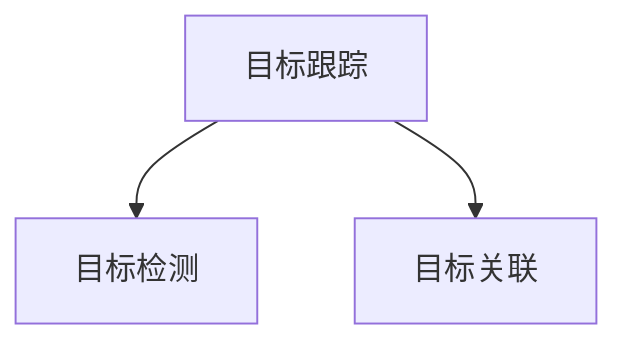

## 1.背景介绍
在计算机视觉领域，目标跟踪(Object Tracking)是一个重要的研究方向。它的目标是在连续的视频帧中定位和跟踪一个或多个感兴趣的目标。这个领域的研究有着广泛的应用，包括视频监控、人机交互、自动驾驶等。然而，由于目标的外观变化、遮挡、运动模糊等问题，目标跟踪仍然是一个具有挑战性的问题。

## 2.核心概念与联系
目标跟踪的主要任务是在视频序列中连续地估计目标的状态。状态通常是目标的位置和尺度，也可能包括目标的速度和方向。为了实现这个任务，目标跟踪算法通常包括两个主要步骤：目标检测和目标关联。



## 3.核心算法原理具体操作步骤
目标跟踪的核心算法通常包括以下几个步骤：

1. **初始化**：在视频的第一帧中，标定出目标的位置，这可以通过手动标定，或者使用目标检测算法自动完成。
2. **目标检测**：在每一帧中，使用目标检测算法（如YOLO、SSD等）检测出所有可能的目标。
3. **目标关联**：将当前帧中检测到的目标与前一帧中的目标进行关联。这一步通常需要计算目标间的相似度，并使用如Hungarian algorithm等匹配算法进行关联。
4. **状态更新**：根据关联结果，更新目标的状态。

## 4.数学模型和公式详细讲解举例说明
在目标跟踪中，我们通常使用卡尔曼滤波器(Kalman Filter)来预测目标的状态。卡尔曼滤波器是一种最优递归数据处理算法，可以从一系列的测量中，估计出系统的当前状态。

卡尔曼滤波器的基本公式如下：

1. **预测步骤**：
   $$
   \hat{x}_{k|k-1} = F_k \hat{x}_{k-1|k-1} + B_k u_k
   $$
   $$
   P_{k|k-1} = F_k P_{k-1|k-1} {F_k}^T + Q_k
   $$
2. **更新步骤**：
   $$
   K_k = P_{k|k-1} {H_k}^T (H_k P_{k|k-1} {H_k}^T + R_k)^{-1}
   $$
   $$
   \hat{x}_{k|k} = \hat{x}_{k|k-1} + K_k (z_k - H_k \hat{x}_{k|k-1})
   $$
   $$
   P_{k|k} = (I - K_k H_k) P_{k|k-1}
   $$

其中，$\hat{x}_{k|k-1}$是对第k时刻的状态的预测，$P_{k|k-1}$是预测误差的协方差，$K_k$是卡尔曼增益，$z_k$是第k时刻的观测值。

## 5.项目实践：代码实例和详细解释说明
在Python中，我们可以使用OpenCV库中的`cv2.Tracker`类来实现目标跟踪。以下是一个简单的例子：

```python
import cv2
# 初始化跟踪器
tracker = cv2.Tracker_create("KCF")
# 初始化视频
video = cv2.VideoCapture("video.mp4")
# 读取第一帧
ok, frame = video.read()
# 定义一个bounding box
bbox = (287, 23, 86, 320)
# 初始化跟踪器
ok = tracker.init(frame, bbox)
while True:
    # 读取新的帧
    ok, frame = video.read()
    if not ok:
        break 
    # 更新跟踪器
    ok, bbox = tracker.update(frame)
    # 绘制bounding box
    if ok:
        p1 = (int(bbox[0]), int(bbox[1]))
        p2 = (int(bbox[0] + bbox[2]), int(bbox[1] + bbox[3]))
        cv2.rectangle(frame, p1, p2, (0,0,255))
    # 显示结果
    cv2.imshow("Tracking", frame)
    # 退出
    if cv2.waitKey(1) & 0xFF == ord('q'):
        break
```

## 6.实际应用场景
目标跟踪在许多领域都有广泛的应用，例如：

- **视频监控**：在视频监控中，目标跟踪可以用来跟踪人或车辆，以便进行行为分析或异常检测。
- **自动驾驶**：在自动驾驶中，目标跟踪可以用来跟踪周围的车辆和行人，以便进行避障和路径规划。
- **人机交互**：在人机交互中，目标跟踪可以用来跟踪用户的手势或眼球运动，以便进行交互操作。

## 7.工具和资源推荐
- **OpenCV**：OpenCV是一个开源的计算机视觉库，包含了许多目标跟踪的算法。
- **DeepSort**：DeepSort是一个深度学习的目标跟踪算法，它结合了目标检测和目标关联，可以实现实时的多目标跟踪。

## 8.总结：未来发展趋势与挑战
目标跟踪是一个持续发展的领域，尽管已经取得了许多进展，但仍然面临一些挑战，例如如何处理目标的遮挡和外观变化，如何处理大规模的目标等。未来，我们期待通过深度学习和其他先进的技术，能够进一步提高目标跟踪的性能。

## 9.附录：常见问题与解答
1. **问题**：目标跟踪和目标检测有什么区别？
   **答**：目标检测是在单个图像中识别和定位目标，而目标跟踪是在视频序列中连续地跟踪目标。

2. **问题**：如何处理目标的遮挡？
   **答**：处理目标遮挡的一个常见方法是使用多视角的摄像头，另一个方法是使用预测模型来预测目标的运动。

3. **问题**：如何选择合适的目标跟踪算法？
   **答**：选择目标跟踪算法需要考虑许多因素，例如你的应用场景、你的硬件资源、你的精度需求等。一般来说，深度学习的方法可以提供更高的精度，但需要更多的计算资源。

作者：禅与计算机程序设计艺术 / Zen and the Art of Computer Programming