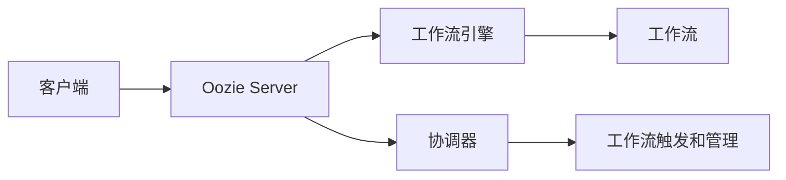
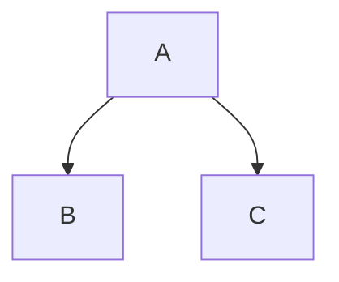

## 1.背景介绍

Oozie是Apache的一个开源项目，主要用于协调和调度Hadoop作业。Oozie允许用户定义一系列的作业，然后按照预定的顺序执行这些作业。Oozie是一个Java Web应用程序，运行在Web容器中。Oozie的工作流可以包含多种类型的作业，如MapReduce、Pig、Hive、Sqoop等，并且可以包含决策控制路径。

## 2.核心概念与联系

Oozie的主要组件包括工作流引擎和协调器。工作流引擎负责执行预定义的工作流，而协调器则负责触发工作流的执行和管理工作流的生命周期。

Oozie的工作流定义基于hPDL（Hadoop Process Definition Language），它是一种基于XML的语言，用于描述工作流的各个阶段和它们之间的依赖关系。



## 3.核心算法原理具体操作步骤

Oozie的执行流程如下：

1. 用户在Oozie服务器上定义一个工作流，这个工作流包含了一系列的作业和它们的执行顺序。

2. 用户提交这个工作流给Oozie服务器。

3. Oozie服务器将这个工作流交给工作流引擎。

4. 工作流引擎开始执行工作流中的作业。作业的执行顺序由用户在工作流定义中指定。

5. 如果工作流中的某个作业失败，工作流引擎会尝试重新执行这个作业，直到这个作业成功或者达到用户设定的最大重试次数。

6. 当工作流中的所有作业都执行完毕，工作流引擎会通知Oozie服务器这个工作流已经结束。

## 4.数学模型和公式详细讲解举例说明

Oozie的工作流调度可以看作是一个有向无环图（DAG），其中的节点表示作业，边表示作业之间的依赖关系。我们可以使用拓扑排序算法来确定作业的执行顺序。

假设我们有一个工作流，包含三个作业：A、B和C，其中A需要在B和C之前执行，B和C没有依赖关系。我们可以将这个工作流表示为一个DAG，然后使用拓扑排序算法来确定作业的执行顺序。



在这个例子中，拓扑排序的结果是A、B、C，这就是我们的作业执行顺序。

## 5.项目实践：代码实例和详细解释说明

下面是一个简单的Oozie工作流定义的例子，这个工作流包含两个MapReduce作业，第一个作业完成后才会执行第二个作业。

```xml
<workflow-app xmlns="uri:oozie:workflow:0.1" name="two-map-reduce-jobs">
    <start to="firstMapReduceJob"/>
    <action name="firstMapReduceJob">
        <map-reduce>
            <job-tracker>${jobTracker}</job-tracker>
            <name-node>${nameNode}</name-node>
            <configuration>
                <property>
                    <name>mapred.job.queue.name</name>
                    <value>${queueName}</value>
                </property>
            </configuration>
        </map-reduce>
        <ok to="secondMapReduceJob"/>
        <error to="fail"/>
    </action>
    <action name="secondMapReduceJob">
        <map-reduce>
            <job-tracker>${jobTracker}</job-tracker>
            <name-node>${nameNode}</name-node>
            <configuration>
                <property>
                    <name>mapred.job.queue.name</name>
                    <value>${queueName}</value>
                </property>
            </configuration>
        </map-reduce>
        <ok to="end"/>
        <error to="fail"/>
    </action>
    <kill name="fail">
        <message>Workflow failed, error message[${wf:errorMessage(wf:lastErrorNode())}]</message>
    </kill>
    <end name="end"/>
</workflow-app>
```

## 6.实际应用场景

Oozie在大数据处理中有广泛的应用，它可以用于调度和协调各种类型的Hadoop作业，包括MapReduce、Pig、Hive、Sqoop等。Oozie可以帮助用户管理复杂的数据处理流程，提高工作效率。

## 7.工具和资源推荐

- Apache Oozie: Oozie的官方网站，提供了详细的文档和教程。

- Hadoop: Oozie是Hadoop的一个组件，需要和Hadoop一起使用。

- Hue: Hue是一个开源的Hadoop用户界面，可以帮助用户更方便地使用Oozie。

## 8.总结：未来发展趋势与挑战

Oozie作为一个成熟的Hadoop作业调度和协调工具，已经在大数据处理中发挥了重要作用。然而，随着大数据技术的发展，Oozie也面临着一些挑战。首先，Oozie的工作流定义语言hPDL虽然功能强大，但学习曲线较陡峭，对于初学者来说可能比较困难。其次，Oozie的错误处理机制还有待改进，当前的错误处理机制可能会导致一些难以预料的问题。未来，Oozie需要在易用性和健壮性上进行进一步的改进，以适应大数据处理的需求。

## 9.附录：常见问题与解答

Q: Oozie支持哪些类型的作业？

A: Oozie支持多种类型的Hadoop作业，包括MapReduce、Pig、Hive、Sqoop等。

Q: Oozie如何处理作业失败？

A: 如果工作流中的某个作业失败，Oozie会尝试重新执行这个作业，直到这个作业成功或者达到用户设定的最大重试次数。

Q: Oozie的工作流定义语言是什么？

A: Oozie的工作流定义语言是hPDL，它是一种基于XML的语言，用于描述工作流的各个阶段和它们之间的依赖关系。

作者：禅与计算机程序设计艺术 / Zen and the Art of Computer Programming