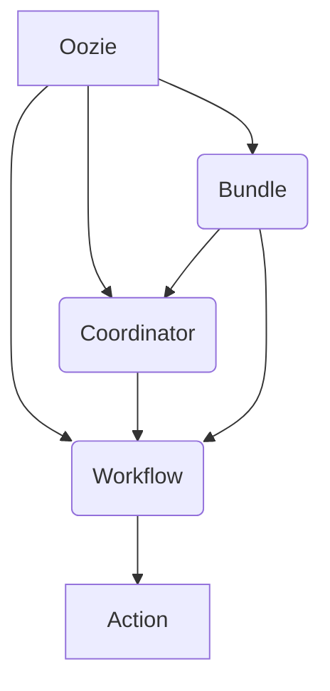

# Oozie在物联网大数据处理中的应用

## 1. 背景介绍

### 1.1 物联网大数据挑战

随着物联网(IoT)设备的快速增长,海量的数据正被不断产生和传输。这些数据来源于各种传感器、摄像头、可穿戴设备等,具有多样性、实时性和大规模的特点。有效地处理和分析这些大数据对于提取有价值的见解至关重要,但同时也带来了一系列挑战:

- **数据量大且种类繁多**: 物联网设备产生的数据量巨大,种类也非常多样化,包括结构化数据(如传感器读数)和非结构化数据(如图像、视频等)。
- **实时性要求高**: 许多物联网应用场景需要对数据进行实时或准实时处理,以便及时做出响应。
- **数据分散性**: 物联网数据通常分散在不同的地理位置,需要在边缘和云端进行协调处理。

### 1.2 大数据处理框架的需求

为了有效应对物联网大数据带来的挑战,需要一种强大的大数据处理框架。这种框架应该具备以下特性:

- **可扩展性**: 能够轻松扩展以处理不断增长的数据量。
- **容错性**: 能够自动处理节点故障,确保数据处理的可靠性。
- **批处理和流处理**: 支持批量处理历史数据和实时处理流数据。
- **多种数据源支持**: 能够集成各种数据源,如关系型数据库、NoSQL数据库、消息队列等。
- **调度和协调能力**: 能够协调和调度复杂的数据处理工作流。

Apache Hadoop生态系统提供了一套完整的大数据处理解决方案,其中包括Apache Oozie,一个强大的工作流调度器,可以满足上述需求。

## 2. 核心概念与联系

### 2.1 Apache Oozie概述

Apache Oozie是Apache Hadoop生态系统中的一个关键组件,用于管理和协调Hadoop作业(如MapReduce、Spark、Hive等)。它提供了一种声明式的工作流定义语言,允许开发人员将多个作业链接在一起,形成复杂的数据处理流程。

Oozie的核心概念包括:

- **Workflow(工作流)**: 由一系列有向无环图(DAG)表示的动作序列组成。
- **Coordinator(协调器)**: 用于调度和执行重复性的工作流作业,支持基于时间和数据可用性的触发条件。
- **Bundle(捆绑包)**: 用于组织和管理多个协调器和工作流作业。



### 2.2 Oozie与物联网大数据处理

在物联网大数据处理场景中,Oozie可以发挥关键作用:

1. **数据摄取**: Oozie可以调度从各种数据源(如Kafka、Flume等)摄取数据的作业,并将数据加载到Hadoop分布式文件系统(HDFS)或其他存储系统中。

2. **数据预处理**: 利用Oozie协调多个Hadoop作业(如MapReduce、Spark等),对原始数据进行清洗、转换和规范化处理。

3. **数据分析**: 通过集成Hive、Spark SQL等工具,Oozie可以调度各种批处理和交互式数据分析作业。

4. **机器学习**: 将机器学习模型训练和评估流程编排为Oozie工作流,实现自动化和可重复的模型构建过程。

5. **数据可视化**: 调度将处理后的数据加载到数据可视化工具(如Superset、Zeppelin等)的作业。

6. **操作自动化**: 利用Oozie的调度和协调能力,自动化各种运维任务,如数据备份、集群监控等。

通过将复杂的数据处理流程编排为Oozie工作流,可以提高物联网大数据处理的效率、可靠性和可维护性。

## 3. 核心算法原理具体操作步骤

### 3.1 Oozie工作流定义

Oozie工作流是由一系列动作(Action)组成的有向无环图(DAG)。每个动作代表一个特定的任务,如MapReduce作业、Spark作业、Shell脚本等。动作之间的依赖关系通过控制节点(如`fork`、`join`、`decision`等)来定义。

工作流定义采用XML格式,主要包括以下元素:

- `<workflow-app>`: 工作流应用程序的根元素。
- `<start>`: 工作流的入口点。
- `<end>`: 工作流的出口点。
- `<decision>` / `<fork>` / `<join>`: 用于控制工作流执行路径的控制节点。
- `<action>`: 代表实际要执行的任务,如MapReduce、Pig、Hive等。

下面是一个简单的Oozie工作流定义示例:

```xml
<workflow-app name="my-workflow" xmlns="uri:oozie:workflow:0.5">
  <start to="import-data"/>
  <action name="import-data">
    <sqoop xmlns="uri:oozie:sqoop-action:0.2">
      <!-- Sqoop作业配置 -->
    </sqoop>
    <ok to="transform-data"/>
    <error to="fail"/>
  </action>
  <action name="transform-data">
    <map-reduce>
      <!-- MapReduce作业配置 -->
    </map-reduce>
    <ok to="analyze-data"/>
    <error to="fail"/>
  </action>
  <action name="analyze-data">
    <hive xmlns="uri:oozie:hive-action:0.2">
      <!-- Hive作业配置 -->
    </hive>
    <ok to="end"/>
    <error to="fail"/>
  </action>
  <kill name="fail">
    <message>Workflow failed, error message[${wf:errorMessage(wf:lastErrorNode())}]</message>
  </kill>
  <end name="end"/>
</workflow-app>
```

在上面的示例中,工作流包含三个动作:导入数据(Sqoop)、转换数据(MapReduce)和分析数据(Hive)。每个动作都定义了成功和失败时的下一步操作。

### 3.2 Oozie协调器

Oozie协调器用于调度和执行重复性的工作流作业。它支持基于时间(如cron表达式)和数据可用性(如HDFS目录)的触发条件。

协调器定义采用XML格式,主要包括以下元素:

- `<coordinator-app>`: 协调器应用程序的根元素。
- `<start>`: 指定协调器的开始时间。
- `<end>`: 指定协调器的结束时间。
- `<frequency>`: 定义协调器执行的频率,如每小时、每天等。
- `<datasets>`: 指定协调器依赖的数据集,如HDFS目录或Hive表。
- `<input-events>`: 指定协调器监听的输入事件,如数据可用性。
- `<action>`: 定义要执行的工作流作业。

下面是一个简单的Oozie协调器定义示例:

```xml
<coordinator-app name="my-coordinator" frequency="${coord:days(1)}" start="${start_time}" end="${end_time}" timezone="UTC" xmlns="uri:oozie:coordinator:0.4">
  <controls>
    <timeout>10</timeout>
    <concurrency>1</concurrency>
    <execution>FIFO</execution>
  </controls>
  <datasets>
    <dataset name="input-data" frequency="${coord:days(1)}" initial-instance="${start_time}" timezone="UTC">
      <uri-template>/user/data/input/${YEAR}/${MONTH}/${DAY}</uri-template>
    </dataset>
  </datasets>
  <input-events>
    <data-in dataset="input-data" name="input-data-available" instance="${coord:current(0)}">
      <instance>${coord:current(0)}</instance>
    </data-in>
  </input-events>
  <action>
    <workflow>
      <app-path>${workflow_path}</app-path>
      <configuration>
        <property>
          <name>input_data</name>
          <value>${coord:dataIn('input-data')}</value>
        </property>
      </configuration>
    </workflow>
  </action>
</coordinator-app>
```

在上面的示例中,协调器每天执行一次工作流作业,并监听HDFS目录`/user/data/input/${YEAR}/${MONTH}/${DAY}`中的数据可用性。当数据可用时,协调器将触发工作流作业,并将输入数据路径作为参数传递给工作流。

### 3.3 Oozie Bundle

Oozie Bundle用于组织和管理多个协调器和工作流作业。它提供了一种层次化的方式来定义和执行复杂的数据处理流程。

Bundle定义采用XML格式,主要包括以下元素:

- `<bundle-app>`: Bundle应用程序的根元素。
- `<coordinator>`: 定义Bundle中包含的协调器作业。
- `<workflow>`: 定义Bundle中包含的工作流作业。

下面是一个简单的Oozie Bundle定义示例:

```xml
<bundle-app name="my-bundle" xmlns="uri:oozie:bundle:0.2">
  <coordinator>
    <app-path>${coordinator_path}</app-path>
    <configuration>
      <!-- 协调器配置 -->
    </configuration>
  </coordinator>
  <workflow>
    <app-path>${workflow_path}</app-path>
    <configuration>
      <!-- 工作流配置 -->
    </configuration>
  </workflow>
</bundle-app>
```

在上面的示例中,Bundle包含一个协调器作业和一个工作流作业。通过Bundle,可以将多个相关的数据处理任务组织在一起,实现更高层次的协调和管理。

## 4. 数学模型和公式详细讲解举例说明

在物联网大数据处理中,常常需要对时间序列数据进行建模和分析。Oozie可以与各种数据分析工具(如Hive、Spark等)集成,实现时间序列模型的构建和应用。

### 4.1 时间序列模型

时间序列模型是一种用于预测未来值的统计模型,它利用过去的观测值来捕获数据中的模式和趋势。常见的时间序列模型包括:

- **自回归移动平均模型(ARMA)**: 将时间序列数据建模为自回归(AR)和移动平均(MA)两部分的线性组合。
- **自回归综合移动平均模型(ARIMA)**: 在ARMA模型的基础上,增加了对非平稳时间序列的差分处理。
- **指数平滑模型(ETS)**: 通过指数加权的方式对过去的观测值进行平滑,从而预测未来值。

这些模型可以用于预测各种物联网时间序列数据,如温度、湿度、能源消耗等。

### 4.2 ARIMA模型

ARIMA模型是时间序列分析中最广泛使用的模型之一。它由三个部分组成:自回归(AR)、综合移动平均(I)和移动平均(MA)。

ARIMA模型的数学表达式如下:

$$
y_t = c + \phi_1 y_{t-1} + \phi_2 y_{t-2} + ... + \phi_p y_{t-p} + \theta_1 \epsilon_{t-1} + \theta_2 \epsilon_{t-2} + ... + \theta_q \epsilon_{t-q} + \epsilon_t
$$

其中:

- $y_t$ 是时间 $t$ 的观测值
- $c$ 是常数项
- $\phi_1, \phi_2, ..., \phi_p$ 是自回归系数
- $\theta_1, \theta_2, ..., \theta_q$ 是移动平均系数
- $\epsilon_t$ 是时间 $t$ 的残差项

ARIMA模型的构建过程包括以下步骤:

1. **差分处理**: 对非平稳时间序列进行差分,使其变为平稳序列。
2. **模型识别**: 通过自相关函数(ACF)和偏自相关函数(PACF)图,确定模型的自回归(AR)和移动平均(MA)阶数。
3. **模型估计**: 使用最小二乘法或最大似然估计等方法,估计模型参数。
4. **模型诊断**: 检验模型残差是否满足白噪声假设,并评估模型的适当性。
5. **预测**: 利用估计的ARIMA模型,对未来值进行预测。

在Oozie工作流中,可以利用Hive或Spark等工具实现ARIMA模型的构建和应用。下面是一个使用Hive的示例:

```sql
-- 加载时间序列数据
CREATE TABLE time_series (
  timestamp TIMESTAMP,
  value DOUBLE
)
ROW FORMAT DELIMITED
FIELDS TERMINATED BY ','
STORED AS TEXTFILE;

LOAD DATA INPATH '/path/to/data' INTO TABLE time_series;

-- 构建ARIMA模型
CREATE TEMPORARY FUNCTION arima AS 'com.cloudera.sparkts