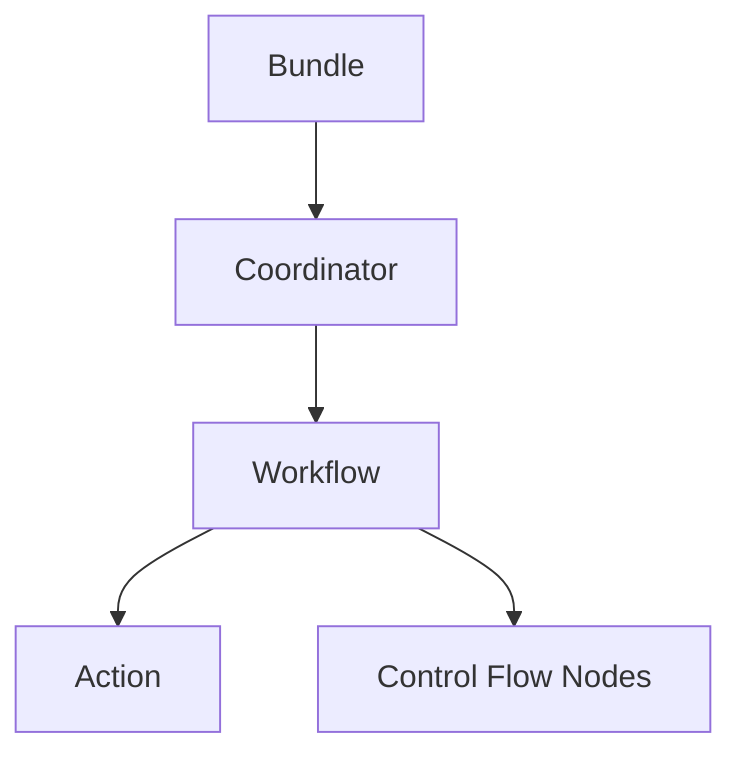

# Oozie工作流调度原理与代码实例讲解

## 1.背景介绍

在大数据处理领域,工作流调度是一个非常重要的环节。Apache Oozie就是一个功能强大的工作流调度系统,它能够管理和协调Hadoop生态系统中各种复杂的作业,如MapReduce、Hive、Pig等。本文将深入探讨Oozie的工作原理,并结合代码实例进行讲解,帮助读者全面掌握这一重要技术。

### 1.1 大数据处理面临的挑战

随着数据量的爆炸式增长,大数据处理已成为各行各业的核心需求。然而,大数据处理往往涉及复杂的任务依赖关系和数据流向,人工管理和调度难度极大。这就需要一个高效、可靠的工作流调度系统来自动化地管理和执行这些任务。

### 1.2 Oozie的优势

Oozie是一个开源的工作流调度系统,专为Hadoop而设计。它具有以下优势:

- 支持多种类型的Hadoop作业,包括MapReduce、Hive、Pig、Sqoop等
- 使用XML格式定义工作流,语法简单易学
- 内置了多种控制流节点,如decision、fork、join等,能够灵活地控制作业流程
- 具有重试、暂停、恢复等错误处理机制,保证作业的可靠性
- 提供了Web界面和REST API,便于作业监控和管理

### 1.3 Oozie在业界的应用

目前,Oozie已被广泛应用于各大互联网公司的生产环境中,如Yahoo、eBay、LinkedIn等。一些典型的应用场景包括:

- 数据仓库ETL:使用Oozie调度Hive、Sqoop等作业,完成数据的抽取、转换和加载
- 日志分析:使用Oozie调度MapReduce作业,对海量日志数据进行清洗、统计和分析
- 机器学习:使用Oozie调度Spark、Mahout等作业,实现模型训练和预测等功能

## 2.核心概念与联系

要深入理解Oozie的工作原理,首先需要掌握其核心概念及其相互关系。

### 2.1 Workflow

Workflow即工作流,它定义了一系列有依赖关系的Action,描述了作业的执行流程。Workflow以DAG(有向无环图)的形式组织Action,从而避免循环依赖。

### 2.2 Action

Action是Workflow中的基本执行单元,代表一个具体的任务,如MapReduce、Hive等。每个Action都有唯一的name,并指定执行该任务所需的配置参数。

### 2.3 Control Flow Nodes

Control Flow Nodes用于控制Action的执行流程,包括:

- start/end:工作流的开始和结束节点
- decision:根据条件判断决定下一步执行分支
- fork/join:开启多个并行执行分支,并等待所有分支完成
- kill:发生错误时杀死整个工作流

### 2.4 Coordinator

Coordinator用于定义工作流的调度策略,如按时间、数据可用性等条件触发工作流。一个Coordinator可以包含多个Workflow,并指定它们的执行时间和频率。

### 2.5 Bundle

Bundle是多个Coordinator的集合,用于对Oozie作业进行打包和部署。Bundle支持跨集群的作业调度,使管理更加灵活。

下图展示了Oozie核心概念之间的关系:



## 3.核心算法原理具体操作步骤

Oozie的核心算法主要体现在工作流的调度和执行上。下面我们详细讲解其原理和步骤。

### 3.1 工作流解析

当用户提交一个Workflow XML定义文件后,Oozie首先会对其进行解析,构建出内存中的DAG结构。具体步骤如下:

1. 解析XML文件,提取出所有Action节点
2. 根据Action之间的依赖关系,构建邻接表
3. 使用拓扑排序算法,检测DAG中是否存在环路
4. 如果检测通过,则将DAG持久化到数据库中

解析后的Workflow会以DAG的形式存储在Oozie的数据库中,为后续调度做准备。

### 3.2 工作流调度

Workflow解析完成后,就进入调度阶段。Oozie采用了基于事件驱动的调度模型,具体步骤如下:

1. MaterializeTransitionService定期扫描数据库中的Workflow
2. 对于每个Workflow,检查其当前状态和前置依赖
3. 如果前置依赖已满足,则创建一个WorkflowInstance,并将其状态设置为PREP
4. ActionStartService定期扫描状态为PREP的WorkflowInstance
5. 对于每个WorkflowInstance,提交其当前Action到Hadoop集群运行
6. 提交成功后,将Action状态设置为RUNNING,WorkflowInstance状态设置为RUNNING
7. 如果Action执行失败,则根据重试策略决定是否重新提交
8. Action执行完成后,CoordActionInputCheckService会检查下一个Action的输入数据是否就绪
9. 如果数据就绪,则触发下一个Action执行,否则等待
10. 所有Action执行完成后,将WorkflowInstance状态设置为SUCCEEDED

整个调度过程是异步进行的,Oozie只负责提交Action,而不会阻塞等待其执行完成。这种事件驱动的调度模型,可以显著提高Oozie的并发处理能力。

## 4.数学模型和公式详细讲解举例说明

在Oozie的工作流调度中,有两个关键的数学模型值得关注。

### 4.1 DAG模型

Oozie使用DAG(有向无环图)来描述工作流中各个Action之间的依赖关系。形式化地,DAG可以表示为:

$G=(V,E)$

其中,$V$表示顶点集合,对应于Workflow中的Action;$E$表示有向边集合,对应于Action之间的依赖关系。如果$\langle v_i,v_j \rangle \in E$,则表示$v_j$依赖于$v_i$,即$v_i$执行完成后$v_j$才能开始执行。

例如,考虑如下Workflow:

```xml
<workflow-app name="sample-wf">
    <start to="action1"/>
    <action name="action1">
        <map-reduce>...</map-reduce>
        <ok to="action2"/>
        <error to="kill"/>
    </action>
    <action name="action2">
        <map-reduce>...</map-reduce>
        <ok to="action3"/>
        <error to="kill"/>
    </action>
    <action name="action3">
        <map-reduce>...</map-reduce>
        <ok to="end"/>
        <error to="kill"/>
    </action>
    <kill name="kill">
        <message>Error occurred</message>
    </kill>
    <end name="end"/>
</workflow-app>
```

它对应的DAG模型如下:

```mermaid
graph LR
start --> action1
action1 --> action2
action2 --> action3
action3 --> end
action1 -.-> kill
action2 -.-> kill
action3 -.-> kill
```

可以看出,该Workflow包含3个Action,它们依次执行。如果中间任一Action执行失败,则直接跳转到kill节点。

### 4.2 资源分配模型

Oozie负责将Action提交到Hadoop集群运行,这就涉及到资源的分配问题。Hadoop采用了基于容器的资源分配模型,每个任务运行在一个独立的容器中。假设一个Workflow有$n$个Action,第$i$个Action需要的资源向量为$\vec{r_i}=(cpu_i,mem_i)$,其中$cpu_i$和$mem_i$分别表示所需的CPU和内存资源量。如果集群可用资源向量为$\vec{R}=(CPU,MEM)$,则调度问题可以形式化为:

$$\max \sum_{i=1}^n x_i$$

$$s.t. \sum_{i=1}^n x_i\vec{r_i} \leq \vec{R}$$

$$x_i \in \{0,1\}, i=1,2,...,n$$

其中,$x_i$是一个二值变量,表示第$i$个Action是否被调度。目标是在资源约束下,最大化被调度的Action数量。这是一个典型的0-1整数规划问题,可以使用动态规划、贪心等算法求解。

例如,考虑一个集群可用资源为(10 CPU, 20 GB),有如下3个Action:

- Action1: (1 CPU, 4 GB)  
- Action2: (2 CPU, 8 GB)
- Action3: (3 CPU, 5 GB)

可以看出,资源约束下最多可以同时调度Action1和Action3,或者Action2和Action3。Oozie在实际调度时,会综合考虑任务优先级、资源利用率等因素,尽可能高效地利用集群资源。

## 5.项目实践：代码实例和详细解释说明

下面我们通过一个实际的Oozie工作流示例,来演示其配置和使用方法。该工作流实现了一个简单的数据处理流程:

1. 从HDFS上读取原始数据
2. 使用MapReduce对数据进行清洗和转换 
3. 使用Hive对处理后的数据进行分析
4. 将分析结果写回HDFS

### 5.1 工作流定义

首先,我们需要使用XML格式定义工作流,并将其保存为`workflow.xml`:

```xml
<workflow-app xmlns="uri:oozie:workflow:0.5" name="data-processing-wf">
    <start to="mr-node"/>
    
    <action name="mr-node">
        <map-reduce>
            <job-tracker>${jobTracker}</job-tracker>
            <name-node>${nameNode}</name-node>
            <configuration>
                <property>
                    <name>mapred.mapper.class</name>
                    <value>com.example.DataCleansingMapper</value>
                </property>
                <property>
                    <name>mapred.reducer.class</name>
                    <value>com.example.DataCleansingReducer</value>
                </property>
                <property>
                    <name>mapred.input.dir</name>
                    <value>/user/input/rawdata.txt</value>
                </property>
                <property>
                    <name>mapred.output.dir</name>
                    <value>/user/output/cleandata</value>
                </property>
            </configuration>
        </map-reduce>
        <ok to="hive-node"/>
        <error to="fail"/>
    </action>
    
    <action name="hive-node">
        <hive xmlns="uri:oozie:hive-action:0.5">
            <job-tracker>${jobTracker}</job-tracker>
            <name-node>${nameNode}</name-node>
            <script>data_analysis.hql</script>
        </hive>
        <ok to="end"/>
        <error to="fail"/>
    </action>
    
    <kill name="fail">
        <message>Job failed</message>
    </kill>
    
    <end name="end"/>
</workflow-app>
```

可以看到,该工作流包含了两个Action:

- mr-node:使用MapReduce对数据进行清洗,输入路径为`/user/input/rawdata.txt`,输出路径为`/user/output/cleandata`
- hive-node:使用Hive对数据进行分析,HQL脚本路径为`data_analysis.hql`

工作流执行时,先运行mr-node,成功后再运行hive-node。如果中间任何一步出错,则直接跳转到fail节点并终止工作流。

### 5.2 MapReduce代码

接下来,我们需要编写MapReduce程序,实现数据清洗功能。Mapper类`DataCleansingMapper`的代码如下:

```java
public class DataCleansingMapper extends Mapper<LongWritable, Text, Text, IntWritable> {
    
    private final static IntWritable one = new IntWritable(1);
    private Text word = new Text();
    
    @Override
    protected void map(LongWritable key, Text value, Context context) 
            throws IOException, InterruptedException {
        String line = value.toString();
        line = line.replaceAll("[^a-zA-Z0-9\\s]", "").toLowerCase();
        StringTokenizer tokenizer = new StringTokenizer(line);
        while (tokenizer.hasMoreTokens()) {
            word.set(tokenizer.nextToken());
            context.write(word, one);
        }
    }
}
```

它的作用是将输入的文本行进行清洗,去除非字母数字字符,转换为小写,并按照空白字符分割为单词。然后,将每个单词作为key,1作为value输出。

Reducer类`DataCleansingReducer`的代码如下:

```java
public class DataCleansingReducer extends Reducer<Text, IntWritable, Text, IntWritable> {
    
    private IntWritable result = new IntWritable();
    
    @Override
    protected void reduce(Text key, Iterable<IntWritable> values, Context context) 
            throws IOException, InterruptedException {
        int sum = 0;
        for (IntWritable val : values) {
            sum += val.get();
        }