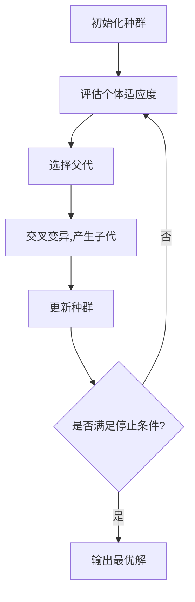

# Optimization Algorithms 原理与代码实战案例讲解

## 1.背景介绍

### 1.1 什么是优化算法?

优化算法是一种用于在给定约束条件下寻找最优解的数学方法。它们被广泛应用于各个领域,旨在最大化或最小化某个目标函数,以找到最佳解决方案。在现实世界中,我们经常遇到需要优化的问题,例如物流路线规划、投资组合优化、机器学习模型调参等。

优化算法可分为多种类型,包括线性规划、非线性规划、整数规划、组合优化等。根据问题的特点和约束条件,需要选择合适的优化算法。一些常见的优化算法有梯度下降法、遗传算法、模拟退火等。

### 1.2 优化算法的重要性

在当今数据时代,优化算法扮演着越来越重要的角色。随着数据量的激增和问题复杂度的提高,高效的优化算法成为解决实际问题的关键。以下是优化算法的一些重要应用:

- 机器学习和深度学习: 训练模型时需要优化损失函数,常用梯度下降等优化算法。
- 运筹管理: 如供应链优化、工厂调度等,需要优化资源分配。
- 金融领域: 投资组合优化、风险管理等需要优化算法支持。
- 工程设计: 结构优化、电路设计等需要优化算法求解。

总的来说,优化算法为各行业提供了高效解决复杂问题的工具,是当代科技发展的重要支柱。

## 2.核心概念与联系

### 2.1 优化问题的形式化描述

优化问题通常可以形式化为如下形式:

$$
\begin{aligned}
&\underset{x}{\text{minimize}} &&f(x)\\
&\text{subject to}&&g_i(x) \leq 0,\quad i=1,\ldots,m\\
&&&h_j(x) = 0,\quad j=1,\ldots,p
\end{aligned}
$$

其中:

- $x$ 是决策变量向量
- $f(x)$ 是目标函数,需要最小化
- $g_i(x)$ 是不等式约束条件
- $h_j(x)$ 是等式约束条件

根据目标函数和约束条件的性质,优化问题可分为线性规划、非线性规划、整数规划等不同类型。

### 2.2 凸优化与非凸优化

凸优化问题指目标函数是凸函数,约束条件是仿射函数或凸集。这类问题有很好的数学性质,存在全局最优解,且可以使用高效算法求解。

非凸优化问题则目标函数或约束条件不满足凸性质,可能存在多个局部最优解。求解此类问题往往需要启发式或近似算法。

### 2.3 确定性算法与随机算法

确定性算法如梯度下降法、牛顿法等,每一步的计算都是确定的。而随机算法如遗传算法、模拟退火等,会引入一定的随机性,有助于跳出局部最优解。

不同类型的算法各有优缺点,需要根据具体问题特点选择合适的算法。

### 2.4 优化算法的性能指标

评估优化算法性能的常用指标包括:

- 收敛速度: 算法达到满意解的迭代次数
- 鲁棒性: 对初值、噪声等的敏感程度 
- 可扩展性: 应对大规模问题的能力
- 并行性: 是否可以有效利用多核计算资源

除此之外,对于某些应用场景,我们还需要考虑算法的可解释性、能耗等其他指标。

## 3.核心算法原理具体操作步骤

### 3.1 梯度下降法

梯度下降法是最基本也是最常用的优化算法之一。其核心思想是沿着目标函数的负梯度方向迭代,从而达到最小化目标函数的目的。

梯度下降法的具体步骤如下:

1. 初始化自变量 $x_0$
2. 计算目标函数 $f(x_0)$ 在 $x_0$ 处的梯度 $\nabla f(x_0)$  
3. 更新 $x$ 的值: $x_{k+1} = x_k - \alpha \nabla f(x_k)$,其中 $\alpha$ 是学习率
4. 重复步骤2和3,直到收敛或达到最大迭代次数

可以看出,梯度下降法的关键是计算目标函数的梯度。对于一些复杂的非凸函数,我们可以使用数值方法近似计算梯度。

梯度下降法的优点是简单易懂、计算高效。缺点是可能陷入局部最小值,对初值和学习率敏感。我们可以采用随机梯度下降、动量梯度下降等变体来改善算法性能。

```mermaid
graph TD
    A[初始化自变量x0] --> B[计算f(x)梯度]
    B --> C[更新x]
    C --> D{是否收敛或达到最大迭代次数?}
    D --是--> E[输出最优解]
    D --否--> B
```

### 3.2 牛顿法

牛顿法是另一种常用的优化算法,它利用目标函数的一阶和二阶导数信息进行迭代。相比梯度下降法,牛顿法具有更快的收敛速度,但计算开销也更大。

牛顿法的迭代步骤为:

1. 初始化自变量 $x_0$
2. 计算目标函数 $f(x_k)$ 在 $x_k$ 处的梯度 $\nabla f(x_k)$ 和 Hessian 矩阵 $H(x_k)$
3. 求解方程 $H(x_k)d_k = -\nabla f(x_k)$ 得到下降方向 $d_k$
4. 进行线搜索,找到步长 $\alpha_k$,使 $f(x_k+\alpha_k d_k)$ 最小
5. 更新 $x_{k+1} = x_k + \alpha_k d_k$  
6. 重复步骤2到5,直到收敛或达到最大迭代次数

牛顿法要求目标函数二阶可导,且需要计算 Hessian 矩阵的逆,计算开销较大。对于大规模问题,我们可以使用拟牛顿法、共轭梯度法等变体来降低计算量。

```mermaid
graph TD
    A[初始化自变量x0] --> B[计算f(x)梯度和Hessian矩阵]
    B --> C[求解下降方向d]
    C --> D[线搜索,求步长α]
    D --> E[更新x]
    E --> F{是否收敛或达到最大迭代次数?}
    F --是--> G[输出最优解]
    F --否--> B
```

### 3.3 遗传算法

遗传算法是一种启发式随机搜索算法,模拟生物进化过程,用于解决优化问题。它的基本思路是:

1. 初始化一组候选解(个体)的种群
2. 评估每个个体的适应度(目标函数值)
3. 根据适应度,选择部分个体作为父代
4. 对父代进行交叉和变异操作,产生新的子代
5. 将子代加入种群,形成新一代种群
6. 重复步骤2到5,直到满足停止条件

在遗传算法中,我们使用适应度函数来评估个体的优劣,适应度高的个体更有可能被选为父代。交叉和变异操作则模拟生物基因重组和突变,产生新的候选解。

遗传算法的优点是可以有效解决非线性、非凸、多模态的复杂优化问题。缺点是收敛速度较慢,需要调参如交叉率、变异率等。



### 3.4 模拟退火算法

模拟退火是另一种常用的随机优化算法,其思想来源于固体退火原理。算法步骤如下:

1. 初始化初始解 $x_0$ 和初始温度 $T_0$  
2. 对当前解 $x_t$ 做一个小扰动,得到新解 $x_{new}$
3. 计算目标函数值的变化量 $\Delta f = f(x_{new}) - f(x_t)$
4. 若 $\Delta f \leq 0$,则接受新解,即 $x_{t+1} = x_{new}$
5. 若 $\Delta f > 0$,则以概率 $e^{-\Delta f / T_t}$ 接受新解
6. 降低温度 $T_{t+1} = \alpha T_t$,其中 $\alpha$ 是冷却速率
7. 重复步骤2到6,直到满足停止条件

模拟退火算法通过接受一定比例的较差解,有助于跳出局部最优解。温度参数控制了搜索范围,逐渐降温可使算法收敛。该算法适用于离散优化和高维连续优化问题。

```mermaid
graph TD
    A[初始化x0,T0] --> B[对x做小扰动,得到xnew]
    B --> C[计算目标函数值变化Δf]
    C --> D{Δf<=0?}
    D --是--> E[接受xnew]
    D --否--> F{以概率e^(-Δf/T)接受xnew}
    F --是--> E
    F --否--> G[保持x不变]
    E --> H[降低温度T]
    G --> H
    H --> I{是否满足停止条件?}
    I --是--> J[输出最优解]
    I --否--> B
```

## 4.数学模型和公式详细讲解举例说明

在优化问题中,我们通常需要使用数学模型对问题进行形式化描述。一些常见的数学模型包括:

### 4.1 线性规划模型

线性规划模型的目标函数和约束条件都是线性的,形式如下:

$$
\begin{aligned}
&\underset{x}{\text{minimize}} &&c^Tx\\
&\text{subject to}&&Ax \leq b\\
&&&x \geq 0
\end{aligned}
$$

其中 $c$ 是目标函数系数向量, $A$ 是约束条件系数矩阵, $b$ 是约束条件常数项。

线性规划广泛应用于生产计划、运输问题、资源分配等领域。我们可以使用单纯形法、内点法等算法高效求解。

### 4.2 二次规划模型

二次规划模型的目标函数是二次型,约束条件是线性的或二次型的,形式如下:

$$
\begin{aligned}
&\underset{x}{\text{minimize}} &&\frac{1}{2}x^TQx + c^Tx\\
&\text{subject to}&&Ax \leq b
\end{aligned}
$$

其中 $Q$ 是二次项系数矩阵,需为半正定矩阵。

二次规划模型常用于机器学习的支持向量机、逻辑回归等模型训练,以及投资组合优化等金融应用。我们可以使用内点法、主动集法等算法求解。

### 4.3 整数规划模型

在某些情况下,决策变量需要取整数值,这就形成了整数规划模型。整数规划可分为纯整数规划(所有变量都是整数)和混合整数规划(部分变量是整数)。

整数规划模型形式为:

$$
\begin{aligned}
&\underset{x}{\text{minimize}} &&c^Tx\\
&\text{subject to}&&Ax \leq b\\
&&&x_i \in \mathbb{Z},\quad i \in I
\end{aligned}
$$

其中 $I$ 是整数变量的索引集合。

整数规划问题属于 NP 难问题,我们通常使用分支定界法、切平面法等算法求解。对于大规模整数规划问题,往往需要启发式算法如遗传算法等。

### 4.4 其他模型

除了上述模型,我们还可以使用半定规划、锥规划、随机规划等模型描述各种优化问题。随着优化理论的发展,新的数学模型不断涌现,为解决复杂问题提供了强有力的工具。

无论使用何种数学模型,我们都需要根据具体问题的特点,选择合适的优化算法进行求解。下面我们通过一些