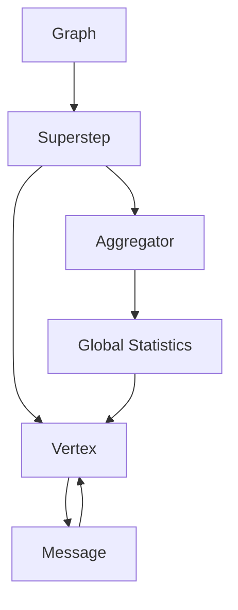
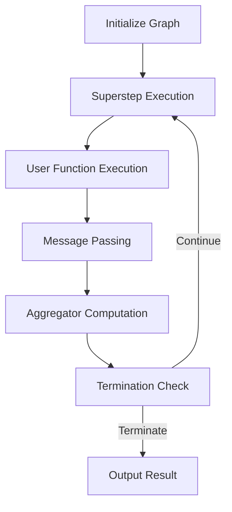

# Pregel原理与代码实例讲解

## 1.背景介绍

### 1.1 大数据时代的到来

随着互联网、物联网和云计算的快速发展,海量的数据正以前所未有的速度被产生和积累。这些数据不仅体现在网页、社交媒体、电子商务等领域,还包括物联网设备、移动应用程序以及各种传感器所产生的数据。传统的数据处理方法已经无法满足对如此庞大数据集的处理需求,这就催生了大数据技术的兴起。

### 1.2 大数据处理的挑战

大数据处理面临着诸多挑战,其中最突出的是数据量的爆炸式增长和数据种类的多样性。单机系统已经无法满足对大规模数据集的存储和计算需求,因此需要一种能够在多台机器上并行处理数据的分布式系统。此外,大数据中包含了结构化数据(如关系数据库中的数据)、半结构化数据(如XML和JSON文件)和非结构化数据(如文本、图像和视频),处理这些异构数据也是一个巨大的挑战。

### 1.3 图计算的重要性

在大数据领域,图计算是一个非常重要的研究方向。许多现实世界的问题都可以用图来建模,例如社交网络、交通网络、知识图谱等。图计算可以帮助我们发现隐藏在大规模图数据中的有价值信息,如社交网络中的社区结构、交通网络中的最短路径等。然而,由于图数据的复杂性和大规模性,传统的图计算算法无法满足实际需求,因此需要一种新的分布式图计算模型。

### 1.4 Pregel的诞生

Pregel是由Google公司于2010年提出的一种大规模图计算模型。它的设计思想是将图计算任务分解为一系列超步(Superstep),每个超步中的顶点并行执行用户定义的函数,通过消息传递在不同超步之间交换数据。Pregel模型简单高效,可以在大规模分布式系统上执行图计算任务,因此被广泛应用于社交网络分析、网页排名、机器学习等领域。

## 2.核心概念与联系

### 2.1 图的表示

在Pregel中,图由一组顶点(Vertex)和一组边(Edge)组成。每个顶点都有一个唯一的ID和一个值(Value),表示该顶点的状态或属性。每条边连接两个顶点,也可以携带一个值,表示边的权重或其他属性。

### 2.2 超步(Superstep)

Pregel将图计算任务划分为一系列超步。在每个超步中,所有的顶点并行执行用户定义的函数,根据当前的值和收到的消息更新自身的值。超步之间通过消息传递来交换数据。

### 2.3 消息传递

在Pregel中,顶点之间通过发送消息来交换数据。每个顶点可以向其他顶点发送消息,也可以接收来自其他顶点的消息。消息的内容由用户定义,可以携带任何需要传递的数据。

### 2.4 聚合器(Aggregator)

聚合器是Pregel中的一个重要概念,用于在超步之间计算全局统计信息。每个超步结束时,所有的顶点都会向聚合器发送部分统计信息,聚合器将这些信息汇总并在下一个超步开始时将结果广播给所有顶点。

### 2.5 组件关系图

为了更好地理解Pregel中各个组件之间的关系,我们可以使用Mermaid流程图进行可视化表示:



在上图中,Graph表示输入的图数据,Superstep表示图计算任务被划分为一系列超步。每个超步中,所有的Vertex并行执行用户定义的函数,通过Message进行数据交换。Aggregator用于计算全局统计信息,并在下一个超步开始时将结果广播给所有Vertex。

## 3.核心算法原理具体操作步骤

Pregel算法的核心思想是将图计算任务划分为一系列超步,每个超步中所有的顶点并行执行用户定义的函数,通过消息传递在不同超步之间交换数据。下面我们将详细介绍Pregel算法的具体操作步骤。

### 3.1 初始化

在执行Pregel算法之前,需要对输入的图数据进行初始化。每个顶点都会被赋予一个初始值,表示该顶点的初始状态或属性。此外,还需要为每个顶点分配一个唯一的ID,用于标识该顶点。

### 3.2 超步执行

Pregel算法的核心部分是超步的执行。每个超步都包含以下几个步骤:

1. **用户函数执行**

   在每个超步中,所有的顶点都会并行执行用户定义的函数。该函数的输入包括当前顶点的值、收到的消息以及聚合器计算的全局统计信息。函数的执行结果将更新顶点的值,并决定是否需要向其他顶点发送消息。

2. **消息传递**

   在用户函数执行完毕后,每个顶点会根据函数的结果向其他顶点发送消息。消息的内容由用户定义,可以携带任何需要传递的数据。

3. **聚合器计算**

   每个超步结束时,所有的顶点都会向聚合器发送部分统计信息。聚合器将这些信息汇总,计算出全局统计信息,如最大值、最小值、求和等。

4. **终止条件检查**

   在每个超步结束时,Pregel会检查是否满足终止条件。如果满足,则算法执行结束;否则,进入下一个超步,重复上述步骤。

终止条件可以由用户自定义,常见的终止条件包括:

- 所有顶点的值不再发生变化
- 没有顶点向其他顶点发送消息
- 达到用户指定的最大超步数

### 3.3 算法流程图

为了更好地理解Pregel算法的执行流程,我们可以使用Mermaid流程图进行可视化表示:



在上图中,算法首先对输入的图数据进行初始化。然后进入超步执行阶段,每个超步包括用户函数执行、消息传递、聚合器计算和终止条件检查四个步骤。如果满足终止条件,则输出计算结果;否则,进入下一个超步,重复执行上述步骤。

## 4.数学模型和公式详细讲解举例说明

在Pregel中,图计算任务可以被抽象为一个函数$f$,该函数将图$G$映射到另一个图$G'$,即$G' = f(G)$。函数$f$由用户定义,可以执行各种图计算操作,如PageRank、最短路径、社区发现等。

为了更好地理解Pregel中的数学模型,我们以PageRank算法为例进行详细讲解。PageRank是一种用于评估网页重要性的算法,它被广泛应用于网页排名和搜索引擎优化。

### 4.1 PageRank算法原理

PageRank算法的核心思想是,一个网页的重要性不仅取决于它自身,还取决于链接到它的其他网页的重要性。具体来说,如果一个重要网页链接到另一个网页,那么后者的重要性就会相应提高。

我们用$PR(p)$表示网页$p$的PageRank值,用$L(p)$表示链接到网页$p$的其他网页集合,用$N(q)$表示网页$q$的出链接数量。则PageRank算法可以表示为:

$$PR(p) = \frac{1-d}{N} + d \sum_{q \in L(p)} \frac{PR(q)}{N(q)}$$

其中,$d$是一个阻尼系数,通常取值为0.85。$\frac{1-d}{N}$是一个常数,表示每个网页的初始PageRank值。第二项是网页$p$从链接到它的其他网页那里获得的PageRank贡献。

### 4.2 PageRank算法在Pregel中的实现

在Pregel中实现PageRank算法的思路是:将每个网页抽象为一个顶点,每个超步中顶点并行计算自身的PageRank值,并将该值发送给所有出链接顶点。聚合器用于计算所有顶点的PageRank值之和,作为全局统计信息广播给所有顶点。

具体来说,每个超步中的操作如下:

1. 用户函数执行:

   对于每个顶点$p$,计算其PageRank值$PR(p)$:

   $$PR(p) = \frac{1-d}{N} + d \sum_{q \in M(p)} \frac{PR(q)}{N(q)}$$

   其中,$M(p)$是上一个超步中发送给$p$的消息集合,每条消息携带了发送方顶点$q$的PageRank值$PR(q)$和出链接数量$N(q)$。

2. 消息传递:

   每个顶点$p$将自己的PageRank值$PR(p)$和出链接数量$N(p)$通过消息发送给所有出链接顶点。

3. 聚合器计算:

   聚合器计算所有顶点的PageRank值之和$\sum_{p} PR(p)$,作为全局统计信息。

4. 终止条件检查:

   如果所有顶点的PageRank值之和在两个连续的超步之间的变化小于一个预设阈值,则算法终止;否则,进入下一个超步。

通过上述步骤,PageRank算法可以在Pregel中高效地执行,并最终收敛到一个稳定的PageRank值分布。

## 5.项目实践:代码实例和详细解释说明

为了更好地理解Pregel的原理和使用方法,我们将通过一个实际项目实践来讲解Pregel的代码实现。在这个项目中,我们将使用Apache Giraph(一种基于Pregel模型的开源图计算系统)实现PageRank算法。

### 5.1 项目环境配置

首先,我们需要配置项目的开发环境。Apache Giraph可以运行在单机模式和分布式模式下,为了简单起见,我们将在单机模式下进行开发和测试。

1. 下载并解压Apache Giraph发行版。
2. 配置Giraph的环境变量。
3. 安装并配置Apache Hadoop,因为Giraph依赖于Hadoop的文件系统和资源管理器。

### 5.2 实现PageRank算法

接下来,我们将实现PageRank算法的Pregel版本。Giraph提供了一个基础类`org.apache.giraph.graph.Vertex`,我们需要继承这个类并实现自定义的顶点计算逻辑。

```java
import org.apache.giraph.graph.Vertex;
import org.apache.hadoop.io.DoubleWritable;
import org.apache.hadoop.io.LongWritable;

public class PageRankVertex extends Vertex<LongWritable, DoubleWritable, DoubleWritable, DoubleWritable> {

    // 初始化PageRank值
    @Override
    public void compute(Iterable<DoubleWritable> messages) {
        double sum = 0;
        int numMessages = 0;
        for (DoubleWritable message : messages) {
            sum += message.get();
            numMessages++;
        }

        // 计算PageRank值
        double newPageRank = (1 - 0.85) / getTotalNumVertices() + 0.85 * sum;

        // 发送PageRank值给出链接顶点
        double prevPageRank = getValue().get();
        if (Math.abs(newPageRank - prevPageRank) > 1e-6) {
            setValue(new DoubleWritable(newPageRank));
            for (Edge<LongWritable, DoubleWritable> edge : getEdges()) {
                double messageToBeSent = newPageRank / getTotalNumOutEdges();
                sendMessageToDestVertex(edge.getTargetVertexId(), new DoubleWritable(messageToBeSent));
            }
        } else {
            voteToHalt();
        }
    }
}
```

在上面的代码中,我们实现了`compute()`方法,该方法在每个超步中被调用。具体逻辑如下:

1. 从收到的消息中计算PageRank贡献之