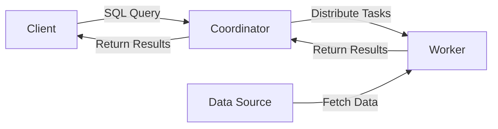

## 1.背景介绍

在大数据时代，数据的规模正以前所未有的速度增长，而我们需要从这些数据中获取有价值的信息。然而，传统的数据处理工具已经无法满足这些需求，这就催生了新一代的大数据查询引擎——Presto的出现。

Presto是由Facebook开发并开源的一款分布式SQL查询引擎，设计用于高效地对各种大小的数据源进行查询，包括GB到PB级别的数据。与Hadoop的MapReduce或者Spark等批处理系统不同，Presto是为在线低延迟的分析查询设计的。它支持标准的SQL语言，包括复杂查询、聚合、连接和窗口函数等。

## 2.核心概念与联系

Presto的设计主要包括以下几个核心概念：

- **Worker节点**：执行查询任务的节点。
- **Coordinator节点**：接收客户端的SQL查询，并将查询任务分发给Worker节点。
- **Connector**：连接不同的数据源，如Hive、Kafka、MySQL等，使Presto能够访问和处理存储在这些系统中的数据。
- **Split**：数据的一部分，是查询执行的最小单位。
- **Task**：由一组split组成，是Worker节点需要执行的工作单元。

这些核心概念之间的关系可以用以下的Mermaid流程图来表示：



## 3.核心算法原理具体操作步骤

Presto的查询执行过程主要包括以下几个步骤：

1. **解析**：Coordinator节点接收到SQL查询后，首先进行语法和语义的解析。
2. **优化**：然后，进行查询计划的优化，包括逻辑优化和物理优化。
3. **生成任务**：根据优化后的查询计划，生成一组任务，并将这些任务分发给Worker节点。
4. **执行任务**：Worker节点接收到任务后，从数据源获取数据，并执行任务。
5. **返回结果**：最后，将执行结果返回给Coordinator节点，由Coordinator节点将结果返回给客户端。

## 4.数学模型和公式详细讲解举例说明

Presto的查询优化主要依赖于代价模型。代价模型是一种用于估计查询计划执行成本的模型，通常包括I/O成本、CPU成本和网络传输成本等。

假设我们有一个查询计划P，它包括n个操作，每个操作的代价为$C_i$，那么查询计划P的总代价$C_p$可以表示为：

$$
C_p = \sum_{i=1}^{n}C_i
$$

Presto在进行查询优化时，会生成多个查询计划，并计算每个计划的代价，选择代价最小的计划作为最优查询计划。

## 5.项目实践：代码实例和详细解释说明

Presto的使用非常简单，我们可以通过以下命令在命令行中执行SQL查询：

```bash
./presto --server localhost:8080 --catalog hive --schema default
```

然后，我们可以在命令行中输入SQL查询，例如：

```sql
SELECT count(*) FROM users;
```

这将返回用户表中的记录数。

## 6.实际应用场景

Presto广泛应用于各种场景，包括：

- **实时分析**：由于Presto支持低延迟的查询，因此它非常适合于实时分析场景。
- **数据探索**：Presto支持标准的SQL语言，使得数据分析师可以方便地进行数据探索。
- **ETL工作流**：Presto可以与Hadoop、Spark等其他大数据处理工具配合，完成复杂的ETL工作流。

## 7.工具和资源推荐

以下是一些有用的Presto资源：

- **Presto官方网站**：提供了详细的文档和教程。
- **Presto GitHub**：可以在这里找到Presto的源代码，以及最新的版本信息。
- **Presto Slack**：这是一个Presto的社区，你可以在这里找到其他Presto用户，以及一些有用的信息。

## 8.总结：未来发展趋势与挑战

随着大数据的发展，Presto的重要性也在不断提高。然而，Presto也面临着一些挑战，例如如何处理更大规模的数据，如何提高查询的效率，以及如何支持更多的数据源等。未来，Presto需要不断地进行优化和改进，以满足这些挑战。

## 9.附录：常见问题与解答

在这部分，我们会列出一些关于Presto的常见问题，以及它们的解答。

- **Presto与Hadoop、Spark有什么区别？**

  Presto是一款为在线低延迟的分析查询设计的引擎，而Hadoop和Spark是批处理系统，更适合于大规模的数据处理。

- **Presto支持哪些数据源？**

  Presto通过Connector可以连接各种数据源，包括但不限于Hive、Kafka、MySQL、PostgreSQL等。

- **如何优化Presto的查询性能？**

  Presto的查询性能可以通过多种方式进行优化，例如选择适当的数据源，合理地设计表结构和索引，以及使用合适的查询计划等。

作者：禅与计算机程序设计艺术 / Zen and the Art of Computer Programming