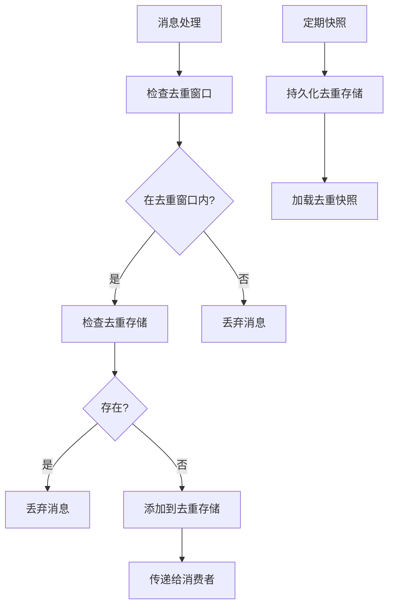

# Pulsar 消息去重及幂等性保证机制

## 1. 背景介绍

### 1.1 消息队列的重要性

在现代分布式系统中，消息队列扮演着关键角色。它们用于在不同组件之间可靠地传递异步消息,确保数据的持久性和有序性。消息队列广泛应用于各种场景,例如解耦生产者和消费者、实现事件驱动架构、构建可扩展的分布式系统等。

### 1.2 消息重复和幂等性问题

然而,在消息传递过程中,由于网络故障、系统崩溃或其他异常情况,消息可能会重复传递。这种重复消息会导致数据不一致,进而影响系统的正确性和可靠性。因此,消息队列系统需要具备消息去重和幂等性保证的能力,以确保每条消息只被处理一次。

### 1.3 Apache Pulsar 介绍

Apache Pulsar 是一个云原生、分布式的开源消息队列系统,旨在提供无限扩展的消息传递能力。它具有多租户、多集群、多事件类型等特性,可以满足各种消息传递需求。Pulsar 提供了强大的消息去重和幂等性保证机制,确保消息的一次且仅一次处理。

## 2. 核心概念与联系

### 2.1 消息去重

消息去重是指在消息传递过程中,确保相同的消息只被处理一次。它通常涉及以下几个关键概念:

1. **消息ID**: 唯一标识一条消息的ID,通常由生产者生成。
2. **去重窗口**: 用于判断消息是否重复的时间窗口。
3. **去重存储**: 存储已处理消息ID的数据结构,如Bitmap、BloomFilter等。

### 2.2 幂等性

幂等性是指对同一个操作执行多次,结果与执行一次相同。在消息队列系统中,幂等性保证了即使消息被重复处理,也不会对最终结果产生影响。实现幂等性通常需要以下几个步骤:

1. **唯一标识业务操作**: 使用业务ID或其他唯一标识来标记每个业务操作。
2. **状态存储**: 存储业务操作的执行状态,例如已完成、正在执行等。
3. **幂等检查**: 在执行业务操作前,检查其状态,如果已完成则跳过。

### 2.3 Pulsar 中的消息去重和幂等性

在 Pulsar 中,消息去重和幂等性是通过以下几个核心概念实现的:

1. **Message ID**: 每条消息都有一个唯一的 Message ID,由生产者生成。
2. **Deduplication Manager**: 负责管理消息去重的组件,维护去重窗口和去重存储。
3. **Deduplication Snapshot**: 用于存储已处理消息 ID 的数据结构,支持 Bitmap 和 BloomFilter。
4. **Consumer Ack 机制**: 消费者通过 Ack 机制确认消息已处理,实现幂等性。

这些概念密切相关,共同构建了 Pulsar 强大的消息去重和幂等性保证机制。

## 3. 核心算法原理具体操作步骤

### 3.1 消息生产者

在 Pulsar 中,生产者在发送消息时会生成一个唯一的 Message ID,格式如下:

```
[Ledger Id]:[Entry Id]:[Batch Size]:[Batch Index]
```

其中:

- **Ledger Id**: 表示消息所在的分区(Topic Partition)。
- **Entry Id**: 表示消息在分区中的偏移量。
- **Batch Size**: 表示批量发送的消息数量。
- **Batch Index**: 表示当前消息在批量消息中的索引。

这种 Message ID 设计可以确保在整个集群中的唯一性,为消息去重和幂等性提供了基础。

### 3.2 消息去重

Pulsar 的消息去重机制由 Deduplication Manager 组件实现,它维护了一个去重窗口和去重存储。去重窗口是一个时间范围,超出该范围的消息将被丢弃。去重存储用于存储已处理消息的 ID,支持 Bitmap 和 BloomFilter 两种数据结构。

当消费者接收到消息时,Deduplication Manager 会检查该消息的 ID 是否在去重存储中。如果存在,则说明该消息是重复的,将被丢弃;否则,将添加到去重存储中,并将消息传递给消费者进行处理。

为了提高性能,Deduplication Manager 会定期将去重存储的快照(Deduplication Snapshot)持久化到磁盘,以防止重启后丢失去重信息。快照的创建和加载过程如下:



### 3.3 幂等性保证

Pulsar 通过 Consumer Ack 机制实现幂等性保证。当消费者成功处理一条消息后,它会向 Pulsar 发送一个 Ack 确认消息。Pulsar 会将该消息标记为已处理,并从去重存储中移除。如果同一条消息被重复处理,由于已经被标记为已处理,因此不会重复执行业务逻辑。

为了支持幂等性,消费者需要维护一个状态存储,用于记录业务操作的执行状态。在处理消息前,消费者会检查该业务操作的状态。如果已完成,则跳过执行;否则,执行业务逻辑并更新状态。这个过程可以用以下伪代码表示:

```
on_message(message):
    business_id = extract_business_id(message)
    if is_operation_completed(business_id):
        ack(message)
    else:
        result = execute_business_logic(message)
        update_operation_state(business_id, result)
        ack(message)
```

通过这种方式,Pulsar 可以确保每条消息对应的业务操作只被执行一次,从而实现了完整的幂等性保证。

## 4. 数学模型和公式详细讲解举例说明

在消息去重和幂等性保证机制中,常用的数学模型和公式包括:

### 4.1 Bitmap

Bitmap 是一种用于存储和查询消息 ID 的数据结构。它将消息 ID 映射到一个位数组中,每个位表示一个消息 ID 是否存在。

假设消息 ID 的范围为 $[0, N-1]$,我们可以使用一个长度为 $\lceil\frac{N}{8}\rceil$ 字节的位数组来表示。对于任意一个消息 ID $x$,它在位数组中的位置为 $\lfloor\frac{x}{8}\rfloor$,第 $x \bmod 8$ 位。

查询一个消息 ID $x$ 是否存在的时间复杂度为 $O(1)$,插入或删除的时间复杂度也为 $O(1)$。但是,Bitmap 的空间开销较大,尤其是在消息 ID 范围很大时。

### 4.2 BloomFilter

BloomFilter 是一种空间高效的概率数据结构,用于判断一个元素是否存在于集合中。它的核心思想是使用多个哈希函数将元素映射到一个位数组中,并通过查询这些位是否全部为 1 来判断元素是否存在。

假设我们使用 $k$ 个哈希函数 $h_1, h_2, \ldots, h_k$,位数组的长度为 $m$ 位。对于任意一个元素 $x$,插入操作为:

$$
\text{insert}(x) = \begin{cases}
\text{set}(h_1(x)), \text{set}(h_2(x)), \ldots, \text{set}(h_k(x)) & \text{in bit array}
\end{cases}
$$

查询操作为:

$$
\text{query}(x) = \begin{cases}
\text{true} & \text{if bit}(h_1(x)) = 1 \land \text{bit}(h_2(x)) = 1 \land \ldots \land \text{bit}(h_k(x)) = 1\\
\text{false} & \text{otherwise}
\end{cases}
$$

BloomFilter 可以高效地判断一个元素是否不存在于集合中,但是对于存在的元素,它只能给出一个概率结果,存在一定的误报率。

在 Pulsar 中,BloomFilter 通常与 Bitmap 结合使用,先使用 BloomFilter 快速判断一个消息 ID 是否存在,如果不存在则直接返回;如果可能存在,再使用 Bitmap 进行精确查询。这种组合方式可以在空间和时间效率之间取得平衡。

### 4.3 示例

假设我们使用一个 8 位的 Bitmap 来存储消息 ID,范围为 $[0, 7]$。初始时,所有位均为 0:

```
00000000
```

插入消息 ID 3 和 5:

```
00101000
```

查询消息 ID 3 是否存在:

```
bit(3) = bit(00101000 >> 3 & 1) = 1
```

因此,消息 ID 3 存在。

现在,我们使用一个 8 位的 BloomFilter,使用两个哈希函数 $h_1(x) = x \bmod 8$ 和 $h_2(x) = (x + 3) \bmod 8$。初始时,所有位均为 0:

```
00000000
```

插入消息 ID 3:

```
set(h_1(3)) = set(3) = 00000100
set(h_2(3)) = set(6) = 00100100
```

查询消息 ID 3 是否存在:

```
bit(h_1(3)) = bit(3) = 1
bit(h_2(3)) = bit(6) = 1
```

因此,BloomFilter 认为消息 ID 3 存在。

但是,如果我们查询消息 ID 5,BloomFilter 也会认为它存在,因为:

```
bit(h_1(5)) = bit(5) = 1
bit(h_2(5)) = bit(0) = 1
```

这就是 BloomFilter 的误报情况。为了避免这种情况,我们需要使用 Bitmap 进行精确查询。

## 5. 项目实践: 代码实例和详细解释说明

在本节中,我们将通过一个简单的 Python 示例来演示 Pulsar 中的消息去重和幂等性保证机制。

### 5.1 准备工作

首先,我们需要安装 Pulsar Python 客户端库:

```bash
pip install pulsar-client
```

### 5.2 生产者示例

下面是一个简单的生产者示例,它每秒向 Pulsar 发送一条消息:

```python
import pulsar
import time

# 创建 Pulsar 客户端
client = pulsar.Client('pulsar://localhost:6650')

# 创建生产者
producer = client.create_producer('my-topic')

# 发送消息
for i in range(10):
    message = f'Hello, Pulsar! {i}'
    producer.send(message.encode('utf-8'))
    print(f'Sent message: {message}')
    time.sleep(1)

# 关闭客户端
client.close()
```

在这个示例中,我们首先创建了一个 Pulsar 客户端,然后创建了一个生产者,连接到主题 `my-topic`。接下来,我们在一个循环中每秒发送一条消息。最后,我们关闭了客户端。

### 5.3 消费者示例

下面是一个简单的消费者示例,它接收并处理来自 Pulsar 的消息:

```python
import pulsar

# 创建 Pulsar 客户端
client = pulsar.Client('pulsar://localhost:6650')

# 创建消费者
consumer = client.subscribe('my-topic', 'my-subscription')

# 处理消息
while True:
    msg = consumer.receive()
    try:
        message = msg.data().decode('utf-8')
        print(f'Received message: {message}')
        # 模拟业务逻辑
        process_message(message)
        # 确认消息已处理
        consumer.acknowledge(msg)
    except Exception as e:
        # 处理异常
        consumer.negative_acknowledge(msg)

# 关闭客户端
client.close()
```

在这个示例中,我们首先创建了一个 Pulsar 客户端,然后创建了一个消费者,订阅主题 `my-topic` 和订阅名称 `my-subscription`。接下来,我们进入一个无限循环,不断接收和处理消息。

对于每条消息,我们首先