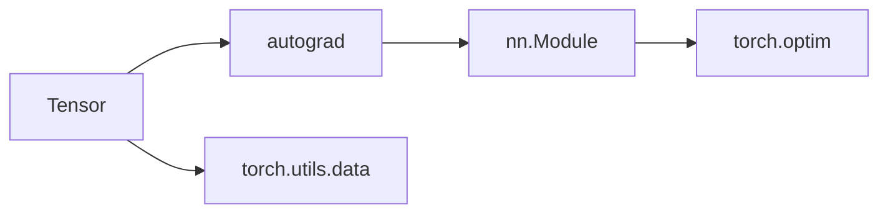

# PyTorch 原理与代码实战案例讲解

## 1. 背景介绍

### 1.1 深度学习框架的发展历程

深度学习的快速发展离不开各种深度学习框架的支持。从最早的Theano、Caffe到现在广泛使用的TensorFlow、PyTorch等，深度学习框架经历了几代演进和发展。这些框架极大地降低了深度学习的使用门槛，使得更多的研究者和工程师能够快速构建和训练深度神经网络模型。

### 1.2 PyTorch的诞生与特点

PyTorch是由Facebook人工智能研究团队开发的一个开源深度学习框架。它基于Torch，提供了一种基于动态图的、命令式编程的深度学习开发方式。与TensorFlow等基于静态图的框架相比，PyTorch更加灵活，代码更加简洁易懂，在研究领域得到了广泛应用。同时PyTorch也支持将动态图转换为静态图，兼顾了部署效率。

### 1.3 PyTorch的生态系统

围绕PyTorch，形成了一个丰富的生态系统。除了核心的PyTorch库外，还有用于计算机视觉的torchvision、用于自然语言处理的torchtext、用于几何学习的torch_geometric等子库。此外还有各种基于PyTorch实现的高层框架，如FastAI、Catalyst等，进一步提升了PyTorch的易用性。PyTorch良好的生态使其在学术界和工业界的应用日益广泛。

## 2. 核心概念与联系

### 2.1 Tensor：PyTorch的基本数据结构

Tensor是PyTorch中最基本的数据结构，可以将其看作是一个高维数组。Tensor与Numpy的ndarry类似，但Tensor可以利用GPU进行加速计算。Tensor有着丰富的数学操作，这些操作可以通过调用Tensor的方法或者PyTorch提供的函数来实现。

### 2.2 autograd：PyTorch的自动微分机制

PyTorch的核心特性之一是autograd，它为Tensor提供了自动微分的功能。通过autograd，我们可以很容易地计算复杂的数学表达式关于某些变量的梯度。这为神经网络的反向传播提供了极大的便利。autograd会记录Tensor的操作历史，从而构建动态计算图，在需要的时候自动计算梯度。

### 2.3 nn.Module：PyTorch的模型构建基类

PyTorch使用nn.Module来构建神经网络模型。通过继承nn.Module基类，我们可以很容易地定义自己的神经网络结构。nn.Module使用一种层级的结构，一个Module可以包含其他的子Module，构成一个树状的模型结构。Module中的可学习参数会被自动识别并添加到参数列表中。

### 2.4 torch.optim：PyTorch的优化器

PyTorch通过torch.optim模块提供了深度学习常用的优化算法，如SGD、Adam、RMSprop等。通过optim.Optimizer基类，我们可以自定义优化算法。使用PyTorch的优化器，我们只需要指定待优化的参数以及学习率等超参数，优化器会自动更新模型参数来最小化损失函数。

### 2.5 torch.utils.data：PyTorch的数据加载工具

PyTorch提供了强大的数据加载工具torch.utils.data。通过定义Dataset和DataLoader，我们可以方便地处理各种类型的数据集，还可以使用多进程并行加速数据加载。Dataset定义了数据集的内容，而DataLoader用于批次化和打乱数据集。

下面是这些核心概念之间的联系：



## 3. 核心算法原理具体操作步骤

### 3.1 反向传播算法

PyTorch的autograd机制是反向传播算法的一种实现。反向传播分为两个阶段：

1. 前向传播：根据输入数据和模型参数计算输出，同时记录计算图。
2. 反向传播：根据损失函数计算误差项，然后沿着计算图反向传播，计算每个参数的梯度。

具体步骤如下：

1. 定义前向传播过程，构建计算图。
2. 计算损失函数。
3. 调用loss.backward()进行反向传播。
4. 调用optimizer.step()更新模型参数。

### 3.2 优化算法

PyTorch的torch.optim模块实现了深度学习中常用的优化算法，用于更新模型参数以最小化损失函数。以随机梯度下降（SGD）为例，其更新步骤为：

1. 计算梯度：$g_t = \nabla_\theta J(\theta)$
2. 更新参数：$\theta_{t+1} = \theta_t - \eta \cdot g_t$

其中$\eta$为学习率。PyTorch的实现如下：

```python
optimizer = torch.optim.SGD(model.parameters(), lr=0.01)
```

### 3.3 数据加载算法

PyTorch的数据加载通过torch.utils.data模块中的Dataset和DataLoader来实现。Dataset定义了数据集的内容，而DataLoader用于批次化和打乱数据集。以图像分类任务为例，数据加载的步骤如下：

1. 定义Dataset，实现__getitem__和__len__方法。
2. 实例化DataLoader，指定batch_size、shuffle等参数。
3. 遍历DataLoader，得到每个批次的数据。

一个简单的例子：

```python
train_loader = torch.utils.data.DataLoader(
    datasets.MNIST('./data', train=True, download=True,
                   transform=transforms.Compose([
                       transforms.ToTensor(),
                       transforms.Normalize((0.1307,), (0.3081,))
                   ])),
    batch_size=64, shuffle=True)
```

## 4. 数学模型和公式详细讲解举例说明

### 4.1 线性回归

线性回归是一种简单但常用的机器学习模型。给定输入特征$x$和对应的目标值$y$，线性回归试图学习一个线性函数$f(x) = wx + b$来拟合数据。其中$w$和$b$是待学习的参数。

损失函数通常选择均方误差（MSE）：

$$
J(w,b) = \frac{1}{m} \sum_{i=1}^m (f(x^{(i)}) - y^{(i)})^2
$$

其中$m$是样本数量。线性回归的目标是找到最优的$w$和$b$使损失函数最小化。

PyTorch实现线性回归的代码如下：

```python
class LinearRegression(torch.nn.Module):
    def __init__(self):
        super(LinearRegression, self).__init__()
        self.linear = torch.nn.Linear(1, 1)  # 一元线性回归
 
    def forward(self, x):
        y_pred = self.linear(x)
        return y_pred
    
model = LinearRegression()

criterion = torch.nn.MSELoss(size_average=False)
optimizer = torch.optim.SGD(model.parameters(), lr=0.01)

for epoch in range(100):
    y_pred = model(x_data)
    loss = criterion(y_pred, y_data)
    print(f'Epoch: {epoch} | Loss: {loss.item()} ')
    
    optimizer.zero_grad()
    loss.backward()
    optimizer.step()
```

### 4.2 Softmax回归

Softmax回归是logistic回归在多分类问题上的推广。对于一个$K$类分类问题，softmax回归的输出是一个$K$维向量$\hat{y}$，其中第$i$个元素表示样本属于第$i$类的概率。

Softmax函数将输入的$K$维向量$z$映射为一个$K$维的概率分布：

$$
\hat{y}_i = \frac{e^{z_i}}{\sum_{j=1}^K e^{z_j}}
$$

其中$z_i$是$z$的第$i$个元素。

Softmax回归的损失函数通常选择交叉熵损失：

$$
J(\theta) = -\frac{1}{m} \sum_{i=1}^m \sum_{j=1}^K y_j^{(i)} \log(\hat{y}_j^{(i)})
$$

其中$y^{(i)}$是第$i$个样本的真实标签的one-hot编码，$\hat{y}^{(i)}$是模型预测的概率分布。

PyTorch实现softmax回归的代码如下：

```python
class SoftmaxRegression(torch.nn.Module):
    def __init__(self, num_features, num_classes):
        super(SoftmaxRegression, self).__init__()
        self.linear = torch.nn.Linear(num_features, num_classes)
    
    def forward(self, x):
        logits = self.linear(x)
        probas = F.softmax(logits, dim=1)
        return probas
    
model = SoftmaxRegression(num_features=784, num_classes=10)

criterion = torch.nn.CrossEntropyLoss()
optimizer = torch.optim.SGD(model.parameters(), lr=0.1)

for epoch in range(10):
    for batch_idx, (data, target) in enumerate(train_loader):
        data = data.view(-1, 28*28)
        
        optimizer.zero_grad()
        output = model(data)
        loss = criterion(output, target)
        loss.backward()
        optimizer.step()
```

## 5. 项目实践：代码实例和详细解释说明

下面我们通过一个完整的项目实践来演示PyTorch的使用。我们将使用PyTorch实现一个简单的卷积神经网络（CNN）来对CIFAR10数据集进行图像分类。

### 5.1 数据加载与预处理

首先我们使用torchvision来加载CIFAR10数据集，并对图像进行标准化预处理。

```python
import torch
import torchvision
import torchvision.transforms as transforms

transform = transforms.Compose(
    [transforms.ToTensor(),
     transforms.Normalize((0.5, 0.5, 0.5), (0.5, 0.5, 0.5))])

trainset = torchvision.datasets.CIFAR10(root='./data', train=True,
                                        download=True, transform=transform)
trainloader = torch.utils.data.DataLoader(trainset, batch_size=4,
                                          shuffle=True, num_workers=2)

testset = torchvision.datasets.CIFAR10(root='./data', train=False,
                                       download=True, transform=transform)
testloader = torch.utils.data.DataLoader(testset, batch_size=4,
                                         shuffle=False, num_workers=2)

classes = ('plane', 'car', 'bird', 'cat',
           'deer', 'dog', 'frog', 'horse', 'ship', 'truck')
```

### 5.2 定义卷积神经网络

接下来我们定义一个简单的卷积神经网络。网络包含两个卷积层和三个全连接层。我们使用ReLU作为激活函数，在全连接层之间插入dropout层来防止过拟合。

```python
import torch.nn as nn
import torch.nn.functional as F

class Net(nn.Module):
    def __init__(self):
        super(Net, self).__init__()
        self.conv1 = nn.Conv2d(3, 6, 5)
        self.pool = nn.MaxPool2d(2, 2)
        self.conv2 = nn.Conv2d(6, 16, 5)
        self.fc1 = nn.Linear(16 * 5 * 5, 120)
        self.fc2 = nn.Linear(120, 84)
        self.fc3 = nn.Linear(84, 10)

    def forward(self, x):
        x = self.pool(F.relu(self.conv1(x)))
        x = self.pool(F.relu(self.conv2(x)))
        x = x.view(-1, 16 * 5 * 5)
        x = F.relu(self.fc1(x))
        x = F.dropout(x, training=self.training)
        x = F.relu(self.fc2(x))
        x = F.dropout(x, training=self.training)
        x = self.fc3(x)
        return x

net = Net()
```

### 5.3 定义损失函数和优化器

我们使用交叉熵损失函数和SGD优化器。

```python
criterion = nn.CrossEntropyLoss()
optimizer = torch.optim.SGD(net.parameters(), lr=0.001, momentum=0.9)
```

### 5.4 训练模型

现在我们可以开始训练模型了。我们将训练10个epoch，每个epoch遍历一次训练集。

```python
for epoch in range(10):  

    running_loss = 0.0
    for i, data in enumerate(trainloader, 0):
        inputs, labels = data

        optimizer.zero_grad()

        outputs = net(inputs)
        loss = criterion(outputs, labels)
        loss.backward()
        optimizer.step()

        running_loss += loss.item()
        if i % 2000 == 1999:    
            print('[%d, %5d] loss: %.3f' %
                  (epoch + 1, i + 1, running_loss / 2000))
            running_loss = 0.0

print('Finished Training')
```

### 5.5 在测试集上评估模型

最后，我们在测试集上评估训练好的模型。

```python
correct = 0
total = 0
with torch.no_grad():
    