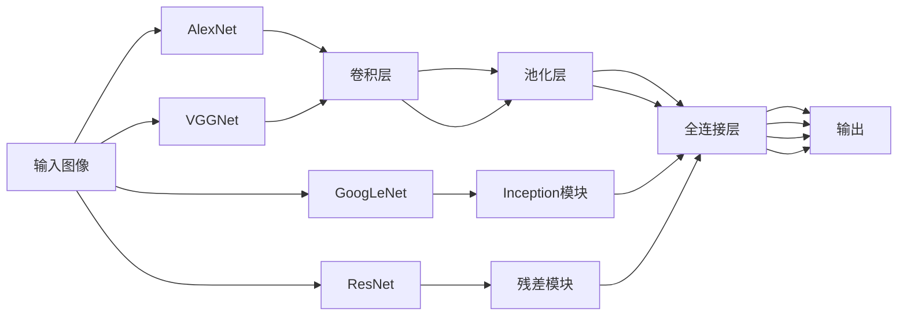

# Python机器学习实战：卷积神经网络(CNN)在图像处理中的应用

## 1.背景介绍

### 1.1 图像处理的重要性
在当今数字时代,图像无处不在。从智能手机拍摄的照片到医疗诊断中的X光片,从卫星拍摄的遥感影像到工业生产中的产品检测,图像处理技术在各个领域发挥着越来越重要的作用。高效、准确地分析和理解图像内容,已经成为人工智能的一个核心课题。

### 1.2 传统图像处理方法的局限性
传统的图像处理方法,如边缘检测、阈值分割等,主要依赖于人工设计的特征和规则。这些方法对于特定场景下的简单任务还能胜任,但面对复杂多变的真实图像时,往往难以取得令人满意的效果。其主要局限在于:

- 特征表达能力有限,难以刻画图像的高层语义信息 
- 处理流程依赖人工设计,缺乏灵活性和自适应能力
- 鲁棒性不足,难以应对图像的变形、遮挡、光照等干扰

### 1.3 深度学习的兴起
近年来,以深度学习为代表的人工智能技术取得了长足的进步。不同于传统方法,深度学习能够通过构建多层神经网络,自动学习图像数据中的层次化特征表示,从而获得更强大的特征提取和分类能力。其在图像分类、目标检测、语义分割等任务上展现出了远超传统方法的优异表现,引发了学术界和工业界的广泛关注。

### 1.4 卷积神经网络的优势
在众多深度学习模型中,卷积神经网络(Convolutional Neural Network, CNN)以其独特的结构设计和出色的表现,成为图像处理领域的明星模型。CNN通过引入局部连接、权重共享、池化等机制,很好地契合了图像数据的特点,在保证模型学习能力的同时,大大减少了参数量和计算复杂度。一些经典的CNN模型,如AlexNet、VGGNet、GoogLeNet、ResNet等,在ImageNet大规模图像分类任务上取得了里程碑式的突破。CNN强大的特征学习能力和优越的性能,使其在图像处理的各个领域得到了广泛应用。

## 2.核心概念与联系

### 2.1 图像的数字化表示
在计算机中,图像通常被表示为一个多维数组。对于灰度图像,它是一个二维数组,其中每个元素表示图像上对应位置像素的灰度值。对于彩色图像,它是一个三维数组,多出的一维用于表示像素的色彩通道(如RGB)。这种数字化表示为图像处理算法提供了统一的数据格式。

### 2.2 卷积的概念与作用
卷积是CNN的核心操作,它通过一个卷积核(也称为过滤器)在输入特征图上滑动,对局部区域进行加权求和,得到输出特征图。卷积的作用主要有:

- 提取局部特征:卷积核可以看作一种模式,用于提取输入中的局部特征,如边缘、纹理等。
- 保留空间结构:卷积操作的滑动窗口机制,使得输出特征图保留了输入的空间排列结构。
- 减少参数量:通过卷积核在不同位置共享参数,大大减少了模型的参数量。

### 2.3 池化的概念与作用
池化是CNN中常用的一种下采样操作,通过对输入特征图的局部区域进行某种聚合操作(如取最大值或平均值),得到尺寸更小的输出特征图。池化的主要作用有:

- 降低特征图的空间维度,减少后续层的计算量。
- 提供了一定程度的平移不变性,增强模型的鲁棒性。
- 有助于控制过拟合,提高模型的泛化能力。

### 2.4 激活函数的作用
激活函数是施加在神经元输出上的非线性变换,它为神经网络引入了非线性因素,使得网络能够拟合复杂的非线性映射关系。常见的激活函数有sigmoid、tanh、ReLU等,其中ReLU以其简单高效和良好的梯度传播特性,成为CNN中最常用的激活函数。

### 2.5 损失函数与优化算法
损失函数用于衡量模型预测结果与真实标签之间的差异,常见的有均方误差、交叉熵等。优化算法则用于最小化损失函数,更新模型参数,如梯度下降法及其变种。CNN的训练过程就是在给定训练数据下,通过反向传播算法不断迭代模型参数,使得损失函数达到最小。

### 2.6 经典CNN模型结构
下图展示了几种经典的CNN模型结构:



这些模型在结构设计上各有特点,但都遵循了CNN的基本组成范式,即若干个卷积层、池化层交替堆叠,最后接若干个全连接层,以实现特征提取和分类预测。

## 3.核心算法原理具体操作步骤

### 3.1 卷积层的前向传播

卷积层的前向传播过程可分为以下步骤:

1. 输入特征图与卷积核进行卷积操作,得到输出特征图。
2. 对输出特征图施加激活函数,引入非线性变换。
3. 如果有多个卷积核,则对各个卷积核的输出特征图进行拼接。

具体地,对于输入特征图$X$,卷积核$W$,偏置项$b$,激活函数$f$,卷积层的输出特征图$Y$可表示为:

$$Y = f(W * X + b)$$

其中$*$表示卷积操作。

### 3.2 池化层的前向传播

池化层的前向传播较为简单,对输入特征图的每个局部区域进行聚合操作即可。以最大池化为例,设输入特征图为$X$,池化窗口大小为$k \times k$,池化层输出为$Y$,则有:

$$Y_{i,j} = \max_{0 \leq m,n < k} X_{i \times k+m, j \times k+n}$$

即输出特征图上每个元素,是输入特征图对应池化窗口内的最大值。

### 3.3 全连接层的前向传播

全连接层可视为一种特殊的卷积层,其卷积核大小与输入特征图大小相同。设输入特征向量为$\mathbf{x}$,权重矩阵为$\mathbf{W}$,偏置向量为$\mathbf{b}$,激活函数为$f$,则全连接层的输出$\mathbf{y}$为:

$$\mathbf{y} = f(\mathbf{W}\mathbf{x} + \mathbf{b})$$

### 3.4 反向传播算法

CNN的训练依赖反向传播算法,其主要步骤如下:

1. 前向传播:根据当前模型参数,计算出输入图像在CNN各层的响应,直到输出层得到预测结果。
2. 计算损失:将预测结果与真实标签代入损失函数,计算出当前模型的损失值。
3. 反向传播:从输出层开始,将损失值沿着CNN逐层反向传播,计算出各层参数的梯度。
4. 更新参数:使用优化算法(如梯度下降),根据计算出的梯度更新各层参数。
5. 重复迭代:将上述过程重复若干次,直到模型收敛或达到预设的迭代次数。

反向传播的关键是求出各层参数的梯度。以卷积层为例,设损失函数为$L$,卷积核为$W$,输入特征图为$X$,卷积层输出为$Y$,则卷积核$W$的梯度为:

$$\frac{\partial L}{\partial W} = \frac{\partial L}{\partial Y} * X$$

其中$\frac{\partial L}{\partial Y}$是损失函数对卷积层输出的梯度,可通过链式法则从上一层反向传播得到。

## 4.数学模型和公式详细讲解举例说明

### 4.1 卷积的数学定义

设输入信号为$f(x)$,卷积核为$g(x)$,卷积操作记为$*$,则卷积结果$h(x)$定义为:

$$(f * g)(x) = \int_{-\infty}^{\infty} f(\tau) g(x-\tau) d\tau$$

对于离散信号,卷积公式可写为:

$$(f * g)[n] = \sum_{m=-\infty}^{\infty} f[m] g[n-m]$$

### 4.2 图像卷积的计算示例

以一个$3 \times 3$的图像$X$和一个$2 \times 2$的卷积核$W$为例:

$$X = \begin{bmatrix}
1 & 2 & 3\\
4 & 5 & 6\\
7 & 8 & 9
\end{bmatrix}, W = \begin{bmatrix}
1 & 0\\
0 & 1
\end{bmatrix}$$

则卷积结果$Y$为:

$$Y = \begin{bmatrix}
1 & 2\\
4 & 5
\end{bmatrix} * \begin{bmatrix}
1 & 0\\
0 & 1
\end{bmatrix} = \begin{bmatrix}
1 & 2\\
4 & 5
\end{bmatrix}$$

可见,卷积核在图像上滑动,提取出了图像的局部特征。

### 4.3 最大池化的计算示例

以一个$4 \times 4$的特征图$X$和$2 \times 2$的池化窗口为例:

$$X = \begin{bmatrix}
1 & 2 & 3 & 4\\
5 & 6 & 7 & 8\\
9 & 10 & 11 & 12\\
13 & 14 & 15 & 16
\end{bmatrix}$$

则最大池化结果$Y$为:

$$Y = \begin{bmatrix}
6 & 8\\
14 & 16
\end{bmatrix}$$

池化操作降低了特征图的空间维度,同时保留了主要特征。

### 4.4 softmax函数与交叉熵损失

在分类任务中,CNN的输出层通常使用softmax函数进行归一化,将输出值转化为概率形式。设输出层特征向量为$\mathbf{z} = (z_1, z_2, \dots, z_K)$,则softmax函数输出的第$i$类概率为:

$$p_i = \frac{e^{z_i}}{\sum_{j=1}^K e^{z_j}}$$

交叉熵损失函数度量了预测概率分布与真实标签分布之间的差异。设真实标签的one-hot编码为$\mathbf{y} = (y_1, y_2, \dots, y_K)$,预测概率为$\mathbf{p} = (p_1, p_2, \dots, p_K)$,则交叉熵损失定义为:

$$L(\mathbf{y}, \mathbf{p}) = -\sum_{i=1}^K y_i \log p_i$$

直观地,交叉熵损失会惩罚那些真实标签为1但预测概率较小的类别,从而指导模型学习。

## 5.项目实践：代码实例和详细解释说明

下面以Keras框架为例,演示如何使用Python实现一个简单的CNN模型,并在MNIST手写数字数据集上进行训练和测试。

```python
from keras.datasets import mnist
from keras.models import Sequential
from keras.layers import Conv2D, MaxPooling2D, Flatten, Dense
from keras.utils import to_categorical

# 加载MNIST数据集
(train_images, train_labels), (test_images, test_labels) = mnist.load_data()

# 数据预处理
train_images = train_images.reshape((60000, 28, 28, 1))
train_images = train_images.astype('float32') / 255
test_images = test_images.reshape((10000, 28, 28, 1))
test_images = test_images.astype('float32') / 255
train_labels = to_categorical(train_labels)
test_labels = to_categorical(test_labels)

# 构建CNN模型
model = Sequential()
model.add(Conv2D(32, (3, 3), activation='relu', input_shape=(28, 28, 1)))
model.add(MaxPool