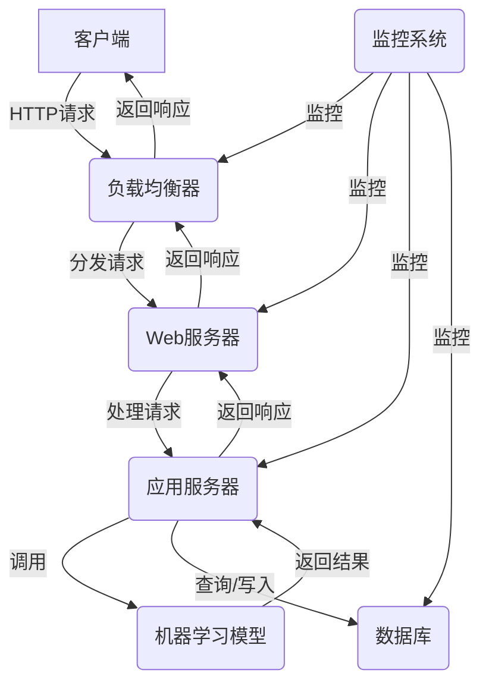

# Python机器学习实战：搭建自己的机器学习Web服务

## 1.背景介绍

### 1.1 机器学习的兴起

近年来,机器学习(Machine Learning)作为人工智能(Artificial Intelligence)的一个重要分支,正在以前所未有的速度发展。随着大数据时代的到来,海量的数据为机器学习算法提供了丰富的训练资源,使得机器学习模型的性能不断提高。与此同时,计算硬件的飞速发展,尤其是GPU的广泛应用,极大地加速了机器学习模型的训练过程。

机器学习已经广泛应用于图像识别、自然语言处理、推荐系统、金融风控等诸多领域,为我们的生活带来了巨大的便利。然而,传统的机器学习系统往往是在本地运行,需要手动部署和维护,这给普通用户带来了一定的困难。因此,如何将机器学习模型快速、便捷地部署到线上,成为了一个亟待解决的问题。

### 1.2 Web服务的优势

Web服务(Web Service)是一种跨平台的分布式计算技术,它可以通过标准的网络协议(如HTTP)来提供服务。将机器学习模型部署为Web服务,可以带来以下优势:

1. **易于访问**: 只需要一个浏览器或HTTP客户端,就可以从任何地方访问机器学习服务,无需安装复杂的软件环境。
2. **跨平台**: Web服务通常采用标准的协议和数据格式(如JSON),可以轻松地在不同的操作系统和编程语言之间进行集成。
3. **可扩展性**: 通过负载均衡和水平扩展,Web服务可以轻松地处理大规模的并发请求。
4. **版本控制**: Web服务可以方便地进行版本管理和升级,确保用户始终使用最新的模型。

因此,将机器学习模型部署为Web服务,可以极大地提高其可用性和可维护性,使得普通用户也能方便地使用机器学习技术。

## 2.核心概念与联系

### 2.1 机器学习流程

在部署机器学习Web服务之前,我们需要先了解机器学习的基本流程。一个典型的机器学习项目通常包括以下几个步骤:

1. **数据收集**: 从各种来源收集相关的数据,如网络爬虫、数据库、文件等。
2. **数据预处理**: 对原始数据进行清洗、标准化、特征工程等预处理,以满足机器学习算法的输入要求。
3. **模型训练**: 选择合适的机器学习算法,使用预处理后的数据对模型进行训练,得到一个可用的模型。
4. **模型评估**: 使用测试数据对训练好的模型进行评估,衡量其性能指标,如准确率、召回率等。
5. **模型调优**: 根据评估结果,对模型进行优化,如调整超参数、特征选择等,以提高模型性能。
6. **模型部署**: 将训练好的模型部署到生产环境中,为用户提供服务。

### 2.2 Web服务架构

为了将机器学习模型部署为Web服务,我们需要构建一个合适的Web架构。一个典型的Web服务架构通常包括以下几个核心组件:

1. **Web服务器**: 负责接收和处理HTTP请求,如Nginx、Apache等。
2. **应用服务器**: 运行Web应用程序的服务器,如Flask、Django等Python Web框架。
3. **机器学习模型**: 已经训练好的机器学习模型,可以根据输入数据进行预测。
4. **数据库**: 用于存储模型相关的元数据、配置信息等。
5. **负载均衡器**: 在高并发场景下,负载均衡器可以将请求分发到多个应用服务器上,提高系统的可扩展性。
6. **监控系统**: 用于监控系统的运行状态,如CPU、内存、网络等指标,并发出警报。

这些组件通过合理的架构设计和部署,可以构建出一个高效、可靠的机器学习Web服务系统。



上图展示了一个典型的机器学习Web服务架构。客户端通过HTTP请求访问Web服务,请求首先经过负载均衡器进行分发,然后由Web服务器接收并交给应用服务器处理。应用服务器调用已经部署的机器学习模型进行预测,并根据需要查询或写入数据库。最终,预测结果通过相反的路径返回给客户端。在整个过程中,监控系统负责监视各个组件的运行状态,确保系统的稳定性和可用性。

## 3.核心算法原理具体操作步骤

在部署机器学习Web服务之前,我们需要先训练出一个可用的机器学习模型。以下是一个典型的机器学习模型训练流程:

### 3.1 数据预处理

1. **导入必要的库**
2. **加载数据集**
3. **数据探索和可视化**
4. **处理缺失值**
5. **特征编码**
6. **特征缩放**
7. **划分训练集和测试集**

### 3.2 模型训练

1. **选择合适的机器学习算法**
2. **初始化模型对象**
3. **设置模型超参数**
4. **模型训练**
5. **模型评估**

### 3.3 模型优化

1. **交叉验证**
2. **特征选择**
3. **超参数调优**
4. **集成学习**

### 3.4 模型持久化

1. **导入必要的库**
2. **保存模型**
3. **加载模型**

以上是一个典型的机器学习模型训练流程,具体的算法和步骤可能会因问题而有所不同。在部署Web服务时,我们只需要加载已经训练好的模型,并将其集成到Web应用程序中即可。

## 4.数学模型和公式详细讲解举例说明

机器学习算法通常基于一些数学模型和公式,以下是一些常见的数学模型和公式:

### 4.1 线性回归

线性回归是一种常见的监督学习算法,用于预测连续型目标变量。其数学模型可以表示为:

$$y = \theta_0 + \theta_1x_1 + \theta_2x_2 + ... + \theta_nx_n$$

其中,$y$是目标变量,$x_i$是特征变量,$\theta_i$是模型参数。

线性回归的目标是找到一组最优参数$\theta$,使得预测值$\hat{y}$与真实值$y$之间的均方误差最小化:

$$\min_\theta \sum_{i=1}^{m}(y^{(i)} - \hat{y}^{(i)})^2$$

其中,$m$是训练样本的数量。

### 4.2 逻辑回归

逻辑回归是一种常见的分类算法,用于预测二元或多元分类问题。其数学模型可以表示为:

$$\hat{y} = \sigma(\theta_0 + \theta_1x_1 + \theta_2x_2 + ... + \theta_nx_n)$$

其中,$\sigma$是逻辑函数(Sigmoid函数):

$$\sigma(z) = \frac{1}{1 + e^{-z}}$$

逻辑回归的目标是找到一组最优参数$\theta$,使得训练数据的对数似然函数最大化:

$$\max_\theta \sum_{i=1}^{m}[y^{(i)}\log(\hat{y}^{(i)}) + (1 - y^{(i)})\log(1 - \hat{y}^{(i)})]$$

### 4.3 决策树

决策树是一种常见的监督学习算法,可以用于分类和回归问题。决策树的构建过程可以看作是一个递归的过程,每次选择一个最优特征进行分裂,直到满足停止条件。

决策树的构建过程可以使用信息增益或基尼系数作为特征选择的标准。以信息增益为例,其公式如下:

$$\text{Gain}(D, a) = \text{Entropy}(D) - \sum_{v=1}^{V}\frac{|D^v|}{|D|}\text{Entropy}(D^v)$$

其中,$D$是当前数据集,$a$是特征,$V$是特征$a$的取值集合,$D^v$是特征$a$取值为$v$的子数据集,$\text{Entropy}$是信息熵,定义如下:

$$\text{Entropy}(D) = -\sum_{i=1}^{c}p_i\log_2p_i$$

其中,$c$是类别数,$p_i$是第$i$类样本的概率。

在构建决策树时,我们选择具有最大信息增益的特征进行分裂,以最大化信息增益。

### 4.4 支持向量机

支持向量机(Support Vector Machine, SVM)是一种常见的监督学习算法,可以用于分类和回归问题。SVM的基本思想是找到一个超平面,将不同类别的样本分开,并且使得超平面与最近的样本点之间的距离最大化。

对于线性可分的情况,SVM的数学模型可以表示为:

$$\min_{\vec{w},b}\frac{1}{2}\|\vec{w}\|^2$$
$$\text{s.t. } y^{(i)}(\vec{w}^T\vec{x}^{(i)} + b) \geq 1, i = 1, 2, ..., m$$

其中,$\vec{w}$是超平面的法向量,$b$是超平面的偏移量,$\vec{x}^{(i)}$是第$i$个样本,$y^{(i)}$是第$i$个样本的标签,$m$是样本数量。

对于线性不可分的情况,SVM引入了松弛变量$\xi$,允许一些样本点位于超平面的错误一侧,同时minimizing损失函数:

$$\min_{\vec{w},b,\xi}\frac{1}{2}\|\vec{w}\|^2 + C\sum_{i=1}^{m}\xi_i$$
$$\text{s.t. } y^{(i)}(\vec{w}^T\vec{x}^{(i)} + b) \geq 1 - \xi_i, i = 1, 2, ..., m$$
$$\xi_i \geq 0, i = 1, 2, ..., m$$

其中,$C$是一个超参数,用于控制模型的复杂度和误差惩罚的权重。

以上只是机器学习中一些常见的数学模型和公式,实际应用中还有许多其他的模型和公式,如神经网络、聚类算法等,具体的选择取决于问题的类型和数据的特征。

## 5.项目实践：代码实例和详细解释说明

在本节中,我们将通过一个实际的项目案例,演示如何使用Python和Flask框架构建一个机器学习Web服务。

### 5.1 项目概述

我们将构建一个房价预测Web服务,用户可以通过输入房屋的各种特征,如房间数量、地理位置等,获得该房屋的预测价格。我们将使用著名的"波士顿房价"数据集进行训练,并将训练好的模型部署为Web服务。

### 5.2 数据预处理

首先,我们需要导入必要的库,加载并探索数据集:

```python
import pandas as pd
from sklearn.datasets import load_boston
from sklearn.model_selection import train_test_split
from sklearn.preprocessing import StandardScaler

# 加载数据集
boston = load_boston()
data = pd.DataFrame(boston.data, columns=boston.feature_names)
data['PRICE'] = boston.target

# 探索数据
print(data.head())
print(data.describe())
```

接下来,我们对数据进行预处理,包括填充缺失值、特征编码和标准化:

```python
# 填充缺失值
data = data.fillna(data.mean())

# 特征编码
from sklearn.preprocessing import LabelEncoder
categorical_cols = ['RAD', 'CHAS']
encoders = {}
for col in categorical_cols:
    encoders[col] = LabelEncoder().fit(data[col])
    data[col] = encoders[col].transform(data[col])

# 标准化数值特征
numeric_cols = [col for col in data.columns if col not in categorical_cols + ['PRICE']]
scaler = StandardScaler()
data[numeric_cols] = scaler.fit_transform(data[