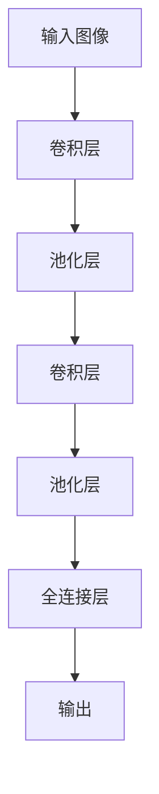
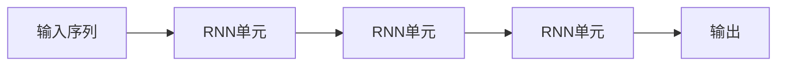
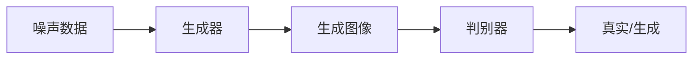
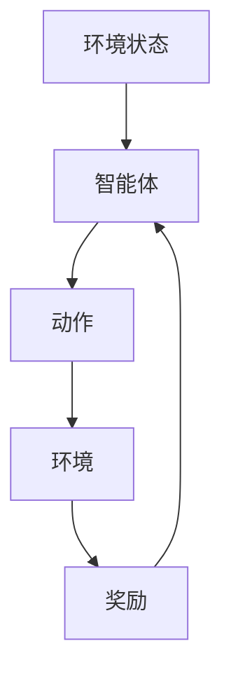

# Python机器学习实战：深度学习在计算机视觉任务中的运用

## 1.背景介绍

### 1.1 计算机视觉概述

计算机视觉是人工智能领域的一个重要分支,旨在使机器能够像人类一样从数字图像或视频中获取有意义的信息。它涉及多个领域,包括图像处理、模式识别和机器学习等。随着深度学习技术的快速发展,计算机视觉的性能得到了极大的提升,在各种视觉任务中取得了令人瞩目的成就。

### 1.2 深度学习在计算机视觉中的作用

深度学习是机器学习的一个新兴热点领域,它通过对数据进行表征学习,捕捉数据的高阶抽象特征,从而解决了传统机器学习算法在处理高维、非线性数据时的瓶颈问题。在计算机视觉领域,深度学习模型可以自动从大量图像数据中学习出多层次的特征表示,极大地提高了视觉任务的性能。

### 1.3 Python在机器学习中的应用

Python是一种简单、优雅且功能强大的编程语言,在机器学习和深度学习领域有着广泛的应用。Python拥有丰富的科学计算库,如NumPy、SciPy、Pandas等,可以高效地处理数值和科学数据。同时,Python还有许多优秀的机器学习库,如Scikit-learn、TensorFlow、PyTorch等,为开发人员提供了强大的工具。

## 2.核心概念与联系  

### 2.1 卷积神经网络

卷积神经网络(Convolutional Neural Network, CNN)是深度学习在计算机视觉领域的核心模型。CNN由卷积层、池化层和全连接层等组成,能够自动从图像数据中学习出多层次的特征表示。CNN在图像分类、目标检测、语义分割等任务中表现出色。

### 2.2 循环神经网络

循环神经网络(Recurrent Neural Network, RNN)是一种用于处理序列数据的深度学习模型,在视频分析、动作识别等任务中有广泛应用。RNN可以捕捉序列数据中的时间依赖关系,常与CNN结合使用,处理视频等时序图像数据。

### 2.3 生成对抗网络

生成对抗网络(Generative Adversarial Network, GAN)是一种由生成器和判别器组成的深度学习模型。生成器负责生成新的数据样本,而判别器则判断生成的数据是否真实。GAN在图像生成、风格迁移等任务中有出色表现。

### 2.4 深度强化学习

深度强化学习将深度学习与强化学习相结合,能够从环境中学习最优策略,在机器人控制、自动驾驶等领域有广泛应用。深度强化学习常用的算法包括深度Q网络(Deep Q-Network, DQN)、策略梯度(Policy Gradient)等。

### 2.5 迁移学习

迁移学习是一种将在源领域学习到的知识迁移到目标领域的技术,可以有效利用已有的模型和数据,加快新任务的训练过程。在计算机视觉领域,常见的做法是使用在大型数据集(如ImageNet)上预训练的模型,并在目标任务上进行微调。

## 3.核心算法原理具体操作步骤

### 3.1 卷积神经网络

卷积神经网络的核心思想是通过卷积操作提取图像的局部特征,并通过池化操作降低特征维度,最终将提取到的特征输入全连接层进行分类或回归。CNN的训练过程如下:

1. **数据预处理**: 将图像数据归一化,并进行数据增强(如翻转、旋转等)以增加训练数据的多样性。

2. **网络构建**: 根据任务需求设计CNN的网络结构,包括卷积层、池化层和全连接层等。常见的网络结构有LeNet、AlexNet、VGGNet、ResNet等。

3. **前向传播**: 将输入图像传入网络,通过卷积、池化等操作提取特征,最终得到输出结果。

4. **计算损失**: 将网络输出与真实标签进行比较,计算损失函数(如交叉熵损失)。

5. **反向传播**: 根据损失函数,利用反向传播算法计算网络参数的梯度。

6. **参数更新**: 使用优化算法(如随机梯度下降)更新网络参数,使损失函数最小化。

7. **模型评估**: 在验证集上评估模型的性能,根据需要调整超参数或网络结构。

8. **模型部署**: 在测试集上测试模型的泛化能力,并将模型部署到实际应用中。

### 3.2 生成对抗网络

生成对抗网络由生成器和判别器组成,两者通过对抗训练的方式相互博弈,最终达到生成器生成逼真样本、判别器无法区分真伪的状态。GAN的训练过程如下:

1. **初始化生成器和判别器**: 根据任务需求设计生成器和判别器的网络结构,常用的生成器网络包括全卷积网络、U-Net等,判别器网络通常采用CNN。

2. **生成器生成样本**: 生成器从噪声数据或潜在空间中采样,生成与真实数据分布相似的样本。

3. **判别器判别真伪**: 判别器接收生成器生成的样本和真实样本,判断它们是真是假。

4. **计算生成器和判别器的损失**: 生成器的目标是使判别器无法区分生成样本和真实样本,因此生成器损失是判别器对生成样本的真实性评分。判别器的目标是正确区分真伪样本,因此判别器损失是对真实样本和生成样本的正确评分。

5. **反向传播和参数更新**: 分别对生成器和判别器进行反向传播,更新网络参数。

6. **重复训练**: 重复执行步骤2-5,直到生成器和判别器达到平衡状态。

7. **模型评估和部署**: 在测试集上评估生成器的性能,并将生成器部署到实际应用中。

### 3.3 深度强化学习

深度强化学习将深度神经网络应用于强化学习,使智能体能够从环境中学习最优策略。以深度Q网络(DQN)为例,其训练过程如下:

1. **初始化智能体和环境**: 构建智能体(如DQN网络)和环境模拟器。

2. **观测环境状态**: 智能体观测当前环境状态。

3. **选择动作**: 根据当前状态,智能体选择一个动作执行。常用的策略包括ε-贪婪策略和软max策略。

4. **执行动作并获取反馈**: 智能体在环境中执行选择的动作,观测环境的新状态、获得的奖励,并将状态转移存入经验回放池。

5. **从经验回放池采样数据**: 从经验回放池中随机采样一批数据,作为神经网络的输入。

6. **计算Q值和损失函数**: 使用神经网络预测每个状态下不同动作的Q值,并与真实Q值计算损失函数(如均方误差损失)。

7. **反向传播和参数更新**: 根据损失函数,利用反向传播算法更新神经网络的参数。

8. **重复训练**: 重复执行步骤2-7,直到智能体达到期望的性能水平。

9. **模型评估和部署**: 在测试环境中评估智能体的性能,并将其部署到实际应用中。

## 4.数学模型和公式详细讲解举例说明

### 4.1 卷积操作

卷积操作是CNN中的核心操作,它通过滤波器(卷积核)在输入特征图上滑动,提取局部特征。对于二维输入$I$和卷积核$K$,卷积操作可表示为:

$$
(I * K)(i, j) = \sum_{m}\sum_{n}I(i+m, j+n)K(m, n)
$$

其中$i$和$j$是输出特征图的坐标,卷积核$K$在输入特征图$I$上滑动,计算局部区域的加权和作为输出特征图的值。

### 4.2 池化操作

池化操作用于降低特征维度,提高计算效率和模型的泛化能力。常见的池化操作包括最大池化和平均池化。对于二维输入$I$和池化窗口大小$k \times k$,最大池化操作可表示为:

$$
\text{max\_pool}(I)_{i, j} = \max_{m=0, \ldots, k-1 \\ n=0, \ldots, k-1} I_{i+m, j+n}
$$

即在$k \times k$的窗口内取最大值作为输出特征图的值。

### 4.3 交叉熵损失函数

交叉熵损失函数常用于分类任务中,它度量了预测概率分布与真实标签分布之间的差异。对于二分类问题,交叉熵损失函数可表示为:

$$
L(y, \hat{y}) = -y \log(\hat{y}) - (1 - y) \log(1 - \hat{y})
$$

其中$y$是真实标签(0或1),$\hat{y}$是预测的概率值。对于多分类问题,交叉熵损失函数可扩展为:

$$
L(Y, \hat{Y}) = -\sum_{i=1}^{C}y_i \log(\hat{y}_i)
$$

其中$C$是类别数,$Y$是one-hot编码的真实标签向量,$\hat{Y}$是预测的概率分布向量。

### 4.4 生成对抗网络损失函数

在生成对抗网络中,生成器和判别器的损失函数通常采用最小-最大博弈形式。生成器的目标是最大化判别器对生成样本的真实性评分,而判别器的目标是最大化对真实样本的真实性评分,最小化对生成样本的真实性评分。对于生成器$G$和判别器$D$,损失函数可表示为:

$$
\begin{aligned}
\min_G \max_D V(D, G) &= \mathbb{E}_{x \sim p_{\text{data}}(x)}[\log D(x)] \\
&+ \mathbb{E}_{z \sim p_z(z)}[\log(1 - D(G(z)))]
\end{aligned}
$$

其中$x$是真实样本,$z$是噪声数据,目标是找到一个生成器$G$使得判别器$D$无法区分真伪样本。

### 4.5 Q-Learning更新规则

在强化学习中,Q-Learning是一种基于时间差分的算法,用于估计状态-动作对的Q值。对于状态$s$、动作$a$和奖励$r$,Q值的更新规则为:

$$
Q(s, a) \leftarrow Q(s, a) + \alpha \left[ r + \gamma \max_{a'} Q(s', a') - Q(s, a) \right]
$$

其中$\alpha$是学习率,$\gamma$是折扣因子,$s'$是执行动作$a$后到达的新状态,$\max_{a'} Q(s', a')$是在新状态下可获得的最大Q值。通过不断更新Q值,智能体可以学习到最优策略。

## 5.项目实践：代码实例和详细解释说明

在这一部分,我们将通过一个实际项目,演示如何使用Python和深度学习库(如TensorFlow或PyTorch)来解决计算机视觉任务。我们将介绍项目的背景、目标,并详细解释代码实现过程。

### 5.1 项目背景和目标

假设我们需要构建一个图像分类系统,能够识别不同种类的交通标志。我们将使用深度学习技术,基于一个包含各种交通标志图像的数据集,训练一个卷积神经网络