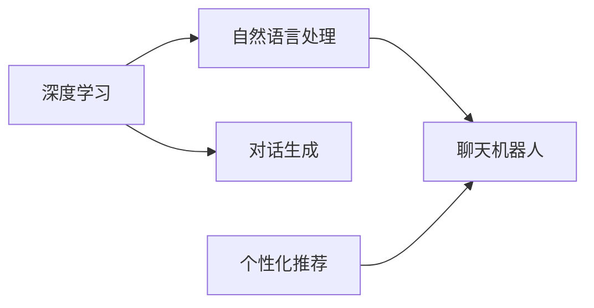
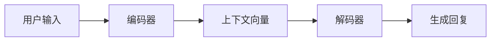

# Python深度学习实践：基于深度学习的个性化聊天机器人

## 1.背景介绍

在当今数字时代,人工智能(AI)技术正在迅速发展和普及。其中,聊天机器人作为一种基于自然语言处理(NLP)和机器学习(ML)技术的AI应用,正受到越来越多的关注。聊天机器人可以与用户进行自然对话,提供个性化的服务和交互体验,在客户服务、在线教育、娱乐等领域有广泛的应用前景。

近年来,深度学习技术的兴起为聊天机器人的发展带来了新的突破。与传统的基于规则或检索的方法相比,基于深度学习的聊天机器人能够更好地理解用户意图,生成更加自然流畅的回复,并具备一定的上下文理解和个性化对话能力。本文将探讨如何利用Python和深度学习技术,实现一个个性化的聊天机器人。

### 1.1 聊天机器人的发展历程

聊天机器人的发展可以追溯到20世纪60年代,最早的聊天机器人是由MIT的Joseph Weizenbaum开发的ELIZA。ELIZA采用基于模式匹配的方法,通过识别用户输入中的关键词,给出预设的回复模板。尽管ELIZA的对话能力有限,但它开创了人机对话的先河。

此后,聊天机器人技术不断发展,出现了一系列著名的聊天机器人,如A.L.I.C.E.、Jabberwacky等。这些聊天机器人主要采用基于检索的方法,通过在大规模语料库中搜索与用户输入相似的问题,返回对应的答案。检索式聊天机器人的优点是回复准确率较高,但灵活性和个性化程度有限。

近年来,随着深度学习技术的发展,特别是循环神经网络(RNN)、长短期记忆网络(LSTM)等序列模型的出现,聊天机器人进入了一个新的发展阶段。基于深度学习的生成式聊天机器人能够根据上下文自动生成回复,具备更强的语言理解和生成能力,使得人机对话更加自然流畅。

### 1.2 个性化聊天机器人的价值

传统的聊天机器人往往采用"一刀切"的方式,对所有用户返回相同的回复。然而,不同用户有不同的背景知识、兴趣爱好和对话风格。一个好的聊天机器人应该能够根据用户的个人特点,提供个性化的对话体验。

个性化聊天机器人的价值体现在以下几个方面:

1. 提升用户满意度:个性化的对话能够让用户感受到被重视和理解,提升用户的满意度和忠诚度。

2. 提高对话效率:通过了解用户的背景和偏好,聊天机器人可以更快地理解用户意图,减少无效对话,提高对话效率。

3. 增强用户粘性:个性化的聊天体验能够增强用户粘性,吸引用户与聊天机器人进行更多互动。

4. 创造商业价值:个性化聊天机器人可以应用于客户服务、销售、推荐等场景,通过个性化服务创造更多商业价值。

综上所述,个性化聊天机器人不仅能够改善用户体验,还能为企业带来切实的商业价值。如何利用深度学习技术实现个性化聊天机器人,是本文要探讨的核心问题。

## 2.核心概念与联系

在实现基于深度学习的个性化聊天机器人之前,我们需要了解一些核心概念及其相互联系。

### 2.1 自然语言处理(NLP)

自然语言处理是人工智能的一个重要分支,旨在让计算机能够理解、生成和处理人类语言。NLP涉及语言学、计算机科学、统计学等多个学科,主要任务包括:

- 分词和词性标注:将文本划分为词语,并标注每个词的词性(如名词、动词等)。
- 句法分析:分析句子的语法结构,如主语、谓语、宾语等成分。
- 语义分析:理解词语和句子的含义,消除歧义。
- 篇章分析:分析语句之间的逻辑关系,理解上下文语境。
- 文本分类:将文本划分到预定义的类别中。
- 信息抽取:从文本中提取结构化信息,如实体、关系等。
- 机器翻译:将一种语言翻译成另一种语言。
- 文本生成:根据给定的主题或上下文,生成自然语言文本。

聊天机器人是NLP的一个典型应用,涉及语言理解和文本生成两大核心任务。NLP技术是实现聊天机器人的基础。

### 2.2 深度学习

深度学习是机器学习的一个分支,基于人工神经网络(ANN)的概念。与传统的机器学习方法相比,深度学习能够自动学习数据的层次特征表示,在语音识别、图像识别、自然语言处理等领域取得了显著成果。

深度学习的核心思想是通过构建多层神经网络,逐层提取数据的抽象特征。常见的深度学习模型包括:

- 前馈神经网络(FNN):每一层神经元只与上一层连接,信息单向传播。
- 卷积神经网络(CNN):主要用于图像识别,通过卷积和池化操作提取局部特征。
- 循环神经网络(RNN):适合处理序列数据,通过循环连接建模时序信息。
- 长短期记忆网络(LSTM):RNN的一种改进,通过门控机制缓解梯度消失问题。

在聊天机器人领域,RNN和LSTM等序列模型被广泛应用于对话生成任务,能够建模对话的上下文依赖关系。

### 2.3 个性化推荐

个性化推荐是根据用户的历史行为、偏好等信息,向用户推荐其可能感兴趣的内容。常见的推荐算法包括:

- 协同过滤(Collaborative Filtering):基于用户或物品之间的相似性进行推荐。
- 基于内容的推荐(Content-based Recommendation):根据物品的属性特征进行推荐。
- 组合推荐(Hybrid Recommendation):结合协同过滤和基于内容的方法。
- 基于深度学习的推荐:利用深度学习模型学习用户和物品的隐式特征表示。

个性化推荐技术可以应用于聊天机器人,根据用户的个人特点提供定制化的对话内容和服务。

### 2.4 技术之间的联系

自然语言处理、深度学习和个性化推荐三者之间存在紧密的联系:

- NLP是聊天机器人的基础,负责对话的语言理解和生成。
- 深度学习是实现NLP任务的重要技术,特别是在对话生成方面,RNN等序列模型发挥了关键作用。
- 个性化推荐可以与NLP和深度学习结合,实现聊天机器人的个性化对话。

下图展示了这三种技术在个性化聊天机器人中的协同关系:

综上,自然语言处理、深度学习和个性化推荐是实现个性化聊天机器人的三大核心技术,它们相互配合,共同构建起智能对话系统的基础。

## 3.核心算法原理具体操作步骤

本节将详细介绍基于深度学习的个性化聊天机器人的核心算法原理和具体操作步骤。我们将重点讨论序列到序列(Seq2Seq)模型在对话生成中的应用。

### 3.1 Seq2Seq模型概述

Seq2Seq模型是一种基于RNN的生成式模型,广泛应用于机器翻译、对话生成等任务。它由两个RNN组成:编码器(Encoder)和解码器(Decoder)。

- 编码器:将输入序列编码为固定长度的向量表示(即上下文向量)。
- 解码器:根据编码器生成的上下文向量,逐步生成输出序列。

在对话生成任务中,编码器负责对用户输入的句子进行编码,解码器根据编码信息生成回复。下图展示了Seq2Seq模型的基本结构:

### 3.2 编码器

编码器的目标是将用户输入的句子 $X=(x_1,x_2,...,x_T)$ 编码为固定长度的上下文向量 $c$。具体步骤如下:

1. 将输入句子中的每个词 $x_t$ 映射为词向量 $e_t$。
2. 将词向量 $e_t$ 输入到RNN的隐藏层 $h_t$:

$$h_t=f(W_{ih}e_t+W_{hh}h_{t-1}+b_h)$$

其中,$W_{ih}$ 和 $W_{hh}$ 分别是输入到隐藏层和隐藏层到隐藏层的权重矩阵,$b_h$ 是隐藏层的偏置项,$f$ 是激活函数(通常选择tanh或relu)。

3. 将最后一个时间步的隐藏状态 $h_T$ 作为上下文向量 $c$。

编码器的关键是通过RNN建模输入序列的上下文信息,将其压缩为一个固定维度的向量表示。

### 3.3 解码器

解码器根据编码器生成的上下文向量 $c$,逐步生成输出序列 $Y=(y_1,y_2,...,y_{T'})$。具体步骤如下:

1. 在每个时间步 $t$,将上一步生成的词 $y_{t-1}$ 映射为词向量 $e_t$,并将其与上下文向量 $c$ 拼接。
2. 将拼接后的向量输入到RNN的隐藏层 $s_t$:

$$s_t=f(W_{is}[e_t;c]+W_{ss}s_{t-1}+b_s)$$

其中,$W_{is}$ 和 $W_{ss}$ 分别是输入到隐藏层和隐藏层到隐藏层的权重矩阵,$b_s$ 是隐藏层的偏置项。

3. 将隐藏状态 $s_t$ 通过全连接层和softmax函数,生成下一个词的概率分布:

$$p(y_t|y_{<t},c)=softmax(W_{so}s_t+b_o)$$

其中,$W_{so}$ 是隐藏层到输出层的权重矩阵,$b_o$ 是输出层的偏置项。

4. 根据生成的概率分布,采样或选择概率最大的词作为 $y_t$,并作为下一步的输入。
5. 重复步骤1-4,直到生成结束符<EOS>或达到最大长度。

解码器的关键是在每个时间步根据上下文向量和之前生成的词,预测下一个词的概率分布。通过这种自回归的方式,逐步生成完整的输出序列。

### 3.4 注意力机制

传统的Seq2Seq模型中,解码器只能访问编码器最后一个时间步的隐藏状态,忽略了输入序列的细节信息。注意力机制通过在每个解码步骤中引入对编码器隐藏状态的加权平均,使得解码器能够有选择地关注输入序列的不同部分。

常见的注意力机制有:

- Bahdanau Attention:在每个解码步骤中,通过对编码器隐藏状态和上一步解码器隐藏状态的非线性组合进行softmax,得到注意力权重。
- Luong Attention:在每个解码步骤中,通过编码器隐藏状态和当前解码器隐藏状态的点积或拼接计算注意力权重。

引入注意力机制后,解码器的隐藏状态更新公式变为:

$$s_t=f(W_{is}[e_t;c_t]+W_{ss}s_{t-1}+b_s)$$

其中,$c_t$ 是根据注意力权重对编码器隐藏状态的加权平均:

$$c_t=\sum_{i=1}^{T}\alpha_{ti}h_i$$

$\alpha_{ti}$ 是第 