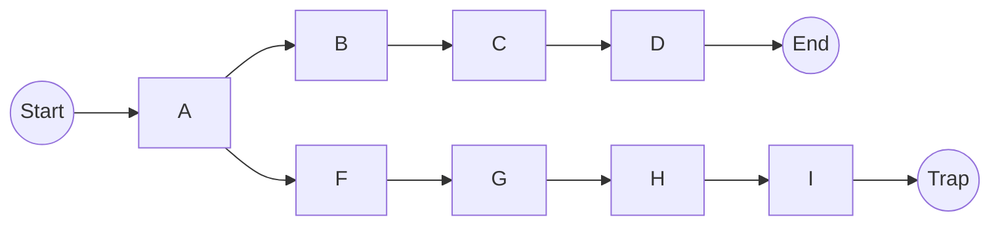

# Q-学习(Q-Learning) - 原理与代码实例讲解

## 1. 背景介绍

### 1.1 强化学习概述

强化学习(Reinforcement Learning)是机器学习的一个重要分支,它关注如何基于环境反馈来学习决策策略,以获得最大化的累积奖励。与监督学习和无监督学习不同,强化学习没有给定的输入-输出样本对,而是通过与环境的交互来学习。

在强化学习中,智能体(Agent)与环境(Environment)进行交互。智能体根据当前状态选择一个动作,环境会根据这个动作转移到新的状态,并给出相应的奖励(Reward)反馈。智能体的目标是学习一个策略(Policy),使得在长期累积奖励最大化。

### 1.2 Q-Learning简介

Q-Learning是强化学习中一种基于价值的无模型算法,它不需要事先了解环境的转移概率模型,而是通过与环境交互来直接学习状态-动作对的价值函数(Value Function)。

Q-Learning算法的核心思想是使用Q函数(Q-Function)来估计在某个状态下采取某个动作所能获得的长期累积奖励。通过不断更新Q函数的估计值,Q-Learning算法可以逐步找到最优策略。

## 2. 核心概念与联系

### 2.1 马尔可夫决策过程(MDP)

Q-Learning是基于马尔可夫决策过程(Markov Decision Process, MDP)的框架。MDP由以下几个要素组成:

- 状态集合(State Space) $\mathcal{S}$
- 动作集合(Action Space) $\mathcal{A}$
- 转移概率(Transition Probability) $\mathcal{P}_{ss'}^a = \Pr(S_{t+1}=s' | S_t=s, A_t=a)$
- 奖励函数(Reward Function) $\mathcal{R}_s^a = \mathbb{E}[R_{t+1} | S_t=s, A_t=a]$
- 折扣因子(Discount Factor) $\gamma \in [0, 1)$

在MDP中,智能体在每个时间步$t$处于状态$S_t \in \mathcal{S}$,选择动作$A_t \in \mathcal{A}(S_t)$,然后转移到新状态$S_{t+1}$,并获得奖励$R_{t+1}$。目标是找到一个策略$\pi: \mathcal{S} \rightarrow \mathcal{A}$,使得期望的累积折扣奖励最大化:

$$
\max_\pi \mathbb{E}_\pi \left[ \sum_{t=0}^\infty \gamma^t R_{t+1} \right]
$$

### 2.2 Q函数和Bellman方程

Q函数(Q-Function)定义为在状态$s$采取动作$a$后,按照策略$\pi$行动所能获得的期望累积折扣奖励:

$$
Q^\pi(s, a) = \mathbb{E}_\pi \left[ \sum_{k=0}^\infty \gamma^k R_{t+k+1} | S_t=s, A_t=a \right]
$$

Q函数满足Bellman方程:

$$
Q^\pi(s, a) = \mathcal{R}_s^a + \gamma \sum_{s' \in \mathcal{S}} \mathcal{P}_{ss'}^a \sum_{a' \in \mathcal{A}} \pi(a'|s')Q^\pi(s', a')
$$

最优Q函数$Q^*(s, a)$定义为所有策略中的最大Q值:

$$
Q^*(s, a) = \max_\pi Q^\pi(s, a)
$$

最优Q函数也满足Bellman最优方程:

$$
Q^*(s, a) = \mathcal{R}_s^a + \gamma \sum_{s' \in \mathcal{S}} \mathcal{P}_{ss'}^a \max_{a' \in \mathcal{A}} Q^*(s', a')
$$

### 2.3 Q-Learning算法

Q-Learning算法的目标是通过与环境交互,不断更新Q函数的估计值,直到收敛到最优Q函数$Q^*$。算法的核心更新规则为:

$$
Q(S_t, A_t) \leftarrow Q(S_t, A_t) + \alpha \left[ R_{t+1} + \gamma \max_{a'} Q(S_{t+1}, a') - Q(S_t, A_t) \right]
$$

其中$\alpha$是学习率,控制更新幅度。

Q-Learning算法的伪代码如下:

```
初始化 Q(s, a) 为任意值
repeat:
    观测当前状态 s
    根据 epsilon-greedy 策略选择动作 a
    执行动作 a, 观测奖励 r 和新状态 s'
    Q(s, a) = Q(s, a) + α[r + γ max_a' Q(s', a') - Q(s, a)]
    s = s'
until 终止条件满足
```

其中epsilon-greedy策略是在探索(Exploration)和利用(Exploitation)之间权衡的一种常用方法。它以$\epsilon$的概率随机选择动作(探索),以$1-\epsilon$的概率选择当前Q值最大的动作(利用)。

## 3. 核心算法原理具体操作步骤

Q-Learning算法的核心操作步骤如下:

1. **初始化Q表**

   首先,需要初始化一个Q表,其中的每个元素$Q(s, a)$代表在状态$s$下采取动作$a$的估计值。初始值可以设置为任意值,通常设置为0或一个较小的常数。

2. **选择动作**

   在每个时间步,根据当前状态$s$,需要选择一个动作$a$。常用的选择策略是epsilon-greedy策略,即以$\epsilon$的概率随机选择一个动作(探索),以$1-\epsilon$的概率选择当前Q值最大的动作(利用)。

3. **执行动作并获取反馈**

   执行选择的动作$a$,环境会转移到新的状态$s'$,并返回一个奖励$r$。

4. **更新Q表**

   根据获得的反馈$(r, s')$,使用Q-Learning更新规则更新Q表中的$Q(s, a)$值:

   $$
   Q(s, a) \leftarrow Q(s, a) + \alpha \left[ r + \gamma \max_{a'} Q(s', a') - Q(s, a) \right]
   $$

   其中$\alpha$是学习率,控制更新幅度;$\gamma$是折扣因子,控制对未来奖励的权重。

5. **重复迭代**

   重复步骤2-4,直到满足终止条件(如达到最大迭代次数或收敛)。

通过不断与环境交互并更新Q表,Q-Learning算法可以逐步找到最优策略,使得在任意状态下选择的动作都是期望累积奖励最大的动作。

## 4. 数学模型和公式详细讲解举例说明

### 4.1 Bellman方程

Bellman方程是Q-Learning算法的理论基础,它描述了Q函数与状态转移概率和奖励函数之间的关系。对于任意策略$\pi$,Q函数满足以下Bellman方程:

$$
Q^\pi(s, a) = \mathcal{R}_s^a + \gamma \sum_{s' \in \mathcal{S}} \mathcal{P}_{ss'}^a \sum_{a' \in \mathcal{A}} \pi(a'|s')Q^\pi(s', a')
$$

其中:

- $Q^\pi(s, a)$是在状态$s$下采取动作$a$,按照策略$\pi$行动所能获得的期望累积折扣奖励。
- $\mathcal{R}_s^a$是在状态$s$下采取动作$a$所获得的即时奖励。
- $\mathcal{P}_{ss'}^a$是在状态$s$下采取动作$a$后转移到状态$s'$的概率。
- $\gamma$是折扣因子,控制对未来奖励的权重。
- $\pi(a'|s')$是在状态$s'$下按照策略$\pi$选择动作$a'$的概率。

Bellman方程表明,Q函数的值等于当前奖励加上按照策略$\pi$行动后所有可能状态的Q函数值的加权平均,其中权重由转移概率和折扣因子决定。

对于最优Q函数$Q^*$,它满足Bellman最优方程:

$$
Q^*(s, a) = \mathcal{R}_s^a + \gamma \sum_{s' \in \mathcal{S}} \mathcal{P}_{ss'}^a \max_{a' \in \mathcal{A}} Q^*(s', a')
$$

这个方程表明,最优Q函数的值等于当前奖励加上所有可能状态下最大Q函数值的加权平均。

### 4.2 Q-Learning更新规则

Q-Learning算法使用以下更新规则来逼近最优Q函数:

$$
Q(S_t, A_t) \leftarrow Q(S_t, A_t) + \alpha \left[ R_{t+1} + \gamma \max_{a'} Q(S_{t+1}, a') - Q(S_t, A_t) \right]
$$

其中:

- $S_t$和$A_t$分别是当前状态和动作。
- $R_{t+1}$是执行动作$A_t$后获得的即时奖励。
- $S_{t+1}$是执行动作$A_t$后转移到的新状态。
- $\max_{a'} Q(S_{t+1}, a')$是在新状态$S_{t+1}$下所有可能动作的最大Q值,代表了按照当前Q函数估计的最优行为所能获得的期望累积奖励。
- $\alpha$是学习率,控制更新幅度。通常取值在$(0, 1]$范围内,较小的学习率可以获得更平滑的收敛,但收敛速度较慢。
- $\gamma$是折扣因子,控制对未来奖励的权重。通常取值在$[0, 1)$范围内,较大的折扣因子意味着更重视未来的奖励。

这个更新规则的本质是使用时间差分(Temporal Difference)方法来逐步减小Q函数的估计误差。右侧的$R_{t+1} + \gamma \max_{a'} Q(S_{t+1}, a')$是根据当前Q函数估计的期望累积奖励,而$Q(S_t, A_t)$是之前的估计值。更新后的$Q(S_t, A_t)$值会朝着期望累积奖励的方向调整,从而逐步逼近最优Q函数。

### 4.3 Q-Learning收敛性证明

Q-Learning算法的收敛性可以通过证明其满足以下两个条件:

1. 每个状态-动作对$(s, a)$被访问无限次。
2. 学习率$\alpha$满足:

   $$
   \sum_{t=1}^\infty \alpha_t(s, a) = \infty, \quad \sum_{t=1}^\infty \alpha_t^2(s, a) < \infty
   $$

   其中$\alpha_t(s, a)$是在时间步$t$访问状态-动作对$(s, a)$时使用的学习率。

如果上述两个条件满足,则根据随机逼近理论,Q-Learning算法的Q函数估计值$Q(s, a)$将以概率1收敛到最优Q函数$Q^*(s, a)$。

证明的关键在于利用随机逼近理论,将Q-Learning更新规则视为一个随机迭代过程,其期望值朝着最优Q函数的方向收敛。访问所有状态-动作对的条件保证了算法能够探索整个状态空间,而学习率条件则保证了收敛的稳定性。

需要注意的是,上述收敛性证明是在理想情况下成立的,实际应用中可能会受到探索策略、环境复杂性等因素的影响,导致收敛速度变慢或无法完全收敛。

### 4.4 Q-Learning示例

考虑一个简单的网格世界(Gridworld)环境,如下图所示:



在这个环境中,智能体的目标是从起点(Start)到达终点(End),同时避免掉入陷阱(Trap)。每一步移动都会获得-1的奖励,到达终点获得+10的奖励,掉入陷阱获得-10的奖励。

假设智能体的状态是其在网格中的位置,动作集合为{上、下、左、右}四个方向移动。我们可以使用Q-Learning算法来学习最优策略。

初始时,Q表中所有元素都设置为0。在每个时间步,智能体根据epsilon-greedy策略选择动作,执行动作并获取反馈,然后根据Q-Learning更新规则更新Q表。

经过多次迭代后,Q表会逐渐