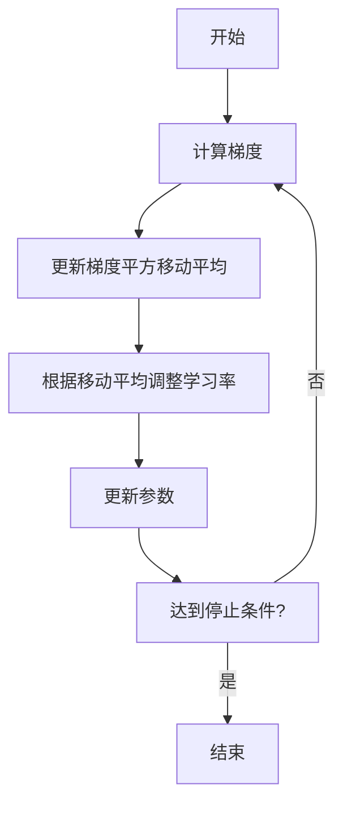

# RMSProp优化器在神经网络中的实践

## 1.背景介绍

### 1.1 神经网络优化的重要性

在深度学习和神经网络的领域中,优化算法扮演着至关重要的角色。训练神经网络模型通常涉及大量参数的调整,目标是最小化损失函数并获得最佳的模型性能。然而,这个过程并非一蹴而就,需要采用合适的优化算法来有效地更新模型参数。

### 1.2 传统优化算法的局限性

早期的优化算法如随机梯度下降(SGD)虽然简单直观,但在实践中往往会遇到一些挑战,例如:

- 收敛速度缓慢
- 陷入鞍点或平坦区域
- 对学习率参数敏感

为了克服这些局限性,研究人员提出了一系列改进的优化算法,其中就包括本文要重点介绍的RMSProp优化器。

### 1.3 RMSProp优化器的背景

RMSProp(Root Mean Square Propagation)优化器最初由Geoffrey Hinton在他的课程中提出,并由Tijmen Tieleman和Geoffrey Hinton在2012年的论文中正式发表。它是一种无需手动调整学习率的自适应学习率优化算法,被广泛应用于训练深度神经网络。

## 2.核心概念与联系  

### 2.1 自适应学习率

传统的SGD算法使用固定的全局学习率,这可能导致以下问题:

- 学习率过大,可能会使损失函数在最小值附近剧烈振荡,难以收敛
- 学习率过小,可能会使优化过程变得极其缓慢

RMSProp通过自适应调整每个参数的学习率,从而提高了优化效率。它根据梯度的指数加权移动平均值来动态调整学习率,使得每个参数的更新步长都不尽相同。

### 2.2 指数加权移动平均

RMSProp算法的核心思想是利用指数加权移动平均来估计每个参数梯度的平方根。具体来说,对于每个参数$w_i$,我们维护一个相应的梯度平方的指数加权移动平均值$v_i$:

$$v_i = \beta v_{i-1} + (1 - \beta)(\nabla_i w)^2$$

其中$\beta$是一个衰减率超参数,通常取值接近于1(如0.9)。$\nabla_i w$表示参数$w_i$的梯度。

通过这种方式,我们可以获得一个平滑的梯度平方的估计值,用于调整每个参数的学习率。

### 2.3 参数更新规则  

在RMSProp中,参数的更新规则如下:

$$w_i \leftarrow w_i - \frac{\eta}{\sqrt{v_i + \epsilon}} \nabla_i w$$

其中$\eta$是全局学习率,而$\frac{1}{\sqrt{v_i + \epsilon}}$则是自适应的参数特定学习率。$\epsilon$是一个很小的常数,用于避免分母为0的情况。

这种更新方式使得每个参数的更新步长都不尽相同,取决于其梯度平方的指数加权移动平均值。对于那些梯度较大的参数,其更新步长会相对较小,而对于梯度较小的参数,其更新步长会相对较大。这有助于加速收敛并避免陷入平坦或鞍点区域。



上图展示了RMSProp优化器的工作流程。首先计算当前参数的梯度,然后根据梯度平方更新指数加权移动平均值。接下来,使用该移动平均值调整当前参数的自适应学习率。最后,使用调整后的学习率更新参数值。该过程重复进行,直到达到预设的停止条件(如最大迭代次数或损失函数收敛)。

## 3.核心算法原理具体操作步骤

RMSProp算法的具体操作步骤如下:

1. 初始化参数$w$和梯度平方的指数加权移动平均值$v$(通常全部初始化为0)
2. 对于每一次迭代:
    - 计算当前参数$w$对应的梯度$\nabla w$
    - 更新梯度平方的指数加权移动平均值:
        $$v \leftarrow \beta v + (1 - \beta)(\nabla w)^2$$
    - 计算当前参数的自适应学习率:
        $$\text{lr} = \frac{\eta}{\sqrt{v + \epsilon}}$$
    - 使用自适应学习率更新参数:
        $$w \leftarrow w - \text{lr} \odot \nabla w$$
3. 重复步骤2,直到达到停止条件

其中,$\beta$是指数加权移动平均的衰减率超参数,通常取值接近1(如0.9)。$\eta$是初始的全局学习率,而$\epsilon$是一个很小的正数,用于避免分母为0。$\odot$表示按元素相乘的运算。

需要注意的是,RMSProp算法为每个参数维护一个独立的梯度平方移动平均值$v_i$,因此参数的更新是基于各自的自适应学习率进行的。这使得算法能够很好地处理参数的梯度范围差异较大的情况。

## 4.数学模型和公式详细讲解举例说明

为了更好地理解RMSProp算法,让我们通过一个具体的例子来解释其中的数学模型和公式。

假设我们有一个简单的线性回归模型:

$$y = wx + b$$

其中$w$和$b$分别是模型的权重和偏置参数。我们的目标是通过训练数据来学习最优的$w$和$b$,使得模型能够很好地拟合数据。

对于给定的训练数据集$\{(x_i, y_i)\}_{i=1}^N$,我们定义损失函数为均方误差:

$$J(w, b) = \frac{1}{N}\sum_{i=1}^N (y_i - (wx_i + b))^2$$

我们需要最小化这个损失函数,以获得最优的模型参数。为此,我们可以使用RMSProp优化算法。

首先,我们计算损失函数$J$关于$w$和$b$的梯度:

$$\begin{aligned}
\frac{\partial J}{\partial w} &= \frac{2}{N}\sum_{i=1}^N (wx_i + b - y_i)x_i\\
\frac{\partial J}{\partial b} &= \frac{2}{N}\sum_{i=1}^N (wx_i + b - y_i)
\end{aligned}$$

接下来,我们初始化参数$w$和$b$,以及它们对应的梯度平方移动平均值$v_w$和$v_b$(通常全部初始化为0)。

在每一次迭代中,我们执行以下步骤:

1. 计算当前参数$w$和$b$对应的梯度$\nabla_w J$和$\nabla_b J$
2. 更新梯度平方的指数加权移动平均值:
    $$\begin{aligned}
    v_w &\leftarrow \beta v_w + (1 - \beta)(\nabla_w J)^2\\
    v_b &\leftarrow \beta v_b + (1 - \beta)(\nabla_b J)^2
    \end{aligned}$$
3. 计算当前参数的自适应学习率:
    $$\begin{aligned}
    \text{lr}_w &= \frac{\eta}{\sqrt{v_w + \epsilon}}\\
    \text{lr}_b &= \frac{\eta}{\sqrt{v_b + \epsilon}}
    \end{aligned}$$
4. 使用自适应学习率更新参数:
    $$\begin{aligned}
    w &\leftarrow w - \text{lr}_w \cdot \nabla_w J\\
    b &\leftarrow b - \text{lr}_b \cdot \nabla_b J
    \end{aligned}$$

通过不断重复这个过程,我们可以逐步调整$w$和$b$的值,使得损失函数$J$不断减小,直到达到收敛或满足其他停止条件。

需要注意的是,在实际应用中,我们通常会对训练数据进行小批量(mini-batch)划分,并在每个小批量上计算梯度和更新参数。这种做法可以提高计算效率,并引入一定的噪声,有助于避免陷入局部最小值。

通过上述例子,我们可以看到RMSProp算法如何利用梯度平方的指数加权移动平均值来动态调整每个参数的学习率,从而加速优化过程并提高收敛性能。

## 5.项目实践:代码实例和详细解释说明

为了更好地理解RMSProp优化器在实践中的应用,让我们来看一个使用Python和PyTorch实现的示例项目。在这个项目中,我们将构建一个简单的前馈神经网络,并使用RMSProp优化器来训练它对手写数字进行分类。

### 5.1 导入所需库

```python
import torch
import torch.nn as nn
import torch.optim as optim
from torchvision import datasets, transforms
```

我们导入了PyTorch及其相关模块,用于构建神经网络模型、加载数据集和实现优化器。

### 5.2 加载数据集

```python
# 加载MNIST手写数字数据集
train_data = datasets.MNIST(root='data', train=True, download=True, transform=transforms.ToTensor())
test_data = datasets.MNIST(root='data', train=False, download=True, transform=transforms.ToTensor())

# 创建数据加载器
batch_size = 64
train_loader = torch.utils.data.DataLoader(train_data, batch_size=batch_size, shuffle=True)
test_loader = torch.utils.data.DataLoader(test_data, batch_size=batch_size, shuffle=False)
```

我们加载了著名的MNIST手写数字数据集,并将其转换为PyTorch张量格式。然后,我们创建了数据加载器,用于在训练和测试过程中按批次获取数据。

### 5.3 定义神经网络模型

```python
# 定义神经网络模型
class Net(nn.Module):
    def __init__(self):
        super(Net, self).__init__()
        self.fc1 = nn.Linear(28 * 28, 512)
        self.fc2 = nn.Linear(512, 256)
        self.fc3 = nn.Linear(256, 10)

    def forward(self, x):
        x = x.view(-1, 28 * 28)
        x = torch.relu(self.fc1(x))
        x = torch.relu(self.fc2(x))
        x = self.fc3(x)
        return x

model = Net()
```

我们定义了一个简单的前馈神经网络,包含两个隐藏层和一个输出层。该网络将输入的手写数字图像(28x28像素)展平为一维向量,并通过全连接层进行处理,最终输出一个长度为10的向量,表示该图像属于10个数字类别中的哪一个。

### 5.4 设置损失函数和优化器

```python
# 设置损失函数和优化器
criterion = nn.CrossEntropyLoss()
optimizer = optim.RMSprop(model.parameters(), lr=0.001, alpha=0.9)
```

我们使用交叉熵作为损失函数,并实例化RMSProp优化器。在创建优化器时,我们传递了模型的参数,设置了初始学习率为0.001,以及RMSProp的衰减率参数alpha为0.9。

### 5.5 训练模型

```python
# 训练模型
num_epochs = 10
for epoch in range(num_epochs):
    running_loss = 0.0
    for i, data in enumerate(train_loader, 0):
        inputs, labels = data
        optimizer.zero_grad()
        outputs = model(inputs)
        loss = criterion(outputs, labels)
        loss.backward()
        optimizer.step()
        running_loss += loss.item()
        if i % 100 == 99:
            print('[%d, %5d] loss: %.3f' % (epoch + 1, i + 1, running_loss / 100))
            running_loss = 0.0
```

我们开始训练模型。在每个epoch中,我们遍历训练数据加载器,获取一个批次的输入数据和标签。然后,我们执行以下步骤:

1. 将优化器的梯度缓冲区清零
2. 通过模型进行前向传播,获得输出
3. 计算输出与标签之间的损失
4. 反向传播计算梯度
5. 使用RMSProp优化器更新模型参数

在每个epoch结束时,我们打印出当前epoch的平均损失值。

### 5.6