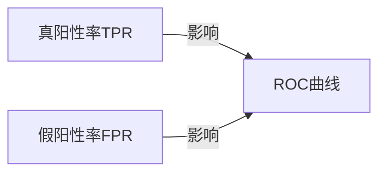

## 1.背景介绍

ROC曲线是一种被广泛应用于机器学习和数据挖掘领域的工具，用于评估分类模型的性能。ROC是Receiver Operating Characteristic的缩写，中文名为"接收者操作特性"。它的起源可以追溯到二战时期，当时用于电波信号分析。现在，ROC曲线已经成为了一种标准的工具，被广泛应用于各种场景，包括医学诊断、信用评分、人工智能等领域。

## 2.核心概念与联系

ROC曲线的横坐标是假阳性率（False Positive Rate, FPR），纵坐标是真阳性率（True Positive Rate, TPR）。在理想情况下，我们希望模型的真阳性率尽可能高，假阳性率尽可能低，也就是ROC曲线尽可能的靠近左上角。



## 3.核心算法原理具体操作步骤

要绘制ROC曲线，我们需要以下步骤：

1. 对每一个观察样本计算其为正例的概率。
2. 根据概率值对所有样本排序。
3. 从高到低设定阈值，对于每一个阈值，我们都可以计算出一对FPR和TPR值，然后在ROC空间中描点。
4. 将所有的点连成线，就得到了ROC曲线。曲线下方的面积就是AUC（Area Under Curve）。

## 4.数学模型和公式详细讲解举例说明

真阳性率（TPR）和假阳性率（FPR）的计算公式如下：

$$
TPR = \frac{TP}{TP+FN}
$$

$$
FPR = \frac{FP}{FP+TN}
$$

其中，TP是真阳性数量，FN是假阴性数量，FP是假阳性数量，TN是真阴性数量。

## 5.项目实践：代码实例和详细解释说明

下面我们用Python的sklearn库来演示如何绘制ROC曲线：

```python
from sklearn import metrics
from sklearn.datasets import make_classification
from sklearn.model_selection import train_test_split
from sklearn.linear_model import LogisticRegression
import matplotlib.pyplot as plt

# 生成数据
X, y = make_classification(n_samples=1000)
X_train, X_test, y_train, y_test = train_test_split(X, y, test_size=0.3)

# 训练模型
clf = LogisticRegression()
clf.fit(X_train, y_train)

# 预测概率
y_pred_proba = clf.predict_proba(X_test)[:,1]

# 计算ROC曲线
fpr, tpr, _ = metrics.roc_curve(y_test, y_pred_proba)

# 绘制ROC曲线
plt.plot(fpr, tpr)
plt.xlabel('False Positive Rate')
plt.ylabel('True Positive Rate')
plt.title('ROC Curve')
plt.show()
```

## 6.实际应用场景

ROC曲线在许多领域都有应用，例如：

- 在医学领域，ROC曲线常用于评估诊断测试的准确性。
- 在信用评分领域，ROC曲线用于衡量评分模型的质量。
- 在机器学习领域，ROC曲线是评估分类模型性能的常用工具。

## 7.工具和资源推荐

- Python的sklearn库提供了计算ROC曲线的工具。
- R语言的pROC包也是一个很好的工具。
- 对于深入理解ROC曲线，推荐阅读Tom Fawcett的论文"An introduction to ROC analysis"。

## 8.总结：未来发展趋势与挑战

随着大数据和人工智能的发展，ROC曲线作为一种评估工具，其重要性将越来越高。然而，也存在一些挑战，例如如何解决样本不平衡问题，如何对多分类问题进行ROC分析等。

## 9.附录：常见问题与解答

1. **ROC曲线和PR曲线有什么区别？**

PR曲线（Precision-Recall Curve）是另一种常用的评估工具，它的横坐标是召回率（Recall），纵坐标是精确率（Precision）。在正负样本不平衡的情况下，PR曲线通常比ROC曲线更有用。

2. **AUC值代表什么？**

AUC（Area Under Curve）是ROC曲线下的面积，它可以用来衡量分类器的整体性能。AUC值越大，表示分类器的性能越好。

作者：禅与计算机程序设计艺术 / Zen and the Art of Computer Programming