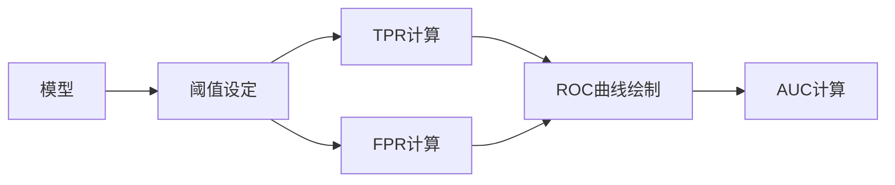

## 1.背景介绍

在生物信息学领域，ROC曲线（Receiver Operating Characteristic curve）是一种常用的评估模型性能的工具。ROC曲线源于二战时期的雷达信号处理技术，后来在医学、机器学习等领域得到广泛应用。ROC曲线可以直观地展示出模型在不同阈值下的性能，包括灵敏度和特异性等指标。

## 2.核心概念与联系

ROC曲线的横轴是“假阳性率”（False Positive Rate，FPR），纵轴是“真阳性率”（True Positive Rate，TPR）。FPR表示的是所有实际为负的样本中，被错误地判断为阳性的比例；而TPR表示的是所有实际为阳的样本中，被正确地判断为阳性的比例。ROC曲线下的面积（Area Under Curve，AUC）可以用来衡量模型的整体性能。



## 3.核心算法原理具体操作步骤

ROC曲线的绘制过程如下：

1. 对于每一个阈值，计算出对应的TPR和FPR；
2. 在以FPR为横轴、TPR为纵轴的坐标系中，以阈值为参数，绘制出ROC曲线；
3. 计算ROC曲线下的面积，即AUC。

## 4.数学模型和公式详细讲解举例说明

假设我们有$n$个样本，其中有$p$个阳性样本，$n-p$个阴性样本。设定一个阈值$t$，我们可以得到以下的四个量：

- 真阳性（True Positive，TP）：预测为阳性，实际也为阳性的样本数；
- 假阳性（False Positive，FP）：预测为阳性，实际为阴性的样本数；
- 真阴性（True Negative，TN）：预测为阴性，实际也为阴性的样本数；
- 假阴性（False Negative，FN）：预测为阴性，实际为阳性的样本数。

TPR和FPR的计算公式如下：

$$
TPR = \frac{TP}{TP+FN}
$$

$$
FPR = \frac{FP}{FP+TN}
$$

## 5.项目实践：代码实例和详细解释说明

在Python中，我们可以使用`sklearn.metrics`模块中的`roc_curve`和`auc`函数来绘制ROC曲线和计算AUC。

```python
from sklearn.metrics import roc_curve, auc

# 计算TPR和FPR
fpr, tpr, thresholds = roc_curve(y_true, y_score)

# 计算AUC
roc_auc = auc(fpr, tpr)

# 绘制ROC曲线
plt.figure()
plt.plot(fpr, tpr, color='darkorange', lw=2, label='ROC curve (area = %0.2f)' % roc_auc)
plt.plot([0, 1], [0, 1], color='navy', lw=2, linestyle='--')
plt.xlim([0.0, 1.0])
plt.ylim([0.0, 1.05])
plt.xlabel('False Positive Rate')
plt.ylabel('True Positive Rate')
plt.title('Receiver Operating Characteristic Example')
plt.legend(loc="lower right")
plt.show()
```

在这段代码中，`y_true`是实际的标签，`y_score`是模型给出的预测得分。

## 6.实际应用场景

在生物信息学中，ROC曲线常用于评估基因表达量、蛋白质互作等预测模型的性能。例如，我们可以通过ROC曲线来比较不同的基因表达量预测算法，或者评估蛋白质互作预测的准确性。

## 7.工具和资源推荐

- Python：Python是一种广泛用于科学计算的语言，其生态系统中有许多用于生物信息学的库，如BioPython、scikit-learn等。
- R：R是一种专门用于统计分析的语言，其生态系统中有许多用于生物信息学的包，如Bioconductor、pROC等。

## 8.总结：未来发展趋势与挑战

随着生物信息学的发展，我们需要处理的数据量越来越大，模型也越来越复杂。如何准确地评估模型的性能，是我们面临的一个重要挑战。ROC曲线作为一种简单而直观的工具，将在未来的生物信息学研究中发挥重要作用。

## 9.附录：常见问题与解答

Q: ROC曲线的AUC值是什么意思？

A: AUC值表示的是ROC曲线下的面积，取值在0到1之间。AUC值越接近1，表示模型的性能越好；AUC值越接近0.5，表示模型的性能越差。

Q: ROC曲线可以用于多分类问题吗？

A: ROC曲线本身只适用于二分类问题。对于多分类问题，我们可以将其转化为多个二分类问题，然后对每个二分类问题绘制ROC曲线，最后将这些ROC曲线综合起来评估模型的性能。

作者：禅与计算机程序设计艺术 / Zen and the Art of Computer Programming