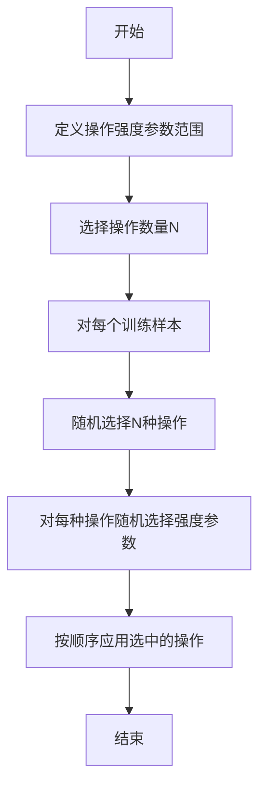

## 1.背景介绍

在深度学习的世界里，数据是至关重要的。然而，对于某些任务，我们可能并没有足够的数据来训练我们的模型。这就是数据增强技术派上用场的地方。数据增强是一种通过在原始数据上应用各种变换来生成新的训练样本的技术。这种方法可以有效地扩大数据集，并有助于提高模型的泛化能力。

然而，传统的数据增强方法，如随机裁剪、旋转、缩放等，往往需要人工设定参数，这使得过程变得既繁琐又高度依赖于经验。随着深度学习的发展，研究人员开始探索自动化的数据增强方法。在这个背景下，Google的研究人员提出了一种名为RandAugment的新方法，它通过随机选择和应用一系列数据增强操作，极大地简化了数据增强过程。

## 2.核心概念与联系

RandAugment的核心思想是：通过随机选择和应用一系列预定义的数据增强操作，来生成新的训练样本。这些操作包括但不限于：裁剪、旋转、色彩变换、噪声注入等。为了控制操作的强度，RandAugment为每种操作定义了一个强度参数，这个参数也是随机选择的。

从这个描述中，我们可以看出，RandAugment的核心概念包括**随机性**和**操作强度**。随机性是通过随机选择操作和强度参数来实现的，这样可以避免人工选择参数的繁琐和主观性。操作强度则是用来控制数据增强操作对原始图像的影响程度的，这样可以避免操作过于剧烈，导致生成的新样本与原始样本差异过大。

## 3.核心算法原理具体操作步骤

RandAugment的算法步骤如下：

1. 首先，为每种预定义的数据增强操作定义一个强度参数范围。这个范围是一个离散的整数集合，例如{1, 2, ..., 10}。

2. 然后，选择一个操作数量N。这个N决定了每个训练样本要应用多少种数据增强操作。

3. 对于每个训练样本，首先随机选择N种数据增强操作。然后，对于每种选中的操作，随机选择一个强度参数。最后，按照选中的顺序，依次应用这些操作。

以下是一个RandAugment的Mermaid流程图：



## 4.数学模型和公式详细讲解举例说明

虽然RandAugment的核心是随机性，但我们可以用概率论的语言来描述它。假设我们有M种预定义的数据增强操作，每种操作有K个可能的强度参数。那么，对于每个训练样本，我们要从M种操作中随机选择N种，这就是一个组合问题，其可能的结果总数为$C_M^N$。

对于每种选中的操作，我们要从K个强度参数中随机选择一个，这就是一个排列问题，其可能的结果总数为$K^N$。

因此，对于每个训练样本，RandAugment的所有可能结果总数为$C_M^N \times K^N$。这个数值非常大，这就是RandAugment能有效扩大数据集的原因。

## 5.项目实践：代码实例和详细解释说明

以下是一个使用Python和TensorFlow实现RandAugment的简单示例：

```python
import tensorflow as tf
from tensorflow.keras.layers.experimental import preprocessing

# 定义数据增强操作和强度参数范围
augmentations = [
    preprocessing.RandomFlip("horizontal_and_vertical"),
    preprocessing.RandomRotation(0.2),
    preprocessing.RandomContrast(0.5),
]
strengths = [1, 2, 3, 4, 5]

# 选择操作数量
N = 2

# 对每个训练样本应用RandAugment
def apply_randaugment(image, label):
    for _ in range(N):
        # 随机选择一种操作和一个强度参数
        aug = tf.random.choice(augmentations)
        strength = tf.random.choice(strengths)
        # 将选中的操作应用到图像上
        image = aug(image, training=True)
    return image, label
```

## 6.实际应用场景

RandAugment在各种需要数据增强的深度学习任务中都有应用，例如图像分类、物体检测、语义分割等。特别是在数据量较小的任务中，RandAugment可以有效地扩大数据集，提高模型的泛化能力。

## 7.工具和资源推荐

对于想要使用RandAugment的读者，我推荐以下工具和资源：

- TensorFlow和PyTorch：这两个是目前最流行的深度学习框架，都提供了丰富的数据增强操作。

- albumentations：这是一个专门的数据增强库，提供了更多的数据增强操作，包括一些特殊的操作，如ElasticTransform、GridDistortion等。

- RandAugment的原始论文：这篇论文详细描述了RandAugment的设计思想和实验结果，对于想要深入理解RandAugment的读者是非常有价值的资源。

## 8.总结：未来发展趋势与挑战

RandAugment作为一种自动化的数据增强方法，无疑开启了数据增强的新纪元。然而，它仍然面临一些挑战，例如如何选择最优的操作数量N，如何定义操作强度参数范围等。我相信，随着深度学习的发展，我们会看到更多的自动化数据增强方法的出现，它们将更加智能、灵活，更好地服务于我们的深度学习项目。

## 9.附录：常见问题与解答

Q: RandAugment是否适用于所有类型的数据？
A: 不一定。RandAugment主要是针对图像数据设计的，对于其他类型的数据，如文本、音频等，可能需要其他的数据增强方法。

Q: RandAugment会不会导致过拟合？
A: 不会。反而，数据增强是一种有效的防止过拟合的方法，因为它可以扩大数据集，提高模型的泛化能力。

作者：禅与计算机程序设计艺术 / Zen and the Art of Computer Programming