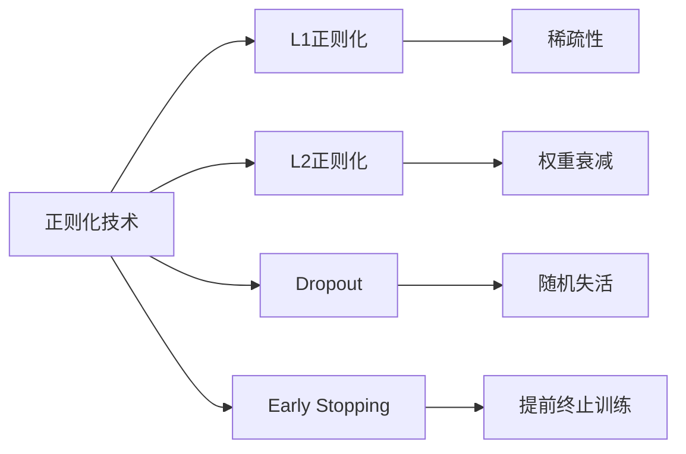

# Regularization Techniques 原理与代码实战案例讲解

## 1. 背景介绍

在机器学习和深度学习中,我们经常面临模型过拟合(Overfitting)的问题。过拟合是指模型在训练数据上表现很好,但在新的、未见过的数据上泛化能力很差。造成过拟合的主要原因是模型过于复杂,学习到了训练数据中的噪声。

为了解决过拟合问题,人们提出了各种正则化(Regularization)技术。正则化是一种通过在损失函数中引入额外项来约束模型复杂度的方法。它能够有效地降低模型的方差,提高模型的泛化能力。

本文将深入探讨几种常见的正则化技术,包括L1正则化、L2正则化、Dropout、Early Stopping等。我们不仅会介绍它们的基本原理,还会通过数学推导、代码实例等方式加深理解。此外,本文还会讨论这些正则化技术在实际应用中的场景和注意事项。

### 1.1 过拟合问题
#### 1.1.1 过拟合的定义
#### 1.1.2 过拟合的危害
#### 1.1.3 过拟合的成因

### 1.2 正则化技术概述 
#### 1.2.1 正则化的定义
#### 1.2.2 正则化的作用
#### 1.2.3 常见的正则化技术

## 2. 核心概念与联系

在深入探讨各种正则化技术之前,我们先来了解一些核心概念:

- 损失函数(Loss Function):衡量模型预测值与真实值之间差异的函数。
- 经验风险(Empirical Risk):模型在训练集上的平均损失。
- 结构风险(Structural Risk):在经验风险的基础上,加上表征模型复杂度的正则化项。
- 偏差(Bias):模型预测值与真实值之间的差异。偏差越大,欠拟合的可能性越大。  
- 方差(Variance):模型预测值的变化范围。方差越大,过拟合的可能性越大。

正则化技术通过在损失函数中引入正则化项,在经验风险和结构风险之间取得平衡,从而降低模型的方差,提高泛化能力。下图展示了几种常见正则化技术之间的联系:



### 2.1 损失函数与风险
#### 2.1.1 损失函数
#### 2.1.2 经验风险
#### 2.1.3 结构风险

### 2.2 偏差与方差
#### 2.2.1 偏差
#### 2.2.2 方差
#### 2.2.3 偏差-方差困境

### 2.3 正则化技术之间的联系
#### 2.3.1 L1正则化与稀疏性
#### 2.3.2 L2正则化与权重衰减
#### 2.3.3 Dropout与随机失活
#### 2.3.4 Early Stopping与提前终止训练

## 3. 核心算法原理具体操作步骤

### 3.1 L1正则化
#### 3.1.1 L1正则化的定义
L1正则化,也称为Lasso正则化,通过在损失函数中加入权重参数的绝对值之和,来控制模型的复杂度。数学表达式如下:

$$J(\theta) = J_0(\theta) + \lambda \sum_{i=1}^n |w_i|$$

其中,$J_0(\theta)$表示原始的损失函数,$\lambda$表示正则化强度,$w_i$表示模型的权重参数。

#### 3.1.2 L1正则化的特点
L1正则化的一个重要特点是能够产生稀疏的权重矩阵,即许多权重参数被压缩为0。这种稀疏性可以用于特征选择,帮助我们识别出重要的特征。

#### 3.1.3 L1正则化的优化算法
求解L1正则化问题的常用优化算法有:
- 坐标轴下降法(Coordinate Descent) 
- 最小角回归(Least Angle Regression,LARS)
- 近端梯度下降法(Proximal Gradient Descent)

### 3.2 L2正则化
#### 3.2.1 L2正则化的定义
L2正则化,也称为Ridge正则化或权重衰减,通过在损失函数中加入权重参数的平方和,来控制模型的复杂度。数学表达式如下:

$$J(\theta) = J_0(\theta) + \frac{\lambda}{2} \sum_{i=1}^n w_i^2$$

其中,$J_0(\theta)$表示原始的损失函数,$\lambda$表示正则化强度,$w_i$表示模型的权重参数。

#### 3.2.2 L2正则化的特点
L2正则化的特点是能够使权重参数均匀地趋向于0,但不会产生稀疏性。它通过约束权重参数的大小,降低模型的复杂度。

#### 3.2.3 L2正则化的优化算法
求解L2正则化问题的常用优化算法有:
- 梯度下降法(Gradient Descent)
- 共轭梯度法(Conjugate Gradient)
- 最小二乘法(Least Squares)

### 3.3 Dropout
#### 3.3.1 Dropout的定义
Dropout是一种在训练过程中随机失活神经元的正则化技术。对于每个训练样本,以一定概率$p$将神经网络中的部分神经元暂时失活,其输出置为0。

#### 3.3.2 Dropout的特点
Dropout通过随机失活神经元,减少了神经元之间的相互适应,使得模型更加鲁棒。它在一定程度上相当于对多个子模型进行了集成,提高了泛化能力。

#### 3.3.3 Dropout的实现步骤
Dropout的实现步骤如下:
1. 在训练过程中,对于每个神经元,以概率$p$将其暂时失活,输出置为0。
2. 对于未失活的神经元,将其输出除以$1-p$,以保持输出的期望值不变。
3. 在测试过程中,不进行随机失活,但将所有神经元的输出乘以$1-p$,以匹配训练时的期望输出。

### 3.4 Early Stopping
#### 3.4.1 Early Stopping的定义
Early Stopping是一种通过提前终止训练来避免过拟合的正则化技术。它通过监控模型在验证集上的性能,在性能开始下降时停止训练。

#### 3.4.2 Early Stopping的特点
Early Stopping能够有效地控制模型的复杂度,防止模型过度拟合训练数据。它不需要对损失函数进行修改,实现简单。

#### 3.4.3 Early Stopping的实现步骤
Early Stopping的实现步骤如下:
1. 将数据集划分为训练集、验证集和测试集。
2. 在每个epoch结束后,评估模型在验证集上的性能。
3. 如果模型在验证集上的性能连续几个epoch没有提升,则停止训练。
4. 返回在验证集上性能最好的模型参数。

## 4. 数学模型和公式详细讲解举例说明

### 4.1 L1正则化的数学模型
L1正则化的目标函数可以表示为:

$$\min_w \frac{1}{n} \sum_{i=1}^n L(y_i, f(x_i; w)) + \lambda ||w||_1$$

其中,$L(y_i, f(x_i; w))$表示损失函数,$||w||_1$表示权重参数的L1范数,即$\sum_{i=1}^n |w_i|$。

举例说明:假设我们使用线性回归模型,损失函数为均方误差(MSE),则L1正则化的目标函数可以写为:

$$\min_w \frac{1}{n} \sum_{i=1}^n (y_i - w^Tx_i)^2 + \lambda \sum_{i=1}^n |w_i|$$

### 4.2 L2正则化的数学模型
L2正则化的目标函数可以表示为:

$$\min_w \frac{1}{n} \sum_{i=1}^n L(y_i, f(x_i; w)) + \frac{\lambda}{2} ||w||_2^2$$

其中,$L(y_i, f(x_i; w))$表示损失函数,$||w||_2^2$表示权重参数的L2范数的平方,即$\sum_{i=1}^n w_i^2$。

举例说明:假设我们使用逻辑回归模型,损失函数为交叉熵损失,则L2正则化的目标函数可以写为:

$$\min_w -\frac{1}{n} \sum_{i=1}^n [y_i \log(\sigma(w^Tx_i)) + (1-y_i) \log(1-\sigma(w^Tx_i))] + \frac{\lambda}{2} \sum_{i=1}^n w_i^2$$

其中,$\sigma(z) = \frac{1}{1+e^{-z}}$表示sigmoid函数。

### 4.3 Dropout的数学模型
假设神经网络的第$l$层有$n_l$个神经元,激活函数为$f(\cdot)$,第$l-1$层的输出为$a^{(l-1)}$,权重矩阵为$W^{(l)}$,偏置向量为$b^{(l)}$。

在训练过程中,Dropout的数学模型可以表示为:

$$r^{(l)} \sim \text{Bernoulli}(p)$$
$$\tilde{a}^{(l)} = r^{(l)} * a^{(l-1)}$$
$$z^{(l)} = W^{(l)} \tilde{a}^{(l)} + b^{(l)}$$
$$a^{(l)} = f(z^{(l)})$$

其中,$r^{(l)}$是一个与$a^{(l-1)}$形状相同的0-1随机向量,服从概率为$p$的伯努利分布。$*$表示逐元素相乘。

在测试过程中,Dropout的数学模型可以表示为:

$$a^{(l)} = p \cdot f(W^{(l)} a^{(l-1)} + b^{(l)})$$

即将权重矩阵$W^{(l)}$乘以$p$,以匹配训练时的期望输出。

## 5. 项目实践：代码实例和详细解释说明

下面我们通过Python代码,演示如何在实际项目中应用这些正则化技术。

### 5.1 L1正则化的代码实例
使用scikit-learn库中的`Lasso`类,可以方便地实现L1正则化的线性回归模型:

```python
from sklearn.linear_model import Lasso

# 创建Lasso模型,设置正则化强度为0.1
lasso = Lasso(alpha=0.1)

# 训练模型
lasso.fit(X_train, y_train)

# 预测
y_pred = lasso.predict(X_test)
```

其中,`alpha`参数表示正则化强度$\lambda$。

### 5.2 L2正则化的代码实例
使用scikit-learn库中的`Ridge`类,可以方便地实现L2正则化的线性回归模型:

```python
from sklearn.linear_model import Ridge

# 创建Ridge模型,设置正则化强度为0.1
ridge = Ridge(alpha=0.1)

# 训练模型
ridge.fit(X_train, y_train)

# 预测
y_pred = ridge.predict(X_test)
```

同样,`alpha`参数表示正则化强度$\lambda$。

### 5.3 Dropout的代码实例
使用Keras库,可以方便地在神经网络中应用Dropout:

```python
from keras.models import Sequential
from keras.layers import Dense, Dropout

# 创建神经网络模型
model = Sequential()
model.add(Dense(512, activation='relu', input_dim=784))
model.add(Dropout(0.2))
model.add(Dense(512, activation='relu'))
model.add(Dropout(0.2))
model.add(Dense(10, activation='softmax'))

# 编译模型
model.compile(loss='categorical_crossentropy', optimizer='adam', metrics=['accuracy'])

# 训练模型
model.fit(X_train, y_train, epochs=20, batch_size=128, validation_data=(X_val, y_val))
```

在创建模型时,通过在`Dense`层之后添加`Dropout`层,指定随机失活的概率。

### 5.4 Early Stopping的代码实例
使用Keras库中的`EarlyStopping`回调函数,可以方便地实现Early Stopping:

```python
from keras.callbacks import EarlyStopping

# 创建Early Stopping回调函数
early_stopping = EarlyStopping(monitor='val_loss', patience=5, restore_best_weights=True)

# 训练模型
model.fit(