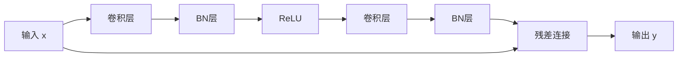

# ResNet：残差连接，突破深度学习的瓶颈

## 1.背景介绍

### 1.1 深度神经网络的发展历程

随着数据和计算能力的不断增长,深度神经网络在计算机视觉、自然语言处理等领域取得了令人瞩目的成就。然而,训练深度网络并非一蹴而就,它面临着一些挑战和瓶颈。

### 1.2 深度网络训练的挑战

#### 1.2.1 梯度消失/爆炸

在训练深度神经网络时,由于反向传播过程中的链式法则,梯度可能会在网络层与层之间传递时出现指数级的衰减或爆炸,从而导致训练无法正常进行。

#### 1.2.2 退化问题

理论上,深层神经网络应该比浅层网络具有更强的表达能力。但实际上,随着网络深度的增加,训练精度会出现饱和,甚至下降,这就是所谓的"退化问题"。

### 1.3 残差连接的提出

为了解决上述问题,2015年,微软研究院的何恺明等人在ImageNet图像识别挑战赛上提出了残差网络(ResNet)的概念,通过引入残差连接(Residual Connection),成功训练了超过100层的深度卷积神经网络,从而在ImageNet数据集上取得了当时最佳的识别精度。

## 2.核心概念与联系

### 2.1 残差连接的定义

残差连接的核心思想是,将输入直接传递到输出,同时学习输入与输出之间的残差映射关系,如下公式所示:

$$y = F(x, \{W_i\}) + x$$

其中,$x$和$y$分别表示输入和输出,$F(x, \{W_i\})$代表学习的残差映射。

### 2.2 为什么残差连接有效?

#### 2.2.1 缓解梯度消失/爆炸

由于残差连接提供了一条直接的通路,梯度可以直接从输出传递到输入,避免了梯度在深层网络中的衰减或爆炸。

#### 2.2.2 解决退化问题

如果残差映射$F(x, \{W_i\})=0$,那么$y=x$,即原始映射被直接拟合。因此,残差连接至少可以学习到一个恒等映射,从而避免了训练精度的退化。

### 2.3 残差块的构建

实际中,我们通过堆叠残差块来构建整个残差网络。一个基本的残差块如下所示:



上图中,残差块由两个卷积层组成,中间加入了BN(Batch Normalization)层和ReLU激活层。最后将输入$x$与卷积层的输出$F(x)$相加,得到残差块的输出$y$。

## 3.核心算法原理具体操作步骤

### 3.1 残差网络的构建过程

1) 确定输入图像的大小,一般为$224\times 224\times 3$。

2) 设计卷积层、池化层等基本模块。

3) 根据设计的基本模块,构建残差块。

4) 将多个残差块堆叠,构建整个残差网络。

5) 在网络末端加入全连接层,用于分类任务。

### 3.2 残差网络的前向传播

1) 输入图像$x$经过一个卷积层和最大池化层,得到初始特征图。

2) 将初始特征图输入到第一个残差块,经过残差连接得到第一个残差块的输出$y_1$。

3) 将$y_1$输入到第二个残差块,经过残差连接得到第二个残差块的输出$y_2$。

4) 重复上一步,直到最后一个残差块,得到最终的特征图$y_n$。

5) 将$y_n$输入到全连接层,得到分类结果。

### 3.3 残差网络的反向传播

1) 计算全连接层的损失函数,并反向传播到最后一个残差块。

2) 在每个残差块中,将梯度分成两部分:一部分通过残差连接直接传递到上一层;另一部分经过卷积层、BN层和ReLU层的反向传播。

3) 将两部分梯度相加,得到上一层的梯度。

4) 重复上一步,直到网络的输入层。

5) 根据梯度,更新网络的权重参数。

## 4.数学模型和公式详细讲解举例说明

### 4.1 残差块的数学表达式

设残差块的输入为$x$,输出为$y$,那么残差块可以表示为:

$$y = F(x, \{W_i\}) + x$$

其中,$F(x, \{W_i\})$是残差映射,由两个卷积层和其他操作(BN、ReLU等)组成。$\{W_i\}$表示这些层的权重参数集合。

在训练过程中,我们需要学习残差映射$F(x, \{W_i\})$,使得输出$y$能够很好地拟合期望的目标值。

### 4.2 梯度传播公式

假设损失函数为$L$,我们需要计算$\frac{\partial L}{\partial W_i}$,以更新权重参数$W_i$。根据链式法则,我们有:

$$\frac{\partial L}{\partial W_i} = \frac{\partial L}{\partial y} \cdot \frac{\partial y}{\partial W_i}$$

其中,$\frac{\partial L}{\partial y}$可以通过反向传播计算得到。对于$\frac{\partial y}{\partial W_i}$,由于残差连接的存在,它可以分解为两部分:

$$\frac{\partial y}{\partial W_i} = \frac{\partial F(x, \{W_i\})}{\partial W_i} + \frac{\partial x}{\partial W_i}$$

第一项$\frac{\partial F(x, \{W_i\})}{\partial W_i}$表示通过残差映射的梯度传播,可以按照普通神经网络的方式计算;第二项$\frac{\partial x}{\partial W_i}$表示通过残差连接的直接传播,它等于上一层的梯度。

通过这种分解,我们可以很好地解决梯度消失/爆炸的问题,因为梯度可以直接从输出传递到输入,而不需要经过太多层的传播。

### 4.3 举例说明

假设我们有一个简单的残差块,其中只包含一个卷积层,输入$x$和输出$y$的关系为:

$$y = \text{conv}(x, W) + x$$

其中,$\text{conv}(\cdot)$表示卷积操作。我们的目标是学习卷积核的权重$W$。

假设损失函数为$L$,根据上述公式,我们有:

$$\frac{\partial L}{\partial W} = \frac{\partial L}{\partial y} \cdot \left(\frac{\partial \text{conv}(x, W)}{\partial W} + \frac{\partial x}{\partial W}\right)$$

$$= \frac{\partial L}{\partial y} \cdot \frac{\partial \text{conv}(x, W)}{\partial W} + \frac{\partial L}{\partial y} \cdot \frac{\partial x}{\partial W}$$

第一项$\frac{\partial L}{\partial y} \cdot \frac{\partial \text{conv}(x, W)}{\partial W}$表示通过卷积层的梯度传播,可以按照普通卷积网络的方式计算。第二项$\frac{\partial L}{\partial y} \cdot \frac{\partial x}{\partial W}$表示通过残差连接的直接传播,由于$\frac{\partial x}{\partial W}=0$(输入$x$与权重$W$无关),因此这一项为0。

通过上述分解,我们可以看到,残差连接为梯度提供了一条直接的通路,避免了梯度在深层网络中的衰减或爆炸。

## 5.项目实践:代码实例和详细解释说明

以下是使用PyTorch实现残差网络的代码示例,包括残差块的定义和整个网络的构建。

### 5.1 定义残差块

```python
import torch
import torch.nn as nn

class ResidualBlock(nn.Module):
    def __init__(self, in_channels, out_channels, stride=1, downsample=None):
        super(ResidualBlock, self).__init__()
        self.conv1 = nn.Conv2d(in_channels, out_channels, kernel_size=3, stride=stride, padding=1, bias=False)
        self.bn1 = nn.BatchNorm2d(out_channels)
        self.relu = nn.ReLU(inplace=True)
        self.conv2 = nn.Conv2d(out_channels, out_channels, kernel_size=3, stride=1, padding=1, bias=False)
        self.bn2 = nn.BatchNorm2d(out_channels)
        self.downsample = downsample

    def forward(self, x):
        residual = x
        out = self.conv1(x)
        out = self.bn1(out)
        out = self.relu(out)
        out = self.conv2(out)
        out = self.bn2(out)
        if self.downsample is not None:
            residual = self.downsample(x)
        out += residual
        out = self.relu(out)
        return out
```

上述代码定义了一个残差块的类`ResidualBlock`。在`__init__`函数中,我们定义了两个卷积层(`conv1`和`conv2`)、两个批归一化层(`bn1`和`bn2`)以及ReLU激活函数。如果输入和输出通道数不同,我们还需要定义一个`downsample`层,用于调整通道数。

在`forward`函数中,我们实现了残差连接的操作。首先,我们保存输入`x`作为残差项。然后,我们将`x`输入到第一个卷积层,再经过批归一化层和ReLU激活层。接着,我们将输出输入到第二个卷积层,再经过批归一化层。如果需要调整通道数,我们使用`downsample`层对残差项进行处理。最后,我们将残差项与卷积层的输出相加,并通过ReLU激活函数得到残差块的输出。

### 5.2 构建残差网络

```python
class ResNet(nn.Module):
    def __init__(self, block, layers, num_classes=1000):
        super(ResNet, self).__init__()
        self.in_channels = 64
        self.conv1 = nn.Conv2d(3, 64, kernel_size=7, stride=2, padding=3, bias=False)
        self.bn1 = nn.BatchNorm2d(64)
        self.relu = nn.ReLU(inplace=True)
        self.maxpool = nn.MaxPool2d(kernel_size=3, stride=2, padding=1)
        self.layer1 = self._make_layer(block, 64, layers[0])
        self.layer2 = self._make_layer(block, 128, layers[1], stride=2)
        self.layer3 = self._make_layer(block, 256, layers[2], stride=2)
        self.layer4 = self._make_layer(block, 512, layers[3], stride=2)
        self.avgpool = nn.AvgPool2d(7, stride=1)
        self.fc = nn.Linear(512 * block.expansion, num_classes)

    def _make_layer(self, block, out_channels, blocks, stride=1):
        downsample = None
        if stride != 1 or self.in_channels != out_channels * block.expansion:
            downsample = nn.Sequential(
                nn.Conv2d(self.in_channels, out_channels * block.expansion, kernel_size=1, stride=stride, bias=False),
                nn.BatchNorm2d(out_channels * block.expansion)
            )
        layers = []
        layers.append(block(self.in_channels, out_channels, stride, downsample))
        self.in_channels = out_channels * block.expansion
        for i in range(1, blocks):
            layers.append(block(self.in_channels, out_channels))
        return nn.Sequential(*layers)

    def forward(self, x):
        x = self.conv1(x)
        x = self.bn1(x)
        x = self.relu(x)
        x = self.maxpool(x)
        x = self.layer1(x)
        x = self.layer2(x)
        x = self.layer3(x)
        x = self.layer4(x)
        x = self.avgpool(x)
        x = x.view(x.size(0), -1)
        x = self.fc(x)
        return x
```

上述代码定义了一个`ResNet`类,用于构建整个残差网络。在`__init__`函数中,我们定义了一个卷积层、一个批归一化层、一个ReLU激活层和一个最大池化层,用于处理输入图像。然后,我们使用`_make_layer`函数构建四个残差层(`layer1`、`layer2`、`layer3`和`layer4`)。最后,我们添加一个平均池化层和一个全连接层,用于