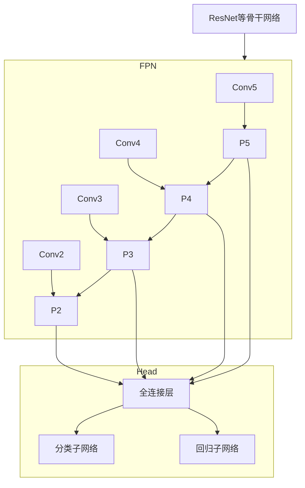

# RetinaNet原理与代码实例讲解

## 1.背景介绍

### 1.1 目标检测任务概述

目标检测是计算机视觉领域的一个核心任务,旨在自动定位图像或视频中的目标对象,并识别出它们的类别。它广泛应用于安防监控、自动驾驶、人脸识别等多个领域。

目标检测任务可以分为两个子任务:

1. **目标分类(Classification)**: 确定图像中存在哪些目标对象的类别。
2. **目标定位(Localization)**: 确定每个目标对象在图像中的位置,通常用一个边界框(bounding box)来表示。

### 1.2 目标检测发展历程

传统的目标检测方法主要基于手工设计的特征和经典机器学习模型,如HOG+SVM、Deformable Part Model等。这些方法需要大量的人工参与,且检测精度和速度均不理想。

近年来,随着深度学习技术的不断发展,基于深度卷积神经网络(CNN)的目标检测算法取得了长足的进步,大大提高了检测精度和速度。这些算法主要分为两大类:

1. **两阶段目标检测器**:先生成候选区域,再对每个区域进行分类和精修,代表算法有R-CNN系列。
2. **单阶段目标检测器**:直接对密集的先验边界框进行分类和回归,代表算法有YOLO、SSD等。

RetinaNet就是一种出色的单阶段目标检测器,在精度和速度上都有很好的表现。

## 2.核心概念与联系

### 2.1 RetinaNet概述

RetinaNet是一种高效且准确的单阶段密集目标检测网络,由Facebook AI研究院于2017年提出。它的主要创新点在于:

1. 使用**焦点损失(Focal Loss)**解决了传统单阶段检测器正负样本不平衡问题。
2. 利用**特征金字塔网络(Feature Pyramid Networks, FPN)** 融合多尺度特征,增强了小目标检测能力。

RetinaNet将目标检测任务分解为两个并行的子任务:

1. **分类子网络**:对每个锚框的目标类别进行二值分类(前景或背景)。
2. **回归子网络**:对每个锚框的目标边界框进行精细回归。

### 2.2 特征金字塔网络(FPN)

传统的特征提取网络(如VGG、ResNet等)通常只使用最后一个层的特征图进行后续处理,这在小目标检测时往往效果不佳。FPN的思想是利用不同层次的特征图,融合不同尺度的特征信息,提高小目标检测能力。

FPN通过自顶向下的横向连接和自底向上的垂直连接,构建了一个金字塔形的特征层次,每一层特征图都融合了其他层的上下文信息。这种多尺度特征融合的方式大大增强了网络对目标尺度变化的适应能力。

### 2.3 焦点损失(Focal Loss)

传统的交叉熵损失函数在正负样本极度不平衡时,往往会过于关注大量的负样本,而忽视了少量的正样本。这导致模型在训练时很难有效地学习正样本特征。

焦点损失通过降低大量简单负样本的权重,同时增加少量困难正样本的权重,从而使模型更加关注正样本和难分样本。它的计算公式如下:

$$
FL(p_t) = -(1-p_t)^\gamma \log(p_t)
$$

其中:
- $p_t$ 是模型预测的概率值
- $\gamma$ 是调节因子,用于平衡正负样本的权重
- $\gamma \geq 0$,当一个样本越难分类时,相应的权重就越大

通过引入焦点损失,RetinaNet有效解决了正负样本不平衡问题,大幅提高了检测精度。

## 3.核心算法原理具体操作步骤 

### 3.1 网络结构

RetinaNet的整体网络结构如下所示:



RetinaNet主要由以下几个部分组成:

1. **骨干网络(Backbone Network)**:用于提取图像特征,通常采用ResNet、VGGNet等经典CNN网络。
2. **特征金字塔网络(FPN)**: 融合多尺度特征,增强小目标检测能力。
3. **分类子网络(Classification Subnet)**: 对每个锚框的目标类别进行二值分类。
4. **回归子网络(Regression Subnet)**: 对每个锚框的目标边界框进行精细回归。

### 3.2 算法步骤

RetinaNet的工作流程可以概括为以下几个步骤:

1. **特征提取**:输入图像经过骨干网络提取特征,得到不同层次的特征图。
2. **构建FPN**:利用不同层次的特征图构建特征金字塔网络FPN,实现多尺度特征融合。
3. **生成锚框**:在FPN的每一层特征图上均匀采样一组锚框(anchor box),作为初始边界框。
4. **前景分类**:将锚框输入分类子网络,对每个锚框的目标类别进行二值分类(前景或背景)。
5. **边界框回归**:将锚框输入回归子网络,对每个锚框的目标边界框进行精细回归。
6. **非极大值抑制**:对分类和回归的结果进行非极大值抑制(NMS),去除重叠的冗余检测框。
7. **输出结果**:最终输出图像中检测到的目标类别、位置和置信度。

整个过程中,关键是利用FPN融合多尺度特征,并使用焦点损失函数解决正负样本不平衡问题。

## 4.数学模型和公式详细讲解举例说明

### 4.1 锚框生成

RetinaNet在不同尺度的特征图上均匀地采样一组锚框(anchor box),作为初始的边界框。每个锚框由4个参数定义:

$$
(x, y, w, h)
$$

其中:
- $(x, y)$ 是锚框的中心坐标
- $(w, h)$ 是锚框的宽度和高度

为了覆盖不同尺度和纵横比的目标,需要设置多个尺度和纵横比的锚框。一种常见的设置是:

$$
\begin{aligned}
&\text{尺度(scale)}: \{2^0, 2^{1/3}, 2^{2/3}\} \\
&\text{纵横比(aspect ratio)}: \{1/2, 1, 2\}
\end{aligned}
$$

这样就可以生成 $3 \times 3 = 9$ 种不同的锚框。

### 4.2 边界框回归

对于每个锚框,回归子网络需要预测4个参数:

$$
t_x, t_y, t_w, t_h
$$

这4个参数描述了锚框到真实边界框的转换关系:

$$
\begin{aligned}
b_x &= p_w a_x + t_x \\
b_y &= p_h a_y + t_y \\
b_w &= p_w e^{t_w} \\
b_h &= p_h e^{t_h}
\end{aligned}
$$

其中:
- $(b_x, b_y)$ 是真实边界框的中心坐标
- $(b_w, b_h)$ 是真实边界框的宽度和高度
- $(a_x, a_y, a_w, a_h)$ 是锚框的坐标和尺寸
- $(p_w, p_h)$ 是特征图相对于输入图像的尺度比例

通过这种参数化的方式,可以将边界框回归问题转化为一个相对简单的回归任务。

### 4.3 焦点损失函数

焦点损失函数是RetinaNet的核心创新之一,用于解决单阶段检测器中正负样本极度不平衡的问题。它的计算公式如下:

$$
FL(p_t) = -(1-p_t)^\gamma \log(p_t)
$$

其中:
- $p_t$ 是模型预测的概率值
- $\gamma \geq 0$ 是调节因子,用于平衡正负样本的权重

当一个样本越难分类时,相应的权重 $(1-p_t)^\gamma$ 就越大。这样可以自动地增加难分样本的权重,降低简单样本的权重,从而使模型更加关注正样本和难分样本。

在实践中,通常设置 $\gamma=2$,并将焦点损失函数与标准交叉熵损失函数相结合,得到最终的损失函数:

$$
Loss = \lambda_1 FL(p_t) + \lambda_2 L_{reg}(t, v)
$$

其中 $L_{reg}$ 是边界框回归的损失函数,如Smooth L1 Loss等; $\lambda_1$和$\lambda_2$是平衡两个任务的超参数。

## 5.项目实践:代码实例和详细解释说明

以下是使用PyTorch实现RetinaNet目标检测器的核心代码,并对关键部分进行详细解释说明。

### 5.1 RetinaNet网络结构

```python
import torch
import torch.nn as nn
import torchvision

class RetinaNet(nn.Module):
    def __init__(self, num_classes):
        super(RetinaNet, self).__init__()
        
        # 骨干网络
        self.backbone = torchvision.models.resnet50(pretrained=True)
        
        # FPN网络
        self.fpn = FPN(self.backbone.out_channels)
        
        # 分类和回归子网络
        self.cls_head = ClassificationHead(256, num_classes)
        self.reg_head = RegressionHead(256)
        
        # 锚框生成器
        self.anchor_gen = AnchorGenerator()
        
    def forward(self, images, targets=None):
        # 特征提取
        features = self.backbone(images)
        
        # 构建FPN
        fpn_features = self.fpn(features)
        
        # 生成锚框
        anchors = self.anchor_gen(images)
        
        # 前景分类和边界框回归
        cls_outputs = []
        reg_outputs = []
        for feature in fpn_features:
            cls_out, reg_out = self.cls_head(feature), self.reg_head(feature)
            cls_outputs.append(cls_out)
            reg_outputs.append(reg_out)
        
        # 损失计算(训练阶段)
        if targets is None:
            return cls_outputs, reg_outputs, anchors
        
        losses = compute_loss(cls_outputs, reg_outputs, anchors, targets)
        return losses
```

上述代码定义了RetinaNet的主要网络结构,包括:

1. **骨干网络(Backbone Network)**: 使用预训练的ResNet-50作为特征提取器。
2. **特征金字塔网络(FPN)**: 融合不同层次的特征图,实现多尺度特征融合。
3. **分类子网络(Classification Head)**: 对每个锚框的目标类别进行二值分类。
4. **回归子网络(Regression Head)**: 对每个锚框的目标边界框进行精细回归。
5. **锚框生成器(Anchor Generator)**: 在FPN的每一层特征图上均匀采样一组锚框。

在前向传播过程中,输入图像首先通过骨干网络提取特征,然后利用FPN融合多尺度特征。接着,在每个FPN层生成锚框,并分别通过分类子网络和回归子网络进行前景分类和边界框回归。在训练阶段,会计算分类和回归的损失函数。

### 5.2 FPN实现

```python
class FPN(nn.Module):
    def __init__(self, in_channels):
        super(FPN, self).__init__()
        
        # 自底向上路径
        self.inner_blocks = nn.ModuleList()
        for idx in range(len(in_channels) - 1, 0, -1):
            self.inner_blocks.append(nn.Conv2d(in_channels[idx], in_channels[idx - 1], 1, 1, 0))
        
        # 自顶向下路径
        self.layer_blocks = nn.ModuleList()
        for idx in range(len(in_channels) - 1):
            self.layer_blocks.append(nn.Conv2d(in_channels[idx], in_channels[idx + 1], 3, 2, 1))
        
        # 平滑层
        self.smooth = nn.Module