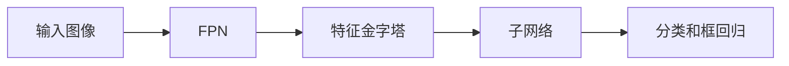

## 1.背景介绍

RetinaNet是一种基于深度学习的目标检测模型，由Facebook的研究人员于2017年提出。RetinaNet解决了在目标检测任务中常见的类别不平衡问题，即背景类别的样本数量远大于目标类别的样本数量。RetinaNet通过引入Focal Loss，有效地降低了在训练中对背景类别的过度关注，提高了对目标类别的检测准确性。

## 2.核心概念与联系

RetinaNet的主要组成部分包括两个网络：特征金字塔网络（Feature Pyramid Network, FPN）和子网络。FPN负责提取图像的特征，子网络负责目标分类和框回归。



## 3.核心算法原理具体操作步骤

RetinaNet的训练过程包括以下几个步骤：

1. 将输入图像送入FPN，得到一组多尺度的特征图。
2. 将特征图送入子网络，得到每个位置的目标分类得分和框回归参数。
3. 计算Focal Loss，反向传播更新网络参数。

## 4.数学模型和公式详细讲解举例说明

Focal Loss的定义如下：

$$
FL(p_t) = -\alpha_t(1-p_t)^\gamma\log(p_t)
$$

其中，$p_t$表示预测的目标分类得分，$\alpha_t$和$\gamma$是超参数，用来调节类别不平衡的影响。当$\gamma>0$时，Focal Loss对于易分类的样本（$p_t$接近1）给予较小的权重，对于难分类的样本（$p_t$接近0）给予较大的权重。

## 5.项目实践：代码实例和详细解释说明

以下是使用PyTorch实现RetinaNet的一个简单示例：

```python
import torch
import torch.nn as nn

class RetinaNet(nn.Module):
    def __init__(self, num_classes):
        super(RetinaNet, self).__init__()
        self.fpn = FPN()
        self.subnet = Subnet(num_classes)

    def forward(self, x):
        features = self.fpn(x)
        scores, deltas = self.subnet(features)
        return scores, deltas
```

## 6.实际应用场景

RetinaNet在各种目标检测任务中都有广泛的应用，例如行人检测、车辆检测、面部检测等。由于其对于类别不平衡的优秀处理能力，RetinaNet在含有大量背景和少量目标的场景中表现尤为出色。

## 7.工具和资源推荐

推荐使用PyTorch和Detectron2等深度学习框架和库来实现和训练RetinaNet。这些工具提供了丰富的功能和优化，可以大大简化开发过程。

## 8.总结：未来发展趋势与挑战

RetinaNet是一个强大的目标检测模型，但仍有一些挑战需要解决。例如，对于非常小或非常大的目标，RetinaNet的检测效果还有待提高。此外，如何进一步提高检测速度，使RetinaNet适用于实时目标检测，也是一个重要的研究方向。

## 9.附录：常见问题与解答

1. **问：RetinaNet适用于哪些任务？**
答：RetinaNet适用于各种目标检测任务，尤其是在类别不平衡的场景中表现优秀。

2. **问：如何选择Focal Loss的超参数？**
答：Focal Loss的超参数通常需要通过交叉验证来选择。一般来说，可以先固定一个参数，然后调整另一个参数，观察验证集上的性能变化，选择性能最好的参数值。

作者：禅与计算机程序设计艺术 / Zen and the Art of Computer Programming