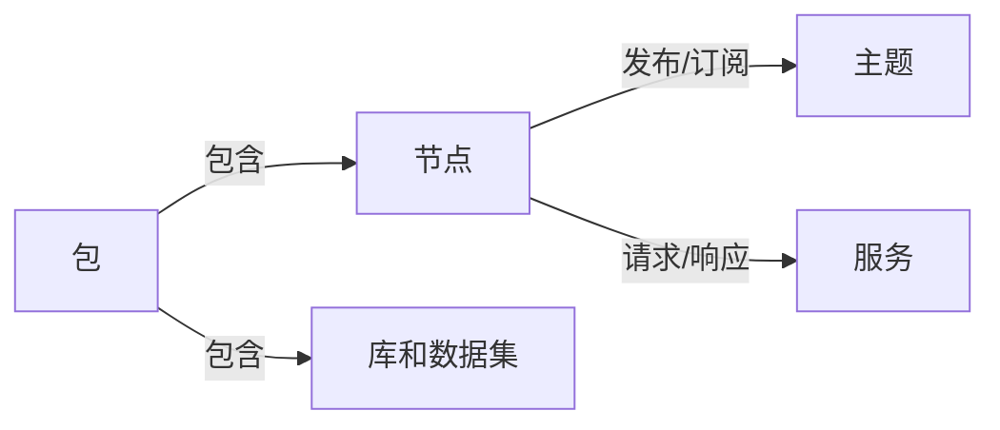
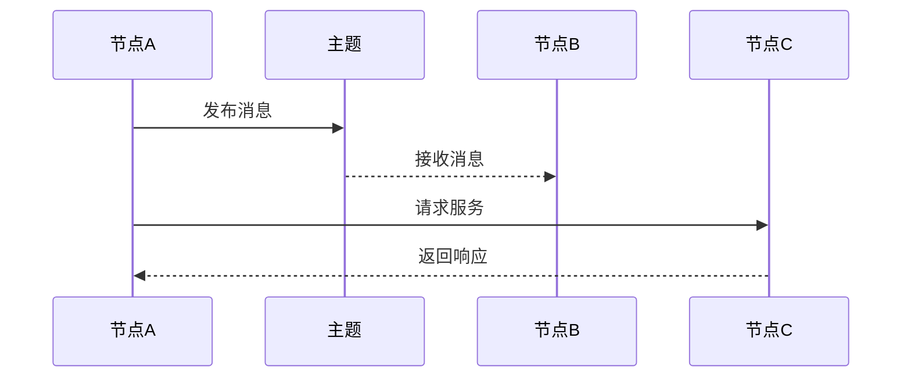

## 1.背景介绍

Robot Operating System (ROS)，即机器人操作系统，是一款开源的软件框架，用于构建机器人应用。自2007年由美国斯坦福大学和Willow Garage联合开发以来，ROS已经成为全球机器人研究和开发的重要工具。ROS提供了一套简单的服务调用、消息传递和包管理的工具，使得机器人的开发者能够更加专注于机器人的核心功能开发。

## 2.核心概念与联系

ROS的核心概念主要包括节点、消息、主题、服务和包。节点是ROS中的一个可执行文件，它可以发布或订阅主题，也可以提供或使用服务。消息是节点之间进行通信的数据结构，主题则是消息的载体，节点通过发布或订阅主题来进行消息的发送和接收。服务是ROS中的另一种通信方式，它是同步的，一个节点向另一个节点发送服务请求后，会等待对方的响应。包则是ROS的软件组织形式，一个包可以包含节点、库、数据集等资源。



## 3.核心算法原理具体操作步骤

ROS的核心算法原理主要包括消息传递和服务调用。在消息传递中，一个节点会向主题发布消息，所有订阅该主题的节点都能接收到这条消息。在服务调用中，一个节点会向另一个节点发送服务请求，对方节点在处理完请求后会返回响应。



## 4.数学模型和公式详细讲解举例说明

在ROS中，节点之间的通信主要通过消息传递和服务调用实现，这两种方式的核心都是数据的传输和处理。我们可以用信息熵来度量数据的不确定性。信息熵的公式为：

$$ H(X) = -\sum_{i=1}^{n} p(x_i) \log p(x_i) $$

其中，$X$是一个离散随机变量，$x_i$是$X$的一个可能取值，$p(x_i)$是$X$取值$x_i$的概率。在ROS中，节点之间的通信可以看作是数据的传输，而数据的不确定性就可以用信息熵来度量。

## 5.项目实践：代码实例和详细解释说明

下面是一个简单的ROS节点的Python代码实例，该节点会向主题`chatter`发布消息。

```python
import rospy
from std_msgs.msg import String

def talker():
    pub = rospy.Publisher('chatter', String, queue_size=10)
    rospy.init_node('talker', anonymous=True)
    rate = rospy.Rate(10) # 10hz
    while not rospy.is_shutdown():
        hello_str = "hello world %s" % rospy.get_time()
        rospy.loginfo(hello_str)
        pub.publish(hello_str)
        rate.sleep()

if __name__ == '__main__':
    try:
        talker()
    except rospy.ROSInterruptException:
        pass
```

在这段代码中，首先导入了`rospy`和`std_msgs.msg`模块。然后定义了一个`talker`函数，该函数会创建一个发布者，然后在一个循环中向主题`chatter`发布消息。最后，在主函数中调用了`talker`函数。

## 6.实际应用场景

ROS广泛应用于各种类型的机器人开发，包括但不限于服务机器人、工业机器人、无人驾驶车辆、无人机等。例如，ROS可以用于开发一款服务机器人，该机器人可以在餐厅中为顾客送餐。ROS也可以用于开发一款工业机器人，该机器人可以在工厂中进行自动化生产。

## 7.工具和资源推荐

如果你对ROS感兴趣，以下是一些推荐的学习资源和工具：

- ROS Wiki：ROS的官方文档，包含了大量的教程和API文档。
- ROS Answers：一个ROS的问答社区，你可以在这里找到许多ROS的问题和解答。
- ROS Development Studio：一个在线的ROS开发环境，你可以在这里直接编写和运行ROS代码。

## 8.总结：未来发展趋势与挑战

随着机器人技术的发展，ROS也在不断进化。ROS 2.0已经发布，它在ROS的基础上进行了许多改进，例如提供了更好的实时性、更强的安全性和更高的性能。然而，ROS也面临着一些挑战，例如如何更好地支持多机器人系统，如何更好地支持硬件抽象，如何更好地支持机器人的智能化等。

## 9.附录：常见问题与解答

Q: ROS适合哪些人学习？

A: ROS适合对机器人开发感兴趣的人学习，包括但不限于机器人工程师、软件工程师、研究人员等。

Q: ROS需要哪些基础知识？

A: 学习ROS需要一些编程基础，例如Python或C++。此外，一些基础的机器人知识和计算机科学知识（例如操作系统、网络通信）也会有帮助。

Q: ROS可以在哪些操作系统上运行？

A: ROS主要在Ubuntu上运行，但也支持其他的Linux发行版。ROS 2.0还支持Windows。

作者：禅与计算机程序设计艺术 / Zen and the Art of Computer Programming