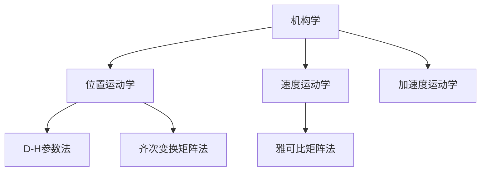
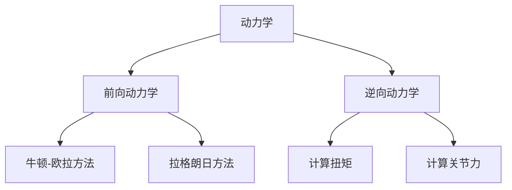
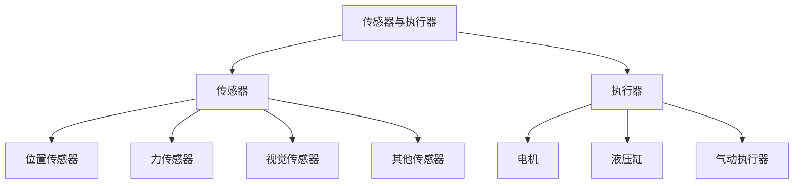
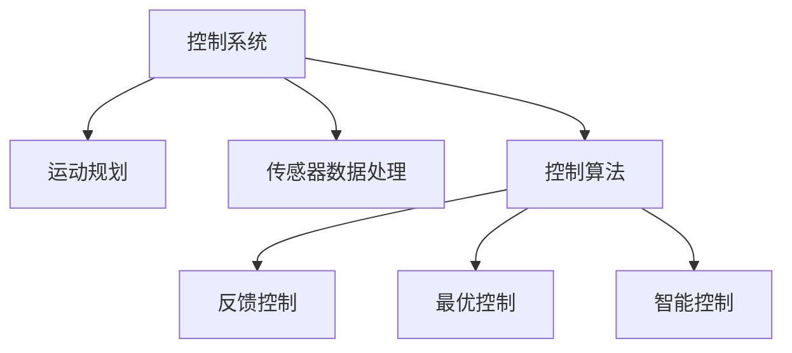
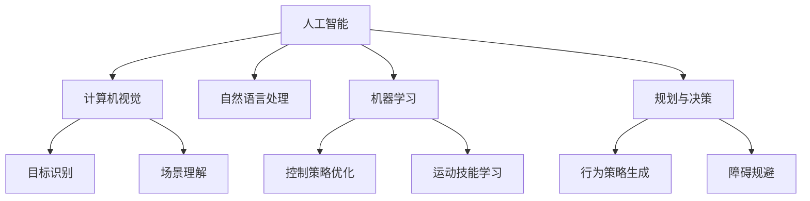
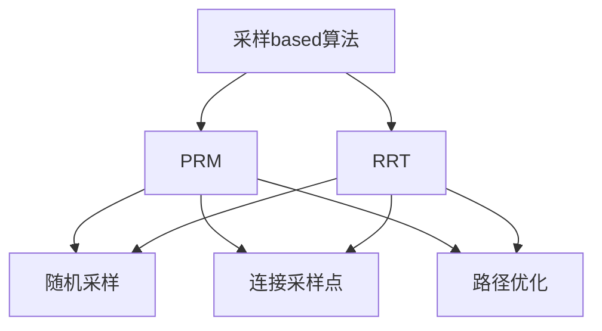

# Robotics 原理与代码实战案例讲解

## 1.背景介绍

### 1.1 什么是机器人?

机器人(Robot)是一种能够按照预先编程的指令自主运行,执行各种操作和任务的自动化机器。它通常由机械装置、传感器、控制系统和动力装置等组成。机器人可以模仿人类的行为,如行走、抓取、操作等,也可以执行一些人类难以完成或不适合完成的任务,如在恶劣环境中工作、进行精密操作等。

机器人技术的发展经历了几个主要阶段:

1) 20世纪50年代,第一代机器人主要用于重复性的单一任务,如焊接、装配等。

2) 20世纪70年代,第二代机器人开始具备一定的编程能力和传感器,可以完成更复杂的任务。

3) 20世纪80年代,机器人技术与计算机技术的结合,使机器人具备更强的智能化水平。

4) 21世纪以来,机器人技术日新月异,人工智能、机器学习等技术的应用,使机器人具备自主学习、决策和适应环境变化的能力。

### 1.2 机器人的应用领域

机器人技术在工业、农业、医疗、航空航天、国防军事、服务业等众多领域得到了广泛应用:

- 工业机器人:主要用于制造业中的焊接、装配、上下料、码垛等重复性工作。

- 服务机器人:如家用服务机器人、医疗护理机器人、教育陪伴机器人等。

- 特种机器人:如反恐机器人、排爆机器人、勘探机器人等,用于一些特殊或危险的环境中工作。

- 娱乐机器人:如机器人玩具、机器人宠物等,主要用于娱乐和教育目的。

机器人技术的发展极大地提高了生产效率,改善了工作环境,拓展了人类活动的范围。

## 2.核心概念与联系

机器人技术涉及多个学科,包括机械工程、电子工程、计算机科学、控制理论、人工智能等,这些学科相互交叉、相辅相成。机器人的核心概念主要包括:

### 2.1 机构学(Kinematics)

研究机器人的运动学特性,包括位置、速度、加速度等,描述机器人各个关节和执行器的运动规律。常用的描述方法有:

- D-H(Denavit-Hartenberg)参数法
- 齐次变换矩阵法
- 雅可比矩阵法

### 2.2 动力学(Dynamics)

研究机器人在运动过程中所受到的力和力矩,包括驱动力、惯性力、重力、摩擦力等,用于计算机器人的运动轨迹和控制输入。

### 2.3 传感器与执行器

传感器用于感知机器人与环境的交互信息,如位置、速度、力、图像等,为控制系统提供反馈。常用的传感器有:

- 位置传感器:如编码器、电位器等
- 力传感器:如应变仪、六维力传感器等
- 视觉传感器:如相机、深度相机等
- 其他传感器:如惯性测量单元(IMU)、激光雷达等

执行器则根据控制系统的指令驱动机器人运动,如电机、液压缸、气动执行器等。

### 2.4 控制系统

控制系统是机器人的"大脑",负责规划运动轨迹、处理传感器数据、生成控制指令等。常用的控制方法有:

- 反馈控制:如PID控制、自适应控制等
- 最优控制:如最小时间控制、最小能耗控制等
- 智能控制:如模糊控制、神经网络控制等

### 2.5 人工智能

人工智能技术在机器人领域的应用主要包括:

- 计算机视觉:用于目标识别、场景理解等
- 自然语言处理:实现人机交互
- 机器学习:用于控制策略优化、运动技能学习等
- 规划与决策:生成行为策略、规避障碍等

机器人技术是一个交叉学科,上述核心概念相互关联、相辅相成,构建了机器人系统的整体框架。

## 3.核心算法原理具体操作步骤

### 3.1 机构学算法

#### 3.1.1 D-H参数法

D-H参数法是描述机器人运动学的常用方法,通过4个参数(α,a,d,θ)来描述相邻两个坐标系之间的位置关系。具体步骤如下:

1) 确定机器人的基坐标系和每个关节坐标系

2) 根据D-H公式计算每个关节坐标系相对于基坐标系的变换矩阵
   
$$
^{i-1}T_i=
\begin{bmatrix}
\cos\theta_i & -\sin\theta_i\cos\alpha_i & \sin\theta_i\sin\alpha_i & a_i\cos\theta_i\\
\sin\theta_i & \cos\theta_i\cos\alpha_i & -\cos\theta_i\sin\alpha_i & a_i\sin\theta_i\\
0 & \sin\alpha_i & \cos\alpha_i & d_i\\
0 & 0 & 0 & 1
\end{bmatrix}
$$

3) 通过矩阵相乘得到末端执行器相对于基坐标系的变换矩阵

$$
^0T_n = ^0T_1 \cdot ^1T_2 \cdots ^{n-1}T_n
$$

4) 根据变换矩阵解算出末端执行器的位置和姿态

#### 3.1.2 雅可比矩阵法

雅可比矩阵描述了机器人末端执行器的位置和姿态与各个关节角度之间的映射关系,可用于求解机器人的速度运动学。具体步骤如下:

1) 根据D-H参数计算出机器人的位置运动学方程

2) 对位置方程分别求关节角度的偏导数,得到位置雅可比矩阵 $J_v$

$$
J_v=\begin{bmatrix}
\frac{\partial x}{\partial q_1} & \frac{\partial x}{\partial q_2} & \cdots & \frac{\partial x}{\partial q_n}\\
\frac{\partial y}{\partial q_1} & \frac{\partial y}{\partial q_2} & \cdots & \frac{\partial y}{\partial q_n}\\
\frac{\partial z}{\partial q_1} & \frac{\partial z}{\partial q_2} & \cdots & \frac{\partial z}{\partial q_n}
\end{bmatrix}
$$

3) 计算出机器人末端执行器的角速度与关节角速度的映射关系,得到姿态雅可比矩阵 $J_\omega$

4) 将位置雅可比矩阵和姿态雅可比矩阵组合成整体雅可比矩阵 $J$

$$
J=\begin{bmatrix}
J_v\\
J_\omega
\end{bmatrix}
$$

5) 根据雅可比矩阵,可以计算出末端执行器的线速度和角速度

$$
\begin{bmatrix}
v\\
\omega
\end{bmatrix}
=J\dot{q}
$$

### 3.2 动力学算法

#### 3.2.1 牛顿-欧拉方法

牛顿-欧拉方法是计算机器人动力学的传统方法,基于牛顿运动定律和欧拉运动方程,具体步骤如下:

1) 建立机器人的自由体系统,列出每个连杆的运动方程

2) 将每个连杆的运动方程代入牛顿运动定律和欧拉运动方程,得到一个由力和力矩方程组成的非线性方程组

3) 对方程组求解,得到每个关节的驱动力和力矩

4) 通过递推计算每个连杆的加速度、速度和位移

这种方法计算过程复杂,需要大量的代数运算,对于高自由度机器人来说,计算量会急剧增加。

#### 3.2.2 拉格朗日方法

拉格朗日方法利用能量原理,将机器人的动力学问题转化为求解拉格朗日方程,具体步骤如下:

1) 计算机器人系统的总动能 $T$ 和总位能 $V$

2) 构造拉格朗日函数 $L=T-V$

3) 对每个广义坐标 $q_i$ 求拉格朗日方程的偏导数

$$
\frac{d}{dt}\left(\frac{\partial L}{\partial \dot{q}_i}\right)-\frac{\partial L}{\partial q_i}=Q_i
$$

4) 将已知的驱动力或力矩 $Q_i$ 代入方程,求解未知的广义坐标加速度 $\ddot{q}_i$

5) 通过数值积分求得广义坐标的速度和位移

拉格朗日方法计算效率较高,适用于高自由度机器人系统。

#### 3.2.3 逆动力学

逆动力学的目标是根据给定的运动轨迹,计算实现该轨迹所需的关节驱动力或力矩。具体步骤如下:

1) 根据运动学方程求解每个关节的位置、速度和加速度

2) 将位置、速度、加速度代入动力学方程(如牛顿-欧拉方程或拉格朗日方程)

3) 求解方程组,得到每个关节的驱动力或力矩

逆动力学是控制系统的核心部分,为机器人的运动控制提供了必要的输入。

### 3.3 路径规划算法

路径规划算法的目标是为机器人生成一条无碰撞、平滑、满足各种约束条件的运动轨迹。常用的路径规划算法包括:

#### 3.3.1 采样based算法

这类算法通过在配置空间中随机采样点,并连接这些点来构建路径。代表性算法有:

- 概率路径映射(Probabilistic Roadmap Method, PRM)
- 快速探索随机树(Rapidly-exploring Random Tree, RRT)

具体步骤如下:

1) 对机器人和环境进行建模,确定配置空间和障碍物区域

2) 在无碰撞区域内随机采样一组点

3) 连接这些点,构建路径

4) 对路径进行优化,满足平滑性和其他约束条件

#### 3.3.2 人工势场法

人工势场法将机器人看作是在一个虚拟的势场中运动,目标点产生吸引力,障碍物产生排斥力,机器人在这些力的作用下运动。具体步骤如下:

1) 建立虚拟的人工势场,定