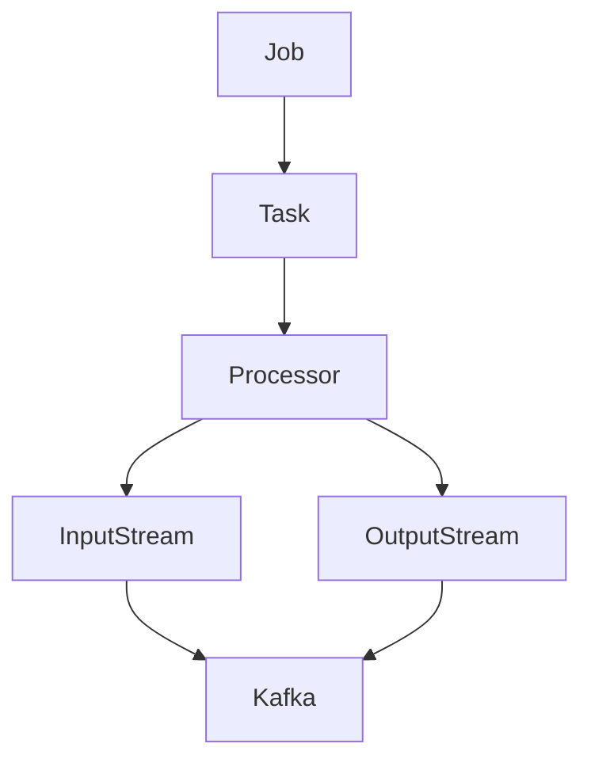

# Samza Task原理与代码实例讲解

## 1.背景介绍

### 1.1 什么是Samza

Apache Samza是一个分布式的流处理系统,最初由LinkedIn公司开发。它基于Apache Kafka消息队列系统,为实时数据处理提供了一个强大、灵活和可扩展的解决方案。Samza旨在解决大规模数据流处理的挑战,例如处理来自多个数据源的海量数据流、实现低延迟和高吞吐量、支持容错和状态恢复等。

### 1.2 Samza的核心概念

Samza的核心概念包括:

- **Stream(数据流)**: 一个持续不断的数据序列,可以来自Kafka主题或其他数据源。
- **Job(作业)**: 一个作业由一个或多个Task组成,用于处理输入数据流并生成输出数据流。
- **Task(任务)**: 作业的基本执行单元,负责处理数据流中的一部分数据。
- **Processor(处理器)**: 实现Task的业务逻辑,处理输入消息并生成输出消息。

### 1.3 Samza的优势

Samza的主要优势包括:

- **容错性和状态恢复**: Samza利用Kafka的日志特性来实现容错和状态恢复,确保数据不会丢失。
- **可扩展性**: Samza可以轻松地扩展以处理更大的数据量,只需添加更多的Task实例。
- **低延迟**: Samza旨在提供低延迟的数据处理,适用于需要实时响应的场景。
- **集成性**: Samza可以与Hadoop生态系统无缝集成,支持YARN和HDFS。

## 2.核心概念与联系

### 2.1 Task

Task是Samza中最核心的概念。每个Task都是一个独立的执行单元,负责处理数据流中的一部分数据。Task的主要职责包括:

1. **从输入流(如Kafka主题)中获取数据**
2. **处理数据(通过Processor)**
3. **将处理后的数据发送到输出流(如Kafka主题或其他系统)**

每个Task都有一个唯一的ID,用于标识和管理该Task。Task的数量可以根据需要进行动态扩展或缩减,以应对不同的数据量和处理需求。

### 2.2 Processor

Processor是实现Task业务逻辑的核心组件。它定义了如何处理输入消息并生成输出消息。Samza提供了多种类型的Processor,用户可以根据需求选择合适的Processor类型,或者自定义Processor。常用的Processor类型包括:

- **StreamTask**: 处理无状态数据流,每条消息都是独立的。
- **WindowableTask**: 处理有状态数据流,可以对数据进行窗口操作(如滑动窗口、会话窗口等)。
- **AsyncStreamTask**: 支持异步处理,适用于需要进行远程调用或I/O操作的场景。

### 2.3 Job

Job是Samza中的最高级别概念,它由一个或多个Task组成。Job定义了整个数据处理流程,包括输入流、输出流、Task数量以及Task的配置等。Job可以通过配置文件或代码进行定义和提交。

### 2.4 核心概念关系

Samza的核心概念之间存在着紧密的关系,它们共同构建了Samza的数据处理框架。这些概念的关系如下所示:



- **Job**包含一个或多个**Task**
- 每个**Task**都包含一个**Processor**
- **Processor**从**输入流**获取数据,并将处理后的数据发送到**输出流**
- **输入流**和**输出流**通常来自于**Kafka**主题

通过这些核心概念及其关系,Samza提供了一种灵活、可扩展的方式来处理实时数据流。

## 3.核心算法原理具体操作步骤

### 3.1 Task生命周期

Samza Task的生命周期包括以下几个阶段:

1. **初始化(Initialization)**: Task在启动时会执行初始化操作,包括设置配置、创建消费者和生产者等。
2. **消费(Consumption)**: Task从输入流(如Kafka主题)中消费数据。
3. **处理(Processing)**: Task通过Processor处理消费的数据,生成输出消息。
4. **发送(Sending)**: Task将处理后的输出消息发送到输出流(如Kafka主题或其他系统)。
5. **窗口操作(Windowing)**: 如果Task需要进行窗口操作(如滑动窗口、会话窗口等),则会在这个阶段执行相应的操作。
6. **检查点(Checkpointing)**: Task会定期将其状态保存到检查点,以实现容错和状态恢复。
7. **关闭(Shutdown)**: Task在关闭时会执行清理操作,如关闭消费者和生产者、释放资源等。

这个生命周期是循环执行的,直到Task被停止或作业完成。

### 3.2 Task并行处理

为了提高处理能力,Samza支持将一个作业划分为多个Task,这些Task可以并行执行。Samza使用**分区(Partition)**的概念来实现并行处理。

1. **输入流分区**: 输入流(如Kafka主题)被划分为多个分区,每个分区包含一部分数据。
2. **Task分配**: Samza根据分区数量创建相应数量的Task,每个Task负责处理一个或多个分区的数据。
3. **并行处理**: 多个Task可以并行执行,同时处理不同分区的数据,从而提高整体处理能力。

通过这种方式,Samza可以实现水平扩展,只需增加Task的数量即可处理更大的数据量。

### 3.3 容错和状态恢复

Samza利用Kafka的日志特性来实现容错和状态恢复。具体步骤如下:

1. **检查点(Checkpointing)**: Task会定期将其状态保存到检查点(如Kafka主题或HDFS)。
2. **故障恢复**: 如果Task发生故障,Samza会重新启动一个新的Task实例。
3. **状态恢复**: 新的Task实例会从最近的检查点恢复状态,并从上次处理的位置继续消费数据。
4. **重新处理**: 新的Task实例会重新处理从上次检查点开始的数据,确保数据不会丢失。

通过这种机制,Samza可以保证数据处理的持久性和容错性,即使发生故障也不会丢失数据。

## 4.数学模型和公式详细讲解举例说明

在Samza中,常见的数学模型和公式主要用于窗口操作和状态管理。以下是一些常见的模型和公式:

### 4.1 滑动窗口

滑动窗口是一种常见的窗口操作,它将数据流划分为固定大小的窗口,并对每个窗口内的数据进行聚合或计算。滑动窗口可以按时间或数据条数进行划分。

**时间窗口公式**:

$$
\text{Window Size} = \text{Window.Duration}
$$
$$
\text{Window Slide} = \text{Window.Advance}
$$

其中:

- `Window Size`表示窗口的大小(时间范围)
- `Window.Duration`表示窗口的持续时间
- `Window Slide`表示窗口的滑动步长
- `Window.Advance`表示窗口的滑动间隔

**计数窗口公式**:

$$
\text{Window Size} = \text{Window.Count}
$$
$$
\text{Window Slide} = \text{Window.Advance}
$$

其中:

- `Window Size`表示窗口的大小(数据条数)
- `Window.Count`表示窗口包含的数据条数
- `Window Slide`表示窗口的滑动步长
- `Window.Advance`表示窗口的滑动间隔(数据条数)

### 4.2 会话窗口

会话窗口是另一种常见的窗口操作,它将属于同一会话的数据聚合到一个窗口中。会话窗口通常基于时间间隔来定义,如果两条数据之间的时间间隔超过指定阈值,则认为它们属于不同的会话。

**会话窗口公式**:

$$
\text{Session Window} = \{e_1, e_2, \ldots, e_n\} \text{ where } \forall i \in [1, n-1], \text{gap}(e_i, e_{i+1}) \leq \text{Session.Gap}
$$

其中:

- `Session Window`表示会话窗口,包含一系列事件`e_1, e_2, ..., e_n`
- `gap(e_i, e_{i+1})`表示事件`e_i`和`e_{i+1}`之间的时间间隔
- `Session.Gap`表示定义会话的最大时间间隔阈值

如果两个相邻事件之间的时间间隔超过`Session.Gap`,则认为它们属于不同的会话窗口。

### 4.3 状态管理

Samza使用键控状态(Key-Based State)来管理Task的状态。每个Task都维护一个键值存储,用于存储和检索与特定键相关的状态。

**状态更新公式**:

$$
\text{State}(k, t) = f(\text{State}(k, t-1), e_t)
$$

其中:

- `State(k, t)`表示在时间`t`时,与键`k`相关的状态
- `State(k, t-1)`表示在时间`t-1`时,与键`k`相关的状态
- `e_t`表示在时间`t`时的输入事件
- `f`是一个函数,用于根据前一个状态和当前事件计算新的状态

通过这种方式,Samza可以高效地管理和更新Task的状态,支持有状态的数据处理。

## 5.项目实践: 代码实例和详细解释说明

在本节中,我们将通过一个实际的代码示例来演示如何使用Samza进行数据处理。我们将构建一个简单的作业,从Kafka主题中读取数据,对数据进行过滤和转换,然后将结果写回到另一个Kafka主题。

### 5.1 项目设置

首先,我们需要创建一个Maven项目,并在`pom.xml`文件中添加Samza的依赖项:

```xml
<dependency>
    <groupId>org.apache.samza</groupId>
    <artifactId>samza-api</artifactId>
    <version>1.7.0</version>
</dependency>
<dependency>
    <groupId>org.apache.samza</groupId>
    <artifactId>samza-kafka_2.13</artifactId>
    <version>1.7.0</version>
</dependency>
```

### 5.2 定义Task

接下来,我们定义一个`FilterTask`类,它继承自`StreamTask`并实现了`process`方法:

```java
public class FilterTask implements StreamTask {

    private final String filterPattern;

    public FilterTask(String filterPattern) {
        this.filterPattern = filterPattern;
    }

    @Override
    public void process(IncomingMessageEnvelope envelope, MessageCollector collector, TaskCoordinator coordinator) {
        String message = (String) envelope.getMessage();
        if (message.contains(filterPattern)) {
            collector.send(new OutgoingMessageEnvelope(new SystemStream("kafka", message)));
        }
    }
}
```

在这个示例中,`FilterTask`会过滤包含指定模式的消息,并将它们发送到输出流。

### 5.3 定义Job

接下来,我们定义一个`FilterJobFactory`类,它实现了`StreamJobFactory`接口,用于创建和配置作业:

```java
public class FilterJobFactory implements StreamJobFactory {

    private final String filterPattern;

    public FilterJobFactory(String filterPattern) {
        this.filterPattern = filterPattern;
    }

    @Override
    public StreamJob getJob() {
        Map<String, String> configMap = new HashMap<>();
        configMap.put("job.factory.class", FilterJobFactory.class.getName());
        configMap.put("task.class", FilterTask.class.getName());
        configMap.put("task.inputs", "kafka.input-topic");
        configMap.put("task.checkpoint.factory", "org.apache.samza.checkpoint.kafka.KafkaCheckpointManagerFactory");
        configMap.put("task.checkpoint.system", "kafka");
        configMap.put("task.checkpoint.replication.factor", "1");
        configMap.put("task.broadcast.inputs", "kafka.input-topic");
        configMap.put("task.window.ms", "60000");
        configMap.put("systems.kafka.samza.factory", "org.apache.samza.system.kafka.KafkaSystemFactory");
        configMap.put("systems.kafka.consumer.zookeeper.connect", "localhost:2181");
        configMap.put("systems.kafka.producer.bootstrap.servers", "localhost:9092");
        configMap.put("job.name", "filter-job");
        configMap.put("job.coordinator.system", "kafka");

        Config config = new MapConfig(configMap);
        return new StreamJobFactory.StreamJobSpec(FilterTask.class.getName(), config, new FilterTask(filterPattern))
                .withDescription("Filter