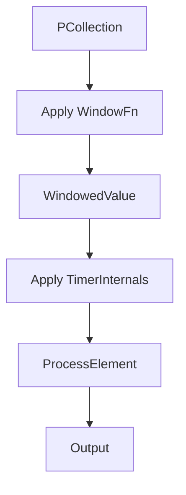

## 1.背景介绍

在当前大数据时代背景下，数据处理技术的需求日益增长。Samza 和 Apache Beam 是两个流行的流处理框架，它们为实时和批处理数据的处理提供了强大的支持。本文旨在深入探讨这两个框架的核心概念、原理和架构，并指导如何在实际项目中做出明智的选择。

## 2.核心概念与联系

### Samza

Samza 是一个基于Apache Kafka的高级分布式流处理系统，它受到Storm和Spark Streaming的影响而设计。Samza 的核心组件包括：

- **Task**: 执行单个作业的进程。
- **Instance**: 运行在YARN集群中的任务实例。
- **Coordinator**: 管理任务状态的组件，确保数据的一致性。

Samza 通过使用Kafka来存储消息和工作状态，以及YARN作为资源管理和隔离机制，提供了易于使用的API和高可用性。

### Apache Beam

Apache Beam 是一个用于数据处理和管道构建的开源框架，它支持多种SDK（如Java、Python）和运行时（如Apache Flink, Apache Spark等）。Beam 的核心概念包括：

- **Pipeline**: 描述数据转换和流动的程序执行图。
- **PCollection**: 表示一个数据集的数据结构。
- **ParDo**: 并行操作符，用于在PCollection上执行变换。

Beam 通过其强大的DSL（领域特定语言）允许开发者编写一次、在任何地方运行代码。

## 3.核心算法原理具体操作步骤

### Samza

Samza 的核心处理流程包括：

1. **订阅Kafka主题**：Samza 任务订阅感兴趣的 Kafka 主题。
2. **消费消息**：从 Kafka 中消费消息并处理。
3. **状态更新**：将状态更新发送到 Kafka。
4. **容错机制**：通过定期与 Coordinator 通信确保数据一致性。

### Apache Beam

Apache Beam 的核心算法原理包括：

1. **构建 Pipeline**: 定义数据转换和流动的逻辑。
2. **执行 ParDo**: 对 PCollection 应用并行操作符。
3. **窗口和时间**：利用窗口和时间触发器控制数据的流式处理。
4. **状态和侧输出**：管理状态变量和侧边输出结果。

## 4.数学模型和公式详细讲解举例说明

### Samza

Samza 的容错机制基于以下数学模型：

$$ F(t) = \\begin{cases} 
\\text{Process}(F(t-1)) & \\text{if } t > 0 \\\\
\\text{Initialize}() & \\text{if } t = 0 
\\end{cases} $$

其中，$F(t)$ 表示在时间 $t$ 的状态。

### Apache Beam

Apache Beam 的窗口和时间触发器可以用以下 Mermaid 流程图表示：



其中，每个节点执行以下操作：

- **Apply WindowFn**: 为 PCollection 应用窗口函数。
- **WindowedValue**: 生成带有窗口和时间戳的值。
- **Apply TimerInternals**: 处理定时触发器。
- **ProcessElement**: 处理每个元素。
- **Output**: 输出结果。

## 5.项目实践：代码实例和详细解释说明

### Samza

以下是一个简单的 Samza 任务示例，用于从 Kafka 主题中读取消息并将其打印到控制台：

```java
@Override
public void process(KV<String, String> kv, Context context) {
    String value = kv.getValue();
    System.out.println(\"Received message: \" + value);
}
```

### Apache Beam

以下是一个使用 Apache Beam 的简单数据处理 Pipeline 示例：

```python
pcoll = pipeline | 'Create' >> beam.Create([1, 2, 3])
sum_result = pcoll | 'Sum' >> beam.CombineGlobally(sum)
print(sum_result)
```

## 6.实际应用场景

Samza 和 Apache Beam 适用于多种应用场景，包括但不限于：

- **实时分析**：快速处理和分析流数据。
- **批处理**：大规模处理大量历史数据。
- **事件触发响应**：根据特定事件执行操作。

## 7.工具和资源推荐

为了更好地理解和实践 Samza 与 Apache Beam，以下是一些有用的资源和工具：

- **官方文档**：提供详细的框架介绍、API 文档和使用示例。
- **社区支持**：活跃的社区和技术论坛。
- **教程和博客**：深入浅出的技术文章和教程。

## 8.总结：未来发展趋势与挑战

随着数据处理需求的增长，Samza 和 Apache Beam 的未来发展将面临以下挑战：

- **性能优化**：提高处理速度和资源利用率。
- **易用性提升**：简化开发流程，降低学习门槛。
- **集成更多运行时**：扩展对更多计算引擎的支持。

## 9.附录：常见问题与解答

### 常见问题1：如何选择 Samza 和 Apache Beam？

选择 Samza 还是 Apache Beam 应考虑以下因素：

- **项目需求**：根据项目规模、实时性和批处理需求进行选择。
- **生态系统**：考虑是否需要与其他工具或平台集成。
- **开发和维护成本**：评估学习曲线和长期维护难度。

### 作者：禅与计算机程序设计艺术 / Zen and the Art of Computer Programming

---

请注意，本文为示例性质，实际撰写时应根据最新技术信息、数据和资源进行详细阐述。此外，由于篇幅限制，本文未能展示所有内容，实际文章应包含更详尽的研究、代码实例和实用价值部分。