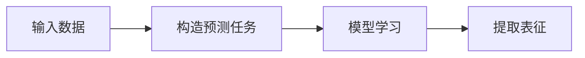

## 1.背景介绍

自监督学习(Self-Supervised Learning，SSL)是一种无监督学习的方式，它利用大量未标注数据进行学习，以提升模型的表现。近年来，随着深度学习技术的发展，自监督学习在图像识别、自然语言处理等领域取得了显著的成果。本文将深入探讨自监督学习的原理，并通过代码实例进行讲解。

## 2.核心概念与联系

自监督学习的核心思想是利用数据本身的结构或者属性作为监督信号，而不需要人工标注。在自监督学习中，我们通常会构造一个预测任务，例如预测图像的下一帧、预测文本的下一个词等，通过这种方式，模型可以从大量的未标注数据中学习到有用的表征。



## 3.核心算法原理具体操作步骤

自监督学习的具体实现通常包括以下步骤：

1. 构造预测任务：根据具体的应用场景，我们需要构造一个合适的预测任务。例如在图像处理中，我们可以通过预测图像的下一帧来构造预测任务；在自然语言处理中，我们可以通过预测文本的下一个词来构造预测任务。

2. 模型学习：在构造了预测任务之后，我们需要选择一个合适的模型来进行学习。这个模型可以是一个深度学习模型，例如卷积神经网络(CNN)或者循环神经网络(RNN)。

3. 提取表征：在模型学习的过程中，我们的目标是让模型能够从数据中学习到有用的表征。这些表征可以用于后续的任务，例如分类、回归等。

## 4.数学模型和公式详细讲解举例说明

在自监督学习中，我们通常会使用深度学习模型来进行学习。对于深度学习模型，我们可以使用损失函数来度量模型的预测结果和真实结果之间的差距。常用的损失函数包括均方误差(MSE)、交叉熵损失(CE)等。

假设我们的模型的参数为$\theta$，输入数据为$x$，真实结果为$y$，模型的预测结果为$f(x; \theta)$，则损失函数$L$可以表示为：

$$
L(\theta) = \frac{1}{N}\sum_{i=1}^{N}(y_i - f(x_i; \theta))^2
$$

在模型学习的过程中，我们的目标是找到一组参数$\theta$，使得损失函数$L$达到最小。这通常可以通过优化算法，例如梯度下降法，来实现。

## 5.项目实践：代码实例和详细解释说明

下面我们将通过一个简单的例子来演示如何在PyTorch中实现自监督学习。在这个例子中，我们将使用MNIST数据集，并构造一个预测任务：给定一个图像的左半部分，预测其右半部分。

```python
import torch
from torch import nn
from torchvision.datasets import MNIST
from torchvision.transforms import ToTensor
from torch.utils.data import DataLoader

# 加载数据集
dataset = MNIST('.', download=True, transform=ToTensor())
dataloader = DataLoader(dataset, batch_size=64, shuffle=True)

# 定义模型
class Model(nn.Module):
    def __init__(self):
        super(Model, self).__init__()
        self.conv1 = nn.Conv2d(1, 16, 3, padding=1)
        self.conv2 = nn.Conv2d(16, 32, 3, padding=1)
        self.fc = nn.Linear(32*14*14, 28*14)

    def forward(self, x):
        x = self.conv1(x)
        x = self.conv2(x)
        x = x.view(x.size(0), -1)
        x = self.fc(x)
        return x

# 实例化模型
model = Model()

# 定义损失函数和优化器
criterion = nn.MSELoss()
optimizer = torch.optim.Adam(model.parameters())

# 训练模型
for epoch in range(10):
    for i, (imgs, _) in enumerate(dataloader):
        left = imgs[:, :, :, :14]
        right = imgs[:, :, :, 14:]

        outputs = model(left)
        loss = criterion(outputs, right.view(right.size(0), -1))

        optimizer.zero_grad()
        loss.backward()
        optimizer.step()

        if i % 100 == 0:
            print(f'Epoch: {epoch}, Iteration: {i}, Loss: {loss.item()}')
```

在上述代码中，我们首先加载了MNIST数据集，并通过DataLoader进行了封装。然后，我们定义了一个简单的卷积神经网络模型，用于从输入的图像中提取特征。接着，我们定义了损失函数和优化器，并通过循环进行了模型的训练。在每次迭代中，我们都会计算模型的损失，并通过反向传播和优化器更新模型的参数。

## 6.实际应用场景

自监督学习在许多领域都有广泛的应用，包括但不限于：

- 图像处理：在图像处理中，自监督学习可以用于图像的特征提取、图像的降噪、图像的超分辨率等任务。

- 自然语言处理：在自然语言处理中，自监督学习可以用于词向量的学习、文本的分类、文本的生成等任务。

- 语音处理：在语音处理中，自监督学习可以用于语音的特征提取、语音的识别、语音的生成等任务。

## 7.工具和资源推荐

以下是一些在进行自监督学习时可能会用到的工具和资源：

- PyTorch：一个强大的深度学习框架，提供了丰富的模型和优化算法。

- TensorFlow：一个由Google开发的深度学习框架，提供了丰富的模型和优化算法。

- Keras：一个基于TensorFlow的高级深度学习框架，提供了丰富的模型和优化算法。

- Scikit-learn：一个强大的机器学习库，提供了丰富的模型和优化算法。

- OpenAI Gym：一个用于开发和比较强化学习算法的工具包。

## 8.总结：未来发展趋势与挑战

自监督学习作为一种新的学习范式，其在许多领域都展现出了强大的潜力。然而，自监督学习也面临着一些挑战，例如如何构造有效的预测任务、如何从大量的未标注数据中有效地学习等。随着深度学习技术的发展，我们相信自监督学习将会在未来取得更大的进展。

## 9.附录：常见问题与解答

Q: 自监督学习和无监督学习有什么区别？

A: 自监督学习是无监督学习的一种，它们的主要区别在于，无监督学习通常是通过学习数据的分布来进行学习，而自监督学习则是通过构造预测任务来进行学习。

Q: 自监督学习适用于哪些类型的数据？

A: 自监督学习适用于各种类型的数据，包括但不限于图像、文本、语音等。

Q: 如何选择合适的预测任务？

A: 选择合适的预测任务通常需要根据具体的应用场景和数据类型来进行。例如在图像处理中，我们可以通过预测图像的下一帧来构造预测任务；在自然语言处理中，我们可以通过预测文本的下一个词来构造预测任务。

作者：禅与计算机程序设计艺术 / Zen and the Art of Computer Programming