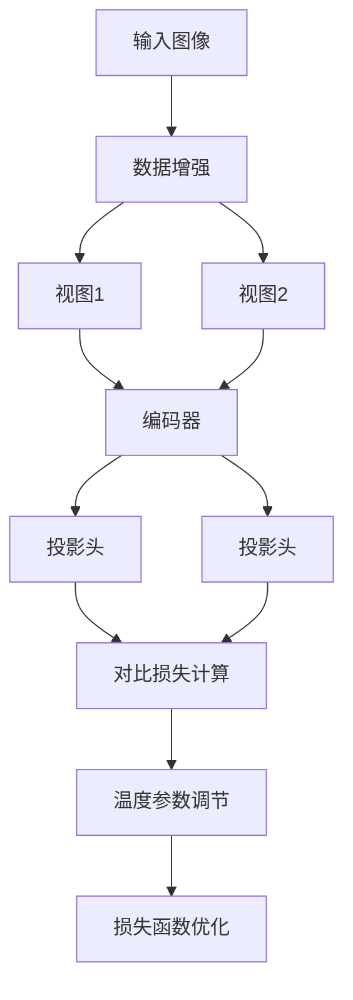

# SimCLR原理与代码实例讲解

## 1. 背景介绍

### 1.1 无监督表示学习的重要性

在深度学习的发展过程中,大量的研究工作都集中在监督学习领域,这需要大量的人工标注数据,而获取高质量的标注数据是一个非常昂贵和耗时的过程。相比之下,无监督学习可以利用大量未标注的数据进行训练,这种数据更容易获取,因此无监督表示学习受到了广泛关注。

无监督表示学习的目标是从原始数据中学习出有用的表示特征,这些特征可以用于下游的各种任务,如图像分类、物体检测等。通过无监督学习获得的表示特征,不仅可以避免耗费大量的人力和财力进行标注,而且往往比监督学习获得的特征更加通用和鲁棒。

### 1.2 对比学习(Contrastive Learning)

对比学习是无监督表示学习的一种重要方法。它的核心思想是通过最大化相似样本之间的相似性,最小化不相似样本之间的相似性,来学习数据的表示特征。对比学习可以从大量未标注的数据中挖掘出有用的信息,因此在无监督表示学习领域受到了广泛关注。

### 1.3 SimCLR的提出

SimCLR(A Simple Framework for Contrastive Learning of Visual Representations)是2020年由Google Brain提出的一种对比学习框架,用于从大量未标注图像数据中学习视觉表示特征。相比之前的对比学习方法,SimCLR提出了一些创新的改进,使得训练更加高效和稳定,在多个下游视觉任务上取得了非常优秀的性能表现。

## 2. 核心概念与联系

### 2.1 对比学习的基本思想

对比学习的核心思想是通过最大化相似样本之间的相似性,最小化不相似样本之间的相似性,来学习数据的表示特征。具体来说,对比学习将每个样本分为两个视图(view),例如对于一张图像,可以通过数据增强(如随机裁剪、颜色失真等)获得两个不同的视图。然后,对比学习的目标是使得同一个样本的两个视图在嵌入空间中距离更近,而不同样本的视图在嵌入空间中距离更远。

通过这种方式,模型可以学习到样本内在的语义特征,而不需要人工标注的监督信息。

### 2.2 SimCLR的创新点

SimCLR在对比学习的基础上提出了以下几个创新点:

1. **数据增强策略**:SimCLR采用了一种强大的数据增强策略,包括随机裁剪、颜色失真、高斯模糊等多种操作,这有助于提高模型的泛化能力。

2. **投影头(Projection Head)**:SimCLR在编码器(Encoder)的输出之后,添加了一个非线性的投影头,用于将表示映射到一个更适合对比学习的空间。

3. **大批量训练(Large Batch Size)**:SimCLR采用了非常大的批量大小(如4096),这使得每个批次中包含了更多的负样本,有助于学习到更加鲁棒的表示。

4. **温度参数(Temperature Parameter)**:SimCLR引入了一个温度参数,用于调节对比损失函数中的相似度分数,从而控制损失函数的平滑程度。

5. **余弦相似度(Cosine Similarity)**:SimCLR使用余弦相似度来衡量样本之间的相似性,而不是传统的欧氏距离或内积,这有助于提高模型的性能。

这些创新点使得SimCLR在多个下游视觉任务上取得了非常优秀的性能表现,成为了无监督表示学习领域的一个重要里程碑。

## 3. 核心算法原理具体操作步骤

SimCLR的核心算法原理可以概括为以下几个步骤:

1. **数据增强**:对输入图像进行数据增强,生成两个不同的视图(view)。常用的数据增强操作包括随机裁剪、颜色失真、高斯模糊等。

2. **编码器(Encoder)**:将两个视图分别输入到相同的编码器(通常是ResNet)中,获得对应的表示向量。

3. **投影头(Projection Head)**:将编码器的输出通过一个非线性的投影头映射到一个新的空间,得到最终的表示向量。投影头通常由两个全连接层组成,中间使用ReLU激活函数。

4. **对比损失计算**:计算一个批次中所有正样本对(同一个图像的两个视图)和负样本对(不同图像的视图对)之间的相似度。正样本对的相似度应尽可能大,负样本对的相似度应尽可能小。

5. **温度参数调节**:引入一个温度参数,用于调节对比损失函数中的相似度分数,从而控制损失函数的平滑程度。

6. **损失函数优化**:使用对比损失函数(如NT-Xent损失)作为优化目标,通过反向传播算法更新模型参数。

下面我们使用一个流程图来直观地展示SimCLR的核心算法步骤:



上图展示了SimCLR算法的主要步骤。首先,输入图像经过数据增强操作生成两个不同的视图。然后,这两个视图分别通过相同的编码器和投影头,得到最终的表示向量。接下来,计算一个批次中所有正样本对和负样本对之间的相似度,并使用温度参数对相似度分数进行调节。最后,使用对比损失函数(如NT-Xent损失)作为优化目标,通过反向传播算法更新模型参数。

通过上述步骤,SimCLR可以从大量未标注的图像数据中学习到有用的视觉表示特征,这些特征可以用于下游的各种视觉任务,如图像分类、物体检测等。

## 4. 数学模型和公式详细讲解举例说明

### 4.1 NT-Xent损失函数

SimCLR使用NT-Xent(Normalized Temperature-scaled Cross Entropy Loss)作为对比损失函数。NT-Xent损失函数的定义如下:

$$
\ell_{i,j} = -\log \frac{\exp(\mathrm{sim}(z_i, z_j)/\tau)}{\sum_{k=1}^{2N} \mathbb{1}_{[k\neq i]}\exp(\mathrm{sim}(z_i, z_k)/\tau)}
$$

其中:

- $z_i$和$z_j$分别表示一个正样本对(同一个图像的两个视图)的表示向量
- $\mathrm{sim}(u, v)=\frac{u^{\top}v}{\|u\|\|v\|}$表示向量$u$和$v$之间的余弦相似度
- $\tau$是一个温度参数(temperature parameter),用于调节相似度分数的缩放程度
- $\mathbb{1}_{[k\neq i]}$是一个指示函数,当$k\neq i$时取值为1,否则取值为0
- $2N$表示一个批次中样本的总数

NT-Xent损失函数的目标是最大化正样本对之间的相似度,最小化正样本对与所有负样本对之间的相似度。具体来说,分子部分$\exp(\mathrm{sim}(z_i, z_j)/\tau)$表示正样本对的相似度,我们希望这个值尽可能大。分母部分$\sum_{k=1}^{2N} \mathbb{1}_{[k\neq i]}\exp(\mathrm{sim}(z_i, z_k)/\tau)$表示正样本与所有负样本之间的相似度之和,我们希望这个值尽可能小。

通过最小化NT-Xent损失函数,模型可以学习到样本内在的语义特征,使得同一个样本的两个视图在嵌入空间中距离更近,而不同样本的视图在嵌入空间中距离更远。

### 4.2 温度参数的作用

在NT-Xent损失函数中,温度参数$\tau$起到了调节相似度分数的作用。当$\tau$较小时,相似度分数会被放大,这意味着正样本对之间的相似度会更大,负样本对之间的相似度会更小。相反,当$\tau$较大时,相似度分数会被压缩,正样本对和负样本对之间的相似度差距会变小。

通过调节$\tau$的值,我们可以控制损失函数的平滑程度。一般来说,在训练的早期阶段,我们希望损失函数更加平滑,因此可以选择一个较大的$\tau$值。随着训练的进行,我们可以逐渐减小$\tau$的值,使得损失函数更加陡峭,从而获得更好的收敛性能。

在SimCLR论文中,作者建议在训练过程中逐步减小$\tau$的值,从0.07开始,每次乘以0.97,直到最小值为0.0005。这种策略可以帮助模型更好地收敛,并获得更好的表示特征。

### 4.3 举例说明

为了更好地理解NT-Xent损失函数和温度参数的作用,我们来看一个具体的例子。

假设我们有一个批次,包含4个样本,每个样本有两个视图,因此总共有8个表示向量$z_1, z_2, \dots, z_8$。其中$z_1$和$z_2$是同一个样本的两个视图,是一个正样本对;$z_3$和$z_4$是另一个正样本对;其余的都是负样本对。

我们计算每个正样本对之间的相似度,以及正样本对与所有负样本对之间的相似度,并将它们代入NT-Xent损失函数:

$$
\begin{aligned}
\ell_{1,2} &= -\log \frac{\exp(\mathrm{sim}(z_1, z_2)/\tau)}{\exp(\mathrm{sim}(z_1, z_2)/\tau) + \exp(\mathrm{sim}(z_1, z_3)/\tau) + \exp(\mathrm{sim}(z_1, z_4)/\tau) + \dots + \exp(\mathrm{sim}(z_1, z_8)/\tau)} \\
\ell_{3,4} &= -\log \frac{\exp(\mathrm{sim}(z_3, z_4)/\tau)}{\exp(\mathrm{sim}(z_3, z_4)/\tau) + \exp(\mathrm{sim}(z_3, z_1)/\tau) + \exp(\mathrm{sim}(z_3, z_2)/\tau) + \dots + \exp(\mathrm{sim}(z_3, z_8)/\tau)}
\end{aligned}
$$

我们希望正样本对之间的相似度$\mathrm{sim}(z_1, z_2)$和$\mathrm{sim}(z_3, z_4)$尽可能大,而正样本对与负样本对之间的相似度(如$\mathrm{sim}(z_1, z_3)$、$\mathrm{sim}(z_1, z_4)$等)尽可能小。

现在,我们来看温度参数$\tau$的影响。当$\tau$较小时,相似度分数会被放大,正样本对之间的相似度会更大,负样本对之间的相似度会更小,因此损失函数会更加陡峭。相反,当$\tau$较大时,相似度分数会被压缩,正样本对和负样本对之间的相似度差距会变小,因此损失函数会更加平滑。

通过调节$\tau$的值,我们可以控制损失函数的平滑程度,从而影响模型的收敛性能和表示特征的质量。

## 5. 项目实践:代码实例和详细解释说明

在这一部分,我们将提供一个基于PyTorch实现的SimCLR代码示例,并对关键部分进行详细解释。

### 5.1 导入所需库

```python
import torch
import torch.nn as nn
import torch.nn.functional as F
from torchvision import models, transforms
```

我们首先导入所需的PyTorch库,包括`torch`、`torch.nn`和`torchvision`。

### 5.2 定义数据增强操作

```python
data_transforms = transforms.Compose([
    transforms.RandomResizedCrop(224),
    transforms.RandomHorizontalFlip(),
    transforms.RandomAp