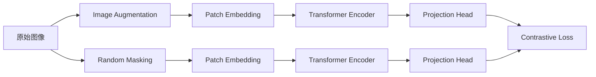

# SimMIM的可解释性探讨:提高模型透明度的重要性

## 1.背景介绍
### 1.1 可解释性的重要性
### 1.2 SimMIM模型概述  
### 1.3 探讨SimMIM可解释性的意义

## 2.核心概念与联系
### 2.1 SimMIM的核心概念
#### 2.1.1 Masked Image Modeling
#### 2.1.2 Siamese Networks 
#### 2.1.3 Contrastive Learning
### 2.2 可解释性的定义与分类
#### 2.2.1 可解释性的定义
#### 2.2.2 可解释性的分类
### 2.3 SimMIM与可解释性的关系

## 3.核心算法原理具体操作步骤
### 3.1 SimMIM的训练过程
#### 3.1.1 数据预处理
#### 3.1.2 Patch Embedding
#### 3.1.3 Mask Tokens
#### 3.1.4 Transformer Encoder
#### 3.1.5 Contrastive Loss
### 3.2 SimMIM的推理过程
#### 3.2.1 图像输入
#### 3.2.2 Patch Embedding
#### 3.2.3 Transformer Encoder
#### 3.2.4 Mask Tokens预测
### 3.3 SimMIM的可解释性分析方法
#### 3.3.1 基于梯度的方法
#### 3.3.2 基于扰动的方法
#### 3.3.3 基于概念激活向量的方法

## 4.数学模型和公式详细讲解举例说明
### 4.1 Contrastive Loss的数学表达
### 4.2 Transformer Encoder的数学表达
### 4.3 可解释性量化指标的数学表达
#### 4.3.1 Faithfulness
#### 4.3.2 Localization
#### 4.3.3 Concept Activation Vector

## 5.项目实践：代码实例和详细解释说明
### 5.1 SimMIM模型的PyTorch实现
#### 5.1.1 模型结构定义
#### 5.1.2 数据加载与预处理
#### 5.1.3 训练循环
#### 5.1.4 推理过程
### 5.2 基于Captum库的可解释性分析
#### 5.2.1 梯度方法
#### 5.2.2 扰动方法 
#### 5.2.3 概念激活向量方法
### 5.3 可视化SimMIM的可解释性结果

## 6.实际应用场景
### 6.1 医学影像分析
### 6.2 自动驾驶
### 6.3 工业缺陷检测

## 7.工具和资源推荐
### 7.1 PyTorch
### 7.2 Captum
### 7.3 SimMIM官方实现
### 7.4 相关论文与资源

## 8.总结：未来发展趋势与挑战
### 8.1 SimMIM可解释性的意义
### 8.2 可解释性研究的发展趋势
### 8.3 SimMIM面临的挑战与机遇

## 9.附录：常见问题与解答
### 9.1 如何平衡模型性能与可解释性？
### 9.2 可解释性分析的局限性有哪些？
### 9.3 如何选择合适的可解释性分析方法？

近年来，随着深度学习模型在计算机视觉领域取得了巨大的成功，如何理解和解释这些模型的内部工作机制成为了一个重要的研究课题。SimMIM作为一种新颖的自监督学习方法，在图像分类、目标检测等任务上展现出了优异的性能。然而，SimMIM模型的复杂性和不透明性也引发了人们对其可解释性的关注。提高SimMIM模型的可解释性不仅有助于我们深入理解模型的决策过程，也能够增强模型的可信度和鲁棒性。

SimMIM的核心思想是通过Masked Image Modeling和Siamese Networks的结合，在无监督的情况下学习到图像的高层语义表示。具体来说，SimMIM采用了以下几个关键技术：

1. Masked Image Modeling：随机遮挡图像的部分区域，并让模型预测被遮挡的像素值。这个过程促使模型学习到图像的全局结构和局部细节。

2. Siamese Networks：使用两个共享权重的编码器分别处理原始图像和被遮挡的图像，通过最小化两个编码器输出的表示之间的距离，使模型学习到一个一致的图像表示。

3. Contrastive Learning：利用对比学习的思想，将相似的图像表示拉近，将不相似的图像表示推远，从而学习到一个更加鲁棒和有判别力的图像表示。

下图展示了SimMIM的整体架构：



可解释性是指我们能够理解模型的决策过程，知道模型为什么做出了特定的预测。根据可解释性的粒度和形式，可以将其分为以下几类：

1. 全局可解释性：对模型的整体行为进行解释，揭示模型学习到的高层特征和概念。

2. 局部可解释性：针对单个样本，解释模型做出特定预测的原因。

3. 基于特征的可解释性：识别对模型决策起关键作用的输入特征。

4. 基于概念的可解释性：将模型的内部表示与人类可理解的概念联系起来。

SimMIM与可解释性之间存在着紧密的联系。一方面，SimMIM通过自监督学习的方式，学习到了图像的高层语义表示，这为可解释性分析提供了基础。另一方面，提高SimMIM的可解释性有助于我们理解模型的内部工作机制，识别模型的优势和局限性，进而改进模型的设计和训练策略。

为了分析SimMIM的可解释性，我们可以采用多种方法，包括：

1. 基于梯度的方法：通过计算输入图像的梯度，识别对模型预测结果影响最大的像素或区域。常用的方法有Saliency Map、Grad-CAM等。

2. 基于扰动的方法：通过对输入图像进行局部扰动，观察扰动对模型预测结果的影响，从而推断出关键区域。代表性的方法有LIME、SHAP等。

3. 基于概念激活向量的方法：将模型的内部表示与预定义的人类可解释的概念联系起来，度量每个概念对模型决策的贡献。这类方法需要先构建一个概念库，然后计算每个概念的激活向量。

下面我们以PyTorch为例，展示如何实现SimMIM模型并进行可解释性分析。

首先，定义SimMIM模型的结构：

```python
class SimMIM(nn.Module):
    def __init__(self, img_size=224, patch_size=16, in_chans=3, embed_dim=768, depth=12, num_heads=12, mlp_ratio=4):
        super().__init__()
        
        self.patch_embed = PatchEmbed(img_size, patch_size, in_chans, embed_dim)
        self.cls_token = nn.Parameter(torch.zeros(1, 1, embed_dim))
        self.pos_embed = nn.Parameter(torch.zeros(1, self.patch_embed.num_patches + 1, embed_dim))
        
        self.blocks = nn.ModuleList([
            Block(embed_dim, num_heads, mlp_ratio, qkv_bias=True, norm_layer=partial(nn.LayerNorm, eps=1e-6))
            for i in range(depth)
        ])
        
        self.norm = nn.LayerNorm(embed_dim)
        self.head = nn.Linear(embed_dim, patch_size**2 * in_chans)
        
    def forward_features(self, x):
        x = self.patch_embed(x)
        cls_token = self.cls_token.expand(x.shape[0], -1, -1)
        x = torch.cat((cls_token, x), dim=1)
        x = self.pos_drop(x + self.pos_embed)
        
        for blk in self.blocks:
            x = blk(x)
        
        x = self.norm(x)
        return x[:, 0]
    
    def forward(self, x):
        x = self.forward_features(x)
        x = self.head(x)
        return x
```

接下来，我们使用Captum库来进行可解释性分析。Captum是PyTorch的一个可解释性工具包，提供了多种常用的可解释性方法。

```python
from captum.attr import IntegratedGradients, Occlusion, LayerGradCam

model = SimMIM()
model.eval()

# 使用Integrated Gradients方法
ig = IntegratedGradients(model)
attributions = ig.attribute(input, target=pred.item())

# 使用Occlusion方法
occlusion = Occlusion(model)
attributions = occlusion.attribute(input, target=pred.item(), sliding_window_shapes=(3,3))

# 使用Layer GradCAM方法
layer_gc = LayerGradCam(model, model.blocks[-1])
attributions = layer_gc.attribute(input, target=pred.item())
```

通过可视化attribution map，我们可以直观地理解模型关注的图像区域和特征。

SimMIM模型的可解释性分析在实际应用中有着广泛的价值。例如，在医学影像分析领域，解释模型的预测结果可以帮助医生进行诊断和决策；在自动驾驶领域，理解模型如何感知和理解道路环境对于确保系统的安全性和可靠性至关重要；在工业缺陷检测中，可解释性分析可以帮助工程师快速定位问题并进行优化。

未来，可解释性研究将继续深入，不断提出新的理论和方法。同时，如何在保证模型性能的同时提高可解释性，如何设计更加高效和通用的可解释性框架，也是亟待解决的问题。SimMIM作为一种前沿的自监督学习范式，其可解释性的研究也将为整个AI领域的发展提供重要的启示和参考。

总之，SimMIM的可解释性探讨对于提高模型透明度、增强用户信任度具有重要意义。通过多角度、多层次的可解释性分析，我们可以更好地理解SimMIM模型的内部工作机制，识别其优势和局限性，进而设计出更加安全、可靠、高效的人工智能系统。让我们携手共进，推动SimMIM乃至整个AI领域的可解释性研究，为构建一个更加美好的智能世界贡献自己的力量。

作者：禅与计算机程序设计艺术 / Zen and the Art of Computer Programming