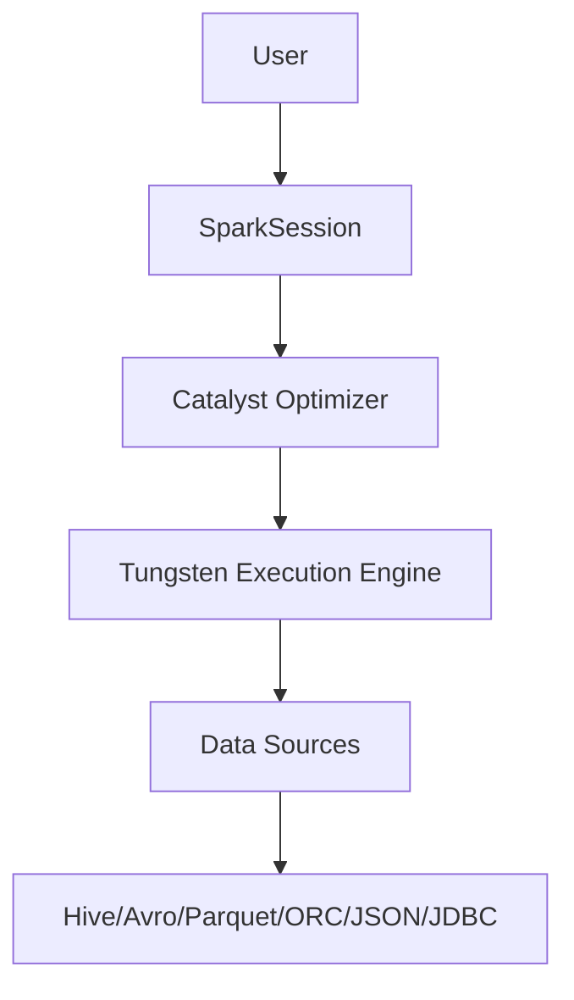

# Spark SQL 原理与代码实例讲解

## 1.背景介绍

### 1.1 什么是 Spark SQL

Apache Spark SQL 是 Spark 的一个模块,它为 Spark 提供了结构化和半结构化数据的处理能力。Spark SQL 允许使用 SQL 或者 Apache Spark 的 Dataset API 查询数据,并且支持多种数据源,包括 Hive、Avro、Parquet、ORC、JSON 和 JDBC。

### 1.2 Spark SQL 的优势

Spark SQL 具有以下优势:

- **统一的数据访问**:无论数据存储在哪里,Spark SQL 都可以使用相同的方式进行查询,从而实现了统一的数据访问。
- **标准连接器**:Spark SQL 支持多种标准连接器,可以轻松地连接到不同的数据源。
- **Catalyst 优化器**:Spark SQL 使用了 Catalyst 优化器,可以自动优化查询执行计划,提高查询性能。
- **高性能**:Spark SQL 在内存中执行查询,并且利用了 Spark 的并行计算能力,可以实现高性能的数据处理。

### 1.3 Spark SQL 架构

Spark SQL 的架构如下图所示:



1. **SparkSession**:用户通过 SparkSession 与 Spark SQL 进行交互。
2. **Catalyst Optimizer**:Catalyst 优化器负责优化查询执行计划。
3. **Tungsten Execution Engine**:Tungsten 执行引擎负责执行查询。
4. **Data Sources**:Spark SQL 支持多种数据源,如 Hive、Avro、Parquet、ORC、JSON 和 JDBC。

## 2.核心概念与联系

### 2.1 DataFrame

DataFrame 是 Spark SQL 中的核心概念之一。它是一个分布式的数据集合,类似于关系型数据库中的表。DataFrame 由行和列组成,每一行都是一个记录,每一列都是一个字段。

DataFrame 支持结构化和半结构化数据,可以从各种数据源创建,如 Hive 表、Parquet 文件、JSON 文件等。DataFrame 提供了类似于关系型数据库的操作,如选择、过滤、聚合等。

### 2.2 Dataset

Dataset 是 Spark SQL 中的另一个核心概念。它是一个强类型的分布式数据集合,可以看作是 DataFrame 的扩展。与 DataFrame 不同,Dataset 中的每一行都是一个强类型的对象,而不是一个无类型的行。

Dataset 提供了更好的类型安全性和更高的运行时性能。它支持编码器,可以自动将对象序列化和反序列化。Dataset 也支持 DataFrame 中的所有操作。

### 2.3 Spark SQL 与 RDD 的关系

Spark RDD (Resilient Distributed Dataset) 是 Spark 的核心数据结构。Spark SQL 是构建在 RDD 之上的,它将 DataFrame 或 Dataset 转换为 RDD,然后在 RDD 上执行查询操作。

Spark SQL 通过 Catalyst 优化器优化查询执行计划,然后将优化后的计划转换为 RDD 操作,最后由 Spark 执行引擎执行这些操作。

## 3.核心算法原理具体操作步骤

### 3.1 查询执行流程

Spark SQL 的查询执行流程如下:

1. **解析**:将 SQL 查询或 DataFrame/Dataset 操作解析为逻辑计划。
2. **分析**:对逻辑计划进行分析,如解析关系、解析数据类型等。
3. **优化**:Catalyst 优化器对逻辑计划进行优化,生成优化后的物理计划。
4. **代码生成**:将物理计划转换为可执行的 Java 字节码。
5. **执行**:Tungsten 执行引擎执行生成的字节码,并返回结果。

### 3.2 Catalyst 优化器

Catalyst 优化器是 Spark SQL 的核心组件之一,它负责优化查询执行计划。Catalyst 优化器包含以下几个主要阶段:

1. **分析**:解析关系、解析数据类型等。
2. **逻辑优化**:应用等价规则对逻辑计划进行优化,如谓词下推、投影剪裁等。
3. **物理优化**:根据代价模型选择最优的物理执行计划。
4. **代码生成**:将物理计划转换为可执行的 Java 字节码。

Catalyst 优化器使用基于规则的优化策略,通过应用一系列优化规则来优化查询执行计划。这些优化规则包括谓词下推、投影剪裁、连接重排序、常量折叠等。

### 3.3 Tungsten 执行引擎

Tungsten 执行引擎是 Spark SQL 的另一个核心组件,它负责执行优化后的物理计划。Tungsten 执行引擎包含以下几个主要组件:

1. **内存管理**:管理和优化内存使用,提高内存利用率。
2. **CPU 代码生成**:将物理计划转换为高效的 Java 字节码,提高 CPU 利用率。
3. **缓存管理**:管理和优化缓存,提高缓存命中率。
4. **向量化执行**:利用 CPU 的 SIMD 指令集,提高执行效率。

Tungsten 执行引擎通过内存管理、CPU 代码生成、缓存管理和向量化执行等技术,提高了 Spark SQL 的执行效率。

## 4.数学模型和公式详细讲解举例说明

在 Spark SQL 中,常用的数学模型和公式包括:

### 4.1 代价模型

代价模型用于估计查询执行计划的代价,从而选择最优的执行计划。Spark SQL 使用基于规则的代价模型,考虑了以下几个主要因素:

- 数据大小
- 数据分布
- 数据格式
- 操作类型
- 硬件资源

代价模型的公式如下:

$$
Cost = \sum_{i=1}^{n} w_i \times f_i(x_1, x_2, \ldots, x_m)
$$

其中:

- $n$ 是考虑的因素个数
- $w_i$ 是第 $i$ 个因素的权重
- $f_i$ 是第 $i$ 个因素的代价函数
- $x_1, x_2, \ldots, x_m$ 是影响代价的参数

例如,对于扫描操作,代价函数可能考虑数据大小和数据格式,公式如下:

$$
Cost_{scan} = w_1 \times size + w_2 \times format
$$

其中:

- $size$ 是数据大小
- $format$ 是数据格式的代价系数

### 4.2 连接重排序

连接重排序是 Spark SQL 优化器中的一个重要优化规则。它通过重新排列连接顺序,减少中间结果的大小,从而提高查询性能。

连接重排序的目标是找到一个连接顺序,使得中间结果的大小最小。这可以通过以下公式来估计:

$$
Size_{intermediate} = \prod_{i=1}^{n} Size(R_i) \times \prod_{i=1}^{n-1} \frac{Size(R_i \Join R_{i+1})}{Size(R_i) \times Size(R_{i+1})}
$$

其中:

- $n$ 是连接表的个数
- $R_i$ 是第 $i$ 个表
- $Size(R_i)$ 是第 $i$ 个表的大小
- $Size(R_i \Join R_{i+1})$ 是第 $i$ 个表与第 $i+1$ 个表连接后的结果大小

优化器会尝试不同的连接顺序,并选择中间结果大小最小的那个顺序作为最优执行计划。

## 5.项目实践:代码实例和详细解释说明

在这一节,我们将通过一个实际项目来展示如何使用 Spark SQL 进行数据处理。我们将使用一个包含用户浏览记录的数据集,并执行一些常见的数据分析操作。

### 5.1 创建 SparkSession

首先,我们需要创建一个 SparkSession 对象,用于与 Spark SQL 进行交互。

```scala
import org.apache.spark.sql.SparkSession

val spark = SparkSession.builder()
  .appName("UserBrowsingAnalysis")
  .getOrCreate()
```

### 5.2 加载数据

接下来,我们将从 JSON 文件中加载用户浏览记录数据。

```scala
val userBrowsingDF = spark.read.json("user_browsing.json")
userBrowsingDF.show()
```

输出:

```
+---+----------+----------+
|uid|    timestamp|     url|
+---+----------+----------+
|  1|1623456789|www.a.com|
|  1|1623456790|www.b.com|
|  2|1623456791|www.c.com|
|  2|1623456792|www.d.com|
|  3|1623456793|www.e.com|
+---+----------+----------+
```

### 5.3 数据转换和聚合

现在,我们可以对数据进行转换和聚合操作。例如,我们可以统计每个用户访问的不同 URL 数量。

```scala
import org.apache.spark.sql.functions._

val userVisitCountDF = userBrowsingDF
  .groupBy("uid")
  .agg(countDistinct("url").alias("visit_count"))
  .orderBy(desc("visit_count"))

userVisitCountDF.show()
```

输出:

```
+---+----------+
|uid|visit_count|
+---+----------+
|  2|         2|
|  1|         2|
|  3|         1|
+---+----------+
```

### 5.4 使用 SQL 查询

我们也可以使用 SQL 语句对数据进行查询。首先,我们需要将 DataFrame 注册为临时视图。

```scala
userBrowsingDF.createOrReplaceTempView("user_browsing")
```

然后,我们可以执行 SQL 查询。

```scala
val topVisitedUrlsDF = spark.sql("""
  SELECT url, count(*) as visit_count
  FROM user_browsing
  GROUP BY url
  ORDER BY visit_count DESC
  LIMIT 3
""")

topVisitedUrlsDF.show()
```

输出:

```
+----------+----------+
|       url|visit_count|
+----------+----------+
|  www.a.com|         1|
|  www.b.com|         1|
|  www.c.com|         1|
+----------+----------+
```

## 6.实际应用场景

Spark SQL 可以应用于各种场景,包括但不限于:

### 6.1 数据湖分析

在数据湖架构中,Spark SQL 可以用于分析存储在数据湖中的结构化和半结构化数据,如日志文件、JSON 文件等。通过 Spark SQL,我们可以对这些数据进行 ETL 操作,并执行各种分析查询。

### 6.2 交互式数据探索

Spark SQL 提供了交互式 SQL 接口,可以用于数据探索和分析。通过 Spark SQL,数据分析师可以快速地查询和可视化数据,从而发现数据中的模式和洞察。

### 6.3 机器学习管道

在机器学习管道中,Spark SQL 可以用于数据预处理和特征工程。我们可以使用 Spark SQL 对原始数据进行清洗、转换和特征提取,然后将处理后的数据传递给机器学习算法进行训练。

### 6.4 流式数据处理

Spark SQL 也支持流式数据处理。通过 Structured Streaming,我们可以使用 SQL 语句对实时数据流进行查询和处理,并将结果写入到各种数据存储中。

## 7.工具和资源推荐

在使用 Spark SQL 时,以下工具和资源可能会很有用:

### 7.1 Spark SQL 官方文档

Spark SQL 官方文档是学习和参考 Spark SQL 的重要资源。它包含了 Spark SQL 的概念、API 和最佳实践等内容。

### 7.2 Spark UI

Spark UI 是一个 Web 界面,用于监控和调试 Spark 应用程序。在 Spark UI 中,我们可以查看 Spark SQL 查询的执行计划、任务信息和内存使用情况等。

### 7.3 Spark SQL 第三方工具

一些第三方工具可以提高 Spark SQL 的开发和调试效率,例如:

- **Zeppelin**:一个基于 Web 的交互式笔记本环境,支持 Spark SQL 等多种语言。
- **Apache Superset**:一个现代的数据探索和可视化平台,支持连接 Spark SQL。
- **DBeaver**:一个通用的数据库工具,支持连接 Spark SQL。

### 7.4 Spark SQL 社区和博客

Spark SQL 拥有一个活跃的