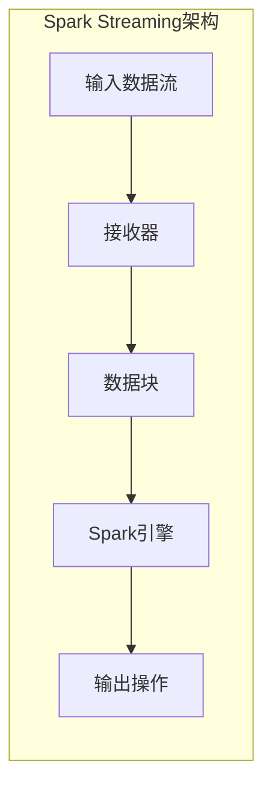
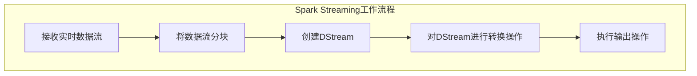

# Spark Streaming原理与代码实例讲解

## 1.背景介绍

### 1.1 大数据时代的到来

随着互联网、物联网和移动互联网的快速发展,海量的数据不断产生和积累。传统的批处理系统已经无法满足实时数据处理的需求,因此实时流式计算应运而生。实时流式计算可以及时处理连续到来的数据流,并快速做出反应,为企业带来了新的商业价值。

### 1.2 Spark Streaming的重要性

Apache Spark是当前最热门的开源大数据处理引擎之一,它支持批处理、交互式查询和流式计算。Spark Streaming作为Spark生态系统中的流式计算组件,可以高效、可靠地处理实时数据流,并与Spark生态系统中的其他组件(如Spark SQL、MLlib等)无缝集成,构建端到端的大数据应用程序。

### 1.3 Spark Streaming的应用场景

Spark Streaming广泛应用于各种实时数据处理场景,例如:

- 实时日志分析:持续处理服务器日志,实时监控服务器状态。
- 实时流式计算:对社交媒体数据流、物联网数据流等进行实时分析。
- 实时数据管道:将数据从kafka等消息队列实时传输到文件系统、数据库等存储系统。

## 2.核心概念与联系

### 2.1 Spark Streaming架构

Spark Streaming将实时数据流按照时间片段(如1秒)进行切分,每个时间片段的数据形成一个数据块(Data Blocks),然后由Spark引擎以micro-batch的方式处理这些数据块。



### 2.2 核心概念

1. **DStream(Discretized Stream)**: 表示一个连续的数据流,内部由一系列数据块(Data Blocks)组成。
2. **Input DStream**: 从外部数据源(如Kafka、Flume等)接收实时数据流,创建Input DStream。
3. **Receiver(接收器)**: 接收外部数据源的数据,并将其存储为Spark的内部数据块。
4. **Transformation(转换)**: 对DStream应用RDD(Resilient Distributed Dataset)转换操作,返回一个新的DStream。
5. **Output Operation(输出操作)**: 将经过转换后的DStream的数据持久化到外部系统(如HDFS、数据库等)。

### 2.3 Spark Streaming与Spark Core的关系

Spark Streaming在内部使用了Spark Core提供的Spark引擎,将流式计算转化为一系列短小的批处理作业。每个批处理作业都会生成一个RDD,然后由Spark引擎并行处理。

## 3.核心算法原理具体操作步骤

### 3.1 Spark Streaming工作原理

Spark Streaming的工作原理可以概括为以下几个步骤:

1. **接收实时数据流**: Spark Streaming使用Receiver(接收器)或Direct Approach(直接方式)从数据源(如Kafka、Flume等)接收实时数据流。
2. **将数据流分块**: Spark Streaming将接收到的实时数据流按照时间片段(如1秒)进行切分,每个时间片段的数据形成一个数据块(Data Blocks)。
3. **创建DStream**: 将数据块序列化为一个DStream(Discretized Stream),DStream由一系列连续的数据块组成。
4. **对DStream进行转换操作**: 开发者可以对DStream应用各种转换操作(如map、flatMap、filter等),生成一个新的DStream。
5. **执行输出操作**: 将经过转换后的DStream的数据输出到外部系统(如HDFS、数据库等)或执行其他操作。



### 3.2 有状态转换操作

Spark Streaming还支持有状态转换操作,可以在执行转换时维护状态信息。常见的有状态转换操作包括:

- **updateStateByKey**: 根据键(Key)对DStream的每个批次进行更新,生成一个新的带有状态的DStream。
- **mapWithState**: 对DStream的每个键值对应用有状态的函数,生成一个新的DStream。

有状态转换操作通常用于实现流式计算中的窗口操作、连接操作等。

## 4.数学模型和公式详细讲解举例说明

在Spark Streaming中,有一些常用的数学模型和公式,对于理解和实现一些高级功能非常有帮助。

### 4.1 窗口操作

窗口操作是流式计算中一种常见的技术,它可以将一个数据流按照时间窗口进行分组,并对每个窗口内的数据进行聚合或其他操作。Spark Streaming支持滑动窗口(Sliding Window)和滚动窗口(Tumbling Window)两种类型的窗口操作。

1. **滑动窗口**

滑动窗口的长度为$windowLength$,滑动步长为$slideInterval$。每隔$slideInterval$时间就计算一次窗口内的结果,窗口会不断向前滑动。

$$
windowOperationOnTime(windowLength, slideInterval)
$$

例如,设置$windowLength = 30$分钟,$slideInterval = 10$分钟,那么Spark Streaming会每10分钟计算一次过去30分钟内的数据。

2. **滚动窗口**

滚动窗口的长度为$windowLength$,滑动步长等于窗口长度,即$slideInterval = windowLength$。每隔$windowLength$时间就计算一次窗口内的结果,窗口不会重叠。

$$
windowOperationOnTime(windowLength)
$$

例如,设置$windowLength = 30$分钟,那么Spark Streaming会每30分钟计算一次过去30分钟内的数据。

### 4.2 状态维护

在有状态转换操作中,Spark Streaming需要维护每个键(Key)对应的状态信息。状态信息通常存储在内存中,但也可以使用检查点(Checkpoint)机制将状态信息持久化到外部存储系统中,以防止数据丢失。

设$state_t$表示时间$t$时刻的状态信息,$data_t$表示时间$t$时刻的输入数据,那么状态更新函数可以表示为:

$$
state_{t+1} = updateFunction(state_t, data_t)
$$

在实现updateFunction时,需要根据具体的业务逻辑来设计状态更新的规则。

### 4.3 连接操作

Spark Streaming还支持将两个DStream进行连接操作,生成一个新的DStream。连接操作通常用于将实时数据与静态数据或其他数据源进行关联。

设有两个DStream $stream1$和$stream2$,它们的键分别为$key1$和$key2$,那么连接操作可以表示为:

$$
joinedStream = join(stream1, stream2, joinCondition)
$$

其中$joinCondition$是连接条件,例如$key1 = key2$。连接操作的实现原理是,Spark Streaming会为每个DStream维护一个状态,存储每个键最近的数据,然后根据连接条件对两个DStream进行连接。

## 5.项目实践:代码实例和详细解释说明

接下来,我们将通过一个实际项目案例,演示如何使用Spark Streaming进行实时数据处理。

### 5.1 项目背景

假设我们需要实时处理一个网站的用户访问日志,统计每个用户的页面浏览数(PV)和独立访客数(UV),并将结果输出到HDFS文件系统中。

### 5.2 数据源

我们使用一个Kafka主题作为数据源,该主题接收网站的实时访问日志。每条日志记录包含以下字段:

- timestamp: 访问时间戳
- userId: 用户ID
- pageId: 访问页面ID

示例日志:

```
1589456724,user123,page1
1589456728,user456,page2
1589456734,user123,page3
```

### 5.3 Spark Streaming应用程序

我们使用Scala编写一个Spark Streaming应用程序,从Kafka主题读取实时日志数据,并进行实时统计分析。

#### 5.3.1 导入依赖库

```scala
import org.apache.spark.SparkConf
import org.apache.spark.streaming.{Seconds, StreamingContext}
import org.apache.spark.streaming.kafka010.ConsumerStrategies.Subscribe
import org.apache.spark.streaming.kafka010.KafkaUtils
import org.apache.spark.streaming.kafka010.LocationStrategies.PreferConsistent
import org.apache.kafka.common.serialization.StringDeserializer
```

#### 5.3.2 创建SparkConf和StreamingContext

```scala
val sparkConf = new SparkConf().setAppName("WebLogAnalyzer")
val ssc = new StreamingContext(sparkConf, Seconds(5))
```

#### 5.3.3 从Kafka读取数据流

```scala
val kafkaParams = Map(
  "bootstrap.servers" -> "kafka:9092",
  "key.deserializer" -> classOf[StringDeserializer],
  "value.deserializer" -> classOf[StringDeserializer],
  "group.id" -> "weblog-analyzer",
  "auto.offset.reset" -> "latest",
  "enable.auto.commit" -> (false: java.lang.Boolean)
)

val topics = Array("web-logs")
val stream = KafkaUtils.createDirectStream[String, String](
  ssc,
  PreferConsistent,
  Subscribe[String, String](topics, kafkaParams)
)
```

#### 5.3.4 解析日志数据

```scala
val logs = stream.map(record => record.value.split(","))
val parsedLogs = logs.map(log => (log(1), log(2)))
```

#### 5.3.5 统计PV和UV

```scala
val pvStream = parsedLogs.map(log => (log._1, 1)).reduceByKey(_ + _)
val uvStream = parsedLogs.map(log => (log._1, 0)).countByValue().map(_.swap)
```

#### 5.3.6 输出结果到HDFS

```scala
val outputDir = "hdfs://namenode:9000/weblog-analysis"

pvStream.foreachRDD(rdd => {
  if (!rdd.isEmpty()) {
    val outputPath = s"$outputDir/pv/${System.currentTimeMillis()}"
    rdd.saveAsTextFile(outputPath)
  }
})

uvStream.foreachRDD(rdd => {
  if (!rdd.isEmpty()) {
    val outputPath = s"$outputDir/uv/${System.currentTimeMillis()}"
    rdd.saveAsTextFile(outputPath)
  }
})
```

#### 5.3.7 启动Spark Streaming应用程序

```scala
ssc.start()
ssc.awaitTermination()
```

### 5.4 代码解释

1. 我们首先导入所需的依赖库,包括Spark Core、Spark Streaming和Kafka相关的库。
2. 创建SparkConf和StreamingContext对象,设置应用程序名称和批处理间隔时间(5秒)。
3. 配置Kafka参数,包括Broker地址、反序列化器、消费者组ID等。
4. 使用KafkaUtils.createDirectStream创建一个从Kafka主题读取数据的DStream。
5. 解析日志数据,将每条日志记录转换为(userId, pageId)的键值对。
6. 统计PV:对于每个userId,计算它对应的pageId个数,即该用户的页面浏览数。
7. 统计UV:对于每个userId,计算它出现的次数,即该用户的独立访客数。
8. 将PV和UV结果分别输出到HDFS的不同目录,每5秒输出一次最新的统计结果。
9. 启动Spark Streaming应用程序,等待终止。

通过这个示例,我们可以看到如何使用Spark Streaming从Kafka读取实时数据流,进行数据转换和统计分析,并将结果输出到HDFS文件系统中。

## 6.实际应用场景

Spark Streaming可以广泛应用于各种实时数据处理场景,例如:

### 6.1 实时日志分析

持续处理服务器日志、应用程序日志等,实时监控系统状态、分析用户行为、检测异常等。示例应用:

- 实时监控网站访问情况
- 实时分析用户行为轨迹
- 实时检测安全威胁

### 6.2 实时数据管道

将实时数据从消息队列(如Kafka)传输到文件系统、数据库、数据仓库等存储系统,为下游的批处理或实时查询提供数据源。示例应用:

- 实时日志收集管道
- 实时数据lake构建
- 实时数据集成

### 6.3 物联网数据处理

处理来自各种物联网设备(如传感器、智能手机等)的实时数据流,用于实时监