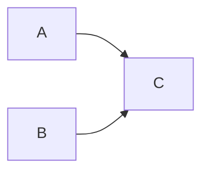

# Sqoop与Oozie的无缝集成

## 1.背景介绍

### 1.1 大数据时代的到来

随着互联网、物联网和云计算等技术的飞速发展,数据正以前所未有的规模和速度呈爆炸式增长。根据IDC(国际数据公司)的预测,到2025年,全球数据量将达到175ZB(1ZB=1万亿TB)。这种海量的数据不仅包括结构化数据(如关系型数据库中的数据),还包括非结构化数据(如网页、图像、视频等)。

面对如此庞大的数据量,传统的数据处理方式已经无法满足需求。因此,大数据技术应运而生,旨在高效地存储、处理和分析海量数据,从中挖掘有价值的信息和知识。

### 1.2 大数据生态系统

Apache Hadoop是大数据生态系统的核心,它提供了一个分布式文件系统(HDFS)和一个分布式计算框架(MapReduce),使得可以在廉价的商用硬件集群上存储和处理大规模数据集。

随着Hadoop的不断发展,其生态系统也在不断扩展,包括了诸多强大的组件,如Hive(数据仓库)、Pig(高级数据流语言)、HBase(分布式列存储数据库)、Sqoop(数据集成工具)、Oozie(工作流调度器)等。这些组件为大数据的存储、处理、分析和管理提供了全方位的支持。

### 1.3 数据集成的重要性

在大数据环境中,数据通常来自多个异构的源系统,如关系型数据库、NoSQL数据库、日志文件等。为了进行有效的数据分析,需要将这些分散的数据集成到一个统一的大数据平台中,这就是数据集成的作用。

数据集成不仅需要处理数据的提取、转换和加载(ETL),还需要考虑数据的调度、监控和管理等方面。因此,在大数据生态系统中,需要一个强大的数据集成工具和工作流调度器来完成这些任务。

## 2.核心概念与联系

### 2.1 Sqoop

Apache Sqoop是一个用于在Apache Hadoop和结构化数据存储(如关系型数据库)之间高效传输批量数据的工具。它可以将数据从外部数据库导入到HDFS中,也可以将HDFS中的数据导出到外部数据库。

Sqoop支持多种数据库,如MySQL、Oracle、PostgreSQL等,并提供了多种导入和导出模式,如全量导入、增量导入、基于查询的导入等。此外,Sqoop还支持数据压缩、分区等高级功能,可以大大提高数据传输的效率。

### 2.2 Oozie

Apache Oozie是一个用于管理Hadoop作业(如MapReduce、Pig、Hive等)的工作流调度系统。它支持通过特定的工作流定义语言(Workflow Definition Language,WF-XML)来定义工作流,并将其调度和执行。

Oozie不仅可以调度单个作业,还可以组合多个作业形成复杂的工作流,并设置作业之间的依赖关系和控制流程。此外,Oozie还提供了作业监控、重试和恢复等功能,可以有效地管理和监控整个数据处理流程。

### 2.3 Sqoop与Oozie的关系

Sqoop和Oozie在大数据生态系统中扮演着不同但又相互补充的角色。Sqoop负责将数据从外部源导入到Hadoop平台,而Oozie则负责调度和协调各种Hadoop作业(包括Sqoop作业)的执行。

通过将Sqoop与Oozie无缝集成,可以实现自动化的数据集成和处理流程。例如,可以定义一个工作流,首先使用Sqoop从关系型数据库导入数据到HDFS,然后执行一系列的Hive、Pig或MapReduce作业对数据进行处理和分析,最后将结果数据导出到目标系统。这种集成不仅提高了数据处理的自动化水平,还增强了整个流程的可靠性和可维护性。

## 3.核心算法原理具体操作步骤

### 3.1 Sqoop的工作原理

Sqoop的工作原理可以概括为以下几个步骤:

1. **连接元数据存储**:Sqoop首先连接到元数据存储(如关系型数据库)并获取表的元数据信息,包括表名、列名、数据类型等。

2. **生成MapReduce作业**:根据获取的元数据信息,Sqoop生成一个MapReduce作业,用于从源系统导入或导出数据。

3. **数据传输**:MapReduce作业启动后,Map任务并行读取源系统中的数据,并将数据写入HDFS或从HDFS读取数据写入目标系统。

4. **数据格式转换**:在数据传输过程中,Sqoop会根据需要对数据进行格式转换,例如将关系型数据库中的行格式转换为Hadoop支持的格式(如文本文件、Avro、Parquet等)。

5. **作业监控和管理**:Sqoop提供了命令行和Web UI界面,用于监控和管理作业的执行情况。

下面是一个使用Sqoop从MySQL导入数据到HDFS的示例命令:

```bash
sqoop import \
  --connect jdbc:mysql://hostname/databasename \
  --username myuser \
  --password mypassword \
  --table mytable \
  --target-dir /user/hadoop/mytable \
  --fields-terminated-by ',' \
  --lines-terminated-by '\n'
```

这个命令将从MySQL数据库中的`mytable`表导入数据到HDFS的`/user/hadoop/mytable`目录下,并使用逗号作为字段分隔符,换行符作为行分隔符。

### 3.2 Oozie的工作原理

Oozie的工作原理可以概括为以下几个步骤:

1. **定义工作流**:使用Oozie的工作流定义语言(WF-XML)定义工作流,包括作业的类型、输入输出、依赖关系等。

2. **提交工作流**:将定义好的工作流提交给Oozie服务器,Oozie会解析工作流定义并将其存储在内部数据库中。

3. **调度和执行**:根据工作流定义,Oozie调度和执行各个作业。作业可以是MapReduce、Pig、Hive、Sqoop等,也可以是其他类型的作业,如Shell脚本、Java程序等。

4. **监控和管理**:Oozie提供了Web UI界面和命令行工具,用于监控和管理工作流的执行情况,包括作业的状态、日志、重试等。

5. **错误处理和恢复**:如果某个作业失败,Oozie可以根据配置自动重试或者执行故障转移操作。

下面是一个使用Oozie定义工作流的示例(WF-XML):

```xml
<workflow-app xmlns="uri:oozie:workflow:0.5" name="data-pipeline">
  <start to="import-data"/>
  
  <action name="import-data">
    <sqoop xmlns="uri:oozie:sqoop-action:0.2">
      <job-tracker>${jobTracker}</job-tracker>
      <name-node>${nameNode}</name-node>
      <command>import --connect ${jdbcUrl} --table ${table} --target-dir ${targetDir}</command>
    </sqoop>
    <ok to="process-data"/>
    <error to="kill"/>
  </action>
  
  <action name="process-data">
    <hive xmlns="uri:oozie:hive-action:0.2">
      <job-tracker>${jobTracker}</job-tracker>
      <name-node>${nameNode}</name-node>
      <script>process.hql</script>
      <file>process.hql</file>
    </hive>
    <ok to="end"/>
    <error to="kill"/>
  </action>
  
  <kill name="kill">
    <message>Action failed, error message[${wf:errorMessage(wf:lastErrorNode())}]</message>
  </kill>
  
  <end name="end"/>
</workflow-app>
```

这个工作流定义了两个主要步骤:首先使用Sqoop从关系型数据库导入数据到HDFS,然后使用Hive对导入的数据进行处理。如果任何一个步骤失败,工作流将被终止并输出错误信息。

## 4.数学模型和公式详细讲解举例说明

在大数据处理中,通常需要使用一些数学模型和公式来优化性能或进行数据分析。以下是一些常见的数学模型和公式,以及它们在Sqoop和Oozie中的应用场景。

### 4.1 数据分区

在将数据从关系型数据库导入到HDFS时,Sqoop支持根据某些列对数据进行分区。这不仅可以提高数据的查询效率,还可以优化后续的数据处理过程。

Sqoop使用哈希分区函数(Hash Partitioning Function)来确定每条记录应该写入哪个分区。该函数的数学表达式如下:

$$
partition = hash(key) \bmod numPartitions
$$

其中:

- `key`是用于分区的列或列组合
- `hash()`是一个哈希函数,通常使用murmur哈希算法
- `numPartitions`是分区的总数

例如,假设我们要根据`user_id`列对用户数据进行分区,并将数据分成16个分区。对于用户ID为123的记录,其分区号可以计算如下:

$$
partition = hash(123) \bmod 16 = 7
$$

因此,这条记录将被写入第7个分区。

通过合理设置分区数量和分区键,可以有效地平衡数据的分布,从而提高查询和处理的效率。

### 4.2 作业调度算法

Oozie使用一种基于有向无环图(DAG)的调度算法来管理作业之间的依赖关系。每个作业都被表示为一个节点,节点之间的边表示依赖关系。

对于一个给定的工作流,Oozie会构建一个DAG,并使用拓扑排序算法来确定作业的执行顺序。拓扑排序算法的数学表达式如下:

$$
L(n) = 1 + \max_{m \in pred(n)} L(m)
$$

其中:

- `n`是当前节点
- `pred(n)`是所有直接前驱节点的集合
- `L(n)`是节点`n`的拓扑排序标号

通过计算每个节点的拓扑排序标号,Oozie可以确定作业的执行顺序,并保证所有依赖关系都得到满足。

例如,假设有一个工作流包含三个作业A、B和C,其中A和B是C的前驱作业。则该工作流的DAG如下所示:



根据拓扑排序算法,作业的执行顺序应该是A、B、C。

通过使用DAG和拓扑排序算法,Oozie可以灵活地定义和管理复杂的工作流,确保作业按照正确的顺序执行。

## 5.项目实践:代码实例和详细解释说明

为了更好地理解Sqoop和Oozie的使用,我们来看一个实际项目的代码示例。在这个示例中,我们将使用Sqoop从MySQL数据库导入数据到HDFS,然后使用Oozie调度一个Hive作业对导入的数据进行处理。

### 5.1 环境准备

首先,我们需要确保已经正确安装和配置了Hadoop、Sqoop和Oozie。此外,还需要在MySQL中创建一个示例表,并插入一些测试数据。

```sql
CREATE TABLE users (
  id INT PRIMARY KEY,
  name VARCHAR(50),
  age INT,
  city VARCHAR(50)
);

INSERT INTO users (id, name, age, city) VALUES
  (1, 'Alice', 25, 'New York'),
  (2, 'Bob', 30, 'Los Angeles'),
  (3, 'Charlie', 35, 'Chicago'),
  (4, 'David', 28, 'San Francisco'),
  (5, 'Eve', 32, 'Boston');
```

### 5.2 使用Sqoop导入数据

接下来,我们使用Sqoop将`users`表的数据导入到HDFS中。

```bash
sqoop import \
  --connect jdbc:mysql://localhost/mydb \
  --username root \
  --password mypassword \
  --table users \
  --target-dir /user/hadoop/users \
  --fields-terminated-by ',' \
  --lines-terminated-by '\n' \
  --m 1
```

这个命令将从MySQL的`mydb`数据库中导入`users`表的数据,并将其存储在HDFS的`/user/hadoop/users`目录下。`--m 1`参数指定使用1个Map任务进行导入。

导入完成后,我们可以在HDFS上查看导入的数据:

```bash
hadoop fs -cat /user/hadoop/users/part-m-00000
```

输出应该类似于:

```
1,