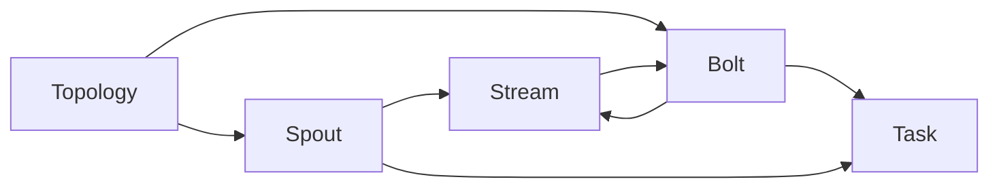
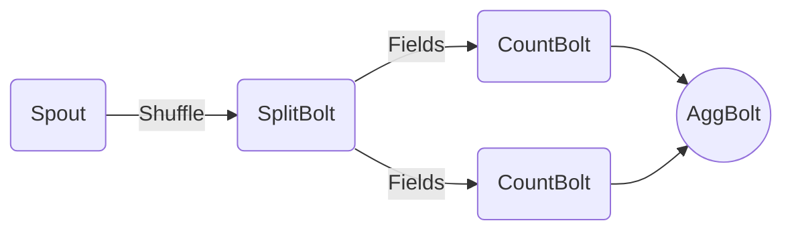

# Storm应用案例分享：大型互联网公司实践

## 1.背景介绍

### 1.1 大数据时代的到来

随着互联网、移动互联网和物联网的快速发展,数据呈现出爆炸式增长。根据IDC(国际数据公司)的预测,到2025年,全球数据总量将达到175ZB(1ZB=1万亿TB)。这些海量的数据来源广泛,种类繁多,传统的数据处理方式已经无法满足实时性、可扩展性和容错性等需求。大数据时代的到来,对数据处理能力提出了更高的要求。

### 1.2 实时计算的需求

在当今快节奏的商业环境中,企业需要实时处理数据,以便快速做出决策并及时响应。例如,电商网站需要实时分析用户行为数据,为用户推荐个性化商品;金融机构需要实时监控交易数据,发现潜在的欺诈行为;社交网络需要实时处理用户发布的信息,进行内容审核和病毒传播预警等。传统的批处理系统由于处理延迟较大,无法满足这些实时计算需求。

### 1.3 Storm的诞生

Apache Storm是一个分布式实时计算系统,最初由Nathan Marz等人在BackType公司开发,后来捐献给Apache软件基金会。Storm具有低延迟、高吞吐量、可水平扩展、容错性强等特点,非常适合于实时计算场景。自2011年9月开源以来,Storm已被众多大型互联网公司广泛应用于实时数据处理、在线机器学习、持续计算等领域。

## 2.核心概念与联系

### 2.1 核心概念

Storm的核心概念包括Topology(拓扑)、Spout(源)、Bolt(bolt)、Stream(流)和Task(任务)等。

#### 2.1.1 Topology

Topology是Storm中最顶层的抽象概念,表示一个完整的数据实时处理任务单元,由Spout和Bolt组成,形成一个有向无环图结构。

#### 2.1.2 Spout

Spout是Topology的数据源,从外部系统(如Kafka、HDFS等)读取数据,并将数据以Stream的形式发送给下游的Bolt进行处理。

#### 2.1.3 Bolt

Bolt用于对Spout或上游Bolt发送的Stream进行处理,处理后可以选择性地发送新的Stream给下游的Bolt,也可以将结果写入外部系统。

#### 2.1.4 Stream

Stream是Storm中的核心数据模型,由一系列连续且无界的Tuple(元组)组成。每个Tuple包含若干个Key-Value对,用于传输数据。

#### 2.1.5 Task

Task是Spout或Bolt的具体执行实例,用于实际处理数据流。一个Spout或Bolt可以由多个Task实例组成,以实现并行处理。

### 2.2 核心概念关系

Storm的核心概念之间存在以下关系:



- Topology由Spout和Bolt组成
- Spout和Bolt通过发送/接收Stream相互连接
- Spout和Bolt由多个Task实例执行

通过这些核心概念及其关系,Storm实现了流式数据的实时处理。

## 3.核心算法原理具体操作步骤

Storm的核心算法原理包括数据流分组、任务并行度控制、失败恢复机制等,下面将详细介绍其具体操作步骤。

### 3.1 数据流分组

Storm采用分组(Grouping)策略将数据流分发给下游Bolt的Task。常见的分组策略包括:

1. **Shuffle Grouping**: 随机分发Tuple给下游Bolt的Task。
2. **Fields Grouping**: 根据Tuple中的某些Field值,将相同Field值的Tuple分发给同一个Task。
3. **Global Grouping**: 将所有Tuple分发给下游Bolt的同一个Task。
4. **Direct Grouping**: 根据Tuple的来源Task,将Tuple分发给下游Bolt的对应Task。
5. **Custom Grouping**: 自定义分组策略。

分组策略的选择需要根据具体的业务场景,权衡负载均衡和数据处理顺序的需求。

### 3.2 任务并行度控制

Storm允许设置Spout和Bolt的并行度(Parallelism),即运行多少个Task实例。合理设置并行度可以提高数据处理吞吐量,但也需要考虑资源消耗。

Storm采用以下步骤控制任务并行度:

1. 在Topology中设置Spout和Bolt的并行度。
2. Storm根据设置的并行度,为Spout和Bolt分别启动对应数量的Task实例。
3. 每个Task实例独立运行,处理分组后的数据流。

通常情况下,并行度的设置需要结合集群资源、数据量和处理复杂度等因素综合考虑。

### 3.3 失败恢复机制

Storm采用At-Least-Once语义保证数据处理的可靠性,即每条数据至少被处理一次。当发生失败时,Storm会自动重新处理未完成的Tuple。

Storm的失败恢复机制包括以下步骤:

1. Spout将成功发送的Tuple元数据(MessageId)存储在本地。
2. Bolt在处理完Tuple后,向Spout发送Ack确认消息。
3. 如果Spout在一定时间内没有收到Ack,则认为处理失败,重新发送对应Tuple。
4. 如果Worker进程崩溃,Supervisor进程会重启Worker,并从Spout重新处理未完成的Tuple。

通过以上机制,Storm可以保证数据处理的可靠性和容错性。同时,用户也可以根据需求选择At-Most-Once或Exactly-Once语义。

## 4.数学模型和公式详细讲解举例说明

在Storm中,数据流处理可以看作是一个有向无环图(DAG)模型,其中每个节点表示一个Spout或Bolt,边表示数据流。我们可以使用图论中的一些概念和公式来描述和优化Storm Topology。

### 4.1 DAG模型

Storm Topology可以用有向无环图$G(V, E)$表示,其中:

- $V$是节点集合,包括所有Spout和Bolt
- $E$是边集合,表示数据流

对于任意两个节点$u, v \in V$,如果存在一条有向边$e = (u, v) \in E$,则表示$u$的输出数据流将被发送到$v$进行处理。

### 4.2 吞吐量模型

假设一个Bolt $b \in V$的处理能力为$r_b$(条记录/秒),其上游节点集合为$U_b$,则$b$的最大吞吐量$T_b$可以表示为:

$$
T_b = \min\left(r_b, \sum_{u \in U_b} T_u \right)
$$

即$b$的最大吞吐量取决于自身处理能力和上游节点的总吞吐量的最小值。

对于整个Topology,我们希望找到一种节点并行度配置,使得根节点(通常是Spout)的吞吐量最大化,同时满足每个节点的资源约束(如CPU、内存等)。这可以形式化为一个优化问题:

$$
\begin{aligned}
\max_{p_1, p_2, \ldots, p_{|V|}} & \quad T_{\text{root}} \\
\text{s.t.} & \quad \sum_{v \in V} c_v(p_v) \leq C \\
& \quad p_v \in \mathbb{Z}^+, \forall v \in V
\end{aligned}
$$

其中:

- $p_v$表示节点$v$的并行度
- $c_v(p_v)$表示节点$v$在并行度为$p_v$时的资源消耗
- $C$是集群的总资源约束

这是一个整数规划问题,可以使用各种优化算法(如遗传算法、模拟退火等)求解。

### 4.3 示例:词频统计

假设我们要统计一个文本数据流中每个单词出现的频率。可以设计如下Storm Topology:



- `Spout`从数据源读取文本数据流
- `SplitBolt`对每条记录进行分词,产生单词流
- `CountBolt`统计每个单词的出现频率
- `AggBolt`汇总所有`CountBolt`的结果,得到最终的单词频率统计

由于`SplitBolt`的输出数据流被重复发送到多个`CountBolt`,因此需要采用Fields Grouping策略,确保相同单词被发送到同一个`CountBolt`进行统计。

在这个例子中,我们可以计算每个节点的最大吞吐量,并通过优化算法找到合适的并行度配置,以最大化`Spout`的吞吐量。

## 5.项目实践:代码实例和详细解释说明

下面以一个简单的单词计数(Word Count)应用为例,演示如何使用Storm进行实时数据处理。

### 5.1 项目结构

```
- pom.xml
- src
    - main
        - java
            - com.example.storm
                - WordCountTopology.java
                - WordSpout.java
                - SplitBolt.java
                - CountBolt.java
        - resources
            - log4j2.xml
```

- `WordCountTopology.java`: 定义Topology的结构
- `WordSpout.java`: 从数据源读取文本数据流
- `SplitBolt.java`: 对文本进行分词
- `CountBolt.java`: 统计每个单词的出现频率

### 5.2 WordSpout

`WordSpout`从命令行或文件读取文本数据,将每行文本作为一条记录发送到输出流。

```java
public class WordSpout extends BaseRichSpout {
    // 定义输出流
    public static final String OUTPUT_STREAM = "line";

    private SpoutOutputCollector collector;

    @Override
    public void open(...) {
        // 从命令行或文件读取数据
    }

    @Override
    public void nextTuple() {
        String line = getNextLine();
        if (line != null) {
            // 发送记录到输出流
            collector.emit(new Values(line), line);
        }
    }

    @Override
    public void ack(Object msgId) {
        // 处理成功确认
    }

    @Override
    public void fail(Object msgId) {
        // 处理失败,重新发送记录
    }
}
```

### 5.3 SplitBolt

`SplitBolt`接收`WordSpout`的输出流,对每条记录进行分词,将单词发送到下游的`CountBolt`。

```java
public class SplitBolt extends BaseRichBolt {
    private OutputCollector collector;

    @Override
    public void prepare(...) {
        // 初始化
    }

    @Override
    public void execute(Tuple input) {
        String line = input.getString(0);
        // 分词
        String[] words = line.split("\\s+");
        for (String word : words) {
            // 发送单词到下游
            collector.emit(new Values(word));
        }
        // 确认成功处理
        collector.ack(input);
    }

    @Override
    public void declareOutputFields(...) {
        // 声明输出流的schema
    }
}
```

### 5.4 CountBolt

`CountBolt`接收`SplitBolt`的输出流,统计每个单词的出现频率。

```java
public class CountBolt extends BaseRichBolt {
    private OutputCollector collector;
    private Map<String, Integer> counts = new HashMap<>();

    @Override
    public void prepare(...) {
        // 初始化
    }

    @Override
    public void execute(Tuple input) {
        String word = input.getString(0);
        // 更新单词计数
        counts.put(word, counts.getOrDefault(word, 0) + 1);
        // 确认成功处理
        collector.ack(input);
    }

    @Override
    public void declareOutputFields(...) {
        // 声明输出流的schema
    }
}
```

### 5.5 WordCountTopology

`WordCountTopology`定义了Topology的结构,包括Spout、Bolt及其并行度。

```java
public class WordCountTopology {
    public static void main(String[] args) throws Exception {
        TopologyBuilder builder = new TopologyBuilder();

        // 设置Spout
        builder.setSpout("word-spout", new WordSpout(), 2);

        // 设置SplitBolt
        builder.setBolt("split-bolt", new SplitBolt(), 4)
                .shuffleGrouping("word-spout");

        // 设置CountBolt
        builder.setBolt("count-bolt", new CountBolt(), 8)
                .fieldsGrouping("split-bolt", new Fields("word"));

        