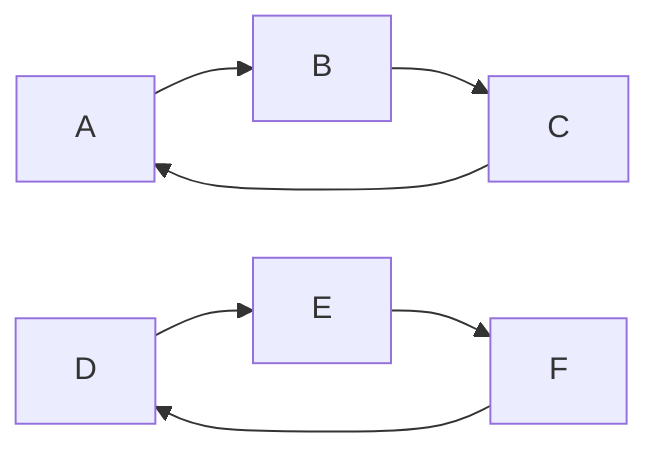

## 1.背景介绍

在计算机科学中，图论是一门研究图的数学理论，它在许多领域都有应用，包括网络科学、物理学、化学、生物学、社会学，以及计算机科学本身。在这其中，强连通分量（Strongly Connected Components, SCC）是一个非常重要的概念，它在许多算法中都有应用，例如网络分析、搜索引擎、数据挖掘等。本文将详细介绍强连通分量的概念，以及如何在代码中实现。

## 2.核心概念与联系

强连通分量是一个有向图的最大子图，在这个子图中，任何两个顶点都是互相可达的。换句话说，如果我们有一个有向图G，那么G的一个强连通分量就是G的一个子图，使得这个子图中的任何两个顶点v和w，都存在一个从v到w的路径和一个从w到v的路径。



在上图中，{A, B, C}和{D, E, F}就是两个强连通分量。

## 3.核心算法原理具体操作步骤

强连通分量的算法主要有两种：Kosaraju算法和Tarjan算法。这里我们主要介绍Kosaraju算法，它是一个简单而高效的算法，可以在O(V+E)的时间复杂度内找出一个图的所有强连通分量。

Kosaraju算法的步骤如下：

1. 对原图G进行深度优先搜索，记录每个顶点的结束时间。
2. 对原图G进行转置，得到转置图GT。
3. 对转置图GT进行深度优先搜索，但是这次的搜索顺序是按照原图顶点的结束时间的逆序进行的。
4. 在第3步的深度优先搜索中，每次新开始一个未访问过的顶点时，就得到了一个新的强连通分量。

## 4.数学模型和公式详细讲解举例说明

在Kosaraju算法中，我们使用了深度优先搜索。深度优先搜索是一种用于遍历或搜索树或图的算法。这个算法会尽可能深的搜索图的分支。当节点v的所在边都己被探寻过，搜索将回溯到发现节点v的那条边的起始节点。这一过程一直进行到已发现从源节点可达的所有节点为止。如果还存在未被发现的节点，则选择其中一个作为源节点并重复以上过程，整个进程反复进行直到所有节点都被访问为止。

在第一步深度优先搜索中，我们记录每个节点的结束时间。结束时间f[v]就是在深度优先搜索中，当我们完成对节点v的访问（即已经访问了v的所有相邻节点）的时间。这个时间可以简单的用一个计数器表示，每访问完一个节点，计数器就加一。

在第二步中，我们得到了图G的转置图GT。转置图就是将原图中的所有边的方向反转得到的图。

在第三步中，我们按照结束时间的逆序对转置图进行深度优先搜索。这样做的原因是，如果我们有一个强连通分量C，那么在C中的任何节点v，其结束时间f[v]都大于C中的任何其他节点。这是因为在深度优先搜索中，我们总是先访问节点v的一个相邻节点，直到所有相邻节点都被访问完，我们才会结束对v的访问。所以，在强连通分量C中的最后一个被访问的节点v，其结束时间f[v]一定是最大的。

在第四步中，我们在深度优先搜索中，每次新开始一个未访问过的节点时，就得到了一个新的强连通分量。这是因为，在深度优先搜索中，我们总是先访问一个节点的相邻节点，直到所有相邻节点都被访问完，我们才会结束对这个节点的访问。所以，如果我们新开始一个未访问过的节点，那么这个节点一定是一个新的强连通分量的开始。

## 5.项目实践：代码实例和详细解释说明

下面我们用Python来实现Kosaraju算法：

```python
class Graph:
    def __init__(self, vertices):
        self.V = vertices
        self.graph = defaultdict(list)

    def addEdge(self, u, v):
        self.graph[u].append(v)

    def DFSUtil(self, v, visited):
        visited[v] = True
        print(v, end='')
        for i in self.graph[v]:
            if visited[i] == False:
                self.DFSUtil(i, visited)

    def fillOrder(self, v, visited, stack):
        visited[v] = True
        for i in self.graph[v]:
            if visited[i] == False:
                self.fillOrder(i, visited, stack)
        stack = stack.append(v)

    def getTranspose(self):
        g = Graph(self.V)
        for i in self.graph:
            for j in self.graph[i]:
                g.addEdge(j, i)
        return g

    def printSCCs(self):
        stack = []
        visited =[False]*(self.V)
        for i in range(self.V):
            if visited[i]==False:
                self.fillOrder(i, visited, stack)
        gr = self.getTranspose()
        visited =[False]*(self.V)
        while stack:
            i = stack.pop()
            if visited[i]==False:
                gr.DFSUtil(i, visited)
                print()
```

在这个代码中，我们首先定义了一个图的类Graph，这个类有一个构造函数__init__，它接受一个参数vertices，表示图的节点数。然后，我们定义了一个函数addEdge，它接受两个参数u和v，表示从节点u到节点v有一条边。

然后，我们定义了一个函数DFSUtil，它是深度优先搜索的实现。这个函数接受两个参数，一个是当前节点v，另一个是一个布尔数组visited，表示每个节点是否被访问过。在这个函数中，我们首先将当前节点标记为已访问，然后对当前节点的每一个相邻节点，如果它还没有被访问过，那么就对它进行深度优先搜索。

接下来，我们定义了一个函数fillOrder，它用来在深度优先搜索中记录每个节点的结束时间。这个函数接受三个参数，一个是当前节点v，一个是布尔数组visited，还有一个是一个栈stack，用来记录结束时间。在这个函数中，我们首先将当前节点标记为已访问，然后对当前节点的每一个相邻节点，如果它还没有被访问过，那么就对它进行深度优先搜索。最后，当我们结束对当前节点的访问时，就将当前节点压入栈中。

然后，我们定义了一个函数getTranspose，它用来得到图的转置。在这个函数中，我们首先创建了一个新的图g，然后对原图中的每一条边，都在g中添加一条反向的边。

最后，我们定义了一个函数printSCCs，它用来打印出所有的强连通分量。在这个函数中，我们首先创建了一个栈stack和一个布尔数组visited，然后对每一个未访问过的节点，都进行深度优先搜索，并在搜索过程中记录每个节点的结束时间。然后，我们得到了图的转置，然后对转置图进行深度优先搜索，但是这次的搜索顺序是按照结束时间的逆序进行的。在这个深度优先搜索中，每次新开始一个未访问过的节点时，就打印出一个新的强连通分量。

## 6.实际应用场景

强连通分量在许多领域都有应用。例如，在社交网络分析中，强连通分量可以用来找出社区，即一组人他们之间的联系比他们和其他人的联系更紧密。在搜索引擎中，强连通分量可以用来找出网页的集群，即一组网页他们之间的链接比他们和其他网页的链接更频繁。在数据挖掘中，强连通分量可以用来找出关联规则，即一组项目他们之间的关联比他们和其他项目的关联更强烈。

## 7.工具和资源推荐

如果你想进一步学习强连通分量和相关的算法，我推荐以下的资源：

- 《算法导论》：这本书是计算机科学中的经典教材，它详细介绍了许多基础的算法，包括深度优先搜索和强连通分量的算法。
- NetworkX：这是一个Python的库，它提供了许多用于创建、操作和分析图的函数，包括强连通分量的函数。
- Gephi：这是一个开源的网络分析和可视化软件，它可以帮助你更好的理解图和强连通分量。

## 8.总结：未来发展趋势与挑战

随着网络科学、社交网络分析、数据挖掘等领域的发展，强连通分量和相关的算法将会有更多的应用。同时，对于大规模的图，如何高效的找出所有的强连通分量，将是一个重要的研究问题。此外，如何将强连通分量的概念推广到加权图、多层图、动态图等更复杂的图中，也是一个有待解决的问题。

## 9.附录：常见问题与解答

Q: 什么是强连通分量？

A: 强连通分量是一个有向图的最大子图，在这个子图中，任何两个顶点都是互相可达的。

Q: 如何找出一个图的所有强连通分量？

A: 有许多算法可以找出一个图的所有强连通分量，例如Kosaraju算法和Tarjan算法。

Q: Kosaraju算法的时间复杂度是多少？

A: Kosaraju算法的时间复杂度是O(V+E)，其中V是图的节点数，E是图的边数。

作者：禅与计算机程序设计艺术 / Zen and the Art of Computer Programming