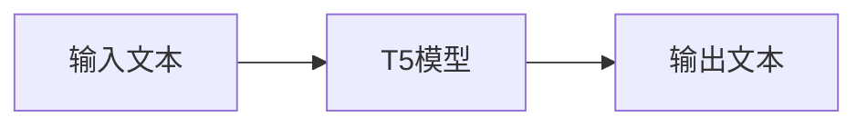
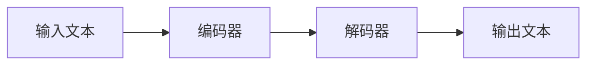

## 1.背景介绍

在自然语言处理（NLP）领域，Transformer模型已经被广泛应用并取得了显著的成效。T5（Text-to-Text Transfer Transformer）是Google在Transformer模型的基础上进行改进和扩展，提出的一种新型的文本生成模型。T5模型不仅能够处理各种NLP任务，而且在许多任务上都取得了最佳表现。

## 2.核心概念与联系

T5模型的核心概念是将所有的NLP任务都视为文本生成任务。无论是机器翻译、文本摘要、问答系统，还是情感分析等任务，都可以通过输入一段文本，输出一段文本的方式来实现。这种方式简化了模型的设计，同时也提高了模型的通用性。



## 3.核心算法原理具体操作步骤

T5模型的核心算法原理是基于Transformer模型的。它首先将输入文本进行编码，然后通过解码器生成输出文本。在编码和解码过程中，T5模型会自动学习文本的语义信息，从而生成准确的输出。



## 4.数学模型和公式详细讲解举例说明

T5模型的数学模型主要包括两部分：编码器和解码器。编码器用于将输入文本转换为中间表示，解码器则根据中间表示生成输出文本。

编码器的数学模型可以表示为：

$$
H = Encoder(X)
$$

其中，$X$是输入文本，$H$是中间表示。

解码器的数学模型可以表示为：

$$
Y = Decoder(H)
$$

其中，$H$是中间表示，$Y$是输出文本。

## 5.项目实践：代码实例和详细解释说明

在Python环境下，我们可以使用Transformers库来实现T5模型。以下是一个简单的示例：

```python
from transformers import T5Tokenizer, T5ForConditionalGeneration

tokenizer = T5Tokenizer.from_pretrained('t5-base')
model = T5ForConditionalGeneration.from_pretrained('t5-base')

input_text = "translate English to French: The cat sits on the mat"
input_ids = tokenizer.encode(input_text, return_tensors='pt')

outputs = model.generate(input_ids)
output_text = tokenizer.decode(outputs[0])

print(output_text)
```

## 6.实际应用场景

T5模型可以应用于各种NLP任务，例如：

1. 机器翻译：将一种语言的文本翻译为另一种语言的文本。
2. 文本摘要：生成文本的摘要。
3. 问答系统：根据问题生成答案。
4. 情感分析：判断文本的情感倾向。

## 7.工具和资源推荐

1. Transformers：一个Python库，提供了T5等多种Transformer模型的实现。
2. T2T：一个TensorFlow库，提供了T5模型的实现。

## 8.总结：未来发展趋势与挑战

T5模型的提出，为NLP领域带来了新的可能性。它将各种NLP任务都视为文本生成任务，简化了模型的设计，同时也提高了模型的通用性。然而，T5模型仍然面临一些挑战，例如计算资源的需求、模型的解释性等。

## 9.附录：常见问题与解答

1. **T5模型和BERT模型有什么区别？**

T5模型和BERT模型都是基于Transformer的模型，但是T5模型将所有的NLP任务都视为文本生成任务，而BERT模型则是一个预训练模型，通常用于下游任务的微调。

2. **T5模型如何处理不同的NLP任务？**

T5模型通过改变输入文本的格式来处理不同的NLP任务。例如，对于机器翻译任务，输入文本可以是"translate English to French: The cat sits on the mat"；对于文本摘要任务，输入文本可以是"summarize: The cat sits on the mat".

作者：禅与计算机程序设计艺术 / Zen and the Art of Computer Programming