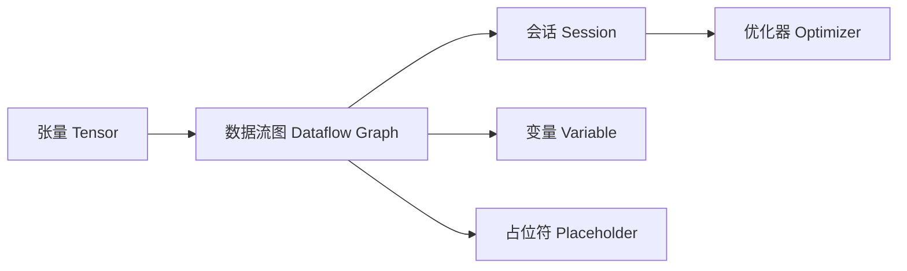

# TensorFlow 原理与代码实战案例讲解

## 1.背景介绍

TensorFlow 是由 Google Brain 团队开发的开源机器学习框架,自2015年开源以来,迅速成为最流行的深度学习框架之一。它提供了一个全面而灵活的生态系统,使开发人员能够轻松地构建和部署机器学习模型。

TensorFlow 的名称源于其核心概念 - 张量(Tensor)。张量是一种多维数组,可以表示各种数据,如标量、向量、矩阵等。TensorFlow 中的计算被表示为一个数据流图,其中节点表示数学运算,边表示在节点之间传递的多维数据数组(张量)。

### 1.1 TensorFlow 的优势

- **高度的灵活性**: TensorFlow 允许开发人员从低级别的数学运算到高级别的神经网络构建,自由地构建模型。
- **强大的性能**: TensorFlow 可以充分利用 GPU 和 TPU 等硬件加速,实现高性能的并行计算。
- **跨平台支持**: TensorFlow 支持多种操作系统(如 Windows、Linux、macOS)和编程语言(如 Python、C++、Java)。
- **大型社区支持**: TensorFlow 拥有一个活跃的开源社区,提供了大量的文档、教程和预训练模型。

### 1.2 TensorFlow 的应用领域

TensorFlow 在各个领域都有广泛的应用,包括:

- 计算机视觉:图像分类、目标检测、语义分割等
- 自然语言处理:文本分类、情感分析、机器翻译等  
- 语音识别:语音转文本、说话人识别等
- 推荐系统:个性化推荐、协同过滤等

## 2.核心概念与联系

要深入理解 TensorFlow,需要掌握以下核心概念:

### 2.1 张量(Tensor)

张量是 TensorFlow 中数据的基本单位。它是一个多维数组,可以存储数值类型的数据。张量有三个关键属性:

- 秩(Rank):张量的维度数量。例如,标量的秩为0,向量的秩为1,矩阵的秩为2。
- 形状(Shape):每个维度的大小。例如,形状为 [3, 4] 的张量表示一个 3 行 4 列的矩阵。  
- 数据类型(Data Type):张量中元素的数据类型,如 float32、int32 等。

### 2.2 数据流图(Dataflow Graph)

TensorFlow 使用数据流图来表示计算过程。数据流图由节点(Nodes)和边(Edges)组成:

- 节点表示数学运算或数据输入/输出等操作。
- 边表示节点之间流动的张量。

数据流图定义了计算的顺序和依赖关系,TensorFlow 会根据图的拓扑结构自动推断并行执行的可能性。

### 2.3 会话(Session)  

会话用于运行数据流图中的操作。它分配资源(如 GPU 内存)并存储中间结果。在会话中,可以通过 `run()` 方法执行图中的特定部分并获取结果。

### 2.4 变量(Variable)

变量用于存储和更新模型的参数,如神经网络的权重和偏置。与普通张量不同,变量在会话之间保持其值不变。变量需要显式初始化才能使用。

### 2.5 占位符(Placeholder)

占位符用于将数据输入到数据流图中。它允许在运行时动态地提供数据,而无需在构建图时指定具体的值。这对于训练模型非常有用,因为每次迭代都需要提供新的训练样本。

### 2.6 优化器(Optimizer)

优化器用于最小化模型的损失函数,从而使模型在训练数据上的表现更好。TensorFlow 提供了多种优化算法,如梯度下降(Gradient Descent)、Adam 等。

下图展示了这些核心概念之间的关系:



## 3.核心算法原理具体操作步骤

TensorFlow 中最常用的算法是反向传播(Backpropagation)和梯度下降(Gradient Descent)。下面详细介绍这两个算法的原理和操作步骤。

### 3.1 反向传播算法

反向传播是训练神经网络的核心算法。它通过计算损失函数对网络参数的梯度,并使用梯度更新参数来最小化损失函数。反向传播算法的步骤如下:

1. 前向传播:将输入数据通过神经网络,计算每一层的输出,直到获得最终的预测结果。
2. 计算损失:使用预测结果和真实标签计算损失函数的值。
3. 反向传播:从输出层开始,递归地计算每一层损失函数对权重和偏置的梯度。
   - 对于输出层,梯度可以直接计算。
   - 对于隐藏层,梯度需要使用链式法则,将后一层的梯度乘以当前层的激活函数导数。
4. 更新参数:使用计算得到的梯度,通过优化算法(如梯度下降)更新网络的权重和偏置。
5. 重复步骤1-4,直到损失函数收敛或达到预定的迭代次数。

### 3.2 梯度下降算法

梯度下降是一种优化算法,用于最小化损失函数。它通过沿着损失函数梯度的反方向调整模型参数来实现。梯度下降算法的步骤如下:

1. 初始化参数:随机初始化模型的权重和偏置。
2. 计算梯度:对于每个参数,计算损失函数对该参数的偏导数。
3. 更新参数:根据学习率和计算得到的梯度,更新每个参数的值。
   - 新参数 = 旧参数 - 学习率 × 梯度
4. 重复步骤2-3,直到达到停止条件(如损失函数收敛或达到预定的迭代次数)。

TensorFlow 提供了多种梯度下降的变体,如随机梯度下降(SGD)、小批量梯度下降(Mini-batch GD)和Adam优化器等,以适应不同的场景和需求。

## 4.数学模型和公式详细讲解举例说明

本节将详细讲解 TensorFlow 中常用的数学模型和公式,并给出具体的例子。

### 4.1 线性回归模型

线性回归是一种简单但有效的机器学习模型,用于预测连续值。给定输入特征 $x$,线性回归模型预测输出 $\hat{y}$ 为:

$$\hat{y} = w^Tx + b$$

其中,$w$ 是权重向量,$b$ 是偏置项。

在 TensorFlow 中,可以使用以下代码实现线性回归模型:

```python
import tensorflow as tf

# 定义输入和输出
x = tf.placeholder(tf.float32, shape=[None, input_dim])
y = tf.placeholder(tf.float32, shape=[None, output_dim])

# 定义权重和偏置
W = tf.Variable(tf.zeros([input_dim, output_dim]))
b = tf.Variable(tf.zeros([output_dim]))

# 构建模型
y_pred = tf.matmul(x, W) + b

# 定义损失函数(均方误差)
loss = tf.reduce_mean(tf.square(y_pred - y))
```

### 4.2 逻辑回归模型

逻辑回归是一种常用的二分类模型。它使用 Sigmoid 函数将线性回归的输出映射到 (0, 1) 区间,表示样本属于正类的概率。

Sigmoid 函数定义为:

$$\sigma(z) = \frac{1}{1 + e^{-z}}$$

其中,$z$ 是线性回归的输出。

在 TensorFlow 中,可以使用以下代码实现逻辑回归模型:

```python
import tensorflow as tf

# 定义输入和输出
x = tf.placeholder(tf.float32, shape=[None, input_dim])
y = tf.placeholder(tf.float32, shape=[None, 1])

# 定义权重和偏置
W = tf.Variable(tf.zeros([input_dim, 1]))
b = tf.Variable(tf.zeros([1]))

# 构建模型
z = tf.matmul(x, W) + b
y_pred = tf.sigmoid(z)

# 定义损失函数(交叉熵)
loss = tf.reduce_mean(tf.nn.sigmoid_cross_entropy_with_logits(labels=y, logits=z))
```

### 4.3 卷积神经网络(CNN)

卷积神经网络是一种常用于图像识别和计算机视觉任务的深度学习模型。CNN 通过卷积层和池化层提取图像的局部特征,并使用全连接层进行分类。

卷积操作可以表示为:

$$(f * g)(i,j) = \sum_{m}\sum_{n} f(m,n)g(i-m,j-n)$$

其中,$f$ 是输入图像,$g$ 是卷积核。

在 TensorFlow 中,可以使用以下代码实现一个简单的 CNN:

```python
import tensorflow as tf

# 定义输入和输出
x = tf.placeholder(tf.float32, shape=[None, 28, 28, 1])
y = tf.placeholder(tf.float32, shape=[None, 10])

# 定义卷积层
conv1 = tf.layers.conv2d(inputs=x, filters=32, kernel_size=[5, 5], activation=tf.nn.relu)
pool1 = tf.layers.max_pooling2d(inputs=conv1, pool_size=[2, 2], strides=2)

conv2 = tf.layers.conv2d(inputs=pool1, filters=64, kernel_size=[5, 5], activation=tf.nn.relu)
pool2 = tf.layers.max_pooling2d(inputs=conv2, pool_size=[2, 2], strides=2)

# 定义全连接层
pool2_flat = tf.reshape(pool2, [-1, 7 * 7 * 64])
dense = tf.layers.dense(inputs=pool2_flat, units=1024, activation=tf.nn.relu)

# 定义输出层
logits = tf.layers.dense(inputs=dense, units=10)

# 定义损失函数(交叉熵)
loss = tf.reduce_mean(tf.nn.softmax_cross_entropy_with_logits(labels=y, logits=logits))
```

## 5.项目实践:代码实例和详细解释说明

本节将通过一个完整的项目实践,演示如何使用 TensorFlow 构建和训练一个手写数字识别模型。我们将使用 MNIST 数据集,该数据集包含 60,000 个训练样本和 10,000 个测试样本,每个样本都是一个 28x28 像素的灰度图像,表示 0-9 的手写数字。

### 5.1 数据准备

首先,我们需要加载并准备 MNIST 数据集:

```python
import tensorflow as tf
from tensorflow.examples.tutorials.mnist import input_data

# 加载 MNIST 数据集
mnist = input_data.read_data_sets("MNIST_data/", one_hot=True)

# 定义输入和输出
x = tf.placeholder(tf.float32, shape=[None, 784])
y = tf.placeholder(tf.float32, shape=[None, 10])
```

这里,我们使用 `input_data.read_data_sets()` 函数加载 MNIST 数据集,并定义输入 `x` 和输出 `y` 的占位符。输入 `x` 的形状为 [None, 784],其中 None 表示批次大小(可变),784 表示图像展平后的像素数(28 × 28)。输出 `y` 的形状为 [None, 10],表示 10 个数字类别的 one-hot 编码。

### 5.2 构建模型

接下来,我们使用 TensorFlow 的高级 API `tf.layers` 构建一个简单的前馈神经网络:

```python
# 定义隐藏层
hidden1 = tf.layers.dense(inputs=x, units=128, activation=tf.nn.relu)
hidden2 = tf.layers.dense(inputs=hidden1, units=64, activation=tf.nn.relu)

# 定义输出层
logits = tf.layers.dense(inputs=hidden2, units=10)
```

这里,我们定义了两个隐藏层,分别包含 128 和 64 个神经元,并使用 ReLU 激活函数。输出层包含 10 个神经元,表示 10 个数字类别的 logits 值。

### 5.3 定义损失函数和优化器

接下来,我们定义损失函数(交叉熵)和优化器(Adam):

```python
# 定义损失函数
loss = tf.reduce_mean(tf.nn.softmax_cross_entropy_with_logits(labels=y, logits=logits))

# 定义优化器
optimizer = tf.train.AdamOptimizer(learning_rate=0.001)